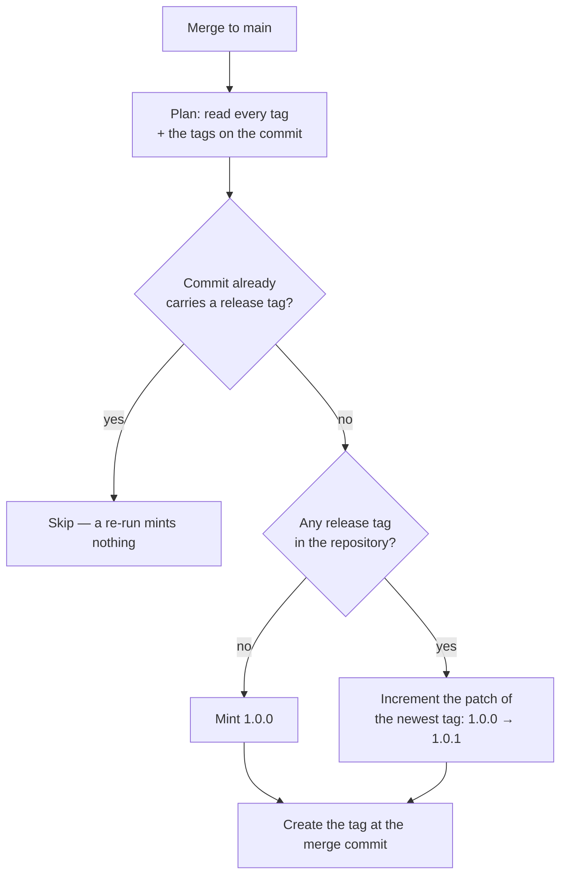

# 🏷️ Release tagging

Every merge to `main` is tagged with the next patch semver, automatically
(Issue #627). A host running in frozen mode pins to a released version, so
without tags the only thing it could pin to is a raw commit SHA.

## What runs

`.github/workflows/release-tag.yml` fires on `push` to `main` — the merge
commit only exists after the merge, so `push` is the one trigger that can see
it. The workflow-level token is read-only; the single `contents: write` grant
the tag needs is scoped to the one job that creates it, and the tag is created
through the API so the checkout persists no git credentials.

The version decision itself lives in `.github/scripts/next-release-tag.sh`, so
it is exercised by unit tests rather than only by a real merge:

```bash
git tag --list > all-tags.txt
git tag --points-at "$GITHUB_SHA" > head-tags.txt
.github/scripts/next-release-tag.sh all-tags.txt head-tags.txt
# should_tag=true
# tag=1.0.1
```



## The rules

- **Patch only.** The newest release tag decides the major and minor. A human
  minting `1.1.0` or `2.0.0` by hand is the supported way to move the series —
  the next merge then continues from there (`1.1.1`).
- **First tag is `1.0.0`.** A repository with no release tag yet starts there.
- **Numeric, not lexical.** `1.0.10` is newer than `1.0.9`.
- **A release tag is a bare `MAJOR.MINOR.PATCH` triple**, optionally
  `v`-prefixed. Pre-releases (`1.0.0-rc1`), build metadata and moving names
  (`latest`) are ignored, and minted tags are always bare.
- **Idempotent.** A commit that already carries a release tag is never tagged
  again, so a re-run is a no-op.
- **Serialised.** The `concurrency` group never cancels: two merges landing
  together are tagged one after the other, so the second run sees the first
  run's tag instead of racing for the same number.
- **Never blocks a merge.** The merge has already landed by the time this runs.
  A failed tag shows as a red run on the workflow and a missing tag on the
  commit — nothing downstream waits on it.

## When a run goes red

The step output names the newest tag it found and the tag it tried to mint. The
usual causes are a tag that appeared between the plan and the create (re-run the
workflow — the second attempt sees it and either skips or mints the next
number), and a token without `contents: write` (check the job-level
`permissions:` block).

## Tests

- `worker/deno/tests/next_release_tag_test.ts` — the version selection and
  increment logic, over tag lists.
- `worker/deno/tests/release_tag_workflow_test.ts` — the workflow structure
  (trigger, permissions, concurrency, SHA-pinned credential-free checkout) and
  the plumbing between real `git tag` output and the script.
