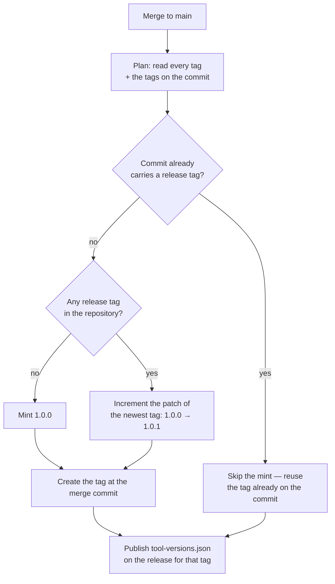
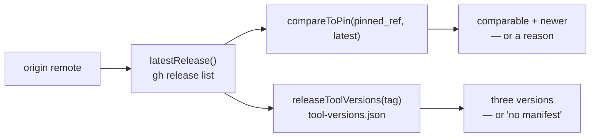

# 🏷️ Release tagging

Every merge to `main` is tagged with the next patch semver, automatically
(Issue #627). A host running in frozen mode pins to a released version, so
without tags the only thing it could pin to is a raw commit SHA.

## What runs

`.github/workflows/release-tag.yml` fires on `push` to `main` — the merge
commit only exists after the merge, so `push` is the one trigger that can see
it. The workflow-level token is read-only; the single `contents: write` grant
the tag needs is scoped to the one job that creates it, and the tag is created
through the API so the checkout persists no git credentials.

The version decision itself lives in `.github/scripts/next-release-tag.sh`, so
it is exercised by unit tests rather than only by a real merge:

```bash
git tag --list > all-tags.txt
git tag --points-at "$GITHUB_SHA" > head-tags.txt
.github/scripts/next-release-tag.sh all-tags.txt head-tags.txt
# should_tag=true
# tag=1.0.1
```



## The rules

- **Patch only.** The newest release tag decides the major and minor. A human
  minting `1.1.0` or `2.0.0` by hand is the supported way to move the series —
  the next merge then continues from there (`1.1.1`).
- **First tag is `1.0.0`.** A repository with no release tag yet starts there.
- **Numeric, not lexical.** `1.0.10` is newer than `1.0.9`.
- **A release tag is a bare `MAJOR.MINOR.PATCH` triple**, optionally
  `v`-prefixed. Pre-releases (`1.0.0-rc1`), build metadata and moving names
  (`latest`) are ignored, and minted tags are always bare.
- **Idempotent.** A commit that already carries a release tag is never tagged
  again, so a re-run is a no-op.
- **Serialised.** The `concurrency` group never cancels: two merges landing
  together are tagged one after the other, so the second run sees the first
  run's tag instead of racing for the same number.
- **Never blocks a merge.** The merge has already landed by the time this runs.
  A failed tag shows as a red run on the workflow and a missing tag on the
  commit — nothing downstream waits on it.

## The tool-version manifest

Every release also records the exact tools it was cut against (Issue #688), so
a host pinning to a release can pin to the same tools instead of drifting onto
whatever is newest. The manifest is published as an asset named
**`tool-versions.json`** on the GitHub Release for the tag, addressable from
any host:

```bash
gh release view 1.0.8 --repo stSoftwareAU/VibeCoder \
  --json assets --jq '.assets[].name'
gh release download 1.0.8 --pattern tool-versions.json
```

The schema is one object, every field required:

```json
{
  "release": "1.0.8",
  "tools": { "claude": "2.0.76", "gh": "2.62.0", "deno": "2.5.4" }
}
```

- `release` — the release tag the manifest describes, a bare
  `MAJOR.MINOR.PATCH` triple (optionally `v`-prefixed), matching the tag it is
  attached to.
- `tools.claude`, `tools.gh`, `tools.deno` — the exact version of each tool,
  in the shape a frozen host's `pinned_tool_versions` takes (see
  [Configuration](CONFIGURATION.md)).

**Where the versions come from.** `worker/deno/mod.ts release-manifest
--release <tag>` prints the manifest on stdout, resolving each version through
`resolveDynamicVersions()` — the same release-age gate an unpinned update goes
through. What a release records is therefore exactly what dynamic mode would
have installed when the release was minted, not merely upstream's newest.

The shape, the generator and the parser share one definition in
`worker/deno/lib/release_manifest.ts`, so every reader validates the asset the
same way rather than re-parsing it by hand.

### The rules

- **All-or-nothing.** A tool whose version cannot be resolved — or that the
  release-age gate reports ineligible — fails the step naming that tool, and
  nothing is published. A manifest naming two tools out of three would let a
  host silently drift on the third, the failure mode `pinned_tool_versions`
  being all-or-nothing already guards against (Issue #622).
- **Strict on the way back in.** The parser rejects malformed JSON, a missing
  or non-semver version, an unknown tool key and a partial manifest. A reader
  never acts on half a manifest.
- **Idempotent.** A tag whose release already carries the asset is left alone,
  so a re-run publishes nothing twice.
- **Recoverable.** The publish is keyed to the release tag on the commit, not
  to the tag this run minted, so re-running the workflow after a failed publish
  attaches the manifest to the tag that already exists.
- **Never blocks the tag.** The tag stays the workflow's first side effect. A
  failed manifest is a red run and a release without an asset — never a
  rolled-back or delayed tag.

## Reading the series back — the release check library

`worker/deno/lib/release_check.ts` is the reader side of everything above
(Issue #689): the one place a caller asks what the newest release is, whether
this host's `pinned_ref` is behind it, and what tool versions that release
recorded.



- **Same definition of a release** as the tagging script: a bare
  `MAJOR.MINOR.PATCH` triple, optionally `v`-prefixed, ordered by numeric
  segment so `1.0.10` beats `1.0.9`. Pre-releases, build metadata, moving
  names such as `latest`, and draft releases are not part of the series. A
  repository with no releases yet is an empty outcome, not a failure.
- **A commit SHA is not orderable against a tag.** `compareToPin` reports
  `comparable: false` with a reason and no `newer` at all for the other
  `pinned_ref` shape [Configuration](CONFIGURATION.md) accepts. Callers decide
  what to do with that; guessing is not on offer.
- **"No manifest" is not a failure.** A release minted before the asset existed
  returns a distinguishable `no-manifest` outcome naming the tag, so a caller
  can tell it apart from an unreachable GitHub. A manifest that is present but
  partial or malformed is an error naming the offending field.
- **Nothing throws, nothing hangs.** Every function returns the repo's `Result`
  type and every subprocess call is bounded by the shared timeout helper — this
  runs on the launch path, where a failed check degrades to a warning. All side
  effects arrive through an injected deps interface, so the tests need no `gh`
  and no network. There is no caching: one check per call, callers choose the
  cadence.

## When a run goes red

The step output names the newest tag it found and the tag it tried to mint. The
usual causes are a tag that appeared between the plan and the create (re-run the
workflow — the second attempt sees it and either skips or mints the next
number), and a token without `contents: write` (check the job-level
`permissions:` block).

A red **manifest** step names the tool it could not record — usually a release
inside the 24-hour quarantine window, or an upstream lookup that failed. The
tag is already minted by then, so re-running the workflow on the same commit
publishes the manifest against that tag once the tool resolves.

## Tests

- `worker/deno/tests/next_release_tag_test.ts` — the version selection and
  increment logic, over tag lists.
- `worker/deno/tests/release_tag_workflow_test.ts` — the workflow structure
  (trigger, permissions, concurrency, SHA-pinned credential-free checkout, the
  tag-before-publish order and the idempotent manifest publish) and the
  plumbing between real `git tag` output and the script.
- `worker/deno/tests/release_manifest_test.ts` — the manifest shape: the
  all-or-nothing build and the parser, over malformed and partial manifests.
- `worker/deno/tests/release_check_test.ts` — the release check library: the
  newest-release selection, the pin comparison (including the incomparable
  commit-SHA pin) and the manifest lookup, over injected `gh` responses.
- `worker/deno/tests/release_manifest_command_test.ts` — the
  `release-manifest` command, over a stubbed release-age gate.
