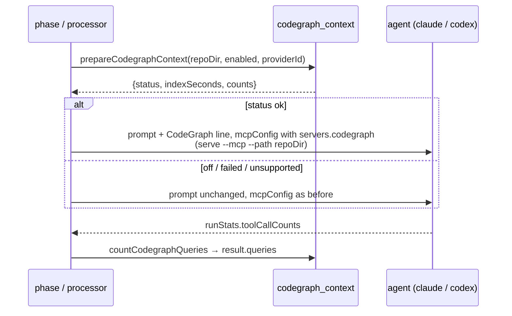
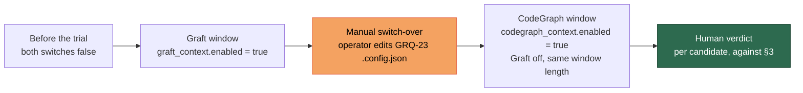

# 🧭 Repo-context trial — Graft and CodeGraph

Today the worker gives an agent code context by **prompt injection** only:
`CLAUDE.md`/`AGENTS.md` plus the codebase map (`include_codebase_map`,
`worker/deno/lib/codebase_map.ts`). Two external repo-context tools are being
trialled to see whether a queryable index of the repository beats that:
**Graft** (milestone #2060) and **CodeGraph** (milestone #2145). A third,
**Graphify**, was assessed and dropped.

This page is the **protocol**, written before the figures exist: the bar both
candidates are judged by, the windows they run in, which runs are excluded, and
where every figure is read from. The judging itself is a human act after a
window closes — this page records the rules that judgement follows, and the
per-candidate result sections below are templates to fill in when each window
ends.

|              |                                                                                                                                  |
| ------------ | -------------------------------------------------------------------------------------------------------------------------------- |
| Trial host   | **GRQ-23** — one host, both candidates, sequential windows                                                                       |
| Switches     | `codegraph_context.enabled` ([Configuration](CONFIGURATION.md)) and Graft's own `graft_context.enabled`, which ships with milestone #2060 and is not on every build — both host-level, both default `false` |
| Bar          | ≥ 10% lower tokens **or** cost per completed implementation run, no worse success rate                                           |
| First judged | after **2 days** or **20** completed GRQ-23 runs, whichever is later                                                             |
| Status       | 🟡 protocol recorded, windows not yet run                                                                                        |

---

## 1. 🥊 The candidates

|                          | **Graft**                                                                                    | **CodeGraph**                                                                                |
| ------------------------ | -------------------------------------------------------------------------------------------- | -------------------------------------------------------------------------------------------- |
| Milestone                | #2060                                                                                        | #2145                                                                                        |
| Install                  | npm `@nanonets/graft@0.18.0`, 7 native modules compiled at image build                       | pinned GitHub-release tarball, checksum-verified (`container/toolchains/codegraph.sh`)       |
| How the agent reaches it | a `graft ask --source` bundle (about 1,900 tokens) **injected into the prompt** at run start, **and** the `graft` **MCP server** (`graft_find_code`, `graft_file_api`, …) the agent queries itself (Issue #2314) | an **MCP server** beside Playwright — the agent calls `codegraph_explore` itself             |
| Index                    | built per run, about 47 s on this repository, about 132 MB under `graft/`                    | `codegraph init`/`sync` on the checkout, kept in `.codegraph/` between runs, capped at 300 s |
| Model calls to index     | none                                                                                         | none                                                                                         |
| Host switch              | `graft_context.enabled`                                                                      | `codegraph_context.enabled`                                                                  |
| Failure marker           | `[GRAFT_UNAVAILABLE]`                                                                        | `[CODEGRAPH_UNAVAILABLE]`                                                                    |

The Graft column is as milestone #2060 specifies that trial; the CodeGraph
column is what `worker/deno/lib/codegraph_context.ts` does today.

Neither switch reads the other, and a run never fails because its repo-context
tool did: the tool is an accelerator, so a failed index logs its marker and the
run carries on without it.

### 1.1 ❌ Why Graphify was dropped

Graphify (`github.com/Graphify-Labs/graphify`) was the third candidate from the
same comparison and is **not** trialled. Three reasons, recorded here so the
decision is not re-litigated from memory:

1. **Python runtime.** It installs as `pip install graphifyy`, which puts a
   Python runtime and its dependency tree into the container image for one trial
   tool. Graft (npm) and CodeGraph (a self-contained binary bundle) each land on
   a runtime the image already carries.
2. **LLM cost to index.** Code-only indexing runs offline, but indexing docs and
   PDFs needs an LLM call — the indexing step itself spends model tokens, which
   is the very quantity the bar measures.
3. **Weakest result in the motivating comparison.** It was the slowest to index
   (about 3.5 minutes) and the most expensive to set up (about US$2.30 of Gemini
   and Claude at API prices), and it saved the least.

### 1.2 🔌 Where CodeGraph is wired in

An enabled host prepares the index **once per run**, before the agent is
invoked, on the six run kinds the trial covers — the standalone issue phase
(`worker/deno/lib/execute_claude_phase.ts`), the main-loop issue phase
(`worker/deno/lib/phases/execute_phase.ts`), the planning and question
processors, the reactive PR paths: PR feedback
(`worker/deno/lib/pr_feedback_processor.ts`) and CI fix
(`worker/deno/lib/pr_ci_processor.ts`), and the grill-me rounds
(`worker/deno/lib/grill_me_processor.ts`, Issue #2561). Planning makes several invocations in
one round (draft, critique, the explicit retry, the Failure-Detection
self-repair) and a CI fix makes a second when the post-quality gate asks for
one; they share one index and their `codegraph_explore` calls are summed into a
single figure for the run.

The server is **rooted at the checkout that was indexed**, by
`codegraph serve --mcp --path <checkout>` (Issue #2200). Rooting it explicitly
rather than letting it inherit the agent's working directory is what makes the
six paths behave alike: the planning and question processors run the agent with
`cwd` set to `config.workDir`, the **parent** of every clone, so an unrooted
server would resolve a directory with no `.codegraph/` in it while the run
still reported `status: ok` with real counts. The path rides in the arguments
because Codex's translation of an MCP entry keeps `command`, `args` and `env`
and drops `cwd`.

The MCP entry and the prompt line are handed over **together or not at all**:
the line without the server tells the agent to call a tool that does not
exist, and the server without the line leaves an indexed repository the agent
never queries. The line is appended in code rather than written into
`prompts/<type>/prompt.md`, because it is run-conditional — the same reason
the codebase map is injected rather than templated — and appending it after
the built prompt leaves the cached static half untouched.



Every run logs one `CodeGraph context: status=…` line naming the status and
whatever figures were gathered, and a failure additionally logs
`[CODEGRAPH_UNAVAILABLE]`. Losing the index never fails a run.

## 2. 📼 Motivation, not evidence

The trial was prompted by a published one-run-per-setup comparison
([youtu.be/Xr2MjfirjqA](https://youtu.be/Xr2MjfirjqA)) on a frozen commit of an
unrelated repository:

| Setup             | Tokens | Wall clock | Index                             |
| ----------------- | ------ | ---------- | --------------------------------- |
| Plain Claude Code | 6.55 M | 9:42       | —                                 |
| Graphify          | 5.34 M | 9:15       | ~3.5 min, ~US$2.30 in model calls |
| CodeGraph         | 4.23 M | 8:45       | < 2 s, no model calls             |

These figures are **motivation only — not evidence**, and no decision cites
them. One run per setup on one repository is a reason to measure, not a result:
the presenter says so, and so does this page. The only figures that count
towards the bar are the ones this trial records on GRQ-23, in §7 and §8.

## 3. 📏 The bar

Both candidates are judged by **the same written bar**, on the same host:

- **≥ 10% lower tokens or cost per completed implementation run**, measured
  against the other hosts over the same window length. Either quantity may carry
  it; neither is weighted above the other.
- **No worse success rate.** A cheaper run that fails more often is not a win.
- **The tool's own build/index time counts against it.** Graft's per-run graph
  build and CodeGraph's `init`/`sync` seconds are part of the candidate's cost,
  not overhead excluded from it.
- **First judged after 2 days or 20 completed GRQ-23 runs, whichever is later.**
  Both thresholds must be met before a verdict is recorded; a fast fortnight of
  few runs is not a window, and neither is a busy afternoon.

A candidate that does not clear the bar is turned off and its switch left at
`false`. A verdict either way is written into its results section below, with
the run counts it was drawn from.

## 4. 🪟 The windows and the switch-over

The windows are **sequential** on GRQ-23, not concurrent — two indexes on one
host would make each candidate's figures unreadable:



- **Graft runs first**, for a window that meets the §3 thresholds.
- **CodeGraph runs second, with Graft off, for the same window length** — equal
  lengths, so the two candidates' per-run figures are comparable.
- **The switch-over is manual.** When the Graft window ends the operator edits
  GRQ-23's `.config.json` by hand — `graft_context.enabled` to `false`,
  `codegraph_context.enabled` to `true`. **No code schedules it**, nothing
  watches the clock, and no worker flips a switch on its own.

## 5. 🚫 Exclusions

A run is excluded from **either** window's figures when:

- **Its repo-context status is `unsupported`.** The switch was on but the run
  was routed to Gemini, which has no MCP transport: no index step, no MCP entry,
  no prompt line. The run cost what a plain run costs and says nothing about the
  candidate.
- **Both switches were on.** Running both tools on one host is allowed and both
  record their figures, but such a run belongs to neither window and is excluded
  from both.

Everything else counts. In particular a run whose status is `failed` — the
switch was on and the index or the server did not come up — **stays in** the
candidate's figures: a tool that fails on an enabled host has spent the run's
time and delivered nothing, and hiding that would flatter it.

The comparison the 10% is measured against is **the other hosts' runs over the
same window length**, not GRQ-23's own history: a GRQ-23 run whose status is
`off` fell outside the window (the switch is on for the whole of it) and is not
part of either candidate's figures.

## 6. 📥 Where each figure is read from

Each window's figures are read from two per-run surfaces rather than from
ad-hoc logs. Both surfaces are still being built — the sub-issue that lands each
is named in its cell, and a window cannot open before its own two have landed:

| Surface                     | Graft                     | CodeGraph                     |
| --------------------------- | ------------------------- | ----------------------------- |
| Per-issue run-stats comment | the `Graft:` line (#2105) | the `CodeGraph:` line (#2161) |
| Callback context            | the `graft` block (#2104) | the `codegraph` block (#2162) |

Both carry the same shape: `enabled`, `status` (`ok`, `failed`, `off`,
`unsupported`), the index/build seconds, and the counts the tool reports. The
`codegraph` surfaces add `queries` — the number of `codegraph_explore` calls the
agent made in that run, read from the agent stream's tool-use events — so a
CodeGraph window can distinguish "the index was there" from "the agent used it".
Tokens, cost and model come from the same run-stats comment as for any other
run, so no separate accounting is kept.

The CodeGraph line (#2161) closes the stats block of the run-stats comment,
below `Degraded:` and above the cumulative issue total, and carries whichever
figures the step reached:

```text
- **CodeGraph:** ok — index 1.8 s, 4,120 nodes, 9,870 relationships, 14 queries
- **CodeGraph:** failed — index 300 s
- **CodeGraph:** unsupported (gemini)
- **CodeGraph:** off
```

It is a status line, never a cost line: the issue cost tally parses only the
`Estimated cost` shape, so these figures never move the published total.

A run that prepared RTK (the separate output trial, Issue #2328) adds one
`RTK:` status line directly beneath it, still above the cumulative issue total
(#2385) — see `rtk_output.enabled` in [Configuration](CONFIGURATION.md).

## 7. 📊 Results — Graft window

_Template — fill in when the Graft window closes._

| Figure                                  | Graft window | Baseline (other hosts, same length) |
| --------------------------------------- | ------------ | ----------------------------------- |
| Window start → end                      | —            | —                                   |
| Completed implementation runs           | —            | —                                   |
| Runs excluded (`unsupported` / both-on) | —            | —                                   |
| Tokens per completed run                | —            | —                                   |
| Cost per completed run (USD)            | —            | —                                   |
| Success rate                            | —            | —                                   |
| Index/build seconds per run (mean)      | —            | —                                   |

- **Margin against the bar:** — (tokens: —%, cost: —%)
- **Verdict:** — (clears / does not clear §3)
- **Judged on:** — by —

## 8. 📊 Results — CodeGraph window

_Template — fill in when the CodeGraph window closes._

| Figure                                     | CodeGraph window | Baseline (other hosts, same length) |
| ------------------------------------------ | ---------------- | ----------------------------------- |
| Window start → end                         | —                | —                                   |
| Completed implementation runs              | —                | —                                   |
| Runs excluded (`unsupported` / both-on)    | —                | —                                   |
| Tokens per completed run                   | —                | —                                   |
| Cost per completed run (USD)               | —                | —                                   |
| Success rate                               | —                | —                                   |
| Index seconds per run (mean)               | —                | —                                   |
| `codegraph_explore` queries per run (mean) | —                | —                                   |

- **Margin against the bar:** — (tokens: —%, cost: —%)
- **Verdict:** — (clears / does not clear §3)
- **Judged on:** — by —

## 9. 🔗 Related documentation

- **[Configuration Reference](CONFIGURATION.md)** — the `codegraph_context`
  switch row, and every other `.config.json` key.
- **[Container Image](CONTAINER.md)** — the pinned CodeGraph toolchain fragment
  and where the bundle lands in the image.
- **[Post-Run Callbacks](CALLBACKS.md)** — the callback context the
  `codegraph`/`graft` blocks are carried on.
- **[RTK output trial](RTK-OUTPUT-TRIAL.md)** — the sibling protocol for the
  `rtk_output.enabled` switch: same shape, a different candidate.
