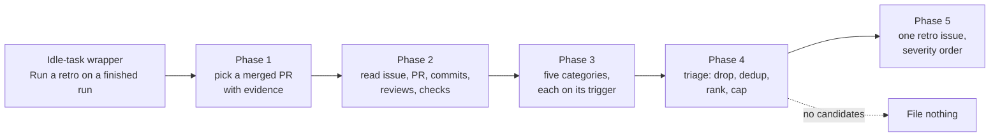

# 🔁 Retro Scan — Operator Manual

The retro scan is the eighteenth registered [idle-task](IDLE-TASK-FRAMEWORK.md)
template. When the worker has no claimable work it may pick this template, clone
one monitored repository, and retrospect the most recent **finished piece of
work** there — a merged pull request, the issue it closed, its commits, and its
review and check feedback. It files **at most one** suggestion-only `retro`
issue listing improvement candidates in severity order, each naming the surface
it would change. A quiet run files nothing, and that is the expected outcome on
a healthy repository.

> **Terminology.** An _idle task_ is background work the worker performs only
> when no higher-priority work exists; see the
> [idle-task framework](IDLE-TASK-FRAMEWORK.md). A _retro candidate_ is a
> proposed change to the **environment** an agent worked in — where files live,
> which gate runs, which rule is written down — never a change to the code that
> run wrote.

The idea comes from a review of the `retro` skill in
[mattpocock/skills](https://github.com/mattpocock/skills); credit for it belongs
there.

## Design intent — learning without waiting for the incident

The fleet already learns from finished runs, but only reactively:
[LESSONS-LEARNT.md](LESSONS-LEARNT.md) records what was learnt the hard way,
after an outage. A retro is the same learning without the outage — it reads the
artefacts of a run that went _fine_ and asks what would have made it easier.

No sibling template covers this. Every other scan judges the **repository**
against a standard; the retro judges the **environment against one run's
experience of it**, and its output is a proposal about the furniture — a
pointer, a gate, a rule, a fact written down — not a defect in the code.

## The five categories

Each fires **only** when its trigger is present in the artefacts.

| Category               | Trigger                                                                              | Surface it proposes                                    |
| ---------------------- | ------------------------------------------------------------------------------------ | ------------------------------------------------------ |
| **Navigation**         | The run visibly searched for where something lives — a reverted file, a wrong first guess, a change spread unpredictably | A README or docs pointer, a module doc comment          |
| **Automated checks**   | The run made a mistake something mechanical could have caught — a check that went from red to green, a fix-up commit, a mechanical review comment | A named lint rule, type-check step, test, or CI job in the repo's **own** gate |
| **Coding standards**   | Review asked for a change no documented standard covers, or one an existing rule already covered but nobody found | A new or clarified rule — or the removal of one the run followed into a worse outcome |
| **Steering-file size** | The agent instructions are large **and** a specific block inside them belongs elsewhere | The named block, its new home, and what enforces it there |
| **Information access** | The run asserted something wrong and was corrected, or recorded a guess | Where the fact should be written down                   |

### Deliberately out of scope

Two categories from the source idea are **not** assessed, because the scan reads
merged artefacts and not the session transcript:

- **Tool economy** — how many tool calls the run made and what they cost.
  Nothing in the artefacts measures it.
- **No-ops** — whether a given instruction changes the model's behaviour versus
  its default. That test is model-relative and needs a run to settle; the
  prompt-rubric surface in
  [PROMPT-BEST-PRACTICES-CHECKLIST.md](PROMPT-BEST-PRACTICES-CHECKLIST.md) owns
  it.

The prompt states both exclusions explicitly so the scan does not approximate
them from the diff.

## Suggestion only

The scan is read-only. It never edits a file, never opens a pull request, and
never applies a candidate. Its whole output is one issue whose closing line says
so. Each candidate is accepted or rejected on its own merits and, if accepted,
rides the normal `work-on` flow like any other issue.

## Severity

- **`severity:high`** — the gap let a defect reach the default branch, or it
  recurs on every run in this repository.
- **`severity:medium`** — the default: the gap cost time or a review cycle, but
  the outcome was still correct.
- **`severity:low`** — a papercut worth fixing next time someone is in the file.

The filed issue carries the **highest** surviving candidate's severity label,
and its sections are ordered most severe first.

## Dedup

Run over many finished runs, a retro would otherwise propose the same
"the steering file is too big" candidate every week. Two lists prevent it, both
fetched repo-wide (no `--label` scoping) and substituted into the prompt:

- `{{KNOWN_OPEN_FINDING_IDS}}` — the deterministic first line. Each candidate
  carries its own `<!-- finding-id: BP-… -->` marker inside the filed issue, so
  the ids of every open issue's candidates are read back and skipped on the next
  run.
- `{{OPEN_ISSUE_TITLES}}` — the semantic second line: every open issue title in
  the repository, whatever its label, so a candidate a human already raised in
  their own words is skipped too.

Both render `(none)` on the wrapper itself and are rebuilt from live issues at
claim time. A detected duplicate is **skipped silently** — no comment, no
cross-link. The stable id is computed from
`{ repo, "retro", category-name, primary surface path }`, so the same recurring
candidate yields the same id across runs.

## Contract summary

| Property             | Value                                                             |
| -------------------- | ----------------------------------------------------------------- |
| Template name        | `retro`                                                            |
| Wrapper title        | `Run a retro on a finished run`                                    |
| Prompt               | `prompts/retro/prompt.md`                                          |
| Output label         | `retro` + one `severity:<level>`                                   |
| Issues per run       | **At most one**                                                    |
| Cadence              | Once per repo per week (`cooldownHours: 168`)                      |
| Raises a PR?         | Never — issue-only, suggestion-only                                |
| Failure behaviour    | Fail loud: a prompt, Claude, or timeout failure returns `ok:false` and leaves the wrapper open |

## Suppression

An operator who does not want a recurring candidate re-proposed has three
options, in increasing permanence:

1. **Leave the issue open** — an open issue's `BP-…` ids are in the known-open
   list, so the candidate is not re-filed.
2. **Add an in-source suppression comment** whose id matches — e.g.
   `<!-- best-practice-ignore: BP-… -->` in Markdown, `// best-practice-ignore:
   BP-…` in code — beside the surface the candidate names.
3. **Set the template's weight to zero** in `idleTaskTemplateWeights`, or drop
   the repo's retro cadence, to stop the scan being drawn at all. See
   [Weighting the template draw](IDLE-TASK-FRAMEWORK.md#weighting-the-template-draw).

## Related documentation

- [Idle-task Framework](IDLE-TASK-FRAMEWORK.md) — lifecycle, registry, dedup
  contract, cadence.
- [Lessons Learnt](LESSONS-LEARNT.md) — the reactive counterpart: what was
  learnt after an incident.
- [Prompt best-practices checklist](PROMPT-BEST-PRACTICES-CHECKLIST.md) — owns
  the no-op test the retro deliberately does not apply.
