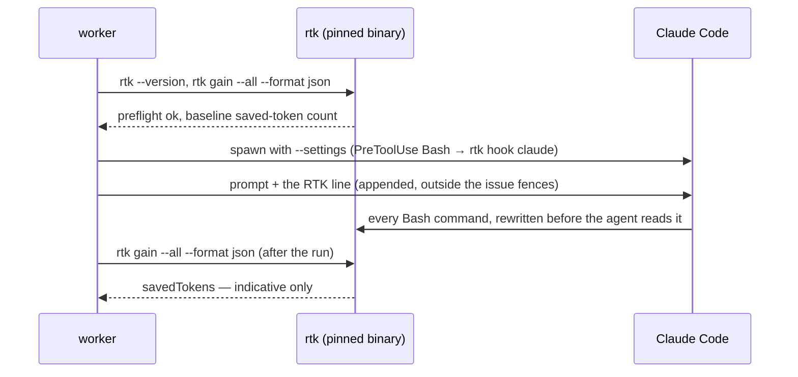
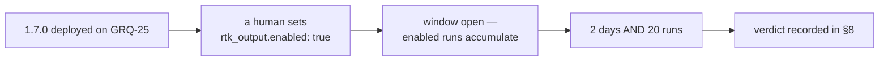

# 🪓 RTK Bash-output trial — condensing what the agent reads

| | |
| - | - |
| **Trial host** | **GRQ-25** — one host, one candidate, one window |
| **Switch** | `rtk_output.enabled` in a host's `.config.json`, default `true` since [#2432](https://github.com/stSoftwareAU/VibeCoder/issues/2432) |
| **Bar** | ≥ 10% lower tokens **or** cost per completed Claude implementation run, no worse success rate |
| **First judged** | after **2 days** or **20** completed RTK-enabled runs, whichever is later |
| **Status** | ⚪ superseded before a verdict — made the default on 20 September 2026 by the owner's decision, on function; the bar below was **not measured** (§8, §9) |

This page is the protocol the RTK trial is judged by. It is a sibling of the
[Repo-context Trial](REPO-CONTEXT-TRIAL.md), which judges Graft and CodeGraph by
the same shape of bar on a different host. Everything a verdict may cite is
written here **before** the window opens, so the verdict is a reading rather
than an argument.

## 1. 🥊 The candidate and how it is wired

[RTK](https://github.com/rtk-ai/rtk) is a Rust binary that rewrites the output
of a shell command before the agent reads it: it runs the command, keeps the
part an agent needs, and prints an id the agent can pass to `rtk recall <id>` to
read the full, unfiltered output when a command fails. The wager is that a
Bash-heavy run spends a large share of its context on output nobody reads.

The switch is `rtk_output.enabled` — one boolean, per host, default `true`
(`false` until [#2432](https://github.com/stSoftwareAU/VibeCoder/issues/2432)),
parsed by [#2380](https://github.com/stSoftwareAU/VibeCoder/issues/2380), turned
into a hook run by
[#2382](https://github.com/stSoftwareAU/VibeCoder/issues/2382), wired
into the ten spawn paths by
[#2383](https://github.com/stSoftwareAU/VibeCoder/issues/2383),
[#2384](https://github.com/stSoftwareAU/VibeCoder/issues/2384),
[#2561](https://github.com/stSoftwareAU/VibeCoder/issues/2561) (grill-me) and
[#2569](https://github.com/stSoftwareAU/VibeCoder/issues/2569) (clarity
assessment, refinement, revision and quorum), and
documented
in the [Configuration Reference](CONFIGURATION.md). The binary
itself is a pinned container toolchain fragment
([#2381](https://github.com/stSoftwareAU/VibeCoder/issues/2381)), so every host
running a given image runs the same RTK version.

On a switched-on Claude host the run is prepared like this:



Three details decide what a run is worth comparing against:

- The hook reaches the agent through **`--settings`** alone — a `PreToolUse`
  entry whose matcher is `Bash` and whose command is `rtk hook claude`. Nothing
  is written to a shared settings file, so a run with the switch off is spawned
  with byte-identical settings to a host that never had the switch.
- The prompt line is **appended**, never injected into the template, so the
  prompt cache is untouched and the line sits outside the untrusted issue
  fences.
- Only Claude Code takes per-spawn `PreToolUse` settings. A Codex, Gemini or
  DeepSeek run on a switched-on host reports `unsupported` rather than claiming
  a filtering that never happened.

## 2. 📼 Motivation, not evidence

Two public measurements motivated trialling RTK at all:

- **JetBrains**, in its work on agentic coding context, reports large fractions
  of an agent's context window consumed by tool output rather than by code.
- **codepointer.dev** published a Bash-output condensing benchmark with
  token reductions in the tens of percent on command-heavy sessions.

These figures are **motivation only — not evidence**, and no decision on this
page cites them. They were measured on other people's workloads with other
people's prompts. This fleet runs Claude with
`--dangerously-skip-permissions` on long, Bash-heavy implementation runs whose
output profile nobody has measured — `git`, `gh`, `deno test`, `./quality.sh`
and a repository's own suite. Whether that profile has 10% of slack in it is
exactly the open question, which is why there is a window and a bar instead of
a rollout.

## 3. 📏 The bar

RTK clears the bar when, over the judged population:

- tokens **or** cost per completed Claude implementation run is **≥ 10%** lower
  on the RTK-enabled side, and
- the **success rate** on the RTK-enabled side is no worse than on the control
  side.

Both clauses must hold. A saving bought by runs that failed and were retried is
not a saving.

RTK's own preflight and gain reads — the `rtk --version` and two
`rtk gain --all --format json` invocations every enabled run makes — count
**against** RTK, never for it: they are part of what an enabled run costs, and
the trial charges them to the candidate that needs them.

The verdict is first taken after **2 days** or **20** completed RTK-enabled
runs, **whichever is later**. Two days with four runs on it is not a
measurement, and twenty runs inside an afternoon is one day's weather.

## 4. 🪟 The window and the switch



The window opens when two things are true: **1.7.0 is deployed on GRQ-25**, and
**a human sets `rtk_output.enabled: true`** in that host's `.config.json`.

**Both steps are manual.** No code schedules it, nothing watches the clock, and
**no worker flips it** — not to open the window, not to close it, and not to
react to a figure it read halfway through. A switch that a worker can turn is a
switch whose position is not evidence of anything.

While the window runs, **GRQ-25 is not an advisor/executor pilot host**
([#2348](https://github.com/stSoftwareAU/VibeCoder/issues/2348)). One host
carries one experiment at a time, or neither result means anything.

## 5. ⚖️ The comparison rule

The two populations are **RTK-enabled completed Claude implementation runs** and
**RTK-disabled completed Claude implementation runs**, on **any** host — the
switch, not the hostname, sorts a run into a side. Which side a run belongs to is
read from its own recorded flag, never inferred from when it ran.

| Run | Side |
| --- | ---- |
| `ok` — the hook was installed and the preflight passed | RTK-enabled |
| `failed` — the switch was on, RTK could not be prepared | RTK-enabled |
| `off` — the switch was off, or the run ended before RTK ran | control |
| `unsupported` — the provider takes no hook | excluded |

Two exclusions and one inclusion carry the rule:

- A run from **before 1.7.0** carries no `- **RTK:**` line at all. It is
  excluded from both sides rather than assumed to be a control run.
- An `unsupported` run is excluded: it is a Codex, Gemini or DeepSeek run whose
  cost profile is not comparable with a Claude run either way.
- A **`failed`** run stays in, on the enabled side. It cost what an enabled host
  really costs when the binary is missing or the store is unreadable, and hiding
  that cost would flatter the candidate.

Both sides must hold the **same Graft and CodeGraph state**: comparing a
Graft-enabled RTK run against a Graft-disabled control measures Graft. Where the
repo-context trial is mid-window on its own host, that host's runs are not
usable on either side here.

## 6. 📥 Where each figure is read from

| Figure | Read from |
| ------ | --------- |
| Which side a run belongs to | the `- **RTK:**` status line in the run-stats comment, or the `rtk` block on the run document |
| Tokens per run | the token total in the run-stats comment |
| Cost per run | the cost total in the run-stats comment |
| Success rate | the run's own completion outcome, as the run-stats comment records it |
| `savedTokens` | RTK's own gain store — **indicative only**, never the bar |

Every run — `off` included — renders exactly one status line, so the two
populations can be separated by reading the comment alone
([#2385](https://github.com/stSoftwareAU/VibeCoder/issues/2385)). The five
shapes it can take are:

```text
- **RTK:** ok — 12,340 tokens saved
- **RTK:** ok
- **RTK:** failed
- **RTK:** off
- **RTK:** unsupported (gemini)
```

It is a status line, never a cost line: the saved-token figure is deliberately
outside the shape that the cost tally reads, so a saving can never be counted
as spend.

The same outcome rides the `rtk` callback block on every run document
([#2386](https://github.com/stSoftwareAU/VibeCoder/issues/2386)), alongside the
`VIBECODER_RTK_ENABLED`, `VIBECODER_RTK_STATUS` and `VIBECODER_RTK_SAVED_TOKENS`
scalars — see [Post-Run Callbacks](CALLBACKS.md). `enabled` there is the host's
switch, stated truthfully whatever became of the run.

`savedTokens` is RTK's own indicative figure, read from a tracking store that
concurrent lanes share, so a neighbouring run can inflate it. It is recorded
because it is cheap and interesting; **the bar is read from run-stats tokens and
cost, never from this number**.

## 7. 🔐 Security posture

RTK is a **third-party** binary sitting ahead of **every** Bash command the
agent runs on a switched-on host. That is the whole of what it does, and the
trial is run with that stated rather than discovered:

- It is pinned as a container toolchain fragment
  ([#2381](https://github.com/stSoftwareAU/VibeCoder/issues/2381)) and moves
  only by a reviewed image change, under the same supply-chain gate as every
  other pinned tool.
- It resolves `git` and `gh` through **PATH**, so the guard shims still sit in
  front of both: the `gh` guard (**C13**) and outbound redaction (**C24**)
  apply to an RTK-wrapped command exactly as they do to a bare one. RTK rewrites
  what the agent *reads*; it does not choose what runs.
- Its telemetry is disabled image-wide (`RTK_TELEMETRY_DISABLED=1`; RTK does not
  honour `DO_NOT_TRACK`), so no run's command output leaves the container by
  this path. `RTK_SUPPRESS_HOOK_WARNING=1` is set beside it to keep the daily
  missing-hook warning off stderr — v0.49.0 reads no such variable, so it is
  declared and **inert** until a release honours it, and the warning is
  cosmetic either way.
- Nothing here can fail a run. Every failure logs exactly one
  `[RTK_UNAVAILABLE] <reason>` line and records `failed`; the run then proceeds
  with an unchanged prompt and no hook.

The residual risk this leaves is recorded in the
[Threat Model](THREAT-MODEL.md).

## 8. 📊 Results — the RTK window

> **No window was judged.** On 20 September 2026 the owner made RTK the fleet
> default ([#2432](https://github.com/stSoftwareAU/VibeCoder/issues/2432))
> before the window in §4 opened, so the table below stays empty and no margin
> against §3 exists. With every host on, no control population remains to take
> one against; a host that opts out with `enabled: false` would supply control
> runs under §5 if a verdict is wanted later.
>
> What was checked is that RTK **functions**, on one host, in one live run: the
> launch preflight passed, the agent was spawned with the `PreToolUse` hook, the
> hook rewrote plain and compound commands (`cd x && git status | head` →
> `… rtk git status …`), the run logged `RTK output: status=ok`, and RTK's own
> counter showed output being condensed. That host also had Graft on, so even
> its figures could not have been read as a saving under §5.

| Measure | RTK-enabled | Control | Delta |
| ------- | ----------- | ------- | ----- |
| Completed runs | — | — | — |
| Tokens per run | — | — | —% |
| Cost per run | — | — | —% |
| Success rate | — | — | — |
| `savedTokens` (indicative) | — | n/a | n/a |

- **Window:** — to —
- **Margin against the bar:** — (tokens: —%, cost: —%)
- **Verdict:** — (clears / does not clear §3)
- **Judged on:** — by —

## 9. 🔀 What the verdict changes

> **What happened instead:** the default was flipped to `true` by
> [#2432](https://github.com/stSoftwareAU/VibeCoder/issues/2432) on the owner's
> decision, without a recorded margin. The two outcomes below are kept as the
> protocol that was written, not as a description of what was done.

**If RTK clears the bar**, a follow-up PR flips the shipped default to `true`,
with a per-host `false` opt-out for any host that wants the raw output back.
That PR states the margin and links this page's §8, in the shape
[#2348](https://github.com/stSoftwareAU/VibeCoder/issues/2348) uses for its own
default-on criteria — a default changes because a recorded margin cleared a
recorded bar, not because a trial ran.

**If RTK misses the bar**, nothing changes beyond the recorded verdict. The
switch stays `false` by default, the wiring stays where it is, and this page
becomes the reason nobody has to re-litigate it.

## 10. 🧰 Comparable tools, recorded not trialled

These are recorded as **facts, not trialled**. None of them is on this page's
bar, none has a window, and none is compared against RTK — they are written down
so a later reader knows they were seen and passed over, and so a future trial
starts from a list rather than a search.

| Tool | What it does | Why it is not in this trial |
| ---- | ------------ | --------------------------- |
| **headroom** | Reports context-window headroom during a session | Measures pressure, does not reduce it |
| **context-mode** | Switches an agent between context strategies | Overlaps the repo-context trial's own candidates |
| **caveman** | Compresses prompt prose to terse tokens | Tone model already recorded in [References](REFERENCES.md); changes the prompt, not Bash output |
| **ponytail** | Terse agent-output style ([#2322](https://github.com/stSoftwareAU/VibeCoder/issues/2322)) | Shapes what the agent writes, not what it reads |
| **code-graph tools** (Graft, CodeGraph) | Serve repo structure instead of file reads | Already under their own protocol — [Repo-context Trial](REPO-CONTEXT-TRIAL.md) |

## 11. 🔗 Related documentation

- **[Repo-context Trial](REPO-CONTEXT-TRIAL.md)** — the sibling protocol, same
  bar shape, different candidates and host.
- **[brief trial](BRIEF-TRIAL.md)** — the sibling protocol for the
  `brief_toolchain.enabled` switch, on a host of its own.
- **[Configuration Reference](CONFIGURATION.md)** — the `rtk_output` switch row,
  and every other `.config.json` key.
- **[Container Image](CONTAINER.md)** — the pinned RTK toolchain fragment and
  where the binary lands in the image.
- **[Post-Run Callbacks](CALLBACKS.md)** — the `rtk` block and the
  `VIBECODER_RTK_*` scalars each run carries.
- **[Threat Model](THREAT-MODEL.md)** — the residual risk of a third-party
  binary ahead of every Bash command.
- **[References](REFERENCES.md)** — where the rewrite-hook idea came from.
