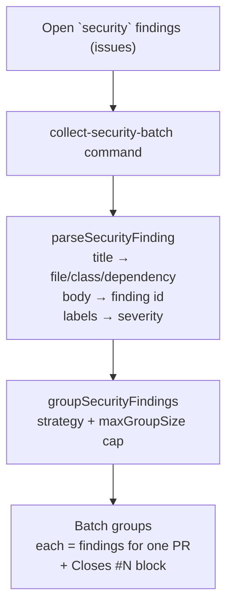

# 🛡️ Security remediation batching

Part of the worker-throughput epic (sub-issue).

The worker serialises to **one in-flight PR per work stream** (see
[DESIGN-PRINCIPLES.md → One PR per work stream](../DESIGN-PRINCIPLES.md)). Under a sustained stream of
`security` findings, that means the backlog clears one PR at a time. Batching
lets a single remediation PR close several *related* findings at once, raising
throughput **without** relaxing the one-PR-per-stream invariant.

## Safe grouping criteria

A batch only ever contains findings that can be remediated together in one
branch with low blast radius. Three strategies are supported:

| Strategy     | Groups findings that share… | Why it is safe to batch                |
| ------------ | --------------------------- | -------------------------------------- |
| `file`       | the same source file        | one edit pass over a single file       |
| `class`      | the same vulnerability class | one fix pattern applied repeatedly     |
| `dependency` | the same dependency          | one version bump                       |

Two guards keep batches reviewable and correct:

- **PR-size cap** — each group is capped at `maxGroupSize` findings (default
  `5`). Buckets larger than the cap are split into multiple groups, so no
  single batch PR grows too large to review.
- **Singleton fallback** — a finding with no shared key for the chosen strategy
  (e.g. a finding whose file could not be parsed) is emitted as its own group of
  one. Un-groupable findings are never batched unsafely.

## Traceability

Every group carries a ready-made GitHub auto-close block — one `Closes #N` line
per finding — so a batched PR closes (and references) every finding it
remediates. `buildFindingIdList` additionally renders the stable `SEC-…` ids
(falling back to `#N`) for the PR body.

## Components



- [`worker/deno/lib/security_remediation_grouping.ts`](../worker/deno/lib/security_remediation_grouping.ts)
  — pure grouping engine: `parseSecurityFinding`, `groupSecurityFindings`,
  `buildClosesReferences`, `buildFindingIdList`.
- [`worker/deno/commands/collect_security_batch.ts`](../worker/deno/commands/collect_security_batch.ts)
  — `collect-security-batch` command: lists a repo's open `security` findings
  (excluding the `security-scan-overflow` tracker) and returns the grouped
  batches as JSON.

## CLI

```bash
deno run ... mod.ts collect-security-batch \
  --repo owner/repo \
  --strategy file \
  --max-group-size 5
```

Output (JSON):

```json
{
  "strategy": "file",
  "maxGroupSize": 5,
  "totalFindings": 3,
  "groups": [
    {
      "key": "src/a.ts",
      "issueNumbers": [1, 2],
      "findingIds": "SEC-aaa000111222, SEC-bbb000111222",
      "closes": "Closes #1\nCloses #2"
    }
  ]
}
```

## Scope and staging

This change delivers the **grouping engine and the collection command** that a
batched security-remediation dispatch consumes. Wiring the live dispatch mode
(running the model over a batch and opening the single PR) is gated on the
backlog/throughput metrics from ****, which is the signal the epic uses to
decide whether batching alone suffices. See.
