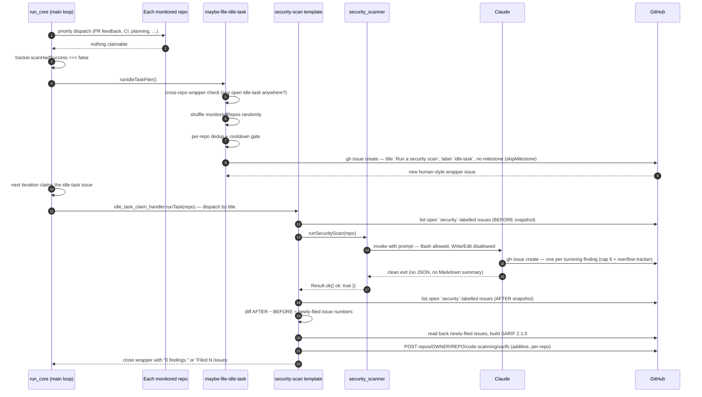
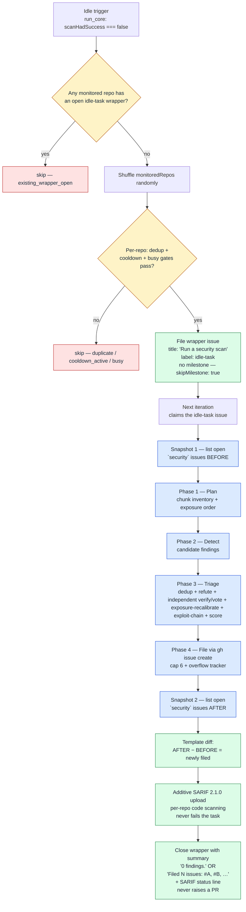
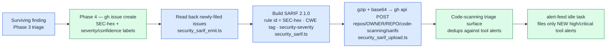

# 🛡️ Security Scans — Operator Manual

This document is the operator-facing reference for the Vibe Coder's MythOS-style
security audit. The intent is documented in the parent issue and the
four sub-issues that built it.

The security scan is **template #1 of the idle-task framework** — the generic
mechanism for "things the worker does when no claimable work exists". The
framework owns filing, dedup, label discipline, and claim routing; this document
covers the security-scan-specific behaviour layered on top. See
[`docs/IDLE-TASK-FRAMEWORK.md`](IDLE-TASK-FRAMEWORK.md) for the framework manual
and the lifecycle diagram common to every template.

For the **agent-facing** rules (label policy, suppression syntax, trigger
summary) see
[DESIGN-PRINCIPLES.md → Security scans](../DESIGN-PRINCIPLES.md#security-scans-simplified-by).

For the **rationale** behind the pipeline's shape — threat modelling, the
multi-stage false-positive triage, and patch verification — see the
[idle-task scans vs Anthropic & Visa harnesses gap analysis](security/idle-task-scans-vs-anthropic-visa-harnesses-gap-analysis.md)
, whose G1–G4 gaps drove the – scan upgrades, and the
[other security analyses](security/README.md) alongside it.

## Four-phase scaffold

Every idle security scan runs the same MythOS-style four-phase pipeline. The
canonical prompt text driving Claude lives in
[`prompts/security_scan/`](../prompts/security_scan/); the phase
summary below is reproduced from that prompt:

| Phase                       | Purpose                                                                                                                                                                        | Output                             |
| --------------------------- | ------------------------------------------------------------------------------------------------------------------------------------------------------------------------------ | ---------------------------------- |
| **1 — Plan**                | Inventory the codebase, build a chunk plan covering every entry point and every taint sink, then order the chunks by trust-boundary exposure (internet-facing / unauthenticated first, local / build-time last).                                | Chunk list (chunk ID, files, why, exposure band)  |
| **2 — Per-chunk detection** | For each chunk, read every referenced file and produce evidence-backed candidate findings against the vulnerability taxonomy below.                                            | Candidate findings (no triage yet) |
| **3 — Triage**              | Drop candidates with no code evidence, dedup by root cause, adversarially self-verify each survivor (re-read the cited file and attempt to refute reachability — refute → drop, partial → lower `confidence`), then **independently verify** each survivor with a fresh-context pass that never saw the detection reasoning and defaults to refute-unless-proven — high/critical findings run a severity-gated odd N-vote consensus (kept only when a majority cannot refute), medium/low stay single-pass — recalibrate each finding's severity by the exposure band of its trust boundary (raise on an unauthenticated internet-facing route, lower behind an internal-only boundary — one level, static-only), then **chain** survivors that share a statically-traceable data/trust path into one combined exploit-chain finding at the composed severity (may exceed the highest constituent; constituents still filed individually and cross-linked; counts as one issue against the cap), attach `confidence` and `easeOfExploit`. | Surviving findings                 |
| **4 — Report**              | Emit a machine-readable JSON block and a human-readable Markdown summary (exec summary, findings sorted by severity, unproven hypotheses, coverage map, suggested next scans). | One JSON + one Markdown block      |

The executor in `worker/deno/lib/security_scanner.ts` wraps Claude with the
prompt and waits for a clean exit; it does **not** parse Claude's stdout. As
of prompt v5 the contract is **outcome-only** — Claude itself
files one GitHub issue per surviving finding via `gh issue create` inside the
scan, and success is verified by diffing the repo's open `security`-labelled
issues before and after the run. Prompt v6 expanded the Phase
2 taxonomy to cover the CWE Top 25 + OWASP Top 10 weakness classes missing
from v5 (CSRF, XSS, XXE, mass assignment, server-side template injection,
broader authentication/authorisation) and retired the
`{{REPO_FULL_NAME}}` placeholder — the executor's cwd points at the cloned
repo, so `gh issue create` operates on the right one without explicit
substitution. The diff lives in
[`worker/deno/lib/idle_task_templates/security_scan_template.ts`](../worker/deno/lib/idle_task_templates/security_scan_template.ts).
The scanner returns `Result<{ ok: true }, ScanError>`; the `Finding`/`ScanReport`
types, the JSON-block extractor, the Markdown-summary extractor, and the
separate `security_issue_filer.ts` module that previously rendered findings
were retired in.

Write/Edit/MultiEdit/NotebookEdit and plan-mode tools are explicitly
disallowed; Bash remains allowed so Claude can call `gh issue create`.

## Dependency-update quarantine audit

Every Phase 2 detection pass since prompt
`v2` audits the target repo's auto-update
tooling for a `minimumReleaseAge`-style quarantine on external dependencies.
The audit exists to close the gap identified in and tracked under
parent: recent supply-chain attacks (npm, PyPI, crates.io maintainer takeovers)
typically ship malicious versions for a short window before takedown, so a repo
that auto-merges third-party bumps within minutes of publish is materially
exposed. The audit makes that exposure visible as a normal scanner-filed
issue (severity-emoji title, `severity:<level>` and `confidence:<level>` labels
— see [Reading a filed finding issue](#reading-a-filed-finding-issue)) rather
than letting it sit silent.

### What it inspects

The Phase 1 chunk plan lists every dependency-update configuration present in
the repo; the Phase 2 audit then opens each one and confirms the quarantine
rules:

- **Renovate** — `renovate.json`, `.github/renovate.json`, `renovate.json5`.
  Looks for a top-level or `packageRules` entry that sets `minimumReleaseAge`
  (or its legacy alias `stabilityDays`) to a window of at least
  `VIBE_BUMP_QUARANTINE_HOURS` hours.
- **Dependabot** — `.github/dependabot.yml`. Dependabot has **no native
  `minimumReleaseAge`** field — only the in-preview `cooldown` keyword — so a
  Dependabot-only repo without a compensating `bump-deps.sh` will reliably
  surface as a finding.
- **Deno native `minimumDependencyAge`** — `deno.json`, `deno.jsonc`. For a
  Deno repo, Deno's CLI has a native quarantine for JSR and `npm:`
  dependencies. The audit accepts `minimumDependencyAge` as a valid Deno
  quarantine when its `age` resolves to at least `VIBE_BUMP_QUARANTINE_HOURS`
  hours (default **24**) — the value may be integer minutes (`"1440"`), an
  ISO-8601 duration (`"P1D"`, `"PT24H"`), or an RFC3339 cutoff; `"0"`
  disables it. The object form `{ "age": …, "exclude": [<jsr:/npm: globs>] }`
  must `exclude` internal `stSoftwareAU` deps (`jsr:@stsoftware/*`,
  `npm:@stsoftware/*`) so they bypass the wait. A Deno repo missing the field
  (with no compensating `bump-deps.sh`) surfaces as `quarantine-missing`; one
  that sets it below the threshold, to `"0"`, or omits the internal-scope
  `exclude` surfaces as `quarantine-misconfigured`. Non-Deno repos are out of
  scope for this check.
- **Per-repo `bump-deps.sh`** — when present, it must either delegate to a
  correctly-configured Renovate/Dependabot or implement its own age gate
  against `VIBE_BUMP_QUARANTINE_HOURS` before upgrading external deps (e.g.
  inspecting npm `time`, JSR publish timestamps, crates.io `created_at`, or
  Maven Central `lastUpdated`).

### Beyond dependency manifests — host toolchain upgrades

The quarantine is **not** limited to dependency manifests. The
worker also upgrades four externally-distributed executables on its own hosts,
and each is gated on the same window by
[`worker/deno/lib/tool_release_age.ts`](../worker/deno/lib/tool_release_age.ts):

| Tool             | Release channel checked                | Pinned?                             |
| ---------------- | -------------------------------------- | ----------------------------------- |
| Claude CLI       | npm `@anthropic-ai/claude-code`        | No — `claude update` takes no version |
| `gh` binary      | GitHub releases `cli/cli`              | No — `brew upgrade gh` takes no version |
| `gh` extensions  | the ref `gh` would install: the latest release tag for a binary extension, the default branch's HEAD commit for a script one | Yes — `gh extension install <repo> --pin <ref> --force` |
| Deno             | GitHub releases `denoland/deno`        | Yes — `deno upgrade <version>`       |

Three rules differ from the manifest checks above and are deliberate:

- **Fail-closed.** An unverifiable release age (registry unreachable, no dated
  release, `gh api` failure) **blocks** the upgrade and logs a warning. Manifest
  checks are best-effort so an offline setup still works; deferring an optional
  toolchain upgrade costs nothing, so the safer default applies here.
- **No wholesale `gh extension upgrade --all`.** Extensions are enumerated with
  `gh extension list` and upgraded one at a time so each third-party repository
  is age-checked individually. If the list cannot be read, nothing is upgraded.
- **The gate dates the ref that is installed.** Bare
  `gh extension upgrade <name>` installs the latest release for a *binary*
  extension but pulls the default branch for a *script* extension, so dating
  every extension by its latest release let a repo with a stale tag and an
  active `main` pass the window while a ten-minute-old commit was installed.
  The gate now resolves whichever ref `gh` would take and the upgrade pins to
  it. A script extension's HEAD date is self-reported by the pusher — weaker
  than a GitHub-stamped `published_at`, but it is the date of the artefact
  actually installed. An extension whose ref cannot be dated is skipped and
  reported.

### Internal vs external classification

Per the worker-side bump policy in, dependencies under
`stSoftwareAU/*` are **internal** — bumped immediately, no quarantine, so that
packages like FLEET stitch in the latest private-repo-14 without delay. All other
dependencies (npm, JSR, crates.io, Maven Central, third-party GitHub Actions)
are **external** and require the quarantine. A `packageRules` entry that
*excludes* `stSoftwareAU/*` from the wait is the correct shape; a rule that
gates internal deps is itself a misconfiguration to flag.

### Threshold

The required quarantine window is `VIBE_BUMP_QUARANTINE_HOURS` hours, default
**24**. Configurations shorter than this — or shorter than the override active
on the worker — count as misconfigured.

### Finding classes

The audit emits one of two finding classes — Claude itself files them via
`gh issue create` from inside the scan, with the canonical
`severity:<level>` / `confidence:<level>` label pair (see
[Reading a filed finding issue](#reading-a-filed-finding-issue)) like every
other finding:

| Class                                     | Meaning                                                                                                                                                                                                                                                                                                  |
| ----------------------------------------- | -------------------------------------------------------------------------------------------------------------------------------------------------------------------------------------------------------------------------------------------------------------------------------------------------------- |
| `supply-chain:quarantine-missing`         | No eligible quarantine config detected for one or more ecosystems in scope — e.g. a Dependabot-only repo with no compensating `bump-deps.sh`, or no auto-update tooling at all while third-party deps are present.                                                                                       |
| `supply-chain:quarantine-misconfigured`   | Quarantine config is present but the window is shorter than `VIBE_BUMP_QUARANTINE_HOURS`, the rule does not cover every external ecosystem in scope (e.g. Renovate gates npm but not cargo), or the rule incorrectly gates internal `stSoftwareAU/*` packages (which must bypass the quarantine).        |

### Hard rule: inspect-only, never auto-remediate

The audit is read-only. It must never rewrite `renovate.json`,
`.github/dependabot.yml`, `deno.json` / `deno.jsonc`, or `bump-deps.sh`, and
it must never open a remediation PR — in particular it never runs
`deno update` / `deno outdated --update`. Misconfigurations surface as a normal scanner-filed
issue, which then flows through the standard Vibe Coder grill-me → planning →
work-on pipeline. The same prompt-level "Must not modify the codebase"
constraint that applies to every other Phase 2 finding applies here — the
audit cites the offending lines and proposes a fix, but the worker leaves the
actual edit to a downstream issue run after human triage.

## Triggers



The flowchart below summarises the same flow as a decision tree. The four
phases (plan → detect → triage → file) sit in the middle of the chart; the
primary output channel (Claude calling `gh issue create` from inside Phase 4)
hangs off the file phase, the additive SARIF upload follows the before/after
snapshot diff, and the wrapper close-comment is rendered from that diff plus the
SARIF status line.



### Idle trigger

Wiring lives in `worker/deno/lib/run_core.ts`. After the priority dispatch and
the Priority-2 issue scan, when no work was processed
(`tracker.scanHadSuccess === false`) and the optional `runIdleTaskFiler` hook
is wired in, the loop invokes the hook inside a `try/catch` so a filer failure
cannot abort the loop. The production wiring in `run_core_production_deps.ts`
delegates to the `maybe-file-idle-task` Deno command.

The command itself (`worker/deno/commands/maybe_file_idle_task.ts`) owns the
rest of the decision tree (retired the in-process trigger and its
state files — no last-scanned timestamps, no idle-cycle counter, no scan lock):

1. **Repo availability sweep** — short-circuits if any monitored repo has
   claimable work.
2. **Random repo selection** — shuffles `monitoredRepos` via a
   `crypto.getRandomValues`-backed Fisher-Yates and walks the result, picking
   the first repo with no open `idle-task` issue (label-only dedup).
3. **File the human-style wrapper issue** — the
   `security-scan` template files the wrapper as an issue that reads
   like one a person would type:

   - **Title:** the literal string `Run a security scan`.
   - **Body:** the latest `prompts/security_scan/` template with
     the three remaining placeholders (`{{SUPPRESSED_IDS}}`,
     `{{KNOWN_OPEN_FINDING_IDS}}`, `{{OPEN_ISSUE_TITLES}}`) substituted
     at file time — no hidden marker, no parameters block. The two dedup
     lists render as `(none)` on the wrapper itself and are rebuilt from
     live issues at claim time. Language detection now happens inside
     the scanning agent during the Phase 1 inventory step (free-form
     filesystem inspection), so the worker no longer substitutes a
     language list at raise time. retired the `{{REPO_FULL_NAME}}`
     placeholder; the worker's cwd is the cloned repo, so `gh issue
     create` operates on the right one without an explicit `--repo`
     argument.
   - **Label:** the canonical `idle-task` label. retired
     the `idle-task-pending` / `requiresApproval` approval gate;
     `idle-task` is already the lowest priority in the queue, so a
     separate approval step added no value.
   - **No milestone** — the template sets `skipMilestone: true`, so the wrapper is filed as a standalone issue and never
     gates a milestone-merge PR. See
     [Skipping the per-template milestone](IDLE-TASK-FRAMEWORK.md#skipping-the-per-template-milestone)
     in the framework manual.

   The next iteration of the main loop claims the issue through standard
   priority dispatch and the claim handler routes it to
   `securityScanTemplate.runTask` by matching the issue title. The template also re-runs its `shouldFile` gate per repo
   before filing: no fresh wrapper is created while open security
   findings or an existing `Run a security scan` wrapper still exist.

## No PR, ever

A security-scan idle-task **never raises a pull request**, regardless of
outcome. Every finding is filed as a standalone GitHub issue in the
scanned repo; the wrapper idle-task issue is closed with a summary
comment and nothing else. Because the template sets `skipMilestone:
true`, the wrapper issue is not assigned to any milestone, so closing
it never triggers the milestone-completion → merge-PR flow that
ordinary milestone work uses. The only artefacts a scan produces are:

1. **New finding issues** filed by Claude itself via `gh issue create`
   from inside Phase 4 of the scan, capped at **6 standalone findings
   per run** by the Phase 4 instructions in
   [`prompts/security_scan/`](../prompts/security_scan/).
2. **An overflow tracker** issue (label `security-scan-overflow`) when
   survivors exceed the six-finding cap.
3. **A SARIF 2.1.0 upload** of the same findings to the scanned repo's own
   GitHub code scanning — additive to the issues, never a replacement. See
   [SARIF publishing to code scanning](#sarif-publishing-to-code-scanning).
4. **A closing comment** on the wrapper idle-task issue — see
   [Close-comment shape](#close-comment-shape) below.

There is no separate Deno-side filer module any more — the previous
`worker/deno/lib/security_issue_filer.ts` was retired in
. The cap, label set, dedup-against-open-issues check,
and in-code suppression check are all enforced by the Phase 4
instructions Claude follows directly.

Auto-remediation is **out of scope** for the scanner. Fixes are filed
as ordinary issues that flow through the normal triage → planning →
work-on pipeline, where each fix is implemented and reviewed
individually.

## SARIF publishing to code scanning

Findings are **also** published as a **SARIF 2.1.0** document uploaded to the
scanned repo's GitHub **code scanning**. This closed a half-open loop: the
worker already *consumed* code-scanning alerts via the `alert-feed` idle task
(see [`docs/IDLE-TASK-FRAMEWORK.md`](IDLE-TASK-FRAMEWORK.md)) but never
*published* its own findings, so operators saw tool alerts and scanner issues on
two unconnected surfaces.

Three durable properties govern the surface:

- **Additive, never a replacement.** The issue-filing path of Phase 4 is
  unchanged. SARIF runs *after* the before/after issue diff and reads those same
  issues back; if the upload is impossible the issues still stand on their own,
  and the wrapper task still succeeds.
- **Per-repo.** The upload targets the scanned repo's own
  `POST repos/<owner>/<repo>/code-scanning/sarifs` endpoint. Nothing is
  centralised cross-repo — each repo owns and triages its own alerts.
- **Fail-loud.** Every outcome is reported in the wrapper's close
  comment. A missing code-scanning surface (403/404) is surfaced as its own
  distinct state, never collapsed into a silent success.



### What lands in the SARIF

[`worker/deno/lib/security_sarif.ts`](../worker/deno/lib/security_sarif.ts) is
a pure builder: it parses the filed issues back into structured findings and
emits **one rule plus one result per finding**.

| SARIF field                            | Value                                                                        |
| -------------------------------------- | ---------------------------------------------------------------------------- |
| `runs[].tool.driver.name`              | `VibeCoder-security-scan`                                                    |
| `rule.id` / `result.ruleId`            | the finding's stable `SEC-<hex>` id — the same id the issue body carries      |
| `result.partialFingerprints`           | `vibeSecurityFindingId` = `SEC-<hex>`, so re-uploads update rather than clone |
| `rule.properties.tags`                 | `security`, plus `external/cwe/cwe-<n>` when the issue carries a CWE marker   |
| `rule.properties.security-severity`    | GHAS score derived from the triaged severity (table below)                    |
| `result.locations`                     | present only when the issue title parsed a `<file>:<line>`; otherwise omitted (the finding is still reported, never dropped) |

Severity mapping — the scanner's four triaged buckets drive both the SARIF level
and the GHAS `security-severity` score:

| Triaged severity | SARIF level | `security-severity` |
| ---------------- | ----------- | ------------------- |
| `critical`       | `error`     | 9.0                 |
| `high`           | `error`     | 7.5                 |
| `medium`         | `warning`   | 5.0                 |
| `low`            | `note`      | 2.5                 |

The severity comes from the issue's `severity:<level>` label, falling back to
the title's severity emoji. Issue text (title, prose) is carried into the SARIF
strictly as **data** — never interpreted as instructions.

**CWE tagging.** The builder emits the GitHub-recognised
`external/cwe/cwe-<n>` tag whenever a filed issue body carries a
`<!-- cwe: CWE-<n> -->` marker directly after the `<!-- finding-id: SEC-… -->`
marker, and those tags are what a future vulnerability-chaining pass (gap G3 of
the [gap analysis](security/idle-task-scans-vs-anthropic-visa-harnesses-gap-analysis.md))
consumes. The `security_scan` prompt emits that marker, so rules built from a
current run carry both `security` and `external/cwe/cwe-<n>`. Findings filed
before the marker was added to the prompt carry the `security` tag only;
uploads are unaffected either way.

### Upload mechanics

[`security_sarif_upload.ts`](../worker/deno/lib/security_sarif_upload.ts)
gzip+base64-encodes the document (Web-standard `CompressionStream`, no Node
dependency), resolves the checkout's commit and ref (`git rev-parse HEAD` plus
`git symbolic-ref -q HEAD` — a **detached HEAD** is surfaced as an error rather
than guessed at), and POSTs via `gh api`.
[`security_sarif_emit.ts`](../worker/deno/lib/security_sarif_emit.ts)
orchestrates the three steps and never throws — it returns one status line that
the template appends to the wrapper close comment.

| Status line appended to the close comment            | Meaning                                                                                        |
| ---------------------------------------------------- | ---------------------------------------------------------------------------------------------- |
| `SARIF: uploaded N findings to code scanning.`       | Success — the alerts are live on the repo's code-scanning tab.                                  |
| `SARIF: skipped (0 findings).`                       | The run filed nothing, so there was nothing to publish.                                         |
| `SARIF: skipped (no parseable findings).`            | Issues were filed but none carried a readable `SEC-<hex>` marker — check the Phase 4 body shape. |
| `SARIF: not uploaded — <git error>`                  | The commit/ref could not be resolved (typically a detached HEAD in the clone).                   |
| `SARIF: code scanning unavailable (HTTP 403\|404) — findings filed as issues only.` | Code scanning is off for the repo, or the token lacks `security_events`. Issues are unaffected. |
| `SARIF: upload failed — <error>`                     | A hard API failure. The findings still exist as issues; the next scan re-uploads.                |
| `SARIF: emission threw — <error>`                    | An unexpected fault inside the emitter. Same remedy — the issue path is unaffected.              |

### Dedup: issues, SARIF alerts, and the `alert-feed` task

Three dedup mechanisms operate on different surfaces and do not overlap:

1. **Issue dedup** — Phase 4 skips a finding whose `SEC-<hex>` id already
   appears in an open `security` issue (see
   [Dedup against open and recently-closed findings](#dedup-against-open-and-recently-closed-findings)).
2. **Code-scanning dedup** — GitHub reconciles re-uploaded results by rule id
   and `partialFingerprints`, so re-scanning the same unchanged code updates the
   existing alert instead of stacking duplicates. Findings from other tools
   (CodeQL, Dependabot) sit alongside them on the same triage surface.
3. **`alert-feed` dedup** — the `alert-feed` idle task reads a repo's
   code-scanning and Dependabot feeds and files an issue per **new**
   high/critical alert, deduping on its own
   `<!-- alert-fingerprint: … -->` marker. Because the scanner's own alerts are
   now on that feed, a high/critical scanner finding can be seen twice: once as
   the Phase 4 issue and once, later, as an `alert-feed` issue derived from the
   uploaded SARIF. Close the duplicate — they share the underlying finding, and
   closing the scanner issue does not remove the code-scanning alert (dismiss
   that on the code-scanning tab, or fix the code).

## Dedup against open and recently-closed findings

The v5 prompt instructs Claude to skip findings whose stable
`SEC-<hex>` id is already present in an issue body. Before filing
each finding, Phase 4 runs:

```text
gh issue list --repo <owner/repo> --state open --label security \
  --search "SEC- in:body" --json number,body --limit 200
```

and inspects each body for a `<!-- finding-id: SEC-… -->` marker.
Findings whose id matches an **open** issue are skipped — there is no
in-place update path any more. The expectation is that the human
operator triages the open issue (close it, fix it, or add a
`security-scan-ignore: SEC-…` comment in the source); the next scan
will re-detect the same root cause and either skip it (still open),
re-file it (closed + re-introduced after the dedup window), or omit
it entirely (suppression marker now present).

Claude also receives three lists at prompt-build time so it can
prune candidates before Phase 4 fires its `gh issue create` calls:

- `{{KNOWN_OPEN_FINDING_IDS}}` — stable ids of currently-open
  scanner-filed issues in the repo, read **repo-wide** from the
  `<!-- finding-id: … -->` body marker regardless of label.
- `{{OPEN_ISSUE_TITLES}}` — every open issue in the repo as
  `#<number> — <title>`, again **repo-wide and label-blind**, so a
  finding already tracked under another scan's label (or typed by a
  human) is recognised semantically.
- `{{SUPPRESSED_IDS}}` — stable ids appearing in an in-source
  `security-scan-ignore: SEC-…` comment (grammar in
  [`worker/deno/lib/suppression_comments.ts`](../worker/deno/lib/suppression_comments.ts)).

Each renders `(none)` when empty. Suppressed and already-open findings
are dropped **silently** in Phase 3 triage — never filed, and never
commented on or cross-linked to the existing issue. Both dedup lists are
bounded (300 titles, 200 finding-id bodies) and hitting the bound is
logged loudly; see
[Cross-label dedup](IDLE-TASK-FRAMEWORK.md#cross-label-dedup--the-open-issue-title-list)
in the framework manual.

## Close-comment shape

The claim handler closes the wrapper idle-task issue with one of two
deterministic comment strings, rendered by `renderRunSummary()` in
[`security_scan_template.ts`](../worker/deno/lib/idle_task_templates/security_scan_template.ts)
from the before/after snapshot diff:

- **Zero newly-filed findings** — the literal string:

  ```text
  0 findings.
  ```

  Emitted whenever the AFTER snapshot of open `security`-labelled
  issues contains the same set as the BEFORE snapshot. Covers clean
  scans, scans where every candidate was deduplicated against an
  existing open finding, and scans where Claude failed before filing
  anything.

- **One or more newly-filed findings** — a single line listing each
  new issue number ascending:

  ```text
  Security scan complete. Filed 2 issues:,
  ```

  The issue numbers are sorted ascending so the comment is
  deterministic across reruns and across workers.

- **Scanner failure** — when `runSecurityScan` returns an error, the
  wrapper is closed with `security-scan failed: <kind> — <message>`.
  A thrown error surfaces as `security-scan threw: <message>`.

On a **successful** run the SARIF status line is appended to
whichever of the first two strings applies, giving e.g.
`Security scan complete. Filed 2 issues:, SARIF: uploaded 2 findings
to code scanning.` The failure strings return before the SARIF step, so they
never carry one. See
[SARIF publishing to code scanning](#sarif-publishing-to-code-scanning)
for the full set of status lines.

The comment is posted by the idle-task claim handler when it closes
the wrapper issue; it never opens a PR.

## State files

There are none. retired the per-host state files
(`security_scan_idle.json`, `security-scan-state.json`,
`security_scan.lock`) — the idle-task filer picks a target by shuffling
`monitoredRepos` and deduping against open `idle-task` issues, and the
atomic claim machinery on the filed issue serialises the actual scan
across workers. Removing the state files eliminates a class of stale-state
bugs (orphaned locks, drifted last-scanned timestamps after a clock skew,
counter desyncs after a crash) and makes the trigger trivially auditable
from GitHub alone.

## Reading a filed finding issue

Each finding is filed as its own GitHub issue in the scanned repo.

**Title.** Format is `<emoji> <plain title>` where the emoji
encodes the severity bucket so the issue list reads severity at a glance:

| Emoji | Severity |
| ----- | -------- |
| 🔴    | critical |
| 🟠    | high     |
| 🟡    | medium   |
| 🟢    | low      |

The plain title is `<class> in <file>:<first-line>` — e.g. `🔴 injection:SQL in
src/auth.ts:47`. Findings whose severity falls outside the four-bucket scheme
(e.g. `Informational`) omit the emoji prefix.

**Labels.** Every filed issue is auto-tagged with both axes:

- `severity:critical` | `severity:high` | `severity:medium` | `severity:low`
- `confidence:high` | `confidence:medium` | `confidence:low`

The labels are created on first use against the target repo if they don't
already exist. The blanket `security` label is also applied (Phase 4 of the
v5 prompt — `security` is the always-on label used by the wrapper's
before/after snapshot diff to identify newly-filed findings). The worker is
not authorised to apply workflow labels (`work-on`, `top-priority`, etc.);
[`label_security.ts`](../worker/deno/lib/label_security.ts) strips any such
label from a scanner-filed issue on each subsequent scan, so an accidental
operational label cannot persist.

The body has three parts (per the Phase 4 instructions in
[`prompts/security_scan/`](../prompts/security_scan/)):

1. **Marker comment** — `<!-- finding-id: SEC-<hex> -->` on its own
   line at the top. The scanner reads this on every subsequent run to
   dedup against open issues, so the same root cause never re-files.
2. **Prose lead** — names the file, lines, severity, and class, e.g.
   `SQL injection at src/api/orders.ts:47–52 — severity High,
   confidence Medium, class injection:SQL`.
3. **Structured Markdown sections** — Claude emits only the sections
   it has evidence for, in this order:
   - `## Why it is a bug` — citation linking the relevant lines.
   - `## Attacker model` — who can reach this surface and what they
     already need.
   - `## Trigger` — concrete request, payload, or sequence that
     drives the bug.
   - `## Exploit sketch` — what the attacker gains (data leak, RCE,
     privilege bump, …).
   - `## Suggested fix` — a one- or two-paragraph proposal that the
     downstream issue run will treat as the starting point.

Operators who want to suppress the finding on future runs paste the
in-source comment described in
[`DESIGN-PRINCIPLES.md → Security scans`](../DESIGN-PRINCIPLES.md#security-scans-simplified-by):
`security-scan-ignore: SEC-<id> — author=<login> expires=<YYYY-MM-DD> reason`.
The grammar lives in
[`worker/deno/lib/suppression_comments.ts`](../worker/deno/lib/suppression_comments.ts)
and the next scan will pre-substitute the suppressed id into the
`{{SUPPRESSED_IDS}}` placeholder so Claude drops the finding in
Phase 3 triage.

Author, expiry, and reason are all **mandatory**. A marker
missing any of them, carrying a malformed or past expiry, or naming an
author outside a configured allowlist is parsed and reported but never
suppresses — the finding stays visible rather than being waived forever.
Every marker seen during a run is listed in that run's scan report as
`Active suppressions (N): …` / `Rejected suppressions (N): …`.

A marker must also sit on a line of at most **2,000 characters**
(`MAX_SUPPRESSION_LINE_CHARS`,) — the parser is fed
attacker-influenced source on the worker's only thread, so the text any
pattern sees is bounded. A longer line is skipped unparsed, which fails
safe: the finding stays visible.

## Overflow rollover

A single run files at most **six** standalone findings. The cap is
enforced by the Phase 4 instructions in
[`prompts/security_scan/`](../prompts/security_scan/) — there
is no hardcoded constant in Deno any more (the previous
`MAX_FILED = 6` in `security_issue_filer.ts` was retired with that
module in). When more than six findings survive triage,
Claude files the top six (sorted severity → confidence → ease of
exploit) as standalone `security` issues and rolls the remainder into
a single **overflow tracker** issue so the follow-up scan knows what
is still outstanding.

**When it is created.** Claude files the tracker from inside Phase 4
in the same scan invocation that filed the first batch, but only when
the post-triage survivors list contains more than six items.

`prompts/security_scan/prompt.md` carries a second
trigger: Phase 2 stops sweeping lower-exposure chunks once the candidate set
already exceeds roughly twice the cap, so a run may finish with chunks
unswept. The tracker then also carries a `## Chunks not reached` section
listing each one by number, name and exposure band — and is filed for that
reason alone, titled `security-scan-overflow: N chunks not reached`, even
when six or fewer findings survived. A bounded sweep is therefore always
visible in the filed output rather than silent.

**Title and label.** The tracker issue is titled
`security-scan-overflow: N unfiled findings`, where `N` is the size of
the leftover slice. It carries the `security-scan-overflow` label
only — neither the blanket `security` label nor any workflow label is
applied.

**Body format.** Claude renders the body with a fixed shape:

```text
# Security scan overflow

The most recent scan produced more than 6 findings. The top 6 were
filed as standalone issues; the remainder are listed below for
follow-up triage.

- `SEC-<hex>` — **High** injection:SQL in `path/to/file.ts`: <one-line
  why-it-is-a-bug summary>
- `SEC-<hex>` — **Medium** crypto:weak-primitive in `other/file.go`: …
- …
```

Each bullet follows the pattern `- \`<id>\` — **<severity>** <class>
in \`<file>\`: <summary>`.

**Follow-up processing.** The tracker is informational — it is not re-read by
the scanner on the next run. A subsequent scan re-runs the full four-phase
pipeline against the current source tree, so any finding that still exists in
the code will simply be re-detected and re-filed (subject to the live dedup
query against open `security` issues that Phase 4 runs before each filing).
The operator workflow is therefore:

1. Triage the six filed issues — close, fix, or add a
   `security-scan-ignore: SEC-…` comment in the source for any false positives.
2. Once the batch is cleared, wait for the next idle trigger to scan the same
   repo again.
3. The next scan re-detects the leftover findings (they are still in the code),
   re-triages, and files the next batch of six.
4. When everything has been triaged the tracker can be closed by hand.

The tracker therefore acts as a checklist for the human operator rather than a
queue for the worker.

## Vulnerability taxonomy covered

From the `prompts/security_scan/` v16 prompt the Phase 2 taxonomy
is organised around the **OWASP Top 10 2025**
(https://owasp.org/Top10/2025/): each class below is tagged with its
`A0N:2025` category id+name, and every one of the ten 2025 categories — Broken
Access Control (A01, with SSRF now merged in), Security Misconfiguration (A02),
Software Supply Chain Failures (A03), Cryptographic Failures (A04), Injection
(A05), Insecure Design (A06), Authentication Failures (A07), Software or Data
Integrity Failures (A08), Security Logging and Alerting Failures (A09), and the
new Mishandling of Exceptional Conditions (A10) — is represented. The deep
supply-chain checklist (A03) is cross-referenced to the dedicated
`supply_chain_readiness` and `github_actions_audit` tasks rather than
duplicated.

The Phase 2 prompt instructs Claude to cover every applicable class from this
list:

- **Memory safety** — OOB reads/writes, UAF, double free, integer overflow,
  unsafe FFI, missing bounds checks.
- **Injection** — SQL, command, LDAP, XPath, header (CRLF), log forgery.
- **Server-side template injection (SSTI)** — user input rendered as a
  template expression by Jinja, ERB, Twig, Handlebars, or Liquid without
  strict separation of template source from user data.
- **XSS** — reflected, stored, and DOM-based XSS where user input is
  reflected into HTML, JS, or attribute context without contextual encoding
  for the target sink.
- **CSRF** — state-changing endpoint authenticating via session cookie
  without an anti-CSRF token, double-submit cookie, or `SameSite=Strict`
  attribute.
- **XXE** — XML parser configured to resolve external entities.
- **Mass assignment** — model populated directly from request body without
  an allowlist of writable fields.
- **Authentication gaps** — missing or skipped authentication on a
  privileged endpoint, broken password-reset flow (predictable or
  guessable token, no expiry), session fixation, missing MFA on admin
  paths, weak or missing cert/signature validation.
- **Authorisation gaps** — IDOR, broken function-level authorisation (role
  check enforced only by the UI), tenant boundary leakage, missing
  object-ownership checks on `update`/`delete`, JWT/session weaknesses
  (none-alg, no expiry, predictable IDs).
- **Deserialisation / parser confusion** — unsafe `pickle` /
  `ObjectInputStream`, polyglot bugs, YAML/XML expansion bombs, prototype
  pollution.
- **SSRF** — outbound HTTP to user-controlled URL without allowlist or with
  metadata-IP blocking missing.
- **Path traversal** — `..` segments, absolute-path overrides, symlink follow
  into restricted areas, Zip Slip.
- **Open redirect** — redirect target derived from user input without a
  destination allowlist.
- **Race / TOCTOU** — check-then-use windows on filesystem, permissions, session
  state, rate-limit counters.
- **Crypto misuse** — weak primitives (MD5/SHA-1 for integrity, DES, RC4, ECB),
  IV/nonce reuse, predictable randomness, non-constant-time secret/MAC
  comparisons.
- **Secrets** — hard-coded credentials, API keys committed to source, secrets in
  logs or error messages, secrets in default config.
- **Dangerous defaults** — debug mode on by default, permissive CORS, default
  admin password, weak default crypto, off-by-default rate limits,
  off-by-default authentication.
- **Supply chain** — unpinned GitHub Actions (`@v4` rather than 40-character
  SHA), unmaintained packages, packages fetched over HTTP, `curl | sh` install
  patterns, lockfile drift.
- **Permissive CORS/CSP** — `Access-Control-Allow-Origin: *` paired with
  credentials, `unsafe-inline` / `unsafe-eval` without justification, missing
  CSP on an authenticated app.
- **Missing rate limiting** — login, password reset, OTP, sensitive API
  endpoints without per-actor throttling.
- **Security logging & alerting failures (A09)** — auth/authz denials
  swallowed by a `catch`/`except` block without logging, privileged or
  state-changing endpoints with no audit-log call on the security path, a
  logging framework configured to drop security events (level above the
  event, disabled audit appender), and log sinks with no integrity
  protection (forge/erase). Precision-first: every finding cites a concrete
  code path; no blanket "no logging found" finding. Secrets/PII in logs are
  filed once under the A04 **Secrets** class, cross-referenced here.
- **Node tooling in a Deno repo (regression)** — Node-only tooling growing
  inside a Deno repo. Phase 1 records the **dual-marker** state:
  when both Deno markers (`deno.json`, `deno.jsonc`, `deno.lock`) and Node
  markers (`package.json`) are present, the repo is classified as **Deno** for
  remediation purposes, and Phase 2 may file a regression finding. A Node-only
  repo (no Deno markers) is still Node and this class does not apply. The
  finding is filed at `severity:medium` with a cited offending path, covering a
  committed `node_modules/`, runtime `dependencies` in `package.json`
  (`devDependencies` is parity, not a regression), CI steps that run repo code
  via `npm`/`pnpm`/`yarn`/`npx`, and Node-only dev dependencies (Jest, Mocha,
  Webpack, Vite, esbuild, ESLint, Prettier) where a Deno-native equivalent
  already covers the need. The suggested fix points at the Deno-native tool
  (`deno test`, `deno lint`, `deno fmt`, `deno bundle`, `deno run`). Carve-out:
  pre-existing Node files are left alone — only growing Node-only tooling is in
  scope.

### OWASP GenAI / LLM Top 10 (2025) — LLM-using repos only

From the `prompts/security_scan/` v17 prompt onward (parent)
the Phase 2 taxonomy also covers the **OWASP GenAI / LLM Top 10 (2025)**
(https://genai.owasp.org/llm-top-10/). These ten classes — Prompt Injection
(LLM01), Sensitive Information Disclosure (LLM02), Supply Chain (LLM03), Data
and Model Poisoning (LLM04), Improper Output Handling (LLM05), Excessive Agency
(LLM06), System Prompt Leakage (LLM07), Vector and Embedding Weaknesses (LLM08),
Misinformation (LLM09), and Unbounded Consumption (LLM10) — apply **only** to a
repo identified as **LLM-using**: one that talks to a Large Language Model in
code. Findings still file through the standard Phase-4 path with the usual
`security` + `severity:*` + `confidence:*` labels; this is detect-and-file only
(no guardrail hardening).

LLM-usage is decided by the shared, precision-first detection rule in
[`worker/deno/lib/llm_usage_detection.ts`](../worker/deno/lib/llm_usage_detection.ts)
(also used by the generic gate, — one mechanism, not two). A repo is
flagged only on a concrete integration signal in **code or dependency
manifests**, never on prose, the repo **name**, or mentions in `docs/`,
`README`, or examples:

- **Primary** — a declared LLM client SDK dependency (`@anthropic-ai/sdk`, the
  Claude Agent SDK, `openai`, `@google/genai`, `cohere-ai`, `@mistralai/*`,
  `langchain` / `@langchain/*`, `llamaindex`; Python `anthropic`, `openai`,
  `google-generativeai`, `litellm`).
- **Secondary** — a live LLM API host, endpoint, or model id in source
  (`api.anthropic.com`, `api.openai.com`,
  `generativelanguage.googleapis.com`, `/v1/messages`,
  `/v1/chat/completions`, or model ids `claude-*`, `gpt-4*`, `gemini-*`).

When no signal is present the LLM section is skipped entirely (skip on absence).

**The worker computes this verdict deterministically and supplies
it to the prompt.** `runSecurityScan` in
[`worker/deno/lib/security_scanner.ts`](../worker/deno/lib/security_scanner.ts)
calls `detectLlmUsageForRepo(repo, workDir)` against the clone and substitutes
the authoritative `LLM-using = YES|NO` verdict into the prompt's `{{LLM_GATE}}`
block (v18). Claude honours that verdict rather than re-deriving its own — there
is one gate, not two. A detection failure falls back to `LLM-using = NO` (skip
on absence). The `{{LLM_GATE}}` block lists the matched signals so each filed
finding can cite them.

**Always-on allowlist floor.** `stSoftwareAU/VibeCoder` is audited against the
LLM classes regardless of signals, via the explicit `LLM_AUDIT_ALLOWLIST`
constant in `llm_usage_detection.ts` — the single floor shared with the gate.
The allowlist is kept deliberately narrow (precision-first; VibeCoder only,
"until we work out a better way"). In practice VibeCoder also self-identifies by
genuine source signals (`api.anthropic.com` / `/v1/messages` and `claude-*`
model ids in `worker/deno/lib/`), so the floor and the signals agree. Its four
highest-value LLM surfaces are called out for
priority audit: untrusted issue/comment ingestion → prompt (LLM01, the
`BOUNDARY_*` wrap and the `prompt_*` builders), prompt-template construction and
system-prompt exposure (LLM07/LLM01), tool-call / agent scope and label-security
enforcement (LLM06, `label_security.ts`), and secret handling (LLM02).

## Operator playbook

| Symptom                                                                      | What to do                                                                                                                                                                     |
| ---------------------------------------------------------------------------- | ------------------------------------------------------------------------------------------------------------------------------------------------------------------------------ |
| Worker logs `[idle-task] action=skipped reason=existing_wrapper_open` repeatedly | A `Run a security scan` wrapper (or any other `idle-task` issue) is open somewhere in the monitored set. Let the worker claim and close it, or close it by hand — the idle-task filer will resume on the next idle pass. |
| Worker logs `[idle-task] action=skipped reason=all_repos_cooled_down` | Every monitored repo is inside its 24-hour per-repo cooldown window. No action needed; the idle-task filer will resume after a repo's window expires. |
| Worker logs `[idle-task] … reason=output_backlog label=security count=N` | A monitored repo already has six or more open `security`-labelled findings from a previous scan. Triage the existing batch — close, fix, or add `security-scan-ignore` comments — and the next idle pass will resume scanning that repo. |
| Worker logs `[idle-task] … reason=pending_results` | The `security-scan` template's `shouldFile` returned `false` — either an open security finding or an existing `Run a security scan` wrapper still exists. Same remedy: triage the open work first. |
| Wrapper closed with `0 findings.`                                            | Either the scan was clean or every candidate was deduplicated against an existing open `security` issue. No action needed unless that pattern persists when you expect new findings. |
| Wrapper closed with `security-scan failed: …` or `security-scan threw: …`    | The scanner exited non-zero, timed out, or threw before finishing. Inspect the worker log for the matching `[security-scan]` lines; the run will be retried on the next idle pass once the repo's cooldown window expires. |
| Filed finding looks wrong                                                    | Either close the issue (the live `gh issue list` dedup query keeps the scanner from re-filing while it is open), or add a `security-scan-ignore: SEC-… — reason` comment at the cited line so future scans skip it. |
| Scan filed a `security-scan-overflow` tracker                                | Resolve the six filed issues, then wait for the next idle trigger to run another batch against the same repo.                                                                  |
| Wrapper comment ends `SARIF: code scanning unavailable (HTTP 403\|404) …`    | Code scanning is disabled for that repo, or the worker token lacks the `security_events` scope. Enable code scanning (or grant the scope) if you want the alerts; the findings are already filed as issues either way. |
| Wrapper comment ends `SARIF: not uploaded — git symbolic-ref …`              | The clone is on a detached HEAD, so no ref could be attributed. Nothing to do — the next scan on an attached branch uploads normally.                                          |
| Worker-generated alerts appear on a repo's code-scanning tab | Expected since — they are this scanner's findings, published as SARIF under the `VibeCoder-security-scan` tool. Dismiss them there (closing the matching `security` issue does not clear an alert), or fix the code. |

For deeper internals (e.g. modifying the prompt, raising the
six-finding cap, adding a new vulnerability class) read
[`prompts/security_scan/`](../prompts/security_scan/) and
the modules linked above. Edit `prompts/security_scan/prompt.md` in
place — git history is the record. The cap, label set, and
per-finding body shape all live in the prompt, not in Deno code.
