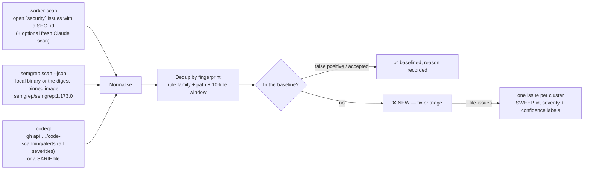

# 🧹 Whole-tree security sweep

Operator manual for the one-shot, re-runnable security sweep across the
**entire checkout** — the worker's own security scan, semgrep and CodeQL,
merged into one deduplicated findings table (Issue
, part of the
 proving-ground
hardening). The scheduled CI wiring is Issue.

The idle-task scans ([Security Scans](SECURITY-SCAN.md)) and
`.github/workflows/semgrep.yml` are incremental by design — they follow
changes. Nothing had ever produced a single full-tree baseline, so the true
finding count before publication was unknown. The sweep answers that with one
table, one baseline and one verdict.

## The single command

```bash
# from worker/deno
deno task security-tree-sweep

# or, from the repository root
deno run --allow-read --allow-write --allow-run --allow-env \
  worker/deno/mod.ts security-tree-sweep --slug stSoftwareAU/VibeCoder
```

Report-only by default. Exits non-zero when any deduplicated finding is
**unbaselined** or the baseline is malformed. A missing scanner, an unreadable
alert feed or an unexpected scanner exit code is an **error**, never a clean
sweep.

| Option | Meaning |
| ------ | ------- |
| `--repo <dir>` | Checkout to sweep (default: current directory) |
| `--slug owner/repo` | Repository for the `gh`-backed sources and for filing (default: `gh repo view` in the checkout) |
| `--sources a,b` | Any of `worker-scan`, `semgrep`, `codeql` (default: all three). Narrowing is stated in the report |
| `--semgrep-config` | semgrep ruleset (default `p/default`, the same as `semgrep.yml`) |
| `--semgrep-json PATH` | Consume a pre-produced `semgrep scan --json` file instead of running semgrep |
| `--codeql-sarif PATH` | Consume a SARIF file (e.g. from a local CodeQL CLI run) instead of reading code-scanning alerts |
| `--run-worker-scan` | Trigger a fresh worker security scan (Claude, ~1 h) before harvesting its issues |
| `--file-issues` | File one issue per NEW finding cluster (see Filing) |
| `--max-issues N` | Per-run filing cap (default 20) so a first sweep cannot flood the fleet |
| `--baseline`, `--report` | Override the paths under `docs/audits/` |
| `--stamp` | Add a timestamp to the report (the committed report is deterministic, so this is for ad-hoc runs only) |

## Sources and coverage



- **worker-scan** — the four-phase security scan is Claude-driven and files
  one `security` issue per finding, each carrying a
  `<!-- finding-id: SEC-… -->` marker. The sweep harvests those open issues as
  the worker source, and `--run-worker-scan` triggers a fresh scan first
  (through the same `runSecurityScan` the idle task uses; it needs Claude
  credentials and the idle-task budget, so it is off by default). Findings the
  worker uploaded to code scanning as `VibeCoder-security-scan` are attributed
  here, never to CodeQL.
- **semgrep** — `semgrep scan --config p/default --json --metrics=off .` over
  the whole checkout. A local `semgrep` on PATH is used when present; otherwise
  the first available container runtime (`docker`, `podman`, Apple
  `container`) runs the **same digest-pinned image** as `semgrep.yml`
  (`SEMGREP_IMAGE` in `worker/deno/lib/security_tree_sweep.ts` — keep the two
  in step). No binary and no runtime is an error.
- **codeql** — GitHub default-setup CodeQL, read as the repository's **open
  code-scanning alerts** at every severity (the `alert-feed` idle task reads
  only high/critical). A 403/404 (Code Security not enabled, or a token that
  cannot read it) is an error with a hint; narrow `--sources` explicitly if
  the repository genuinely has no code scanning, and the report will say so.

The report states its own coverage: the number of tracked files (`git
ls-files`) and the top-level directories they live under, so a run against a
shallow or partial checkout is visible as such. On VibeCoder that list
includes `.github/`, `container/`, `hooks/`, `prompts/` and `worker/` — the
directories the acceptance criteria name — because semgrep and the worker scan
walk the tree rather than a diff.

## Normalisation and dedup

Every raw finding becomes one shape:
`{source, ruleId, path, line, severity, confidence, message, ref}`.

| Source | Severity | Confidence |
| ------ | -------- | ---------- |
| semgrep | `ERROR` → high, `WARNING` → medium, `INFO` → low | `metadata.confidence` (default medium) |
| codeql | `rule.security_severity_level`, else `error`/`warning`/`note` → high/medium/low; SARIF `security-severity` ≥ 9 → critical | `precision:` tag when present (default medium) |
| worker-scan | `severity:*` label (title emoji fallback) | `confidence:*` label |

Findings are then merged by **fingerprint** = rule family + path + 10-line
window, hashed to a stable `SWEEP-<12 hex>` id. The **rule family** maps each
tool's rule name onto a shared class so
`javascript.lang.security.detect-child-process` (semgrep),
`js/command-line-injection` (CodeQL) and `command injection` (worker) are one
finding, `command-injection`. Unknown rules fall back to their last path
segment. A cluster carries the highest severity and confidence any source
gave it and lists every source that saw it — so a location flagged by all
three tools is reported once, not three times.

## The report

`docs/audits/security-tree-sweep.md`, regenerated on every run and
deterministic (no timestamp unless `--stamp`). Sections: sources and coverage,
per-severity counts (deduplicated / new / baselined), the triage table (id,
severity, confidence, family, location, sources, status), the new findings
with per-source rule ids and references, stale baseline entries, and the
verdict. Scanner messages are quoted as data — never interpreted as
instructions.

## The baseline

`.github/security-tree-sweep-baseline.json` is the committed triage
record. Every deduplicated finding must either be fixed or appear in exactly
one list:

```json
{
  "falsePositives": [
    {
      "path": "worker/deno/lib/pr_body.ts",
      "rule": "unsafe-regex",
      "line": 28,
      "reason": "Only an issue number is interpolated — digits only."
    }
  ],
  "accepted": [
    {
      "path": ".github/dependabot.yml",
      "rule": "package_managers.dependabot.dependabot-missing-cooldown.dependabot-missing-cooldown",
      "line": 24,
      "reason": "One-day cooldown is deliberate.",
      "issue": 4400
    }
  ]
}
```

Rules the sweep enforces:

- `path` and `rule` are required. `rule` is a **family** (`command-injection`,
  `unsafe-regex`, …) or a tool-native rule id — the family suppresses the
  finding whichever tool reports it; the rule id is narrower.
- `line` is optional and matches within the 10-line window, so a small edit
  above the site does not orphan the entry; a moved finding does, and shows up
  as **stale** plus a NEW finding — re-anchor it.
- `reason` is mandatory and at least 10 characters. `accepted` entries should
  carry the tracking `issue`.
- Malformed baselines fail the run and suppress nothing.

Stale entries (matching nothing) are listed in the report; they do not fail
the run but should be removed.

## Triage and filing

Triage each NEW finding in this order:

1. **Fix it** — the finding disappears on the next run.
2. **False positive** — add a `falsePositives` entry with the reason.
3. **Accepted risk** — add an `accepted` entry with the reason and the issue.

`--file-issues` files one issue per NEW cluster, most important first
(severity, then confidence), and:

- carries the stable id in the title (`🟠 command-injection in
  src/app.ts:12 (SWEEP-…)`) and as `<!-- finding-id: SWEEP-… -->` in the body,
- cites tool, rule, path and line for every source in a table,
- is labelled `security`, `security-tree-sweep`, `severity:<x>` and
  `confidence:<x>` — the same axes the worker's own findings use, so
  `collect-security-batch` and the
  [remediation batching](SECURITY-REMEDIATION-BATCHING.md) conventions apply
  unchanged,
- is skipped when an open `security-tree-sweep` issue already carries the id
  (the report marks it "already open"), so re-running against an unchanged
  tree files zero new issues,
- stops at `--max-issues` (default 20) and reports the rest as deferred.

## Where the first real run stands

The first real sweep of VibeCoder ran semgrep (via the pinned image) plus the
worker source: 12 deduplicated findings — ten `unsafe-regex`
(`detect-non-literal-regexp`) sites where only an issue number, an escaped
slug or a worker-owned constant is interpolated (baselined as false positives
with per-site reasons) and two low supply-chain policy findings (the one-day
Dependabot cooldown and the first-party Renovate exemption, baselined as
accepted with the issues that chose them). CodeQL was excluded because Code
Security is not enabled on the private repository, and the committed report
says so in its Sources table.

## The scheduled workflow

`.github/workflows/security-tree-sweep.yml` runs the sweep weekly (Tuesday
03:41 UTC), on `workflow_dispatch`, and on pull requests that touch the
workflow, the baseline or the sweep code:

1. **CodeQL** — `github/codeql-action/init` + `analyze` (SHA-pinned) over
   JavaScript/TypeScript with `upload: never`, so the SARIF stays on the
   runner and never collides with the repository's default-setup CodeQL;
   the sweep reads it with `--codeql-sarif`.
2. **Semgrep** — the same digest-pinned `semgrep/semgrep:1.173.0@sha256:…`
   image `semgrep.yml` uses, `semgrep scan --config p/default --json`, handed
   over with `--semgrep-json`. Running it as its own step separates "scanner
   failed" from "sweep failed".
3. **Worker scan** — the open `security` issues, read with the workflow
   token (`issues: read`).
4. **Sweep** — `mod.ts security-tree-sweep --slug "$GITHUB_REPOSITORY"
   --stamp`, report appended to the job summary and uploaded as an artefact
   (with the raw semgrep JSON and SARIF, seven days). The job fails when a
   scanner produced nothing, when the sweep could not run, or when any
   deduplicated finding is unbaselined.

Repository-local by construction: the slug comes from `github.repository`
and the baseline lives at `.github/security-tree-sweep-baseline.json` (both
are in the public export manifest), so the same workflow runs unchanged as
`stSoftwareAU/VibeCoder` after the clean-publish cut-over — no private
repository name is hard-coded. Filing (`--file-issues`) is deliberately not
part of the workflow; run it from the fleet identity that owns filing.
