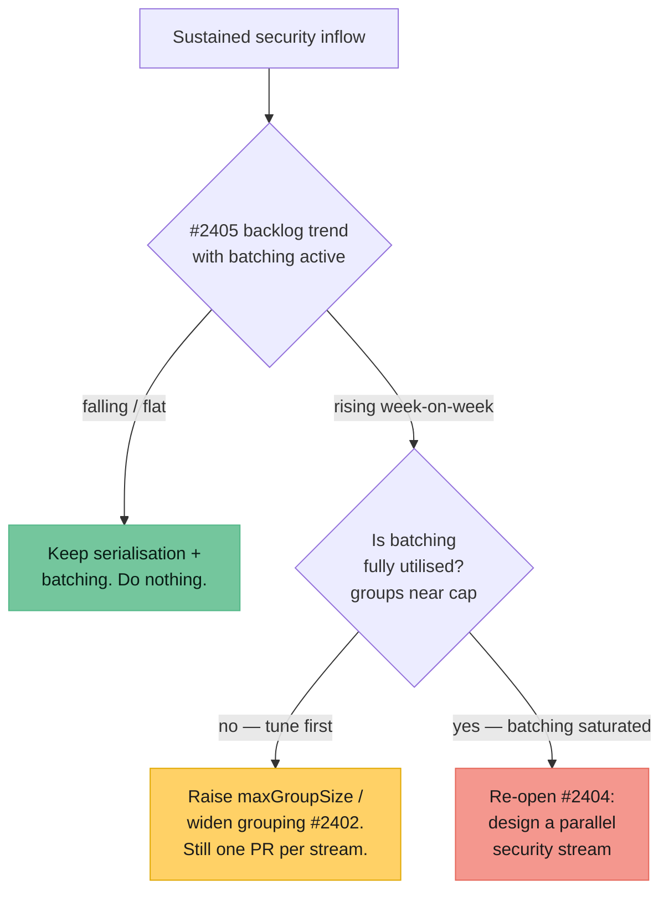

# 🔬 Investigation — dedicated security work stream / safe parallelism

Part of the worker-throughput epic (#2400, sub-issue #2404).

**Status: investigation complete. Recommendation — _do not_ implement a parallel
security work stream now.** Batching (#2402) plus backlog observability (#2405),
both already merged, deliver the throughput the surge needs while preserving the
one-PR-per-work-stream invariant at zero added merge risk. Revisit only if the
issue #2405 metrics show the security backlog growing week-on-week _despite_ batching
being active (the explicit re-open trigger is defined below).

## The question

The worker serialises to **one in-flight PR per work stream** — each milestone
is a work stream, and non-milestone issues share the default-branch stream. Two
guards enforce it:

- `isMilestoneOccupied` in
  [`worker/deno/lib/issue_filter.ts`](../worker/deno/lib/issue_filter.ts) — the
  worker will not pick a second issue in a work stream it already occupies.
- `getBlockingPRForIssue` in
  [`worker/deno/lib/issue_query.ts`](../worker/deno/lib/issue_query.ts) — an open
  PR targeting a branch blocks further issues for that branch.

The serialisation is deliberate: it stops multiple independent PRs branching from
the same root and colliding on merge ("merge hell"). The cost is a throughput
cap of one PR per repo/work-stream at a time. The question this issue asks:
could `security` remediation run as an **additional, parallel work stream** —
one security PR in flight _alongside_ one feature PR per repo — without
reintroducing merge hell?

## Conflict-risk analysis

A second concurrent work stream per repo reintroduces exactly the failure mode
serialisation was built to avoid. The risk is not hypothetical — it scales with
how much surface security fixes touch.

| Risk | Why a parallel security stream makes it worse |
| ---- | --------------------------------------------- |
| **Shared-file collisions** | Security fixes are disproportionately likely to touch the same hot files a feature PR touches — `deno.json`/lockfiles (dependency bumps), CI workflow YAML (Actions hardening), shared validation/auth modules. Two open PRs editing the same file is the classic conflict. |
| **Base-branch churn** | When either PR merges, the other must rebase onto the new base. Lockfile and manifest rebases routinely conflict and often need a re-resolve plus a re-run of the quality gate — the precise cost serialisation removes. |
| **Re-review tax** | A rebase after the sibling merges changes the diff, so CI re-runs and (for non-trivial conflicts) the reviewer re-reads. Throughput "gained" from parallelism is partly handed back as rebase + re-review overhead. |
| **Cross-stream ordering hazards** | A security bump and a feature change can each pass independently yet break once combined (e.g. a dependency major bump the feature branch was not written against). Serial work surfaces this on the single shared base; parallel work defers it to whichever PR rebases last. |
| **Worker-loop complexity** | Every occupancy and blocking check (`isMilestoneOccupied`, `getBlockingPRForIssue`, repo-availability in `repo_availability.ts`) would need a stream dimension. More state, more branches, more ways to deadlock or double-pick. |

The conflict probability is highest for precisely the remediation classes that
dominate supply-chain inflow — dependency bumps and workflow hardening — so a
security-specific parallel stream maximises rather than minimises collision risk.

## Why batching wins instead

Issue #2402 (`security_remediation_grouping.ts`, merged) already raises throughput
**inside** the serialisation model. It collects related findings — same file,
same vulnerability class, same dependency — and closes N of them in **one**
PR, capped at a reviewable size (`DEFAULT_MAX_GROUP_SIZE = 5`). One PR closing
five findings clears the backlog five times faster than five serial PRs, with:

- **No second base** — still one in-flight PR per stream, so no rebase/merge-hell
  cost.
- **Lower collision odds** — a batch deliberately groups edits that already share
  a file/dependency, so the edits are coherent rather than racing.
- **Cheaper review** — one coherent PR instead of five context-switches.

Batching captures most of the throughput a parallel stream would offer, at none
of the merge risk. See
[`docs/SECURITY-REMEDIATION-BATCHING.md`](SECURITY-REMEDIATION-BATCHING.md).

## The decision is data-gated, not permanent

Issue #2405 (`backlog_throughput.ts`, merged) surfaces the single number that settles
this: is the open `security` / `supply-chain-*` count **rising or falling**
week-on-week, and what is the projected drain time at the current clear-rate.
Parallelism should only be reconsidered if that signal says batching is not
keeping pace.

## Recommendation

**Do not** build a dedicated parallel security work stream at this time, and do
**not** open a follow-up design issue. The ordered fallback ladder is:

1. **Now** — rely on batching (#2402) + observability (#2405). No code change.
2. **If the backlog still rises** — first tune batching (raise `maxGroupSize`,
   widen grouping criteria). This stays inside one-PR-per-stream.
3. **Only if batching is demonstrably saturated and the backlog still grows** —
   re-open #2404 with the #2405 trend data attached and design the parallel
   stream then, when the merge-risk trade-off is justified by evidence.

### Re-open trigger (explicit)

Re-open #2404 only when **all** of the following hold, evidenced by the #2405
`backlog-report` output:

- The open `security` / `supply-chain-*` backlog trend is `rising` for **two
  consecutive weekly windows**.
- Batching is active and groups are landing **at or near** `maxGroupSize` (i.e.
  the cheap lever in step 2 is already pulled).
- Projected drain time is increasing, not decreasing.

Until that evidence exists, the merge-hell cost of a second concurrent stream
outweighs its throughput benefit.
