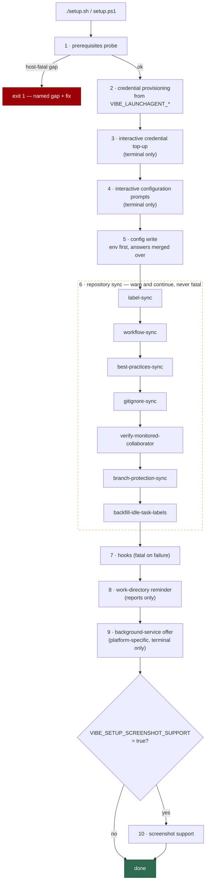

# 🛠️ Setup Guide

This is the document you read to get a Vibe Coder configured on a host — by
script or by hand — on macOS, Linux or Windows. It ends where the
[Deployment Guide](DEPLOYMENT.md) begins: once the worker runs correctly by
hand, the background-service setup (cron, launchd, systemd or Task Scheduler)
is [DEPLOYMENT.md](DEPLOYMENT.md)'s job, and this document links to it rather
than repeating it.

There are two supported routes, and they produce the same end state:

- **The automated route** — `./setup.sh` on macOS and Linux, `setup.ps1` on
  Windows. The script probes prerequisites, provisions credentials and
  configuration, syncs the monitored repositories and installs the hooks.
- **The manual route** — every step by hand, so the script is never required.
  An operator who cannot or will not run the script can still bring a bare
  host to exactly the state a scripted run would have produced.

## 📋 Table of Contents

- [What the automated setup does](#what-the-automated-setup-does)
- [Platform differences in the automated setup](#platform-differences-in-the-automated-setup)
- [Manual setup: prerequisites](#manual-setup-prerequisites)
- [Manual setup: credentials](#manual-setup-credentials)
- [Manual setup: writing `.config.json`](#manual-setup-writing-configjson)
- [Manual setup: repo sync steps and verification](#manual-setup-repo-sync-steps-and-verification)

## What the automated setup does

`./setup.sh` (macOS and Linux) and `setup.ps1` (Windows) run the same ten
phases in the same order — the two entry points (`main()` in `setup.sh`,
`Invoke-VibeSetupMain` in `setup.ps1`) are deliberately step-for-step
equivalent, and `worker/deno/tests/setup_parity_test.ts` holds them that way.
The scripts themselves are thin orchestrators that own the terminal I/O; the
real work is delegated to the Deno setup CLI
(`worker/deno/setup/setup_cli.ts`). This section describes the behaviour that
is identical on all three platforms; where they genuinely diverge — which
background service is offered, where files land — is covered in
[Platform differences in the automated setup](#platform-differences-in-the-automated-setup).

1. **Prerequisites probe** — `setup prerequisites`. Verifies the host tools,
   the container runtime and the worker image before anything is changed. A
   host-fatal gap **exits 1** and stops the whole run; informational gaps are
   reported and never fail setup. In a terminal (or with `--auto-install`)
   each failed check with an install plan is offered as an interactive
   install, and the final verdict always comes from a re-probe. The
   classification table and the install-offer flow are documented in
   [Deployment — Initial Setup](DEPLOYMENT.md#-initial-setup), so they are not
   repeated here.

2. **Credential provisioning** — writes the dedicated credential directory
   (`~/.vibe-coder/credentials` by default) non-interactively from the
   `VIBE_LAUNCHAGENT_*` environment variables: the GitHub token into
   `gh/hosts.yml`, and each enabled coding-agent provider's credential into
   its own sub-directory. It runs before any prompt, so the `gh` config
   directory can default to it and no login prompt is offered for it. With no
   credential variables set it leaves the directory unchanged, warns, and the
   run continues. The variable table lives in
   [Deployment — Credential Provisioning](DEPLOYMENT.md#-credential-provisioning-non-interactive).

3. **Interactive credential top-up** — skipped entirely when no terminal is
   attached. Fills whatever phase 2 left empty: offers to copy the existing
   `gh` identity into the credential directory, and prompts for the
   coding-agent OAuth token (minted with `claude setup-token`), validating it
   before it is stored. Declining an offer never fails the run.

4. **Interactive configuration prompts** — also terminal-only. Collects the
   key configuration answers (repositories to monitor, allowed authors,
   service accounts, SSH key path, `gh` config directory, screenshot-upload
   key, fleet-health repository), showing any existing value as the default.
   Nothing is written yet — the answers are held for the next phase. What
   each key means is the [Configuration Reference](CONFIGURATION.md)'s job.

5. **Config write** — `setup config` writes `.config.json` from the `VIBE_*`
   environment variables, and then the interactive answers are merged over
   the result. The order matters: an answered prompt wins over the
   environment, and a prompt left at its default keeps the environment's
   value — the prompts do not lose the environment, and the environment does
   not lose the prompts. A failure here stops the run.

6. **Repository sync phases** — seven subcommands, each acting on the
   monitored GitHub repositories rather than the host, each idempotent, and
   each **non-fatal**:

   - `label-sync` — standardises the worker's label set in every monitored
     repository.
   - `workflow-sync` — audits each repository's CI workflows and files issues
     for missing protections.
   - `best-practices-sync` — audits the same workflows for best-practice
     findings.
   - `gitignore-sync` — applies the canonical `.gitignore` safety block to
     every monitored repository.
   - `verify-monitored-collaborator` — checks the worker account is a
     collaborator on every monitored repository, filing an issue where it is
     not.
   - `branch-protection-sync` — applies the default-branch ruleset to every
     monitored repository.
   - `backfill-idle-task-labels` — adds the `idle-task` label to existing
     security-scan wrapper issues that lack it; already-labelled wrappers are
     not touched again.

7. **Hooks** — `setup hooks` installs the pre-commit security hook into the
   worker's own clone, removes the retired pre-push hook, and updates the
   clone's git exclude patterns. A failure here is **fatal** — the hooks are
   part of the security posture, not a nicety.

8. **Obsolete work-directory reminder** — reports any leftover host work
   directories (such as `~/auto-issue-work`) that the container's named
   volumes made obsolete, with their size and the command to reclaim the
   space. It only reports — setup never deletes operator data — and it cannot
   fail the run.

9. **Background-service offer** — platform-specific and terminal-only: each
   platform offers its own supervision mechanism, and declining also offers
   to remove a service an earlier run installed. Which platform offers what
   is covered in
   [Platform differences in the automated setup](#platform-differences-in-the-automated-setup),
   and the services themselves in
   [Deployment — Running as a Background Service](DEPLOYMENT.md#-running-as-a-background-service).
   Declining never fails the run.

10. **Optional screenshot support** — runs only when
    `VIBE_SETUP_SCREENSHOT_SUPPORT=true` is set; otherwise the phase is
    skipped entirely. See
    [Deployment — Screenshot Support Setup](DEPLOYMENT.md#-screenshot-support-setup).

**Fatal versus non-fatal, and why setup is re-runnable.** The sync phases
(phase 6) warn and continue by design, so a rate-limited or
partly-permissioned run still finishes configuring the host — only the
prerequisites probe, the config write and the hooks install stop the run.
And because every phase is idempotent, the recovery from any warning is
simply to re-run setup: nothing is duplicated, and already-correct state is
left alone.



## Platform differences in the automated setup

*Placeholder — this section will list everywhere macOS, Linux and Windows
actually diverge during an automated setup run (#79, parent #66).*

## Manual setup: prerequisites

*Placeholder — this section will explain how to bring a bare host to a passing
prerequisites probe by hand on each platform (#80, parent #66).*

## Manual setup: credentials

*Placeholder — this section will explain how to build the
`~/.vibe-coder/credentials` directory by hand, correctly, on each platform
(#81, parent #66).*

## Manual setup: writing `.config.json`

*Placeholder — this section will explain how to hand-write `.config.json`
instead of letting `setup config` and the interactive prompts produce it
(#82, parent #66).*

## Manual setup: repo sync steps and verification

Everything the setup script does beyond the interactive layer lives in one
Deno CLI, `worker/deno/setup/setup_cli.ts`, and every phase of it is
invocable on its own. The manual path is exactly that: run the CLI one
subcommand at a time.

```bash
cd worker/deno
deno task setup <subcommand> --script-dir ../.. --config-path ../../.config.json
```

The two flags matter when running by hand. The script passes the checkout
root as `--script-dir` and the root `.config.json` as `--config-path`; the
CLI's defaults are the current directory (`worker/deno` after the `cd`),
which is not where the hooks or the config live. Pass both, every time,
exactly as above.

### The subcommands

In the order the CLI lists them (`deno task setup --help`). "Repo-side"
means the subcommand acts on the monitored repositories over the GitHub
API; the rest act only on the host. Every subcommand is idempotent — a
re-run converges on the same state rather than piling up duplicates.

| Subcommand | What it does | Skippable? |
| --- | --- | --- |
| `prerequisites` | Probes the host: `git`, an authenticated `gh`, `deno`, the `claude` CLI, and a working container runtime plus worker image. Changes nothing on GitHub. On an interactive host each missing tool is offered as an install, one prompt at a time; `--auto-install` consents to every offer in advance. | No — it is the first row of the checklist below. |
| `config` | Writes `.config.json` from `VIBE_*` environment variables. Host-only. | Yes, if you hand-wrote the file per [the config section](#manual-setup-writing-configjson). The file itself is not optional. |
| `launchagent` | Installs the macOS LaunchAgent (background service). `--status` reports `installed`/`not-installed`; `--uninstall` removes it. | Yes — background services are the [Deployment Guide](DEPLOYMENT.md#-running-as-a-background-service)'s job, after the first foreground run. |
| `screenshot` | Installs Playwright MCP on the host so the worker can capture page screenshots. | Yes — a convenience; nothing else depends on it. |
| `label-sync` | Repo-side. Creates or updates the worker's canonical labels (`work-on`, `top-priority`, `needs-human`, `question`, `planning`, …) in every monitored repository, with canonical colours and descriptions. | Not in practice — see below for what skipping it breaks. |
| `workflow-sync` | Repo-side. Audits each monitored repository's GitHub Actions workflows and raises issues for missing protections. Writes nothing but issues. | Yes — idempotent housekeeping; the audit simply runs later. |
| `best-practices-sync` | Repo-side. Audits workflows for best-practice findings and files (or updates) one follow-up issue per repository. | Yes — same housekeeping category. |
| `best-practices-relabel` | Repo-side. One-off back-fill of severity and category labels onto best-practice issues filed before those labels existed. Supports `--dry-run`. | Yes — internal maintenance; not part of `setup all`, and a fresh setup has nothing to relabel. |
| `gitignore-sync` | Repo-side. Applies the canonical `.gitignore` and `.gitattributes` safety blocks to every monitored repository, so worker artefacts and credential-shaped files stay out of commits. | Yes, but recommended — the safety blocks exist for a reason. |
| `verify-monitored-collaborator` | Repo-side, read-mostly. Verifies the worker account can be assigned issues on every monitored repository; files (or updates) a precheck issue for any repository that fails, and warns when `service_accounts` is empty. | Yes, but it is the step that tells you access is wrong *before* the first run does. |
| `branch-protection-sync` | Repo-side. Applies the worker's default-branch ruleset to every monitored repository; repositories whose default branch takes direct pushes, or that opted out, are skipped, and leftover classic branch protection is flagged for manual removal. | Yes — but without it merges are not gated the way a scripted setup leaves them. |
| `backfill-idle-task-labels` | Repo-side. One-off back-fill of the `idle-task` label onto security-scan wrapper issues that predate the label. | Yes — a fresh setup has nothing to back-fill. |
| `hooks` | Installs the pre-commit hook and git exclude patterns into the VibeCoder checkout itself. Host-only. | No. |
| `scheduled-task` | Registers the Windows Task Scheduler entry — the LaunchAgent's twin. `--status` / `--uninstall` as for `launchagent`; `--powershell` names the PowerShell host the task should run under. | Yes — same hand-off to the [Deployment Guide](DEPLOYMENT.md#-running-as-a-background-service). |
| `all` | The default. Runs the full sequence: `prerequisites` (fatal on failure), then `config`, the repo-side syncs and back-fill (each non-fatal), then `hooks`. `launchagent` and `screenshot` join in only when `VIBE_SETUP_LAUNCHAGENT=true` / `VIBE_SETUP_SCREENSHOT_SUPPORT=true`. `best-practices-relabel` is never part of it. | — |

### Required versus convenience

Two things are genuinely not optional: **`hooks`** and a **valid
`.config.json`** (however produced). Everything repo-side is idempotent
housekeeping that the automated run performs non-fatally — a failure there
warns and moves on, and a later re-run converges.

**`label-sync` deserves special mention.** The worker's discovery is
label-driven: humans steer it by applying labels (`top-priority`,
`work-on`, …) and the worker reports back through labels (`needs-human`,
`question`, `failed`, …). Skip `label-sync` and none of those labels exist
in the monitored repositories — issues cannot be labelled for pickup, and
the worker's own labelling calls fail. Run it.

An operator who wants the script's entire repo-side effect without any of
its prompts can run `setup all` — it is the same sequence the script drives,
minus the interactive layer.

### Equivalence checklist

A manual setup is equivalent to a scripted one when every row below ticks.
All commands run from the checkout root.

| Check | Proven by |
| --- | --- |
| Prerequisites probe passes | `cd worker/deno && deno task setup prerequisites --script-dir ../.. --config-path ../../.config.json` ends `All host prerequisites satisfied (run mode: container)`. |
| Credential directory passes the startup preflight | `~/.vibe-coder/credentials` exists with mode `0700`, files `0600`, holding the material described in [the credentials section](#manual-setup-credentials). The first run proves this: a bad directory aborts with a [named preflight error](TROUBLESHOOTING.md#-the-worker-exits-on-a-credential-preflight-error). |
| `.config.json` parses and names the intended repos | Every repo-side subcommand loads it and fails loudly on a parse error; `verify-monitored-collaborator` additionally confirms the repos it names are reachable as the worker identity. |
| Labels present in each monitored repo | `gh label list --repo <owner>/<repo>` shows the worker's labels — or re-run `label-sync` and see every repository report `0 created, 0 updated`. |
| Hooks installed | `.git/hooks/pre-commit` exists in the checkout and delegates to `hooks/pre-commit`. |
| Worker image present | `deno run --allow-read worker/deno/mod.ts container-image-hash` names the tag, and the runtime's `image inspect` finds it locally ([which image is this host meant to run?](TROUBLESHOOTING.md#which-image-is-this-host-meant-to-run)). A missing image is not a failure — the first run builds it, at the cost of several minutes. |

### First run

Run the worker once, in the foreground, from the checkout root:

```bash
./run.sh     # macOS / Linux
.\run.ps1    # Windows (PowerShell)
```

This is one cycle, not a loop, and it is the moment the manual path proves
itself. A healthy first run: the launcher resolves the run mode to
`container`, finds the worker image (or builds it — several minutes, once),
launches the least-privilege container, the credential preflight passes
silently, and the worker syncs its clone and polls the monitored
repositories. On a fresh setup with no labelled work it finds nothing to
claim and exits cleanly — that *is* success. Activity lands in
`~/logs/worker.log`.

An unhealthy first run fails loudly with a named cause — a
[credential preflight error](TROUBLESHOOTING.md#-the-worker-exits-on-a-credential-preflight-error)
such as `credential-dir-missing`, a run-mode or runtime-detection failure,
or an image build failure. Every one of them is covered in the
[Troubleshooting Guide](TROUBLESHOOTING.md).

### Hand-off

Once a foreground run is clean, setup is done. Making it run unattended —
cron, systemd, launchd or Task Scheduler — is the
[Deployment Guide](DEPLOYMENT.md#-running-as-a-background-service)'s job,
and this document stops here.
