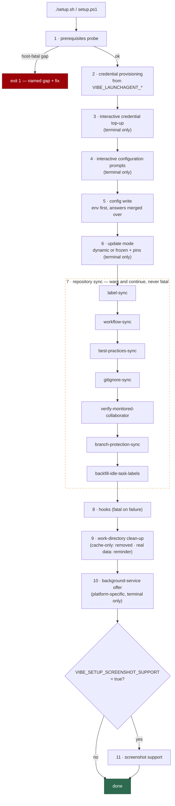

# 🛠️ Setup Guide

This is the document you read to get a Vibe Coder configured on a host — by
script or by hand — on macOS, Linux or Windows. It ends where the
[Deployment Guide](DEPLOYMENT.md) begins: once the worker runs correctly by
hand, the background-service setup (cron, launchd, systemd or Task Scheduler)
is [DEPLOYMENT.md](DEPLOYMENT.md)'s job, and this document links to it rather
than repeating it.

There are two supported routes, and they produce the same end state:

- **The automated route** — `./setup.sh` on macOS and Linux, `setup.ps1` on
  Windows. The script probes prerequisites, provisions credentials and
  configuration, syncs the monitored repositories and installs the hooks.
- **The manual route** — every step by hand, so the script is never required.
  An operator who cannot or will not run the script can still bring a bare
  host to exactly the state a scripted run would have produced.

## 📋 Table of Contents

- [What the automated setup does](#what-the-automated-setup-does)
- [Update mode: dynamic or frozen](#update-mode-dynamic-or-frozen)
- [Platform differences in the automated setup](#platform-differences-in-the-automated-setup)
- [Manual setup: prerequisites](#manual-setup-prerequisites)
- [Manual setup: credentials](#manual-setup-credentials)
- [Token scopes for derived trust](#token-scopes-for-derived-trust)
- [Manual setup: writing `.config.json`](#manual-setup-writing-configjson)
- [Manual setup: repo sync steps and verification](#manual-setup-repo-sync-steps-and-verification)

## What the automated setup does

`./setup.sh` (macOS and Linux) and `setup.ps1` (Windows) run the same ten
phases in the same order — the two entry points (`main()` in `setup.sh`,
`Invoke-VibeSetupMain` in `setup.ps1`) are deliberately step-for-step
equivalent, and `worker/deno/tests/setup_parity_test.ts` holds them that way.
The scripts themselves are thin orchestrators that own the terminal I/O; the
real work is delegated to the Deno setup CLI
(`worker/deno/setup/setup_cli.ts`). This section describes the behaviour that
is identical on all three platforms; where they genuinely diverge — which
background service is offered, where files land — is covered in
[Platform differences in the automated setup](#platform-differences-in-the-automated-setup).

1. **Prerequisites probe** — `setup prerequisites`. Verifies the host tools,
   the container runtime and the worker image before anything is changed. A
   host-fatal gap **exits 1** and stops the whole run; informational gaps are
   reported and never fail setup. In a terminal (or with `--auto-install`)
   each failed check with an install plan is offered as an interactive
   install, and the final verdict always comes from a re-probe. The
   classification table and the install-offer flow are documented in
   [Deployment — Initial Setup](DEPLOYMENT.md#-initial-setup), so they are not
   repeated here.

2. **Credential provisioning** — writes the dedicated credential directory
   (`~/.vibe-coder/credentials` by default) non-interactively from the
   `VIBE_LAUNCHAGENT_*` environment variables: the GitHub token into
   `gh/hosts.yml`, and each enabled coding-agent provider's credential into
   its own sub-directory. It runs before any prompt, so the `gh` config
   directory can default to it and no login prompt is offered for it. With no
   credential variables set it leaves the directory unchanged, warns, and the
   run continues. The variable table lives in
   [Deployment — Credential Provisioning](DEPLOYMENT.md#-credential-provisioning-non-interactive).

3. **Interactive credential top-up** — skipped entirely when no terminal is
   attached. Fills whatever phase 2 left empty: offers to copy the existing
   `gh` identity into the credential directory, then runs **one credential
   flow per configured coding-agent provider**, in the order
   `.config.json` enables them (Issue #730). Claude's flow is the one it
   always was — setup offers to run `claude setup-token` for you and proves
   the token with a live call before storing it; every other provider gets a
   hidden paste of its own credential variable, written to
   `<provider>/provider.env` with the same owner-only permissions. A
   Codex-only host is asked for `OPENAI_API_KEY` and never sees a Claude
   prompt. The flows the run will drive are named before it drives them, so a
   misconfigured provider set is visible rather than silent. An existing
   credential file is never overwritten without an explicit `y`, and
   declining an offer never fails the run. `setup.ps1` does the same on
   Windows, from the same `agent-providers` answer (Issue #745), and
   `setup_parity_test.ts` fails the quality gate if either script drops the
   gate and goes back to prompting for Claude regardless.

4. **Interactive configuration prompts** — also terminal-only. Collects the
   key configuration answers (repositories to monitor, allowed authors,
   service accounts, SSH key path, `gh` config directory, screenshot-upload
   key, fleet-health repository), showing any existing value as the default.
   Nothing is written yet — the answers are held for the next phase. What
   each key means is the [Configuration Reference](CONFIGURATION.md)'s job.

5. **Config write** — `setup config` writes `.config.json` from the `VIBE_*`
   environment variables, and then the interactive answers are merged over
   the result. The order matters: an answered prompt wins over the
   environment, and a prompt left at its default keeps the environment's
   value — the prompts do not lose the environment, and the environment does
   not lose the prompts. A failure here stops the run.

6. **Update mode** — `setup update-mode` (Issue #626), bash only for now:
   `setup.ps1` is unchanged and gains it as a follow-up. It asks whether this
   host is `dynamic` or `frozen`, defaulting to `frozen` on a fresh host
   (Issue #692) and, on a re-run, to whatever the host already says. A
   `frozen` answer asks for the pinned ref — defaulting to the latest release
   tag, and validated by fetching origin and resolving it in this very
   checkout, so a ref that does not resolve is rejected by name and asked
   again rather than saved — and then for one exact version per tool, each
   defaulting to the version that release recorded, so accepting every default
   reproduces a released, tested combination. Blank accepts the default
   everywhere, so pressing Enter through a frozen host's prompts leaves
   `.config.json` byte-for-byte unchanged. Without a terminal nothing is
   asked: existing values are left alone, and a fresh config is pinned to the
   latest release when one resolves with its manifest — otherwise it stays
   `dynamic` with one warning line saying why. The prompts in the order they
   are asked are
   [Update mode: dynamic or frozen](#update-mode-dynamic-or-frozen) below;
   what the fields mean is the
   [Configuration Reference](CONFIGURATION.md#-update-mode)'s job.

7. **Repository sync phases** — seven subcommands, each acting on the
   monitored GitHub repositories rather than the host, each idempotent, and
   each **non-fatal**:

   - `label-sync` — standardises the worker's label set in every monitored
     repository.
   - `workflow-sync` — audits each repository's CI workflows and files issues
     for missing protections.
   - `best-practices-sync` — audits the same workflows for best-practice
     findings.
   - `gitignore-sync` — applies the canonical `.gitignore` safety block to
     every monitored repository.
   - `verify-monitored-collaborator` — checks the worker account is a
     collaborator on every monitored repository, filing an issue where it is
     not.
   - `branch-protection-sync` — applies the default-branch ruleset to every
     monitored repository, then reports each repository's `milestone/**`
     ruleset. On a terminal it offers to create a missing one, mirroring the
     default-branch checks — but only when an answer could change something
     (Issue #678). It stays quiet when a `milestone/**` ruleset already exists,
     says so and asks nothing when there is no default-branch gate to mirror
     (nothing could be created), and warns with the read error — never
     "missing" — when the repository's rulesets cannot be read at all.
     Every ruleset failure is non-fatal and named: a **private repository on
     a free plan** cannot take a ruleset at all — GitHub answers HTTP 403,
     because rulesets there need GitHub Pro — and setup says exactly that,
     naming the repository, rather than printing the same line a missing token
     scope or an organisation policy would (Issue #733). Any other failure
     names the repository and the HTTP status. Setup finishes either way; the
     branch is simply left unprotected.
   - `backfill-idle-task-labels` — adds the `idle-task` label to existing
     security-scan wrapper issues that lack it; already-labelled wrappers are
     not touched again.

8. **Hooks** — `setup hooks` installs the pre-commit security hook into the
   worker's own clone, removes the retired pre-push hook, and updates the
   clone's git exclude patterns. A failure here is **fatal** — the hooks are
   part of the security posture, not a nicety.

9. **Obsolete work-directory clean-up** — handles any leftover host work
   directories (such as `~/auto-issue-work`) that the container's named
   volumes made obsolete, in two distinct cases. A directory holding nothing
   beyond a stale `.vibe-cache` from an earlier setup is **removed**, with a
   report of what went: setup keeps no cache on the host any more — it
   re-queries the GitHub API for default branches each run instead — so such
   a directory is setup's own leftover and safe to reclaim. A directory
   holding real worker data still only gets a **reminder** with its size and
   the command to reclaim the space — deleting operator data is never setup's
   call. Neither case can fail the run.

10. **Background-service offer** — platform-specific and terminal-only: each
   platform offers its own supervision mechanism, and declining also offers
   to remove a service an earlier run installed. Which platform offers what
   is covered in
   [Platform differences in the automated setup](#platform-differences-in-the-automated-setup),
   and the services themselves in
   [Deployment — Running as a Background Service](DEPLOYMENT.md#-running-as-a-background-service).
   Declining never fails the run.

11. **Optional screenshot support** — runs only when
    `VIBE_SETUP_SCREENSHOT_SUPPORT=true` is set; otherwise the phase is
    skipped entirely. See
    [Deployment — Screenshot Support Setup](DEPLOYMENT.md#-screenshot-support-setup).

**Fatal versus non-fatal, and why setup is re-runnable.** The sync phases
(phase 7) warn and continue by design, so a rate-limited or
partly-permissioned run still finishes configuring the host — only the
prerequisites probe, the config write and the hooks install stop the run.
And because every phase is idempotent, the recovery from any warning is
simply to re-run setup: nothing is duplicated, and already-correct state is
left alone.



## Update mode: dynamic or frozen

Phase 6 (`setup update-mode`) is the one phase that decides how this host
tracks Vibe Coder releases, so it gets its own walkthrough. What the fields
mean once written is the
[Configuration Reference](CONFIGURATION.md#-update-mode)'s job; this section is
only what setup asks and in what order.

The conversation is three questions deep, and a `dynamic` answer ends it after
the first:

1. **The mode.** After a two-line explanation of the choice, setup asks
   `Update mode (dynamic/frozen)`. The accepted answers are `dynamic` and
   `frozen`; the answer **defaults to `frozen`** on a fresh host (Issue #692)
   and, on a re-run, to whatever the host already says. Blank accepts that
   default, and anything else is refused by name (`… is not an update mode.
   Accepted values: dynamic, frozen.`) and asked again. `dynamic` stays a
   valid typed answer — the deliberate, opt-in exception for a host that
   should follow the tip.
2. **The pinned ref** (`frozen` only) — `pinned_ref` in `.config.json`. Setup
   fetches origin first, so a tag pushed since the last launch resolves, then
   asks `Pinned ref`, offering the **latest release tag** as the default on a
   fresh host and the existing pin on a re-run. The answer is validated twice:
   against the character rules the field enforces, and by resolving it in this
   very checkout. A ref that does not resolve is rejected by name —
   `"v9.9.9" does not resolve to a commit in … — it was not saved` — and asked
   again, so nothing unusable reaches the file. A resolved ref is echoed with
   the commit it points at. A fetch that fails is reported and the
   conversation continues against the refs the checkout already has.
3. **One exact version per tool** (`frozen` only) — the three
   `pinned_tool_versions` entries, asked in this order:
   `pinned_tool_versions.claude` (`Claude CLI version`), then
   `pinned_tool_versions.gh` (`GitHub CLI (gh) version`), then
   `pinned_tool_versions.deno` (`Deno version`). Each prompt defaults to the
   version **that release recorded** in its `tool-versions.json` manifest, so
   pressing Enter through all three reproduces a released, tested combination
   rather than assembling a set no release ever shipped. On a re-run the
   existing pin is the default instead. Where the latest release cannot be
   resolved, or carries no manifest, the defaults fall back to the versions
   `dynamic` mode would install today and setup says so in one line — no
   version prompt is ever left without a default. Where even that cannot be
   worked out — no network, or the release-age quarantine has nothing eligible
   yet — the reason is printed and the version is typed by hand.

```text
  Update mode: 'dynamic' tracks the tip of the default branch and installs the latest tools;
  'frozen' holds this host at a pinned ref with exact tool versions.
  Update mode (dynamic/frozen) [frozen]

  Pinned ref: the commit SHA or tag this host is held at.
  Pinned ref [1.0.7]
  1.0.7 resolves to 3f2a1b9c4d5e6f708192a3b4c5d6e7f809a1b2c3.

  Tool versions: the exact version this host installs while frozen.
  Claude CLI version [2.0.76]
  GitHub CLI (gh) version [2.62.0]
  Deno version [2.5.4]
```

A question that never gets a usable answer after five attempts, or input that
ends mid-conversation, **fails loudly and writes nothing** — `.config.json` is
left exactly as it was rather than half-answered.

**A non-interactive run never asks.** With no terminal attached — cron, a
LaunchAgent, CI — setup skips the conversation entirely: a host that already
has `update_mode` keeps every value untouched, and a fresh `.config.json` is
pinned to the latest release — `update_mode: "frozen"`, the release tag, and
the three versions its manifest records — when that release resolves. When it
does not, or it carries no manifest, the host is written with
`update_mode: "dynamic"` and one warning line naming what could not be
resolved: a ref without the versions it ships with is the partial pin frozen
mode exists to prevent, so nothing is half-pinned behind an operator's back.

**After setup, the pin moves by command, not by re-running setup.** A freshly
pinned host stays on the release setup chose: later releases never move it, and
each launch prints one line naming the newer release and the command that
installs it (`Run ./run.sh upgrade to install it.`). Running `./run.sh upgrade`
rewrites `pinned_ref` and all three `pinned_tool_versions` to that release, and
the next launch installs exactly them. Setup is not part of that loop — see
[Configuration — The upgrade loop](CONFIGURATION.md#the-upgrade-loop).

**The setup default is not the load-time default.** Setup offers `frozen` to a
host being configured; a `.config.json` with **no** `update_mode` key still
loads as `dynamic`, unchanged — see
[Configuration — Update Mode](CONFIGURATION.md#-update-mode).

**Blank answers are byte-for-byte safe.** Re-running setup and pressing Enter
through every prompt re-writes the same values on a frozen host and leaves a
dynamic host dynamic, so setup stays re-runnable and neither a pin nor a
deliberate `dynamic` answer is lost to a re-run.

**Windows does not ask yet.** `setup.ps1` is unchanged — the update-mode
conversation is bash-only for now, and the Windows counterpart is a follow-up.
A Windows host sets `update_mode`, `pinned_ref` and `pinned_tool_versions` by
hand in `.config.json`; everything downstream is the shared Deno code, so
`run.ps1` honours a frozen pin through `worker-checkout-update` exactly as
`run.sh` does. Hand-editing is a first-class path on every platform — see
[Moving a pin by hand](CONFIGURATION.md#-update-mode).

## Platform differences in the automated setup

The phase sequence is the same everywhere; this section is the short list of
everywhere the platforms actually diverge. Read the shared walkthrough plus
your platform's column and you have the whole picture — nothing below repeats
what another document owns.

| | macOS | Linux (Debian/Ubuntu) | Windows |
|---|---|---|---|
| Entry point | `./setup.sh` (bash) | `./setup.sh` (bash) | `.\setup.ps1` (PowerShell) |
| Unattended consent | `./setup.sh --auto-install` | `./setup.sh --auto-install` | `.\setup.ps1 -AutoInstall` |
| Install offers use | Homebrew (`brew install …`) | apt (`sudo apt-get install -y …`) | `winget install --exact --id … --source winget` |
| Container runtime | Apple `container`, installed **and** started | Docker, then Podman | Docker Desktop, then Podman |
| Credential/config protection | `chmod` 0700 / 0600 | `chmod` 0700 / 0600 | Inheritance-stripped ACL, current identity only |
| Background-service offer | LaunchAgent prompt | None at setup time | Scheduled-task prompt |
| Update-mode prompts | `setup update-mode` | `setup update-mode` | Not yet — `setup.ps1` is unchanged |
| Home directory | `$HOME` | `$HOME` | `%USERPROFILE%` (then `HOME`) |

**Entry point and invocation.** macOS and Linux run `./setup.sh` under bash;
Windows runs `setup.ps1` under PowerShell. The unattended-consent switch —
`./setup.sh --auto-install`, `.\setup.ps1 -AutoInstall` — consents in advance
to every install the run would otherwise offer interactively. It is
deliberately a flag typed on that one invocation, never an environment
variable, so consent cannot leak into later runs.

**What an install offer can resolve to.** When the prerequisites probe finds a
tool missing, the offer resolves to a package-manager command from a fixed
per-platform table (`worker/deno/setup/prerequisite_install_plan.ts`):
Homebrew on macOS, apt on Debian/Ubuntu (these steps may prompt for `sudo`),
and `winget --source winget` on Windows (winget elevates through UAC itself).
The table has holes you close by hand:

- **No package manager, no plan.** On a macOS host without Homebrew, or a
  Linux host without apt, every offer is withheld and the report falls back
  to a manual install hint — the script never runs a remote install script
  for you.
- **No `deno` package exists for Debian/Ubuntu**, so Deno is never offered
  there; you install it yourself.
- **`git` has no install plan on macOS or Linux** (it arrives with the Xcode
  command line tools, or is already present as a bootstrap dependency); only
  Windows can have it installed for you (winget `Git.Git`).

**Container runtime.** macOS accepts only Apple `container` — Docker Desktop
is not the containment boundary there — and its install offer both installs
the Homebrew formula and starts the service, because the probe checks the
running service rather than the binary's presence. Linux and Windows probe
Docker first, then Podman. What the runtime runs and how the image is built is
[CONTAINER.md](CONTAINER.md); why containment is mandatory is
[CONTAINMENT.md](CONTAINMENT.md).

**File permissions on credential and config files.** On macOS and Linux the
credential directories are `chmod` 0700 and the files within 0600. On Windows
the same protection is an ACL: `Protect-VibePath` (`setup.ps1`) strips the
path's inherited access outright and grants full control to the current
identity alone, so a profile that gives *Users* read access cannot leak a
credential. Windows also writes every credential and config file LF-terminated
and without a byte-order mark (`Write-VibeTextFile`), because the container
reads them on Linux — hand-edit these files on Windows with the same
discipline.

**Background-service offer.** A terminal-attached run ends with a
platform-specific offer: macOS offers to install the LaunchAgent (launchd
starts the worker every five minutes), Windows offers to register the
scheduled task (Task Scheduler, every five minutes and at logon). Linux gets
no offer at setup time — the operator wires cron or systemd from
[DEPLOYMENT.md](DEPLOYMENT.md), which owns background-service configuration on
every platform.

**Where paths differ.** The credential directory defaults to
`~/.vibe-coder/credentials` on every platform. On Windows, `~` means the
profile directory: `setup.ps1` resolves the home directory as `USERPROFILE`,
falling back to `HOME` (`Get-VibeHomeDirectory`), so the default lands at
`%USERPROFILE%\.vibe-coder\credentials`, and the same resolution expands a
leading `~` in the paths setup handles.

## Manual setup: prerequisites

This section brings a bare host to a passing prerequisites probe entirely by
hand — no `setup.sh`, no `setup.ps1`. The end state is exactly what the
scripted probe demands, so once the probe passes you continue with the
[credentials](#manual-setup-credentials) and
[`.config.json`](#manual-setup-writing-configjson) sections.

### The target state

The probe (`worker/deno/setup/prerequisites.ts`) classifies every tool as
**host-fatal** (a gap fails the probe) or **informational** (reported, never
fatal). The classification table lives in the
[Deployment Guide](DEPLOYMENT.md#-initial-setup); the checklist below is the
same set, stated as the state your host must reach:

- [ ] **`git`** installed — host-fatal.
- [ ] **`gh`** installed **and authenticated** (`gh auth status` passes) —
  host-fatal.
- [ ] **`deno`** installed — host-fatal.
- [ ] **`claude`** (the Claude Code CLI) installed — host-fatal **on a host
  that runs Claude**, even though the worker runs the coding agent inside the
  container: setup mints and validates the worker's OAuth token with
  `claude setup-token`, so the host needs the CLI too. A host whose
  `agent_provider` / `agent_providers` selects other vendors is not asked for
  it at all (Issue #730) — the probe reports
  `claude CLI not required — this host is configured for codex` and moves on.
  On the **very first** run there is no `.config.json` to read yet, so the
  probe falls back to the default provider (Claude). Say which agent that host
  runs on the command line instead — `VIBE_AGENT_PROVIDER=codex ./setup.sh` —
  and the same gate applies from the first probe.
- [ ] **A container runtime** installed *and answering its probe* —
  host-fatal. The **worker image** must be present or buildable from the
  committed definition; a missing image is fine (the launcher builds it on
  first run), a missing `container/` definition is not. The image itself is
  the [Container Image guide](CONTAINER.md)'s subject.
- [ ] **`jq`** and **`timeout`** — informational only. The
  [image](CONTAINER.md) provides both to the worker, so a host without them
  still passes.

The three recipes below install the whole list, `claude` included. Skip the
`claude` step on a host whose configured providers do not include Claude — the
probe does not ask for it there (Issue #730), and nothing else in setup uses
it.

### macOS

```bash
# git — ships with the Xcode command line tools (the automated path never
# offers this: it is a large, interactive Apple download)
xcode-select --install        # or: brew install git

# gh, then authenticate (always the operator's own step)
brew install gh
gh auth login

# deno
brew install deno

# claude CLI
brew install --cask claude-code

# container runtime — Apple container is a Homebrew formula, and the binary
# alone is not enough: the probe runs `container system status`, which fails
# until the service is started
brew install container
container system start

# optional (the image provides both): jq, and coreutils for timeout —
# Homebrew installs it as gtimeout, which the probe accepts
brew install jq coreutils
```

### Linux (Debian/Ubuntu as the worked example)

```bash
# git — the distribution package
sudo apt-get install -y git

# gh (Debian 12+ / Ubuntu 22.04+ carry it), then authenticate
sudo apt-get install -y gh
gh auth login

# deno — the upstream installer; no Debian or Ubuntu package exists,
# which is also why the automated path refuses to install it here.
# Installs to ~/.deno/bin — put that on PATH.
curl -fsSL https://deno.land/install.sh | sh

# claude CLI — no distribution package; use the upstream installer
# (https://docs.anthropic.com/en/docs/claude-code)
curl -fsSL https://claude.ai/install.sh | bash

# container runtime — the distribution's own Docker package (the automated
# path deliberately never adds Docker's third-party apt repository), or Podman
sudo apt-get install -y docker.io    # or: sudo apt-get install -y podman

# optional (the image provides both): jq; coreutils already supplies timeout
sudo apt-get install -y jq
```

On older releases without a `gh` package, install from
[cli.github.com](https://cli.github.com/) instead.

### Windows

Run in PowerShell. Winget may prompt to elevate through UAC.

```powershell
# git
winget install --exact --id Git.Git --source winget

# gh, then authenticate
winget install --exact --id GitHub.cli --source winget
gh auth login

# deno
winget install --exact --id DenoLand.Deno --source winget

# claude CLI — no winget package; use the upstream installer
# (https://docs.anthropic.com/en/docs/claude-code)
irm https://claude.ai/install.ps1 | iex

# container runtime — Docker Desktop, or Podman
winget install --exact --id Docker.DockerDesktop --source winget
# or: winget install --exact --id RedHat.Podman --source winget

# optional: jq (the image provides it)
winget install --exact --id jqlang.jq --source winget
```

An installed runtime must also be *answering*: start Docker Desktop (it is a
GUI application) or initialise the Podman machine before probing. `timeout`
has no Windows package at all — it stays informational there, as the
[Windows table](DEPLOYMENT.md#the-windows-table) explains.

### Clone the repository — a dedicated one

```bash
gh repo clone <your-org>/VibeCoder
```

The clone the worker runs from is an appliance checkout: the worker
hard-resets and cleans it on every cycle, so never point it at a clone you
also develop in. The
[Deployment Guide](DEPLOYMENT.md#the-worker-needs-its-own-dedicated-clone)
explains the failure modes in both directions.

### Verify — run the probe on its own

The probe runs standalone, so you can confirm the host is ready before
writing any credential or configuration:

```bash
cd worker/deno
deno task setup prerequisites
```

On an interactive terminal a failing probe offers to install what it can —
that is the [automated path's installer](DEPLOYMENT.md#interactive-install-offer);
decline the offers to stay manual. A pass prints one `✓` line per check
(informational gaps print as `ℹ`), ends with the headline, and exits `0`:

```text
ℹ  Configured coding-agent providers: claude
✓  git is installed
✓  gh CLI authenticated as: your-login
✓  deno is installed
✓  Docker is installed and answering (/usr/bin/docker)
✓  Worker image vibe-coder:<hash> is not built yet — the launcher builds it on first run
✓  claude CLI is installed
ℹ  jq is not installed on the host — the container image provides it
ℹ  No action needed: container-only is the supported run mode.
✓  timeout is installed
✓  All host prerequisites satisfied (run mode: container)
```

A fail marks each host-fatal gap with `✗` and its fix, ends with the failing
headline, and exits `1`:

```text
✗  gh CLI is not authenticated
ℹ  Run: gh auth login
✗  Some host prerequisites are missing or not configured (run mode: container).
ℹ  Container mode needs git, an authenticated gh, deno, the claude CLI (setup mints the worker's OAuth token with it) and a working container runtime on the host; the image provides jq and timeout. Configured coding-agent providers: claude.
ℹ  VIBE_SKIP_PREREQ_CHECK=true skips the whole probe (CI only — it hides real gaps).
```

The claude CLI appears in that sentence only when Claude is among the
configured providers; a Codex-only host is told what *it* needs, and never
`VIBE_SKIP_PREREQ_CHECK` as a workaround for a provider it does not run.

Out of scope here: credentials beyond `gh auth login`
([next section](#manual-setup-credentials)), `.config.json`
([its own section](#manual-setup-writing-configjson)), and background
services ([Deployment Guide](DEPLOYMENT.md)).

## Manual setup: credentials

The worker authenticates from files, never from a login. This section builds
by hand exactly what the scripted route's credential provisioning would have
written: one dedicated directory, read by the worker and mounted read-only
into the container. The authoritative layout, and the `VIBE_LAUNCHAGENT_*`
environment variables that provision it automatically instead, are in
[Deployment — Credential Provisioning](DEPLOYMENT.md#-credential-provisioning-non-interactive);
those variables are the scripted route, and everything below is the by-hand
one. Pointing `gh_config_dir` at the result is part of
[writing `.config.json`](#manual-setup-writing-configjson), the next section.

The invariant a manual setup must respect: **no runtime step may reach an
interactive credential mechanism** — no browser login, no `gh auth login` on
the run path, no macOS Keychain lookup. The credential is a file the operator
writes, not a login the worker performs.

### The layout to reproduce

```text
~/.vibe-coder/credentials/        (override with VIBE_CREDENTIAL_DIR)
├── gh/hosts.yml                  the worker's GitHub token
├── <provider>/provider.env       one file per enabled agent vendor
└── claude/provider-2.env         optional, written by hand: a second Claude
                                  subscription token (advanced — see
                                  "Several Claude tokens" below)
```

Nothing else belongs in that directory. Build only the vendors you use: an
unenabled provider is simply absent, and provisioning one vendor never touches
another's file. The permitted entries are exactly `gh/` plus one sub-directory
per **enabled** provider — a directory for a vendor that is not enabled counts
as unexpected material and fails the startup preflight, so remove a vendor's
sub-directory when you stop enabling it.

### `gh/hosts.yml`

Write the token inline — never a keychain reference, because the container
cannot reach a host credential store. On macOS in particular, a `hosts.yml`
taken from an ordinary `gh auth login` may contain no token at all (gh keeps
it in the Keychain); such a file fails the preflight even though `gh` works
fine on the host.

```yaml
github.com:
    oauth_token: ghp_your_token
    git_protocol: ssh
```

The preflight accepts any `oauth_token:` (or `token:`) line with a non-blank
value; a blank or empty-quoted value counts as no token.

### `<provider>/provider.env`

A single `NAME=value` line per file, using a variable name that vendor
accepts. `#` comment lines and an `export ` prefix are tolerated, and quotes
around the value are stripped, but one plain line is the canonical form:

```bash
ANTHROPIC_API_KEY=sk-ant-your_key
```

| Vendor | File | Accepted variable names |
|--------|------|-------------------------|
| Claude Code | `claude/provider.env` | `ANTHROPIC_API_KEY`, `ANTHROPIC_AUTH_TOKEN`, `CLAUDE_CODE_OAUTH_TOKEN` |
| Codex CLI | `codex/provider.env` | `OPENAI_API_KEY`, `CODEX_API_KEY` |
| Gemini CLI | `gemini/provider.env` | `GEMINI_API_KEY`, `GOOGLE_API_KEY` |
| DeepSeek (on the Claude Code CLI) | `deepseek/provider.env` | `DEEPSEEK_API_KEY` |

DeepSeek has no interactive login, so its file is the only way to authenticate
it: `setup.sh` writes it from `VIBE_LAUNCHAGENT_DEEPSEEK_API_KEY` (or a plain
`DEEPSEEK_API_KEY` in the environment), using a key issued at
<https://platform.deepseek.com/api_keys>. The binary it runs is Anthropic's,
but the credential is DeepSeek's — an `ANTHROPIC_API_KEY` in
`deepseek/provider.env` is not accepted, and Anthropic's credentials are
withheld from the DeepSeek subprocess.

Any of the listed names works; the first is the one `setup.sh` writes. This
table mirrors `vibe_provider_credential_table` in `setup.sh` and the
descriptors in `worker/deno/lib/agent_provider.ts`, which remain the source of
truth — a quality-gate test fails when they drift.

One file per vendor is the rule, and Claude is its one exception: a host
holding more than one Claude **subscription** may add
`claude/provider-2.env`, `provider-3.env` and so on, of which each run uses
exactly one ([Several Claude tokens](#several-claude-tokens) below). Every
other vendor takes exactly the one file its row names.

#### Several Claude tokens

> **Advanced, and optional.** Everything above is complete on its own. A host
> with one Claude credential needs nothing from this section: it makes no
> extra request, writes no extra log line, and behaves exactly as it did
> before the option existed.

An operator holding more than one Claude subscription may add extra token
files beside `claude/provider.env`, named `provider-2.env`, `provider-3.env`
and so on, each holding a `CLAUDE_CODE_OAUTH_TOKEN`. They are ordinary
credential files: the same `600` permissions, the same read-only mount, and
every one of them is permission-checked by the preflight. The worker exports
exactly **one** of them into a run, so an unused subscription's token never
reaches the coding agent's environment. No other vendor takes extra files, and
a metered `ANTHROPIC_API_KEY` is not one of these: a host with one credential —
key or token — behaves exactly as it always has.

What that guarantee does and does not cover: the coding agent's environment
carries the selected token and no other, and a suffixed or indexed variant of
an accepted variable name (`CLAUDE_CODE_OAUTH_TOKEN_2`) is refused rather than
inherited. It is an **environment** guarantee. The whole `claude/`
sub-directory is mounted read-only into the container, so a process with
filesystem read access inside the container can read every token file there,
selected or not — recorded as residual risk R9 in
[the threat model](THREAT-MODEL.md#-residual-risks). That is the same exposure
a single-token host has always carried; more tokens raise its count, not its
kind. Add a second subscription knowing that its blast radius is the container,
not the environment policy.

**Writing the files is your own step.** `setup.sh` provisions
`claude/provider.env` and nothing else: there is no `VIBE_LAUNCHAGENT_*`
variable for a second token, no launcher change and no crontab change. The
extra files are an operator's edit on the host, made with the permissions the
primary file already carries:

```bash
umask 077
printf 'CLAUDE_CODE_OAUTH_TOKEN=%s\n' "$SECOND_TOKEN" \
    > ~/.vibe-coder/credentials/claude/provider-2.env
chmod 600 ~/.vibe-coder/credentials/claude/provider-2.env
```

Three rules the file has to satisfy:

- **The name is `provider-<number>.env`.** `provider-2.env`, `provider-3.env`,
  `provider-10.env`. The number orders them — numerically, so `provider-10.env`
  comes after `provider-2.env` rather than before it — and gaps in the
  numbering are harmless. A name outside that pattern (`provider-backup.env`,
  `provider.env.old`) is not a token file at all: it is never read, never
  selected, and never reported, so a token parked under such a name is simply
  invisible to the worker.
- **The variable is `CLAUDE_CODE_OAUTH_TOKEN`.** Only a subscription token has
  a budget to compare. A numbered file holding `ANTHROPIC_API_KEY` or
  `ANTHROPIC_AUTH_TOKEN` is still read and still permission-checked, but it
  joins no pool and is never weighed against a subscription — a metered key is
  priced, not rationed, so it stays on the single-credential path it has always
  taken.
- **The mode is `600`, inside the `700` directory.** Every discovered token
  file is permission-checked, not only the primary one, so a `provider-2.env`
  left group-readable fails the startup preflight with
  `credential-permissions-too-open` naming that file and the `chmod` to run.

#### Which Claude token a run uses

The choice is made **once per worker start**, before any work begins, and holds
for the whole run. Nothing re-selects mid-run: a subscription that runs out
part-way through fails exactly as it always has, and the next process start
decides again.

With **fewer than two** subscription tokens there is nothing to choose between,
so nothing is done — no request, no delay, no log line, and the same token file
the worker has always used. That covers every single-token host and every other
vendor.

With two or more, worker start measures each of them. One request per token,
issued concurrently and each bounded by a ten-second timeout, goes to
Anthropic's `POST /v1/messages` asking for `max_tokens: 0` — the cheapest valid
request there is, because the figures the worker needs come back in the
response's `anthropic-ratelimit-unified-*` headers and a *rejected* request
carries none of them. Each probe bills the handful of input tokens in a
one-character prompt and generates nothing.

Anthropic reports two windows, a five-hour and a seven-day one, and names one
of them representative. The worker ranks on the **most constrained** of the two
rather than the one named representative: a token whose five-hour window is
fresh but whose seven-day window is at 99% has almost no budget to spend, and
ranking it first would start the run on a subscription that stalls immediately.

The candidates are then ordered:

1. **A measured budget beats an unmeasured one.** A token whose probe failed
   ranks behind every token whose probe answered.
2. **Most remaining budget wins**, each token measured against its own window.
   Comparing shares rather than absolute totals is what makes subscriptions
   whose windows reset on different days at different times comparable at all.
   A window whose reset instant has already passed counts as **full**: the
   figure describes the window that was current when it was measured, and once
   that instant is behind us the window has rolled over.
3. **A tie on remaining budget goes to the soonest reset**, so budget is spent
   before it lapses rather than left to expire.
4. **A remaining tie goes to discovery order** — `provider.env` first, then the
   numbered files in ascending numeric order.

A probe can fail in ordinary ways: the host cannot reach the endpoint, the
token has been revoked (`http-401`), the probe is itself throttled
(`http-429`), or the response carries no rate-limit headers
(`unrecognised-response-shape`). That token's budget is *unknown*. It ranks
last, but it is never dropped and it never blocks a start — a probe failure
must not make a configured subscription disappear. When **every** budget is
unknown, discovery order decides and the run starts on `provider.env`, which is
exactly what a host with no network path to the endpoint does today.

**What the operator sees.** The decision is logged at `INFO`, one line per
candidate, best first, then the winner:

```text
[2026-09-04 22:10:07Z] INFO: [SECURITY] claude token candidate provider-2 (#2): remaining=75.0% window=five_hour resets=2026-09-05T02:00:00.000Z host=vibe-host:5312
[2026-09-04 22:10:07Z] INFO: [SECURITY] claude token candidate provider (#1): remaining=25.0% window=seven_day resets=2026-09-11T05:00:00.000Z host=vibe-host:5312
[2026-09-04 22:10:07Z] INFO: [SECURITY] claude token candidate provider-3 (#3): remaining=unknown reason=http-401 host=vibe-host:5312
[2026-09-04 22:10:07Z] INFO: [SECURITY] claude token selected provider-2 (#2) of 3: most-remaining-budget remaining=75.0% resets=2026-09-05T02:00:00.000Z host=vibe-host:5312
```

`(#2)` is the discovery position, so `provider-2 (#2)` is the second file
found; `of 3` is how many candidates were ranked. The `[SECURITY]` prefix and
the trailing `host=` field belong to the logger, not to this decision — every
worker line carries them. A candidate whose window had already rolled over
reads `remaining=100.0% … (window already elapsed, counted as full)`.

Tokens are named by **file stem** — `provider`, `provider-2` — and never by
value: no part of a token, not even a prefix, is an input to these lines, so an
operator can read which subscription a run consumed without the log ever
carrying the credential. The last line names why the winner won:

| Reason | What it means |
|--------|---------------|
| `most-remaining-budget` | Strictly more remaining budget than every other candidate. |
| `equal-remaining-budget-soonest-reset` | Level on remaining budget; won on the sooner reset. |
| `tied-discovery-order` | Level on both budget and reset; won on discovery order. |
| `budget-unknown-discovery-order` | No candidate's budget could be measured; discovery order decided. |

Absence of these lines is itself informative: a host with one token, or with
one token plus a metered key, logs none of them, because it makes no probe.

**What the choice isolates.** Selection decides what the run's *environment*
carries — one token file's variables, and no other subscription's. It decides
nothing about the credential *mount*, which still exposes every token file in
`claude/` to the container. That boundary, and the residual risk R9 that
records the part of it which is not closed, are stated under
[Several Claude tokens](#several-claude-tokens) above and in
[the threat model](THREAT-MODEL.md#-residual-risks).

One last precedence note: a `CLAUDE_CODE_OAUTH_TOKEN` already present in the
worker's own environment is never overwritten by a file, so an
environment-supplied token wins — the probes still run and the decision is
still logged, but the export is skipped. On a contained host that case does not
arise: the container is started with no token variables passed through, so the
credential directory is the only route in.

### Permissions

On macOS and Linux, directories are owner-only `700` and files `600`
(substitute the vendors you actually built):

```bash
chmod 700 ~/.vibe-coder/credentials \
          ~/.vibe-coder/credentials/gh \
          ~/.vibe-coder/credentials/claude
chmod 600 ~/.vibe-coder/credentials/gh/hosts.yml \
          ~/.vibe-coder/credentials/claude/provider.env
```

On Windows there is no POSIX mode; the equivalent — what `setup.ps1`'s
`Protect-VibePath` does — is to break ACL inheritance, remove every inherited
rule, and grant full control to the current identity alone. A credential
directory left inheriting the profile's `Users` read access is exactly the
state the preflight exists to reject:

```powershell
icacls "$env:USERPROFILE\.vibe-coder\credentials" `
    /inheritance:r /grant:r "${env:USERNAME}:(OI)(CI)F" /t
```

`/inheritance:r` drops the inherited rules, `/grant:r` replaces the grants
with full control for you alone, and `/t` applies the same to every file and
sub-directory inside.

### Line endings on Windows

These files are read by Deno inside a Linux container: write them
LF-terminated and without a byte-order mark. That is **not** what
Windows PowerShell's `Set-Content` or `Out-File` produce by default, so write
them the way `setup.ps1` does:

```powershell
[System.IO.File]::WriteAllText(
    "$env:USERPROFILE\.vibe-coder\credentials\claude\provider.env",
    "ANTHROPIC_API_KEY=sk-ant-your_key`n",
    [System.Text.UTF8Encoding]::new($false))
```

`UTF8Encoding($false)` suppresses the BOM, and the explicit `` `n `` keeps the
line ending LF.

### Verify against the startup preflight

Every worker start runs the credential preflight
(`worker/deno/lib/credential_preflight.ts`) before any work begins; when the
directory is wrong the worker exits with a named, actionable failure rather
than degrading into a mid-run auth error. So the verification of a hand-built
directory is simply the
[first foreground run](#manual-setup-repo-sync-steps-and-verification) — and
each failure it can name maps to a specific hand-editing mistake:

| Preflight failure | The hand-editing mistake that causes it |
|-------------------|------------------------------------------|
| `credential-dir-missing` | The directory was never created at the path the worker resolves — a typo in the path, the wrong user's home, or `VIBE_CREDENTIAL_DIR` pointing somewhere else. |
| `credential-dir-not-a-directory` | A *file* named `credentials` was created where the directory belongs. |
| `credential-dir-unreadable` | The directory itself cannot be read by the worker — created as another user (or root, e.g. with `sudo mkdir`), or its read permission stripped instead of set to `700`. |
| `credential-dir-empty` | The directory exists but the files were written elsewhere — for example into `~/.vibe-coder` itself, or under a mistyped sub-directory name. |
| `github-credentials-missing` | `gh/hosts.yml` is absent, or present without a usable inline token: copied from a macOS Keychain-backed `gh` install (no `oauth_token:` line), a blank or empty-quoted token value, or the file/token line otherwise malformed. |
| `provider-credentials-missing` | The named vendor's `provider.env` is absent, uses a variable name that vendor does not accept (see the table above), or carries a blank value. The failure names the vendor and the variable that provisions it, so a multi-vendor host knows which file to fix. |
| `credential-permissions-too-open` | A credential file is group- or world-readable — `chmod 600` was skipped, or the file was created with a default umask (e.g. mode `644`). The message names the file and the exact `chmod` to run. |
| `provider-token-file-unrecognised` | An additional token file (`claude/provider-2.env` and friends) holds no variable name the vendor accepts — a typo in the variable, or a bare token with no `NAME=` at all. The message names the file and the variables it could have used. It is reported rather than skipped, so a token you added is never silently ignored. It applies to the **numbered** files only: an empty or unrecognised primary `provider.env` is reported as `provider-credentials-missing` instead, and a file whose name is outside the `provider-<number>.env` pattern is not a token file, so it raises nothing at all. |
| `unexpected-credential-material` | A stray entry sits directly inside the credential directory: a backup copy, a notes file, or a sub-directory for a vendor that is not enabled. Only `gh/` and the enabled providers' sub-directories belong there (`.DS_Store` is ignored). |

Two notes on reading a result. First, `github-credentials-missing` and
`provider-credentials-missing` fire only when *neither* the file *nor* the
corresponding environment variables supply the credential — but on a contained
host the directory is the only route that reaches the worker, because the
container is started with no token variables passed through (see
[Deployment — Credential Provisioning](DEPLOYMENT.md#-credential-provisioning-non-interactive)).
Second, the preflight reports every problem it finds in one pass, so fix the
whole list before re-running rather than one failure at a time.

## Token scopes for derived trust

The token in `gh/hosts.yml` must be able to **read collaborators** on every
monitored repository. That is already implied by write access to those
repos (the worker clones, pushes, and assigns issues), but it becomes a
**trust-resolution** dependency the moment `.config.json` sets
`author_source` to `"github"`. Listing collaborators is
`GET /repos/<owner>/<repo>/collaborators`; a token that can push but
cannot read the collaborator list is mis-scoped for derived trust.

When `exclusion_team` is set, the token also needs the **`read:org`**
scope (classic) / Organisation members read (fine-grained). The worker
calls `GET /orgs/<org>/teams/<slug>/members` once per cycle; without
`read:org` that call returns **403**.

A missing scope is **fail-closed and loud**, never silently permissive:

| Symptom | What it means | What the worker does |
| ------- | ------------- | -------------------- |
| `[TRUST_REFRESH] … collaborator fetch 403` (or `HTTP 403`) | The token cannot list collaborators on a monitored repo — usually a missing repository-administration / collaborator-read grant. | The cycle is **skipped**. No issue is claimed, no PR is maintained, no local `allowed_authors` leftover is consulted. |
| `[TRUST_REFRESH] … Team fetch 403 … token is missing read:org` | `exclusion_team` is set and the token lacks `read:org`. | Same skip. The worker will not derive an allowlist with team exclusion silently off. |

Search the worker log for `[TRUST_REFRESH]` or `403` if a host that just
flipped `author_source` to `"github"` appears idle. The host is marked
unhealthy for that cycle so the fleet report cannot claim otherwise.
Restoring the scope (or unsetting `exclusion_team` if the team fetch is
the failure) is the fix; there is no config flag that says "proceed
without exclusions".

The rest of the token — `repo` (or the fine-grained equivalent) plus
`workflow` if the worker must edit GitHub Actions files — is unchanged.
See [SECURITY.md — Token Security](../SECURITY.md#-token-security) and
[CONFIGURATION.md — Author source](CONFIGURATION.md#author-source).

## Manual setup: writing `.config.json`

`.config.json` lives in the root of the VibeCoder checkout — every script
defaults to `<checkout>/.config.json`, and the `CONFIG_FILE` environment
variable can point elsewhere (`CONFIG_PATH` is accepted as its alias; a
relative value resolves against the checkout, and setting both to different
files is refused — see
[One config file, one name](CONFIGURATION.md#one-config-file-one-name-issue-750)). On the automated route the file is composed in
two passes: the Deno setup CLI's `config` subcommand merges any `VIBE_*`
environment variables over whatever the file already holds and writes only
values that differ from the built-in defaults, then `setup.sh` merges the
interactive terminal answers into the same file. The manual route is the
operator writing that same JSON in an editor. Either way the file must stay
private: setup creates it owner-only (permissions `600`), it is git-ignored,
and the pre-commit hook refuses to commit it. Its overrides-only semantics —
defaults are never written, so changed defaults flow through on upgrade — are
covered in the
[Configuration File section](CONFIGURATION.md#configuration-file) of the
Configuration Reference.

### The minimum viable config

A first run genuinely needs only who may instruct the worker, who reviews its
PRs, what it monitors, and how it authenticates:

```json
{
  "allowed_authors": ["myusername"],
  "pr_reviewers": ["myusername"],
  "repos": ["myorg/repo1"],
  "ssh_key_path": "~/.ssh/vibe-worker_ed25519",
  "gh_config_dir": "~/.vibe-coder/credentials/gh"
}
```

- `allowed_authors` — under the default `author_source: "config"`, GitHub
  logins whose issues and labels the worker acts on. Not the sole source
  of author trust: set `author_source` to `"github"` to derive that set
  from write collaborators instead. See
  [Author source](CONFIGURATION.md#author-source) and
  [Multiple Allowed Authors](CONFIGURATION.md#multiple-allowed-authors).
- `pr_reviewers` — logins requested as reviewers on every PR the worker
  raises; see [Multiple PR Reviewers](CONFIGURATION.md#multiple-pr-reviewers).
- `repos` — the monitored repository list, `owner/name` per entry; see
  [Monitored Repositories](CONFIGURATION.md#monitored-repositories).
- `ssh_key_path` — the service account's SSH private key, used for all git
  transport; see
  [Service Account Authentication](CONFIGURATION.md#service-account-authentication-ssh--gh-auth).
- `gh_config_dir` — the `gh` CLI identity directory built in
  [Manual setup: credentials](#manual-setup-credentials), used for all `gh`
  operations; same reference section as `ssh_key_path`.

### A fuller worked example

`.config.json` is strict JSON: a comment is a parse error, so a hand-written
file can never carry inline annotations. The keys below are therefore
explained beneath the block, never inside it.

```json
{
  "allowed_authors": ["myusername"],
  "pr_reviewers": ["myusername"],
  "repos": ["myorg/repo1", "myorg/repo2"],
  "ssh_key_path": "~/.ssh/vibe-worker_ed25519",
  "gh_config_dir": "~/.vibe-coder/credentials/gh",
  "service_accounts": ["mysvcbot"],
  "authorized_commenters": ["myusername"],
  "claude_model": "opus",
  "claude_timeout": 10800,
  "sleep_interval": 120,
  "worker_name": "Worker Alpha",
  "fleet_health_repo": "git@github.com:myorg/fleet-health.git"
}
```

- `service_accounts` — the worker identity guard's allowlist. The automated
  route defaults it to the login setup authenticated as; a hand-written config
  without it leaves the guard inactive, which the worker warns about loudly at
  startup. These logins are fleet accounts, so they are also unioned into the
  effective `fleet_pr_authors` and a sibling's open PR blocks this host from
  duplicating the work. See the identity guard notes under
  [Service Account Authentication](CONFIGURATION.md#service-account-authentication-ssh--gh-auth)
  and
  [Service accounts are fleet PR authors too](CONFIGURATION.md#service-accounts-are-fleet-pr-authors-too).
- `authorized_commenters` — under `author_source: "config"`, logins whose
  comments the worker trusts. Note the key itself is spelt
  `authorized_commenters`. Under `"github"` a leftover entry is parsed
  but ignored for trust. See
  [Authorised Commenters](CONFIGURATION.md#authorised-commenters) and
  [Author source](CONFIGURATION.md#author-source).
- `author_source` / `exclusion_team` — omit both to keep local arrays.
  `"github"` needs collaborator read on every monitored repo, and
  `read:org` when `exclusion_team` is set; a 403 skips the cycle. See
  [Token scopes for derived trust](#token-scopes-for-derived-trust).
- `claude_model`, `claude_timeout`, `sleep_interval` — operational overrides.
  Write them only when they must differ from the defaults; the file holds
  overrides, not a snapshot. Values and defaults are in
  [Configuration Defaults](CONFIGURATION.md#configuration-defaults).
- `worker_name`, `fleet_health_repo` — multi-worker visibility and fleet
  health tracking, both optional and both in the same
  [defaults table](CONFIGURATION.md#configuration-defaults).

### Choosing the coding agent

The worker is provider agnostic: `claude` (Claude Code) is the default, and
`codex` (the OpenAI Codex CLI), `gemini` (the Gemini CLI) and `deepseek` are
registered alongside it. `deepseek` is the Claude Code CLI installed under its
own command and pointed at DeepSeek's Anthropic-compatible endpoint, so it
authenticates with a **DeepSeek** key rather than an Anthropic one. Nothing
else in the configuration changes with the choice —
`agent_provider` names the agent a run uses, and `agent_providers` names every
vendor whose credentials are provisioned, preflighted and mounted:

```json
{
  "agent_provider": "codex",
  "agent_providers": ["codex"]
}
```

Omit both and the worker uses Claude Code alone, exactly as a deployment that
predates the choice. `VIBE_AGENT_PROVIDER` and `VIBE_AGENT_PROVIDERS`
(comma-separated) override them for a single run. The enabled set must include
the active provider — a set that excludes it fails loudly at startup, because
its agent would have no credential mounted, as does an id that is not
registered.

Each enabled vendor needs its own `<provider>/provider.env` from
[the credential layout above](#providerproviderenv). The image itself follows
the same key: the launcher builds it with the enabled set (`AGENT_PROVIDERS`)
and the set is part of the image tag, so a host that adds a provider rebuilds
on its next launch — see
[the coding-agent provider layer](CONTAINER.md#the-coding-agent-provider-layer)
in the Container Guide.

### Where the full reference lives

This section deliberately stops at the two examples above. The
[Configuration Reference](CONFIGURATION.md) owns the complete key catalogue,
the defaults table and the operational constants;
[Per-Repository Configuration](CONFIGURATION.md#per-repository-configuration)
owns the `repo_config` block. The `container_tools` key is documented in the
[Configuration Reference](CONFIGURATION.md) and the
[Container Guide](CONTAINER.md), not here.

### Checking the file before a first run

The worker parses the file with `JSON.parse` and stops with
`Config file ... contains invalid JSON` on anything non-strict, so check the
file before the first run rather than during it:

- **Validate the JSON.** `jq . .config.json` from the checkout root. A
  trailing comma, a `//` or `#` comment, and a UTF-8 byte-order mark are all
  parse errors. A misspelt key parses fine but is caught at startup by the
  unknown-key check, which warns and suggests the likely intended key.
- **Make the paths real.** `ssh_key_path` and `gh_config_dir` are applied as
  given, with no existence probe on the host — a missing key file or `gh`
  directory does not fail startup, it fails every subsequent git and `gh`
  call. Check them with `test -f` and `test -d` before running.
- **Know what `~` does.** Only a *leading* `~` is expanded, by replacing it
  with the `HOME` environment variable when the worker applies the value.
  `~user` and a `~` anywhere else in the path are passed through literally.
- **On Windows, mind encoding and path syntax.** Save the file as UTF-8
  *without* a BOM and with LF line endings — the same discipline as the
  credential files (Windows PowerShell 5.1's `Out-File` defaults to an
  encoding that breaks both; use an editor or PowerShell 7's
  `utf8NoBOM`). Write paths either with escaped backslashes
  (`"C:\\Users\\me\\key"`) or with forward slashes (`"C:/Users/me/key"`),
  which Windows accepts. A single backslash is either a parse error or a
  silently mangled path — `"C:\temp"` parses, but the `\t` in it becomes a
  tab character. `HOME` is usually unset on Windows, so prefer full absolute
  paths over `~` there.
- **Keep it private.** Match what setup does: `chmod 600 .config.json` (or
  the Windows ACL equivalent) — the file can hold API keys.

## Manual setup: repo sync steps and verification

Everything the setup script does beyond the interactive layer lives in one
Deno CLI, `worker/deno/setup/setup_cli.ts`, and every phase of it is
invocable on its own. The manual path is exactly that: run the CLI one
subcommand at a time.

```bash
cd worker/deno
deno task setup <subcommand> --script-dir ../.. --config-path ../../.config.json
```

The two flags matter when running by hand. The script passes the checkout
root as `--script-dir` and the root `.config.json` as `--config-path`; the
CLI's defaults are the current directory (`worker/deno` after the `cd`),
which is not where the hooks or the config live. Pass both, every time,
exactly as above.

### The subcommands

In the order the CLI lists them (`deno task setup --help`). "Repo-side"
means the subcommand acts on the monitored repositories over the GitHub
API; the rest act only on the host. Every subcommand is idempotent — a
re-run converges on the same state rather than piling up duplicates.

| Subcommand | What it does | Skippable? |
| --- | --- | --- |
| `prerequisites` | Probes the host: `git`, an authenticated `gh`, `deno`, the `claude` CLI, and a working container runtime plus worker image. Changes nothing on GitHub. On an interactive host each missing tool is offered as an install, one prompt at a time; `--auto-install` consents to every offer in advance. | No — it is the first row of the checklist below. |
| `config` | Writes `.config.json` from `VIBE_*` environment variables. Host-only. | Yes, if you hand-wrote the file per [the config section](#manual-setup-writing-configjson). The file itself is not optional. |
| `launchagent` | Installs the macOS LaunchAgent (background service). `--status` reports `installed`/`not-installed`; `--uninstall` removes it. | Yes — background services are the [Deployment Guide](DEPLOYMENT.md#-running-as-a-background-service)'s job, after the first foreground run. |
| `screenshot` | Installs Playwright MCP on the host so the worker can capture page screenshots. | Yes — a convenience; nothing else depends on it. |
| `label-sync` | Repo-side. Creates or updates the worker's canonical labels (`work-on`, `top-priority`, `needs-human`, `question`, `planning`, …) in every monitored repository, with canonical colours and descriptions. | Not in practice — see below for what skipping it breaks. |
| `workflow-sync` | Repo-side. Audits each monitored repository's GitHub Actions workflows and raises issues for missing protections. Writes nothing but issues. | Yes — idempotent housekeeping; the audit simply runs later. |
| `best-practices-sync` | Repo-side. Audits workflows for best-practice findings and files (or updates) one follow-up issue per repository. | Yes — same housekeeping category. |
| `best-practices-relabel` | Repo-side. One-off back-fill of severity and category labels onto best-practice issues filed before those labels existed. Supports `--dry-run`. | Yes — internal maintenance; not part of `setup all`, and a fresh setup has nothing to relabel. |
| `gitignore-sync` | Repo-side. Applies the canonical `.gitignore` and `.gitattributes` safety blocks to every monitored repository, so worker artefacts and credential-shaped files stay out of commits. | Yes, but recommended — the safety blocks exist for a reason. |
| `verify-monitored-collaborator` | Repo-side, read-mostly. Verifies the worker account can be assigned issues on every monitored repository; files (or updates) a precheck issue for any repository that fails, and warns when `service_accounts` is empty. | Yes, but it is the step that tells you access is wrong *before* the first run does. |
| `branch-protection-sync` | Repo-side. Applies the worker's default-branch ruleset to every monitored repository; repositories whose default branch takes direct pushes, or that opted out, are skipped, and leftover classic branch protection is flagged for manual removal. | Yes — but without it merges are not gated the way a scripted setup leaves them. |
| `backfill-idle-task-labels` | Repo-side. One-off back-fill of the `idle-task` label onto security-scan wrapper issues that predate the label. | Yes — a fresh setup has nothing to back-fill. |
| `label-colour-reconcile` | Repo-side. Repaints fleet-managed labels whose colour drifted from the canonical table — the `severity:*` / `confidence:*` ramps, `security`, `lang:*` and the per-scan category labels. Only labels the table **names** are touched, and none are created; a label a human added is left as they set it. Supports `--dry-run`. | Yes — a fresh setup has nothing to reconcile; run it on a fleet that predates the canonical table. |
| `hooks` | Installs the pre-commit hook and git exclude patterns into the VibeCoder checkout itself. Host-only. | No. |
| `scheduled-task` | Registers the Windows Task Scheduler entry — the LaunchAgent's twin. `--status` / `--uninstall` as for `launchagent`; `--powershell` names the PowerShell host the task should run under. | Yes — same hand-off to the [Deployment Guide](DEPLOYMENT.md#-running-as-a-background-service). |
| `all` | The default. Runs the full sequence: `prerequisites` (fatal on failure), then `config`, the repo-side syncs and back-fill (each non-fatal), then `hooks`. `launchagent` and `screenshot` join in only when `VIBE_SETUP_LAUNCHAGENT=true` / `VIBE_SETUP_SCREENSHOT_SUPPORT=true`. `best-practices-relabel` is never part of it. | — |

### Required versus convenience

Two things are genuinely not optional: **`hooks`** and a **valid
`.config.json`** (however produced). Everything repo-side is idempotent
housekeeping that the automated run performs non-fatally — a failure there
warns and moves on, and a later re-run converges.

**`label-sync` deserves special mention.** The worker's discovery is
label-driven: humans steer it by applying labels (`top-priority`,
`work-on`, …) and the worker reports back through labels (`needs-human`,
`question`, `failed`, …). Skip `label-sync` and none of those labels exist
in the monitored repositories — issues cannot be labelled for pickup, and
the worker's own labelling calls fail. Run it.

An operator who wants the script's entire repo-side effect without any of
its prompts can run `setup all` — it is the same sequence the script drives,
minus the interactive layer.

### Equivalence checklist

A manual setup is equivalent to a scripted one when every row below ticks.
All commands run from the checkout root.

| Check | Proven by |
| --- | --- |
| Prerequisites probe passes | `cd worker/deno && deno task setup prerequisites --script-dir ../.. --config-path ../../.config.json` ends `All host prerequisites satisfied (run mode: container)`. |
| Credential directory passes the startup preflight | `~/.vibe-coder/credentials` exists with mode `0700`, files `0600`, holding the material described in [the credentials section](#manual-setup-credentials). The first run proves this: a bad directory aborts with a [named preflight error](TROUBLESHOOTING.md#-the-worker-exits-on-a-credential-preflight-error). |
| `.config.json` parses and names the intended repos | Every repo-side subcommand loads it and fails loudly on a parse error; `verify-monitored-collaborator` additionally confirms the repos it names are reachable as the worker identity. |
| Labels present in each monitored repo | `gh label list --repo <owner>/<repo>` shows the worker's labels — or re-run `label-sync` and see every repository report `0 created, 0 updated`. |
| Hooks installed | `.git/hooks/pre-commit` exists in the checkout and delegates to `hooks/pre-commit`. |
| Worker image present | `deno run --allow-env --allow-read worker/deno/mod.ts container-image-hash` names the tag, and the runtime's `image inspect` finds it locally ([which image is this host meant to run?](TROUBLESHOOTING.md#which-image-is-this-host-meant-to-run)). A missing image is not a failure — the first run builds it, at the cost of several minutes. |

### First run

Run the worker once, in the foreground, from the checkout root:

```bash
./run.sh     # macOS / Linux
.\run.ps1    # Windows (PowerShell)
```

This is one cycle, not a loop, and it is the moment the manual path proves
itself. A healthy first run: the launcher resolves the run mode to
`container`, finds the worker image (or builds it — several minutes, once),
launches the least-privilege container, the credential preflight passes
silently, and the worker syncs its clone and polls the monitored
repositories. On a fresh setup with no labelled work it finds nothing to
claim and exits cleanly — that *is* success. Activity lands in
`~/logs/worker.log`.

An unhealthy first run fails loudly with a named cause — a
[credential preflight error](TROUBLESHOOTING.md#-the-worker-exits-on-a-credential-preflight-error)
such as `credential-dir-missing`, a run-mode or runtime-detection failure,
or an image build failure. Every one of them is covered in the
[Troubleshooting Guide](TROUBLESHOOTING.md).

**Patching the launcher while you debug?** Every launch updates this checkout
to its default branch first (Issue #512), so a fix applied by hand — the sort a
new platform tends to need, next to the runtime the host actually has (Podman
as well as Docker on Linux) and the providers `.config.json` names — is
discarded by the next run. The update says so when it discards work, naming the
opt-out; set it for the launcher and the checkout is left exactly as it is:

```bash
VIBE_SKIP_CHECKOUT_UPDATE=1 ./run.sh     # macOS / Linux
$env:VIBE_SKIP_CHECKOUT_UPDATE = "1"; .\run.ps1    # Windows (PowerShell)
```

Drop the variable once the fix is committed and pushed — a host that keeps it
set never picks up new code. See
[The launcher keeps overwriting my local fix](TROUBLESHOOTING.md#-the-launcher-keeps-overwriting-my-local-fix).

### Hand-off

Once a foreground run is clean, setup is done. Making it run unattended —
cron, systemd, launchd or Task Scheduler — is the
[Deployment Guide](DEPLOYMENT.md#-running-as-a-background-service)'s job,
and this document stops here.
