# 🔍 Spec-Kit Comparison

A point-in-time assessment of [GitHub spec-kit](https://github.com/github/spec-kit)
against the Vibe Coder workflow, done to answer one question: **are there good
ideas in spec-kit that we have missed?**

This is not a migration proposal. The Vibe Coder workflow is close to mature and
stays as it is; nothing in spec-kit's CLI, templates or extension system is being
adopted directly. What follows extracts ideas, judges each one, and ends with
recommendations — five adopted (one since removed by design), five
deliberately rejected.

Assessed against spec-kit `main` as at August 2026.

## The two systems are shaped for different operators

spec-kit is a **human-driven, in-tree** toolkit. A developer types slash commands
in their editor; each command writes a Markdown artefact into
`specs/<feature>/` or `.specify/`, and the next command reads it. The artefacts
are the memory, and a human decides when to advance a phase.

The Vibe Coder is an **unattended, GitHub-native** worker. Nobody is at a
keyboard. GitHub *is* the memory and the control plane — issue bodies, labels,
comments, sub-issues and milestones — and the phase advances when a label
changes or a gate passes. Planning prompts are explicitly forbidden from writing
files (`prompts/planning/`, `prompts/quorum/`); the only
per-issue Markdown that reaches a repo is the retrospective

```mermaid
flowchart TB
    subgraph SK["spec-kit — artefacts in the tree, human drives"]
        direction LR
        C1[constitution.md] --> S1[spec.md] --> CL1[clarify] --> P1[plan.md] --> T1[tasks.md]
        T1 --> A1[analyze] --> I1[implement] --> V1{converge}
        V1 -->|gaps| T1
        V1 -->|converged| PR1[review]
    end
    subgraph VC["Vibe Coder — state in GitHub, labels drive"]
        direction LR
        G1[coding_guidelines] --> IS[issue body]
        IS --> GM[grill-me rounds] --> QP[quorum / planning]
        QP --> SUB[sub-issues + milestone] --> IMP[implement + quality gate]
        IMP --> PRV[PR + review]
    end
    style V1 fill:#b60205,stroke:#7a0202,color:#fff
    style IMP fill:#2d6a4f,stroke:#1b4332,color:#fff
```

`docs/archive/pr-summaries/pr-summary-<issue>.md`.

The red node is the shape the Vibe Coder has no equivalent of, and the reason
this assessment was worth doing.

## Phase-by-phase mapping

| spec-kit | Vibe Coder equivalent | Verdict |
| --- | --- | --- |
| `/speckit.constitution` → `constitution.md` in the repo | `prompts/coding_guidelines/`, fleet-wide, injected as the system prompt on every run | Present, different trust model — see [rejected](#considered-and-rejected) |
| `/speckit.specify` → `spec.md` | Issue body, converged into `## Current Understanding` between HTML markers | Present, stored in GitHub |
| `/speckit.clarify` | Grill-me rounds plus the clarity assessment (`CLEAR` / questions / `TOO_COMPLEX`) | Present, and stronger — it can hand the issue back to a human via `needs-human` |
| `/speckit.plan` → `plan.md` | Quorum plan-off, then planning draft → adversarial critique → publish | Present, stored in GitHub |
| `/speckit.tasks` → `tasks.md` | Sub-issues with acceptance criteria, `## Failure Detection`, `Depends on #N`, grouped into a milestone | Present, stored in GitHub |
| `/speckit.taskstoissues` | Native — the planner publishes real sub-issues with dependency edges and a milestone | Already better |
| `/speckit.analyze` — cross-artefact consistency | Adversarial self-critique that is deliberately never published | **Gap** — the judgement exists, the artefact does not |
| `/speckit.implement` | `prompts/issue/` plus the phase pipeline and `./quality.sh` | Present |
| `/speckit.converge` — assess code against intent, append remaining work | The assessment half is native: `prompts/issue/` requires a `## Acceptance Criteria` closure block in the PR summary, gated by `acceptance_criteria_gate.ts` (#518). The iterate-until-clean loop is not adopted | Adopted, assessment only |
| `/speckit.checklist` — "unit tests for English" | Acceptance-criteria checkboxes in issues; the grill-me requirements-quality rubric (four named classes, deterministic pre-pass) | Present, scoped to grill-me |
| `bug` extension — `assess → fix → test` | One pipeline for every tier; a `bug`-labelled PR summary must carry a `## Reproduction` block (`verified` / `partial` / `not-run`), gated by `reproduction_status_gate.ts` (#521) | Adopted, vocabulary only |
| `assess` extension — go / needs-clarification / kill | Scattered partial gates; kill authority reserved for humans | Partial, by design |

## Ideas worth adopting

Five, each filed as its own issue. Each is a native adaptation, not a port. The
fifth was adopted and then removed by design (#1120) — it is kept here as the
record of that decision, not as current behaviour.

### 1. Close the acceptance-criteria loop (from `/speckit.converge`) — #518

The planner writes a `## Acceptance Criteria` checklist into every sub-issue
(`prompts/planning/`) and, before #518, **nothing ever read it
again**: searching `worker/deno/lib` and `prompts/issue/prompt.md`
for "Acceptance Criteria" returned no matches. The implementing run never saw the
criteria as a target and the PR summary never said which were met.

spec-kit's converge does exactly this job: read the stated intent, inspect the
code, and classify each gap as `missing`, `partial`, `contradicts` or
`unrequested`, with the evidence observed. Its `unrequested` class is the piece
worth stealing twice over — the Vibe Coder has a prose "Change Scope" rule with
no output surface, so scope creep is invisible until review.

Adopted as: a closure block in the PR summary rather than a new loop —
`prompts/issue/` requires it and `acceptance_criteria_gate.ts` gates it
before the PR is raised (see
[issue-processing.md](workflows/issue-processing.md#-acceptance-criteria-closure-before-the-pr)).
Converge's iterate-until-clean shape is not adopted — an unattended worker with a
budget should surface an unmet criterion, not spin on it.

### 2. A requirements-quality rubric for grill-me (from `/speckit.checklist`) — #519

spec-kit's framing is the valuable part: a checklist is **"unit tests for
English"**, validating the requirements text and explicitly *not* the
implementation. `/speckit.analyze` then names the failure classes — vague
adjectives with no measurable criterion, unresolved placeholders,
requirements with a verb but no observable outcome, terminology drift.

Grill-me converges when the model judges there is nothing meaningful left to ask
(`docs/workflows/grill-me.md:76,89` — "more meaningful questions?" → "No more
questions"), bounded only by the five-round safety cap (`:402`). Until #519 the
only quality guidance on the result was a single line of prose in the grill-me
template. Named classes turn one round's luck into a repeatable check.

**Adopted** (#519): `worker/deno/lib/requirements_rubric.ts` runs a
deterministic pre-pass over the understanding and the grill-me template applies
the same four named classes to the understanding it writes each round. A flagged
item becomes a question in that round; no Ready comment is posted while one is
outstanding. See [the rubric section of the grill-me
manual](workflows/grill-me.md#-requirements-quality-rubric).

### 3. Publish the coverage table and gate it (from `/speckit.analyze`) — #520

`prompts/planning_critique/` already asks the critique turn to find
"asks in the issue with no sub-issue covering them" — but the critique is never
published (`:164`), so the coverage judgement leaves no artefact and nothing
fails when an ask is dropped. spec-kit publishes a requirement → task table with
counts and treats zero coverage as CRITICAL.

The repo has a precedent for this exact upgrade: `## Failure Detection` was prose
in the planner until `worker/deno/lib/failure_detection_gate.ts` gated it at the
single `closePlanningIssue()` chokepoint. Coverage should take the same shape,
including spec-kit's per-task `source-ref` so a sub-issue traces back to the ask
it satisfies.

**Adopted** (#520): the publish turn posts a `## Plan Coverage` table on the
parent (ask → covering sub-issue → note, with deliberately dropped asks kept as
`Out of scope` rows), each sub-issue's `## Context` carries a matching
`Covers ask:` line, and `worker/deno/lib/plan_coverage_gate.ts` rejects an
uncovered, unexplained ask at the same `closePlanningIssue()` chokepoint —
escalating through the existing `escalateToHuman()` path rather than adding a
second one. See [the coverage section of the planning
manual](workflows/planning-and-questions.md#-plan-coverage-table-and-gate-issue-520).

### 4. Honest reproduction status for bug fixes (from the `bug` extension) — #521

spec-kit's bug guardrail is one sentence worth adopting whole: "a reproduction
that was not actually performed is reported as `partial` or `not-run`, not
`verified`."

All work tiers share one pipeline here (`docs/workflows/label-flows.md:226-234`),
and `bug` is descriptive only. `prompts/issue/prompt.md`
asks for a regression test, but a PR claiming one reads identically whether the
test was watched to fail before the fix or written afterwards — precisely the
over-claim the fail-loud standard exists to prevent. Adopted as a conditional
PR-summary block, not as a separate lane: the three-command structure buys
nothing when one agent runs the whole thing.

**Adopted** (#521): a `bug`-labelled issue must produce a `## Reproduction` block
in the PR summary recording the symptom, the status as `verified` / `partial` /
`not-run`, and the covering regression test —
`prompts/issue/` requires it and
[`reproduction_status_gate.ts`](../worker/deno/lib/reproduction_status_gate.ts)
blocks PR creation at the same chokepoint as the acceptance-criteria gate when
the block is missing or a `verified` claim is unsupported. See [the reproduction
section of the issue-processing
manual](workflows/issue-processing.md#-reproduction-status-on-a-bug-fix). No new
label, no new tier, no separate lane.

### 5. Name the MVP slice (from the spec template) — #522, considered and removed by #1120

spec-kit's spec template forces every user story to be independently testable —
"if you implement just ONE of them, you should still have a viable MVP" — and its
tasks template puts a checkpoint after each story. Adopted as #522: the publish
turn marked one sub-issue `**MVP slice**` and a gate rejected a plan that did
not.

**Considered and removed** (#1120): **a milestone merges as a whole, so no MVP
slice is required.** The adoption rested on a premise that does not hold here —
that a milestone can stop part-way and leave only its first sub-issue landed. It
cannot: a planning run puts its sub-issues in a milestone, every sub-issue PR
merges into that milestone's own feature branch, and the default branch is
updated by one final milestone PR raised only once every milestone issue is
closed ([milestone workflow](workflows/milestones.md)). Nothing partial reaches
the default branch, so ordering partial value inside a milestone buys nothing and
the marker cost the planner a sentence for it. A plan with a single sub-issue
gets no milestone at all, and an MVP marker on a one-entry list is meaningless
anyway.

The gate, its prompt instructions and its escalation are gone: no
`mvp_slice_gate.ts`, no marker in the planning prompts, no `needs-human`
escalation for a plan that names no slice. The value-ordering rule went with it —
sub-issues are published in dependency order. The other four adoptions above are
unaffected; the coverage gate (#520) still runs at the same
`closePlanningIssue()` chokepoint. See [the design-decision note in the planning
manual](workflows/planning-and-questions.md#-no-mvp-slice-gate--milestones-merge-as-a-whole-issue-1120).

## Considered and rejected

Five ideas assessed and deliberately not adopted. Each rejection is a design
position, not an oversight.

**In-tree `spec.md` / `plan.md` / `tasks.md`.** GitHub is deliberately the sole
control plane (`docs/OVERVIEW.md:11-16`), and every planning-class prompt bans
file writes. In-tree plan artefacts would also collide: several workers can hold
different issues in the same repo concurrently, so a shared `tasks.md` becomes a
merge-conflict generator. Sub-issues give the same decomposition with per-item
claiming and dependency gating for free.

**A repo-owned, authoritative constitution.** A monitored repo's `CLAUDE.md` /
`AGENTS.md` is read and injected, but explicitly as *advisory, untrusted*
context (`worker/deno/lib/repo_context_reader.ts:165`). spec-kit's constitution
is non-negotiable and can override a plan; making a file inside an
attacker-influenceable repo authoritative over the worker's own standards is a
prompt-injection surface, not a feature. The fleet-wide
`prompts/coding_guidelines/` plus operator-side `customInstructions` keep
authority on the trusted side of the boundary.

**An agent-authored `kill` verdict.** spec-kit is right that killing an idea with
a documented reason is a success. But issue lifecycle is deliberately not the
agent's to change — `gh issue close` on the worked issue is refused at the guard.
Where the agent has objective evidence, the path already exists: a performance
change with no measurable gain gets benchmark numbers, a `negative-result` label
and a comment. Generalising kill authority to model judgement trades a real
safety property for a verdict a human still has to confirm.

**The converge loop itself (as a loop).** Assessing the code against the intent
is adopted (#518); re-running implement until a model reports "converged" is not.
Every loop in this worker is bounded on purpose — quality remediation is capped
at two attempts (`worker/deno/lib/phases/quality_gate_remediation_phase.ts:298`),
CI fixes at three (`maxAutoFixAttempts`, `worker/deno/lib/config_defaults.ts:454`)
and grill-me at five (`maxGrillMeRounds`,
`docs/workflows/grill-me.md:402`). An unbounded semantic loop on an unattended
machine spends the budget without a human able to stop it.

**spec-kit's CLI, templates and extension system.** Out of scope by the issue's
own framing, and the mechanics do not transfer: `.specify/extensions.yml` hooks,
slug directories and prerequisite scripts all assume an interactive session and a
per-feature working directory. The ideas transfer; the plumbing does not.

## Recommendations

1. **Adopt #518 first.** It is the highest-value item and the cheapest: the
   acceptance-criteria artefact already exists and is orphaned, so closing the
   loop adds a report, not a phase.
2. **Then #520**, because it has a working precedent in the Failure-Detection
   gate and reuses that chokepoint, repair and resume machinery.
3. **#519, #521 and #522 are prompt-level changes** with small deterministic
   tests behind them; take them in any order as capacity allows. #522 was taken,
   then removed by #1120 — see section 5 for why.
4. **Do not adopt spec-kit itself, and do not revisit the five rejections**
   without new evidence — each is a consequence of the unattended, multi-worker,
   GitHub-native design rather than a gap in it.
5. **Re-run this assessment only when spec-kit ships a new workflow phase.** The
   five gaps above are the whole delta as at August 2026; the rest of spec-kit's
   pipeline is already covered, and in the case of `/speckit.taskstoissues`,
   covered better.
