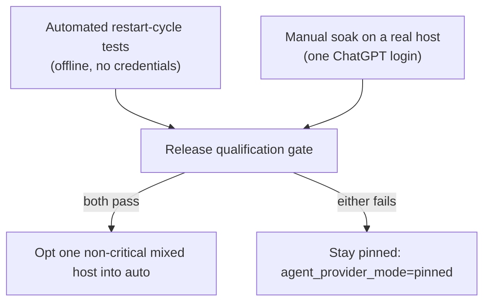

# Subscription restart/soak qualification

**Issue:** #1927 · **Parent:** #1923

The subscription-authenticated multi-provider path (Codex persistent ChatGPT
login #1924, the shared quota/status probe #1925, and quota-aware automatic
selection/failover #1926) is **not recommended as production-ready until the
qualification below passes**. This page is the qualification record: the
automated restart-cycle coverage, and the manual soak procedure a release
engineer runs on a real host before the fleet opts into `auto` routing.



## What the automated coverage proves

`worker/deno/tests/subscription_soak_test.ts` drives the real production
modules through `worker/deno/lib/subscription_soak_status.ts` — the
operator-facing observability surface added by this issue — and asserts:

- **Restart determinism.** Two identical worker/container generations produce
  an identical status snapshot, so a Claude-only baseline cannot drift across
  restarts, and no new files or settings are required to keep it identical.
- **Codex auth persistence.** A refreshed `auth.json` under the persistent
  agent-state directory survives disposable container replacement and both
  generations classify it as a ChatGPT login; metered-looking variables never
  reach the Codex child.
- **Token refresh, not reuse.** `refreshInstant` names the earliest instant a
  credential must be refreshed — expiry when known, otherwise a 12-hour horizon
  after the last refresh — so a long-lived run refreshes rather than reusing an
  unexpired access token forever.
- **Failover and recovery-after-reset.** A provider exhausted on one work item
  is routed around; after its reset it is eligible again and wins on the
  deterministic preference tie-break.
- **Fail-closed billing.** With every fixed-price subscription exhausted the
  selection defers (`chosen=none`) and the billing guard reports it holds; a
  metered candidate can never win.
- **Conservative telemetry.** Unknown/malformed quota stays unknown — never
  fabricated into zero, never metered — and the worker remains alive.

Run it offline (no credentials, no network):

```bash
deno test --frozen --lock=deno.lock \
  --allow-read --allow-env --allow-run --allow-write --allow-sys=hostname \
  tests/subscription_soak_test.ts
```

## Observability

`buildSubscriptionSoakStatus` renders one `[soak]` summary line per routing
decision, plus structured entries. It is wired into the automatic-routing
refresh in `worker/deno/lib/provider_auto_runtime.ts`, so every
`agent_provider_mode: "auto"` decision emits the line through the run's existing
log sink. The line carries, for an unattended operator:

- `providers-enabled` — which providers the image installed;
- `chosen` — provider/credential selected, or `none`;
- `reason` — the automatic-routing reason (`fresh-known-capacity`,
  `no-eligible-fixed-subscription`, …);
- `all-eligible-exhausted` — whether every fixed-price subscription is spent;
- `auth-required` — providers needing initial/re-authentication;
- `billing-guard` — `holds`/`failed`, cross-checking the winner is never metered;
- `retryAt` — earliest known reset among exhausted providers, or `none`;
- `last-quota-probe` — `<provider>:<availability>@<observedAt>` per provider.

Each structured entry adds `billingMode`, `availability`, `confidence`,
`refreshBy` and the quota windows. No secret, token or API key is an input or an
output of this surface — labels and reason codes only.

## Manual soak procedure (release qualification on a real host)

Run once per provider configuration you intend to enable for `auto`, on a
disposable host, against a throwaway repository. Record the `[soak]` lines in
the release notes.

### 1. One-time login

Perform the single allowed ChatGPT subscription login (device auth on a
headless host), then confirm the credential lives only under the persistent
agent-state directory — never in the image, logs or repository:

```bash
codex login --device-auth
# confirm ~/auto-issue-work-agent-state/codex/auth.json exists
# confirm it is not in the repo, logs, or a read-only provider mount
```

### 2. Baseline Claude regression

With `agent_provider: "claude"` and no `agent_provider_mode`, run a smoke issue
and capture the provider/credential selection, token-pool ranking, model/effort
routing and failure classification. Restart the worker/container at least three
times and confirm every reading is unchanged. A Claude-only configuration must
not require any new files or settings.

### 3. Codex restart cycle

Enable Codex (`agent_providers: ["codex"]`, `agent_provider: "codex"`), run a
smoke issue, then destroy and recreate the worker container **without** logging
in again. Repeat at least three times. Confirm:

- Codex authenticates after every restart with no browser/TTY/device prompt;
- the refreshed `auth.json` is reused from persistent state, not re-created;
- no `OPENAI_API_KEY` / `CODEX_API_KEY` reaches a subscription-mode child.

### 4. Token refresh (not unexpired reuse)

Use a controlled fixture whose access token expires before the 12-hour refresh
horizon, or run long enough that a refresh is forced. Confirm the run refreshes
(rather than failing on, or reusing, an expired token) and that the refreshed
state is written back to the persistent directory.

### 5. Automatic failover and recovery

On a mixed host with `agent_provider_mode: "auto"`,
`agent_providers: ["claude", "codex"]`:

1. Exhaust Claude (or inject a usage-limit signal naming Claude) and confirm new
   work moves to Codex unattended.
2. Exhaust Codex too and confirm work defers — the host waits, and never runs a
   metered credential.
3. Wait past the reset and confirm the exhausted provider becomes eligible
   again automatically.

### 6. Billing guard

With `OPENAI_API_KEY` and `ANTHROPIC_API_KEY` present in the environment, run
the all-exhausted scenario and confirm the worker still defers. Check the
`[soak]` line shows `billing-guard=holds` and `chosen=none`.

### 7. Sign-off

Only after steps 1–6 pass on a real host is `auto` routing eligible for the
staged rollout in [Provider parity](PROVIDER-PARITY.md#staged-rollout). Until
then the shipped default stays `pinned`.
