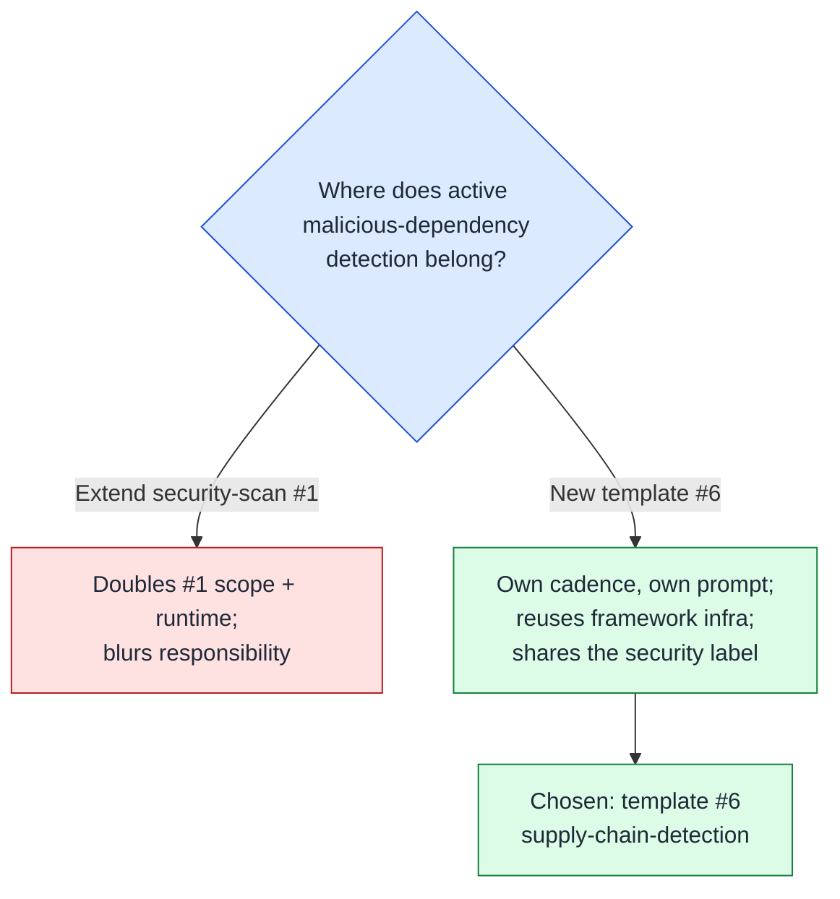

# 🛡️ Supply-Chain Detection Scan — Design & Catalogue

This document is the design specification for the Vibe Coder's
supply-chain **detection** scan — the active-detection counterpart to
the posture audit documented in
[`docs/SUPPLY-CHAIN-READINESS-SCAN.md`](SUPPLY-CHAIN-READINESS-SCAN.md).
The intent is set by the parent epic; this document and the
prompt at [`prompts/supply_chain_detection/`](../prompts/supply_chain_detection/)
are the foundational design deliverable that blocks the implement
sub-issue.

> **Status.** This issue delivers the *design* — the check catalogue,
> the new-template-vs-extend decision, and the orchestrating prompt. The
> Deno idle-task template that wires this prompt into the idle-task
> framework (registry, claim handler, snapshot/diff, cadence) is
> delivered by the **implement sub-issue** under epic. Until that
> lands, the prompt is loadable and validated but is not yet selected by
> the idle-task filer.

## Readiness vs detection

The supply-chain work splits cleanly along one axis:

- **Readiness** ([`supply-chain-readiness`](SUPPLY-CHAIN-READINESS-SCAN.md),
  template #5). The meta-capability to *detect and react* to a
  compromise — is a vulnerability scanner wired into CI, are install
  scripts blocked by config, is there an emergency-bump runbook? These
  are pre-incident posture gaps.
- **Detection** (this scan). Whether the committed dependency set shows
  an *active* compromise signal *right now* — an install script that
  harvests secrets, a dependency-confusion exposure, a typosquatted
  name, a mutable pin that lets an attacker's next publish land without
  review.

The split is finalised, so detection is broken out without double-owning
a check. Detection **cross-links** the readiness posture gaps rather
than re-filing them: whether install scripts are *blocked by config* is
readiness (`SCR-IGNORE-SCRIPTS`); whether a committed install script's
*content* exfiltrates secrets is detection (`SCD-INSTALL-SCRIPT`).

## Core design decision — new template #6, not an extension of `security-scan`

**Decision: a new `supply-chain-detection` idle-task template (template #6),
not an extension of `security-scan` (#1).**

Rationale:

- **Scope hygiene.** `security-scan` (#1) is already a multi-phase audit
  covering current published vulnerabilities and the dependency-update
  quarantine window. Folding active malicious-dependency detection into
  it would roughly double its scope and runtime and blur its
  responsibility. The idle-task framework exists precisely so a new
  background concern plugs in as its own template, sharing the dedup,
  label, cadence, and claim-routing machinery without bloating a sibling.
- **Independent cadence.** Detection is a heavy weekly sweep
  (`cooldownHours: 168`, matching templates #2–#5), separate from
  whatever cadence `security-scan` runs at.
- **Disjoint ids, shared label.** Per the epic, detection findings carry
  the **`security`** label (the same label `security-scan` uses), so a
  human triages them in the same queue. To keep the shared `SEC-` id
  space collision-free, detection ids use a `"supply-chain-detection"`
  discriminator (see [Stable finding ID recipe](#stable-finding-id-recipe)).



### The network-data tension, resolved

Several candidate detections in epic want **network / registry /
package-manager** data: OSV "malicious package" advisories, registry
metadata for maintainer-change signals, and version-diff to spot a
release that *adds* a lifecycle script. That conflicts with the
**static-evidence-only** discipline every idle-task template (#1–#5)
follows — no package-manager invocation, no registry calls, no network.

**Resolution for v1: constrain detection to what is statically decidable
from the committed manifests, lockfiles, and install scripts.** The
network/registry-sourced checks are explicitly **deferred** and recorded
in the catalogue as cross-link-only rows pointing at epic, so the
design captures them without v1 reaching for the network. This keeps v1
consistent with its siblings, low-noise, and re-runnable offline. A
future version may introduce a vetted, read-only OSV/registry
cross-check once the epic decides how to source that data safely.

## Detection check catalogue

Phase 2 of the prompt walks the detected ecosystems against the
catalogue below. A finding is only valid when Claude can cite the
specific committed file (and line range) that demonstrates the signal.
The **cross-link only** rows are owned by another template, or deferred
to epic, and are never filed here.

| ID prefix | Owner | Scope (ecosystems) | Severity | What it detects |
| --------- | ----- | ------------------ | -------- | --------------- |
| `SCD-INSTALL-SCRIPT` | this template | Node, Python, Rust | high | A committed install/lifecycle hook whose content shows exfiltration: outbound network call to a non-package host, credential/environment harvesting, or obfuscated execution. |
| `SCD-DEP-CONFUSION` | this template | Node, Python | high / medium | An internal/scoped package name declared without a registry pin binding it to the private registry, so a public package of the same name could shadow it. |
| `SCD-TYPOSQUAT` | this template | Node, Python, Rust | low / medium | A direct dependency whose name is a small edit-distance variant of a well-known popular package. |
| `SCD-FLOATING-PIN` | this template | all manifest-based | medium | A direct dependency declared with a mutable resolution (`*`/`latest`/wildcard major/git branch/tarball URL) that lets an attacker's next publish land without review. |
| `SCD-UNVERIFIED-SOURCE` | this template | Node, Python, Rust, Go | medium | A lockfile entry resolved over `http://` or from a non-canonical registry, or missing its integrity/hash field. |
| `SCD-OSV-MALICIOUS` | **cross-link / deferred** | n/a | n/a | OSV malicious-package / GitHub malware advisory cross-check. Needs network → deferred to epic. |
| `SCD-MAINTAINER-CHANGE` | **cross-link / deferred** | n/a | n/a | Abrupt maintainer change. Needs registry metadata → deferred to epic. |
| `SCD-SCRIPT-ADDED` | **cross-link / deferred** | n/a | n/a | A version that *adds* a lifecycle script vs its predecessor. Needs registry version-diff → deferred to epic. Committed-script variant is `SCD-INSTALL-SCRIPT`. |
| `SCD-CURRENT-VULN` | **cross-link only** | n/a | n/a | Owned by `security-scan` (#1). |
| `SCD-QUARANTINE-WINDOW` | **cross-link only** | n/a | n/a | Owned by `security-scan` (#1) via the dependency-update quarantine audit. |
| `SCD-ACTIONS-PIN` | **cross-link only** | n/a | n/a | Owned by `github-actions-audit` (#4). |
| `SCD-POSTURE` | **cross-link only** | n/a | n/a | Readiness/posture gaps owned by `supply-chain-readiness` (#5). |

The full per-check evidence rules and the
"sensible-and-proportionate" discipline (is the signal exhibitable by
this ecosystem? is there a committed-file citation? is it a detection
signal or a posture gap?) live in the prompt, not in Deno code.

## Sensible, proportionate, static-first

Mirroring the readiness catalogue's discipline:

- **Ecosystem-aware.** Never flag a signal an ecosystem cannot exhibit.
- **Severity matches impact.** A concrete exfil signal or clear
  dependency-confusion → `severity:high`; a mutable pin or unverified
  source → `severity:medium`; a typosquat heuristic → `severity:low`.
  There is **no `severity:critical`** in v1 — the strongest *statically*
  decidable signal is `severity:high`; an actually-malicious-package
  match (which would warrant more) needs the deferred OSV cross-check.
- **Low-noise, static-evidence only.** Every finding cites the committed
  manifest/lockfile/script line. No package-manager, registry, or
  network calls. At most **6 findings per run**, severity-ordered.
- **Cross-link, never duplicate.** Concerns owned by #1/#4/#5 — and the
  network-sourced classes owned by epic — are referenced in prose,
  never re-filed.

## Issue label scheme

Filed detection findings carry exactly two labels — no
operational/workflow label is ever added.

| Label | Allowed values | Meaning |
| ----- | -------------- | ------- |
| `security` | (constant) | Always present (per epic); shared with `security-scan`. Used by the dedup, snapshot, and known-open queries. |
| `severity:<level>` | `severity:high`, `severity:medium`, `severity:low` | Exactly one per issue. |

There is **no `lang:<bucket>` label** — the scan is single-scope and
language-agnostic. Operational labels (`planning`, `work-on`,
`top-priority`, `low-priority`, `failed`, `failed-once`, `needs-human`,
`best-model`, `question`, `refine-issue`) are **never** applied by the
scanner; [`label_security.ts`](../worker/deno/lib/label_security.ts)
strips any operational label added by the worker on the next scan.

## Stable finding ID recipe

Each finding's stable id is `SEC-<12 hex>` computed from the inputs:

```
{ repo, "supply-chain-detection", check-class-prefix, primary file or dependency }
```

The literal `"supply-chain-detection"` discriminator is **required** so
the ids never collide with `security-scan`'s own `SEC-` findings for the
same file — both families share the `security` label and the `SEC-` id
space, and the discriminator keeps them disjoint. The
`check-class-prefix` is the catalogue row's ID prefix (e.g.
`SCD-INSTALL-SCRIPT`). Whitespace and identifier renames are normalised
to equivalence so the same root cause yields the same id across runs,
which is what makes dedup and in-source suppression stable.

## 6-finding cap and priority order

A single detection run files **at most 6 standalone findings**, sorted
`severity:high` → `severity:medium` → `severity:low` (strongest signal
first within each band). Like the best-practices, test-audit,
github-actions-audit, and supply-chain-readiness scans, there is **no
overflow tracker** — surplus candidates are silently dropped and the
next weekly scan re-detects them (subject to dedup against open issues).

## Suppression-comment syntax

A finding can be suppressed in-source by adding the host language's
standard ignore comment with the finding ID and a short reason. Because
detection findings share the `security` label with `security-scan`, they
reuse the **`security-scan-ignore: SEC-…`** grammar recognised by
[`worker/deno/lib/suppression_comments.ts`](../worker/deno/lib/suppression_comments.ts)
(the same module also accepts `# noqa: SEC-…` and
`// eslint-disable-next-line SEC-…`). The suppressed id is
pre-substituted into the `{{SUPPRESSED_IDS}}` placeholder so Claude drops
the finding in Phase 3 triage on the next run.

```jsonc
// security-scan-ignore: SEC-1234567890ab — author=nigel expires=2026-12-31 postinstall builds a native
// addon; the script is vetted and pulls no network resources.
"scripts": { "postinstall": "node-gyp rebuild" }
```

## No PR, ever

Like every idle-task template, a detection run **never raises a pull
request**. Each finding is filed as its own `security`-labelled GitHub
issue; the wrapper idle-task issue is closed with a summary comment and
nothing else. Auto-remediation is out of scope — fixes flow through the
normal triage → planning → work-on pipeline.

## Related documentation

- [`prompts/supply_chain_detection/`](../prompts/supply_chain_detection/)
  — Orchestrating prompt (Phases 1–4). The catalogue, cap, label set, id
  recipe, and per-finding body shape live in the prompt.
- [`docs/SUPPLY-CHAIN-READINESS-SCAN.md`](SUPPLY-CHAIN-READINESS-SCAN.md)
  — The posture counterpart (template #5). Detection cross-links it
  rather than re-filing posture gaps.
- [`docs/SECURITY-SCAN.md`](SECURITY-SCAN.md) — Template #1
  (current-vulnerability audit + quarantine window). Shares the
  `security` label; detection uses a `"supply-chain-detection"` id
  discriminator to stay disjoint.
- [`docs/IDLE-TASK-FRAMEWORK.md`](IDLE-TASK-FRAMEWORK.md) — Framework
  operator manual and lifecycle diagram common to every template.
- Epic — proactive supply-chain compromise detection, which owns
  the deferred network/registry-sourced checks.
