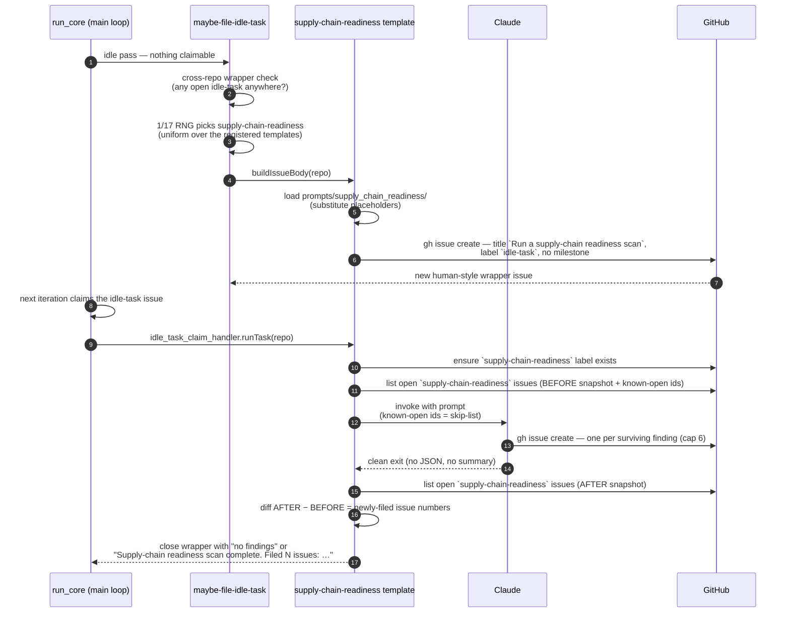

# 🔗 Supply-Chain Readiness Scans — Operator Manual

This document is the operator-facing reference for the Vibe Coder's
supply-chain **readiness** audit. The intent is documented in the parent
epic and the sub-issues that built it: the template, prompt, and
tests and this manual.

The supply-chain readiness scan is **template #5 of the idle-task
framework** — the generic mechanism for "things the worker does when no
claimable work exists". The framework owns filing, dedup, label
discipline, and claim routing; this document covers the
readiness-specific behaviour layered on top. See
[`docs/IDLE-TASK-FRAMEWORK.md`](IDLE-TASK-FRAMEWORK.md) for the framework
manual and the lifecycle diagram common to every template, and
[`docs/TEST-AUDIT-SCAN.md`](TEST-AUDIT-SCAN.md) for the sibling template
that this manual mirrors structurally (single prompt, language-agnostic,
no bucket).

For the **agent-facing** rules (label policy, suppression syntax,
trigger summary) see
[DESIGN-PRINCIPLES.md → Supply-chain readiness scans](../DESIGN-PRINCIPLES.md#supply-chain-readiness-scans-template-5).

## Design intent — readiness, not active compromise

The supply-chain readiness scan is an **evidence-backed static audit** of
the repository's posture for **surviving and responding to** a
supply-chain compromise. The orchestrating prompt at
[`prompts/supply_chain_readiness/`](../prompts/supply_chain_readiness/)
instructs Claude to detect the repo's ecosystems, apply the readiness
check catalogue, triage, and file each surviving recommendation as its
own GitHub issue.

The guiding distinction is **readiness vs detection**:

- **Readiness (this scan).** The meta-capability to *detect and react* to
  a compromise — is a vulnerability scanner wired into CI, are install
  scripts blocked, is there a documented emergency-bump runbook? These
  are pre-incident posture gaps, audited here.
- **Active detection (sibling templates).** Whether the repo *is
  currently* exposed. This scan deliberately does **not** re-file those
  concerns — it cross-links the owning template instead (see
  [Cross-link, never duplicate](#cross-link-never-duplicate)).

Findings are **recommendations calibrated to real risk**, not a
maximalist checklist. The bar is "what a reasonable maintainer would
do":

- **Ecosystem-aware.** Never flag tooling an ecosystem does not offer.
  Detect the stack first; stay silent on any check that is genuinely N/A.
- **Severity matches impact.** A missing CI vuln-scan or unblocked npm
  install scripts → `severity:high`. A missing SBOM → `severity:low` /
  informational. There is no blanket `severity:high`, and there is **no
  `severity:critical`** — readiness gaps are pre-incident posture, not an
  active compromise.
- **Low-noise, static-evidence only.** Every finding cites the config
  that is present or absent. The scan never invokes a package manager
  (`npm`, `pnpm`, `cargo`, `mvn`, `gradle`) or guesses at runtime state.

**No linters, package managers, or repo code are invoked.** The scan is
read-only static review. The only `gh` calls it makes are
`gh issue list` (dedup), `gh label create` (defensive),
`gh issue create` (file a finding), and the read-only repository
visibility lookup `gh repo view <owner>/<repo> --json visibility` (or
`gh api repos/{owner}/{repo} --jq .visibility`) used by the
[public-only / GHAS gate](#public-only--ghas-gate). It never edits a
file, never opens a remediation PR.

## Readiness check catalogue

Phase 2 of the prompt walks the detected ecosystems against the catalogue
below. A finding is only valid when Claude can cite the specific file
path (and line range, where the file is non-trivial) that demonstrates
the gap. The rows marked **cross-link only** are owned by another
template and are never filed here.

| ID prefix | Scope (ecosystems) | Severity | What it audits |
| --------- | ------------------ | -------- | -------------- |
| `SCR-LOCKFILE` | all manifest-based | medium | Lockfile present and not stale relative to its manifest. |
| `SCR-SBOM` | all | low | SBOM artefact present in repo or produced and uploaded by CI. Informational. |
| `SCR-VULN-SCAN` | all | high | CI runs at least one vulnerability scanner on every PR / on a schedule (Dependabot/Renovate alerts, `osv-scanner`, `npm audit --audit-level=high`, `deno audit`, `cargo audit`, `pip-audit`, OWASP Dependency-Check, Trivy / Grype). |
| `SCR-AUTO-UPDATE` | all manifest-based | medium | Renovate or Dependabot is configured to raise **security** updates automatically. |
| `SCR-IGNORE-SCRIPTS` | Node only | high | Install-time lifecycle scripts (`postinstall`/`preinstall`/`prepare`) are blocked or explicitly allow-listed. |
| `SCR-PROVENANCE` | Node primarily; opt-in elsewhere | medium | Provenance / attestation verification is enforced where the ecosystem supports it. Cite the config that *enables* verification, not the absence of an attestation. |
| `SCR-DEP-REVIEW` | **public** repos that accept PRs | medium | `dependency-review-action` (or equivalent) runs on every pull request and blocks new high-severity advisories. **Public-only / GHAS-gated** — silent unless visibility is confirmed `public` (see [public-only / GHAS gate](#public-only--ghas-gate)). |
| `SCR-QUARANTINE-OVERRIDE` | all manifest-based | low | Documented emergency-override / fast-lane procedure to bypass the quarantine window when a CVE is being actively exploited. |
| `SCR-RUNBOOK` | all | low | `SECURITY.md` exists, names a disclosure contact, **and** sketches at least a brief emergency-bump procedure. |
| `SCR-SEC-ALERTING` | all | medium | **OWASP A09:2025 — alerting/monitoring readiness.** An alerting path exists for security-relevant signals: advisory / Dependabot-alert notifications, alerting on security-relevant CI failures, and a documented escalation / incident-response path. Silent when any one path is present. Posture only — the *code-level* A09 logging detection is owned by [`security-scan`](SECURITY-SCAN.md) (#1); cross-link, never re-file. |
| `SCR-CURRENT-VULNS` | **cross-link only** | n/a | Owned by `security-scan` (#1). |
| `SCR-QUARANTINE-WINDOW` | **cross-link only** | n/a | Owned by `security-scan` (#1) via the dependency-update quarantine audit. |
| `SCR-ACTIONS-PIN` | **cross-link only** | n/a | Owned by `github-actions-audit` (#4). |
| `SCR-EOL-RUNTIME` | **cross-link only** | n/a | Owned by `best-practices` (#2) and `github-actions-audit` (#4). |
| `SCR-ANOMALOUS-PUBLISH` | **cross-link only** | n/a | Owned by the proactive-detection epic. |

The full per-check evidence rules and the "sensible-and-proportionate"
discipline (is the control available to this ecosystem? does its absence
plausibly affect this repo? is the fix actionable in under a day?) live
in the prompt, not in Deno code.

### Cross-link, never duplicate

When a concern is owned by another template, the readiness scan
references it in prose rather than filing a parallel issue:

- **Current vulnerabilities + dependency-update quarantine window** →
  [`security-scan`](SECURITY-SCAN.md) (template #1).
- **GitHub Actions SHA-pinning, runner deprecation, workflow privilege
  creep** → [`github-actions-audit`](GITHUB-ACTIONS-AUDIT-SCAN.md)
  (template #4).
- **EOL language runtimes** →
  [`best-practices`](BEST-PRACTICES-SCAN.md) (template #2) and
  `github-actions-audit` (#4).
- **Anomalous-publish / proactive compromise detection** → the
  proactive-detection epic.
- **Reactive triage of a published upstream advisory** →
  [`docs/security-advisory-triage.md`](security-advisory-triage.md).
- **Code-level security logging/alerting (OWASP A09:2025)** — the
  *code* half of A09 (security-relevant events not logged, secrets in
  logs, integrity-unprotected log sinks) → [`security-scan`](SECURITY-SCAN.md)
  (#1) § "A09:2025". `SCR-SEC-ALERTING` owns only the **alerting /
  monitoring readiness posture** half and cross-references the
  code-level detection rather than re-filing it.

This scan is purely about **posture** — whether the meta-capability
exists — not whether the repo is currently exposed.

## Public-only / GHAS gate

Some recommended controls only work — or only add value — on a **public**
repository, or on a **private** repository with paid **GitHub Advanced
Security (GHAS)** enabled. Recommending them on a private repo without
GHAS produces a control that can never pass.

The canonical example is `SCR-DEP-REVIEW`
(`actions/dependency-review-action`). It relies on GitHub's Dependency
Graph review API, which on a private repo requires GHAS — a paid feature
that is **off by default** — so the `dependency-review` check fails on
every PR of a private, non-GHAS repo. (This is exactly what happened in
issue →: a finding fired on this private repo, the added
`dependency-review.yml` then failed on every PR — symptoms /
/.)

The prompt (from v2 onward) gates every such check on **confirmed public
visibility**:

- Before filing **any** finding whose recommended control needs a public
  repo or GHAS, the scan determines visibility by running
  `gh repo view <owner>/<repo> --json visibility` (or
  `gh api repos/{owner}/{repo} --jq .visibility`).
- The check **fails safe to private**: any result other than a confirmed
  `public` — `private`, `internal`, an empty value, an error, or a
  non-zero exit — is treated as not public.
- If the repo is not confirmed `public`, the scan **stays silent** on
  that check and files nothing.
- The rule is **generic**: it covers every current and future
  GHAS/public-only check, not only `dependency-review-action`. Today
  `SCR-DEP-REVIEW` is the only check in this class.

This gate is **prompt guidance only** — there is no hard code gate in
`supply_chain_readiness_template.ts`. The spec-driven
[`workflow_auditor.ts`](../worker/deno/lib/workflow_auditor.ts) handles
the same concern in code for the deterministic auditor (the
`dependencyReview` spec is marked `visibilityScope: "public-only"` in
[`workflow_definitions.ts`](../worker/deno/lib/workflow_definitions.ts)
and skipped on private repos via
[`repo_visibility.ts`](../worker/deno/lib/repo_visibility.ts)); the
LLM-driven idle-task scan is a separate code path and enforces the same
rule through the prompt.

## Idle trigger



The flowchart below summarises the same flow as a decision tree.

```mermaid
flowchart TD
    classDef gate fill:#fef3c7,stroke:#b45309,color:#1f2937;
    classDef phase fill:#dbeafe,stroke:#1d4ed8,color:#1f2937;
    classDef output fill:#dcfce7,stroke:#15803d,color:#1f2937;

    Idle[Idle trigger<br/>run_core: nothing claimable]
    Idle --> Pick{1/17 RNG over the<br/>registered idle-task templates}
    Pick -- supply-chain-readiness --> FileWrapper[File wrapper issue<br/>title: 'Run a supply-chain readiness scan'<br/>label: idle-task<br/>no milestone — skipMilestone: true]:::output
    FileWrapper --> Claim[Next iteration<br/>claims the idle-task issue]
    Claim --> Ensure[Ensure `supply-chain-readiness` label exists]:::phase
    Ensure --> Before[Snapshot 1 — list open<br/>`supply-chain-readiness` issues BEFORE<br/>+ build known-open id list]:::phase
    Before --> Run[Invoke Claude<br/>read-only static audit<br/>readiness check catalogue]:::phase
    Run --> Cap[Triage — drop unbacked,<br/>drop cross-link, dedup, suppress,<br/>cap at 6: high > medium > low]:::phase
    Cap --> FileFindings[Phase 4 — gh issue create<br/>labels: supply-chain-readiness, severity:&lt;level&gt;]:::phase
    FileFindings --> After[Snapshot 2 — list open<br/>`supply-chain-readiness` issues AFTER]:::phase
    After --> Diff[Template diff:<br/>AFTER − BEFORE = newly filed]:::output
    Diff --> Close[Close wrapper with summary<br/>'no findings' OR<br/>'Supply-chain readiness scan complete. Filed N issues: …'<br/>never raises a PR]:::output
    class Pick gate;
```



## Wrapper issue layout

The wrapper issue is **human-style** — no hidden marker,
no parameters block. Anyone can paste the same prompt into a fresh issue
with the `idle-task` label and the worker will run it identically.

- **Title:** the literal string `Run a supply-chain readiness scan`.
  Dispatch matches the title to
  [`supplyChainReadinessTemplate.buildIssueTitle(repo)`](../worker/deno/lib/idle_task_templates/supply_chain_readiness_template.ts).
- **Body:** the latest `prompts/supply_chain_readiness/` template with the
  two placeholders substituted at file time — `{{SUPPRESSED_IDS}}` and
  `{{KNOWN_OPEN_FINDING_IDS}}` (both render as `(none)` on the wrapper
  itself; the real known-open list is rebuilt from live issues at claim
  time).
- **Body fingerprint:** the prompt's H1 begins
  `# Supply-chain readiness …`, matched by
  `SUPPLY_CHAIN_READINESS_BODY_FINGERPRINT` so dispatch recognises the
  wrapper even if the title was edited (body-fingerprint
  dispatch).
- **Label:** the canonical `idle-task` label. No workflow labels.
- **No milestone** — the template sets `skipMilestone: true`, so the
  wrapper never gates a milestone-merge PR.

## Cadence — once per week per repo

The template sets `cooldownHours: 168`, so a given repo is scanned for
supply-chain readiness **at most once per week**. The per-repo cooldown
gate (`worker/deno/lib/idle_task_cooldown_gate.ts`) keys the window off
the `createdAt` of the most recent wrapper or finding the template
produced in that repo, so a fast-failing scan still counts towards the
window. A heavy weekly sweep deliberately runs less often than the
framework default (24h).

On top of the cooldown, the template's `shouldFile()` refuses to file a
fresh wrapper while an open `Run a supply-chain readiness scan` wrapper is
still being triaged, and the generic output-backlog gate skips filing once
the repo has six or more open `supply-chain-readiness` issues.

## Issue label scheme

Filed supply-chain-readiness issues carry exactly two labels — no
operational/workflow label is ever added.

| Label | Allowed values | Meaning |
| ----- | -------------- | ------- |
| `supply-chain-readiness` | (constant) | Always present; used by the dedup, snapshot, and known-open queries. Colour `5319E7`. |
| `severity:<level>` | `severity:high`, `severity:medium`, `severity:low` | Exactly one per issue. |

There is **no `lang:<bucket>` label** — the scan is single-scope and
language-agnostic, so a single `supply-chain-readiness` label scopes all
findings.

Operational labels (`planning`, `work-on`, `top-priority`,
`low-priority`, `failed`, `failed-once`, `needs-human`, `best-model`,
`question`, `refine-issue`) are **never** applied by the scanner. The
canonical pickup-priority order is `top-priority` > `work-on` >
`low-priority` > `idle-task`; `idle-task` is the only label the Vibe
Coder may self-apply.
[`label_security.ts`](../worker/deno/lib/label_security.ts) strips any
operational label added by the worker on the next scan, so an accidental
operational label cannot persist.

### Severity guidance

- **`severity:high`** — the gap leaves the repo materially undefended
  against an active class of compromise (no CI vuln-scan; npm
  install-script execution unblocked on a repo that pulls third-party
  deps).
- **`severity:medium`** — the gap weakens an established defence but a
  parallel safeguard exists (lockfile missing on a repo whose CI runs
  `npm audit` regardless; provenance verification absent on a Node repo
  whose deps are all pinned).
- **`severity:low`** — informational / hygiene (no SBOM; no
  emergency-override section in `SECURITY.md`).

There is **no `severity:critical`** — readiness gaps are by definition
pre-incident posture, not an active compromise.

## Stable finding ID recipe

Each finding's stable id is `BP-<12 hex>` computed from the inputs:

```
{ repo, "supply-chain-readiness", check-class-prefix, primary file }
```

The literal `"supply-chain-readiness"` discriminator is **required** so
the ids never collide with `best-practices`, `test-audit`, or
`github-actions-audit` findings for the same file — all four families
share the `BP-` id space, and the discriminator keeps them disjoint. The
`check-class-prefix` is the catalogue row's ID prefix (e.g.
`SCR-VULN-SCAN`). Whitespace and identifier renames are normalised to
equivalence so the same root cause yields the same id across runs, which
is what makes dedup and in-source suppression stable.

## 6-finding cap and priority order

A single supply-chain-readiness run files **at most 6 standalone
findings**. The cap is enforced in Phase 3 of the prompt: Claude sorts
surviving findings by severity (high → medium → low; within each
severity, easiest fix first) and keeps the top 6.

**No overflow tracker.** Like the best-practices and test-audit scans —
and unlike the security-scan template — the supply-chain-readiness scan
does **not** file an overflow tracker when more than six candidates
survive triage. Surplus candidates are silently dropped from this run;
the next weekly scan re-detects them (subject to dedup against open
issues).

## Suppression-comment syntax

A finding can be suppressed in-source by adding the host language's
standard ignore comment with the finding ID and a short reason. The
supply-chain-readiness scan shares the `best-practice-ignore: BP-…`
grammar with the best-practices and test-audit scans — recognised by
[`worker/deno/lib/suppression_comments.ts`](../worker/deno/lib/suppression_comments.ts)
— and applies on every subsequent run (the suppressed id is
pre-substituted into the `{{SUPPRESSED_IDS}}` placeholder so Claude drops
the finding in Phase 3 triage).

The canonical form is `best-practice-ignore: BP-<id> — author=<login> expires=<YYYY-MM-DD> <reason>`. Worked
examples per language family:

```jsonc
// best-practice-ignore: BP-1234567890ab — author=nigel expires=2026-12-31 install scripts are required
// by the native addon build; the deps are pinned and vetted upstream.
"scripts": { "postinstall": "node-gyp rebuild" }
```

```yaml
# best-practice-ignore: BP-1234567890ab — author=nigel expires=2026-12-31 this repo is internal-only and
# accepts no external PRs, so dependency-review-action adds no value here.
on: [pull_request]
```

The grammar also accepts `# noqa: BP-…` (Python) and
`// eslint-disable-next-line BP-…` (TypeScript/JavaScript) for
convenience, so an existing ignore comment can carry the BP-id without
adding a second marker.

## No PR, ever

A supply-chain-readiness idle-task **never raises a pull request**,
regardless of outcome. Every finding is filed as a standalone GitHub
issue in the scanned repo; the wrapper idle-task issue is closed with a
summary comment and nothing else. Because the template sets
`skipMilestone: true`, the wrapper is not assigned to any milestone, so
closing it never triggers the milestone-completion → merge-PR flow that
ordinary milestone work uses.

The only artefacts a supply-chain-readiness run produces are:

1. **New finding issues** filed by Claude itself via `gh issue create`
   from Phase 4 of the prompt, capped at six per run.
2. **A closing comment** on the wrapper idle-task issue — either
   `no findings` or
   `Supply-chain readiness scan complete. Filed N issues: #A, #B, …`
   (numbers sorted ascending so the comment is deterministic).

Auto-remediation is **out of scope** for the scan. Fixes are filed as
ordinary issues that flow through the normal triage → planning →
work-on pipeline, where each recommendation is implemented and reviewed
individually.

## Related documentation

- [`docs/IDLE-TASK-FRAMEWORK.md`](IDLE-TASK-FRAMEWORK.md) — Framework
  operator manual; lifecycle diagram common to every template.
- [`docs/SECURITY-SCAN.md`](SECURITY-SCAN.md) — Template #1
  (current-vulnerability audit + dependency-update quarantine window).
  This scan cross-links rather than duplicates those classes.
- [`docs/security-advisory-triage.md`](security-advisory-triage.md) —
  Reactive triage of a published upstream advisory (the complement to
  this proactive posture audit).
- [`docs/TEST-AUDIT-SCAN.md`](TEST-AUDIT-SCAN.md) — Sibling template
  (single prompt, language-agnostic). This document mirrors its
  structure.
- Proactive supply-chain compromise detection — flagging malicious deps
  before an advisory exists — is tracked under epic.
- [`prompts/supply_chain_readiness/`](../prompts/supply_chain_readiness/)
  — Orchestrating prompt (Phases 1–4). The catalogue, cap, label set, id
  recipe, and per-finding body shape live in the prompt, not in Deno
  code.
- [`DESIGN-PRINCIPLES.md`](../DESIGN-PRINCIPLES.md#supply-chain-readiness-scans-template-5)
  — Worker-side design principles for the supply-chain readiness scan.
```
