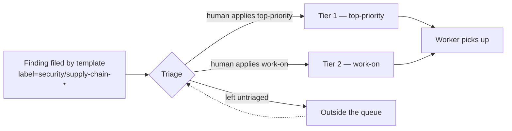

# 📥 Bulk triage and dispatch order for supply-chain findings

The security-scan, best-practices, github-actions-audit, and
supply-chain-readiness idle-task templates file findings as ordinary
GitHub issues. Each finding carries only its **finding label** (one of
`security`, `supply-chain-readiness`, `supply-chain:quarantine-missing`,
`supply-chain:quarantine-misconfigured`, `best-practices`,
`github-actions-audit`, `test-audit`) plus a `severity:high|medium|low`
label. The pickup labels — `top-priority`, `work-on`, `low-priority`,
`idle-task` — are **never applied by the worker** (see
[Worker Label Policy](../README.md#-supported-labels)).

Under a steady, growing inflow of findings, manually toggling `work-on`
per issue becomes the triage bottleneck. This doc covers the two parts
of the throughput fix (Issue #2403):

1. The `bulk-triage-security` Deno command for clearing the triage queue
   in one pass.
2. The dispatch order a labelled finding sees once it enters the
   worker's queue.

## Dispatch order for security remediation

The worker selects candidate issues using
[`selectHighestPriority` in `worker/deno/lib/issue_priority.ts`](../worker/deno/lib/issue_priority.ts).
The order is:

| Tier | Source label | Notes |
| ---- | ------------ | ----- |
| 1    | configured-label (e.g. `top-priority`) | Highest priority. Selected before everything else. |
| 2    | `work-on`     | Standard worker pickup. |
| 3    | `low-priority` | Backlog. Suppressed in any repo that has an open work-on issue. |
| 4    | `idle-task`   | Worker-filed background work. Suppressed in any repo with an open work-on or low-priority issue. |

A security finding starts unlabelled by any pickup label, so it sits
**outside** the queue entirely. The moment a human (or
`bulk-triage-security`) applies `work-on`, it enters tier 2 — above
backlog work and above any idle-task scans. Applying `top-priority`
promotes it to tier 1.



### Surge ordering

Within tier 2 (`work-on`), candidates are ordered by `labelIndex` then
`createdAt`. There is no built-in "security-first" reordering: once a
human applies `work-on`, a security finding competes with every other
`work-on` issue on age. If a sustained backlog needs security ahead of
unrelated work, the recommended pattern is to apply `top-priority`
(tier 1) instead of `work-on` (tier 2) — that escalation is what
tier 1 exists for.

A config-gated "security-first" reordering inside tier 2 was considered
during refinement and rejected for now: it would have introduced a
hidden ordering rule on top of `createdAt` that is easy to forget and
hard to debug. Tier 1 is the right escape valve for surges.

## `bulk-triage-security` command

The command walks every monitored repo, finds open issues carrying any
of the configured findings labels, applies severity and minimum-age
filters, and — unless `--dry-run` is set — applies the pickup label
(`work-on` by default) in bulk.

It is designed to be **run by a human operator with their own `gh`
credentials**, not by the worker. The worker's own user is stripped of
`work-on` by `label_security.ts`; running the command from a trusted
session keeps the label policy intact while clearing the triage backlog
in one pass.

### Usage

```bash
deno run --allow-env --allow-run --allow-read \
  worker/deno/mod.ts bulk-triage-security \
  --monitored-repos owner/a,owner/b \
  --severities severity:high,severity:medium \
  --min-age-days 1 \
  --max 20 \
  --dry-run
```

### Flags

| Flag | Default | Purpose |
| ---- | ------- | ------- |
| `--monitored-repos` | _required_ | Comma-separated `owner/name` slugs. |
| `--apply-label` | `work-on` | Pickup label to apply. Pass `top-priority` for surge handling. |
| `--findings-labels` | `security,supply-chain-readiness,supply-chain:quarantine-missing,supply-chain:quarantine-misconfigured` | Comma-separated finding labels to match. Issues carrying any of them are eligible. |
| `--severities` | _all_ | Comma-separated `severity:high\|medium\|low`. When set, an issue must carry one of these to be triaged. |
| `--min-age-days` | `0` | Issue `createdAt` must be at least this many whole days old. |
| `--max` | `50` | Cap on label writes (or `would_label` events under `--dry-run`) per run. |
| `--dry-run` | _off_ | Emit `would_label` events without applying any labels. |

### Output

Each candidate emits one structured log line, followed by a single
summary line:

```
[bulk-triage] repo=owner/a issue=42 action=labelled label=work-on matched=security severity=severity:high
[bulk-triage] repo=owner/a issue=43 action=skipped reason=severity allowed=severity:high
[bulk-triage] repo=owner/a issue=44 action=skipped reason=age age_days=0 min_age_days=3
[bulk-triage] repo=owner/a issue=45 action=skipped reason=cap max=20
[bulk-triage] action=summary mode=applied labelled=12 would_label=0 already=2 skipped_severity=4 skipped_age=1 skipped_cap=3 errors=0
```

Per-repo `gh` failures are captured as `action=error` events and never
abort the rest of the sweep — the next repo is processed cleanly.

### Behavioural guarantees

- Idempotent: an issue already carrying the pickup label is reported as
  `skipped reason=already_labelled` and never re-written.
- Dedup across findings labels: an issue carrying both `security` and
  `supply-chain-readiness` is processed once, not twice.
- Oldest-first within a repo: ties broken by `createdAt`, so a draining
  pass clears the oldest issues first.
- The `--max` cap stops further writes (or would-writes) the moment it
  is reached; remaining candidates are reported as `skipped reason=cap`.

## See also

- [`docs/SECURITY-SCAN.md`](SECURITY-SCAN.md) — security-scan template
  operator manual.
- [`docs/SUPPLY-CHAIN-READINESS-SCAN.md`](SUPPLY-CHAIN-READINESS-SCAN.md)
  — supply-chain-readiness template operator manual.
- [`docs/IDLE-TASK-FRAMEWORK.md`](IDLE-TASK-FRAMEWORK.md) — idle-task
  framework that files findings as standalone issues.
- [Supported Labels in README.md](../README.md#-supported-labels)
  — why the worker cannot apply pickup labels itself.
