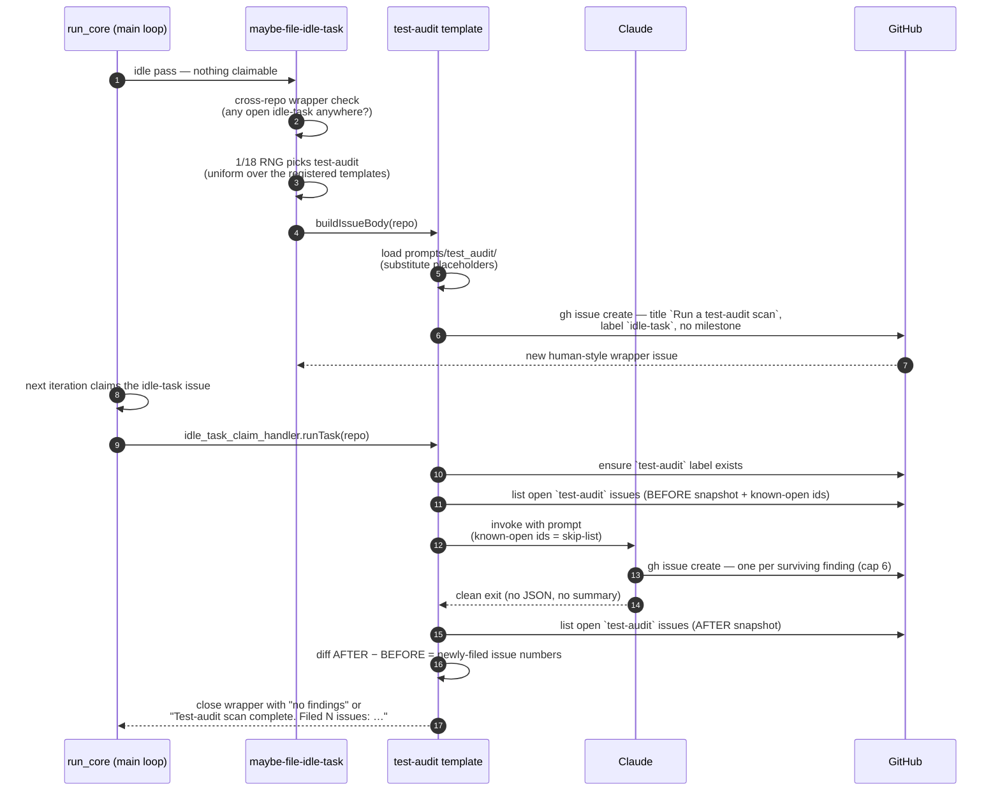
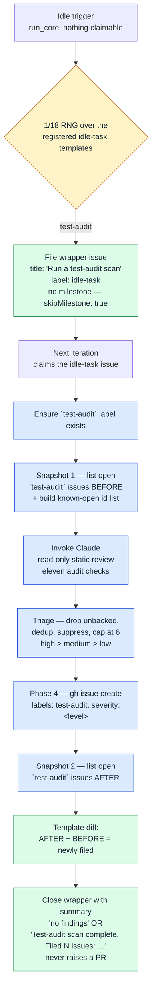

# 🧪 Test-Audit Scans — Operator Manual

This document is the operator-facing reference for the Vibe Coder's
LLM-driven test-quality audit. The intent is documented in the parent
issue and the sub-issues that built it: the template and prompt
 and this manual.

The test-audit scan is **template #3 of the idle-task framework** — the
generic mechanism for "things the worker does when no claimable work
exists". The framework owns filing, dedup, label discipline, and claim
routing; this document covers the test-audit-specific behaviour layered
on top. See [`docs/IDLE-TASK-FRAMEWORK.md`](IDLE-TASK-FRAMEWORK.md) for
the framework manual and the lifecycle diagram common to every template,
and [`docs/BEST-PRACTICES-SCAN.md`](BEST-PRACTICES-SCAN.md) for the
sibling template that this manual mirrors structurally.

For the **agent-facing** rules (label policy, suppression syntax,
trigger summary) see
[DESIGN-PRINCIPLES.md → Test-audit scans](../DESIGN-PRINCIPLES.md#test-audit-scans-template-3).

## Design intent — Static Test-Suite Maintainability and Coverage-Gap Audit

The test-audit scan is an **evidence-backed static review** of the
repository's test suite, performed entirely by Claude. It is a
**static test-suite maintainability and coverage-gap audit** — it reads
and reviews test source and cross-references public symbols, but does
**not** execute the tests, so it never claims dynamically measured
execution coverage. The orchestrating prompt at
[`prompts/test_audit/`](../prompts/test_audit/) instructs Claude to read
the test tree, apply the **eleven audit checks**, and file each surviving
finding as its own GitHub issue. ("Test Audit" remains the short display
name.)

The audit reviews two complementary concerns in **one** run, using the
same deduplication, severity, stable-ID and finding-limit rules (never a
parallel report):

- **Test maintainability** (checks 1–6 and 8–11) — tests that get in the
  way of refactoring (the ten **test-maintainability smells**). Checks
  8–10, added from v7 onward, cover mocked state objects,
  near-duplicate test bodies, and tests of framework guarantees; check
  11, added in v12, covers tautological assertions.
- **Potential behavioural coverage gaps** (check 7,) —
  public API functions where no test directly references the symbol and
  no reviewed test provides clear indirect behavioural coverage. A static
  `deno doc` pre-pass over the Deno / TypeScript public API surface feeds
  Claude a verified static starting list via the `{{COVERAGE_GAPS}}`
  prompt input; Claude confirms each and supplements the non-Deno
  languages.

The scan exists to flag tests that get in the way of refactoring. The
guiding distinction is **behaviour versus implementation — the WHAT/HOW
heuristic** — an informal project heuristic, not established industry
taxonomy:

- **Behaviour-based test (good), called a WHAT-test in this audit.**
  Asserts on externally observable behaviour or outcome — the function's
  return value, the side effect a caller can see, the exit code, the
  persisted record. It does not care *how* the function arrived at the
  answer.
- **Implementation-coupled test (flagged), called a HOW-test in this
  audit.** Depends on incidental implementation details — call order,
  which private function ran, which mock was invoked in which sequence,
  the source text of the function under test.

A bubble-sort → quick-sort or TypeScript → Rust rewrite must keep passing
the same behaviour-based (WHAT) tests. Tests that need to change because
the implementation changed — even though the behaviour did not — are
implementation-coupled (HOW) tests, and they are exactly what this scan
flags.

**Rewrite or delete are both valid resolutions.** A counter-productive
test should never have been written, so deleting one is an acceptable PR
outcome. Each filed finding names *both* resolutions: rewrite the test to
assert observable behaviour, or delete it.

**Language-agnostic — no bucket.** Unlike the best-practices scan, the
test-audit scan has no bucket. A single run inspects every test ecosystem
present in the repo: Deno/TypeScript, JavaScript, Rust, Java, Go, Python,
shell/BATS, Cypress, and Playwright. This makes it structurally closer to
the `security-scan` template (single prompt, language-agnostic) than to
the bucket-scoped best-practices template.

**No linters or test runners are invoked.** The scan is read-only static
review. It must not execute repo code — no `deno test`, `cargo test`,
`pytest`, `bats`, `npm test`, etc. The only `gh` calls it makes are
`gh issue list` (dedup), `gh label create` (defensive), and
`gh issue create` (file a finding).

From v8 onward the prompt opens with the shared
[Phase 0 — Adapt to the project](IDLE-TASK-FRAMEWORK.md#phase-0--adapt-to-the-project)
stanza: the repo's own documented testing conventions are read before any
check is applied, and a **documented** convention beats a check. An unsafe
convention is filed as a finding against the convention itself.

## The eleven audit checks

Phase 2 of the prompt walks every inventoried test file against checks
1–6 and 8–11 (the **test-maintainability smells**), then cross-checks
every public function (enumerated in Phase 1b) against the test suite for
check 7 (a **potential behavioural coverage gap**). A missing test is not
itself a test anti-pattern, so the combined checklist is the *eleven
audit checks*, not "eleven anti-patterns". A finding is only valid when
Claude can cite a specific file/line-range in the current source tree.

| # | Audit check | What it flags |
| - | ----------- | ------------- |
| 1 | **Implementation-coupled assertions** | Call-order assertions, mocks of internal calls, assertions on private functions or the AST/source text of the function under test. Interaction / mock assertions are flagged **only** when the interaction is not part of the public contract — verifying a required payment-gateway call or audit event is legitimate observable behaviour. |
| 2 | **Source-text greps as assertions** | Tests that grep the source file for a pattern (`grep -qE '^foo\(\)' src/foo.sh`) instead of running the code. Any rename breaks the test without a real regression. |
| 3 | **Performance / timing assertions in unit tests** | Wall-clock thresholds inside unit tests (`expect(elapsed).toBeLessThan(100)`). Flaky across machines; performance belongs in a dedicated benchmark. |
| 4 | **Benchmarks in the unit-test runner** | A test that iterates `10_000` times or measures throughput and asserts only that the loop finished. Slows the suite, adds no correctness signal. |
| 5 | **Unexplained or unjustified expected values** | A literal value is *not* a smell merely because it is hard-coded (`addGST(100) === 110` is fine). Flag values copied from the current implementation's output, unexplained/non-obvious, not independently derived from a requirement, or updated whenever the implementation changes. Every bullet is about a *literal*; an expected value recomputed at test run time is check 11. |
| 6 | **Snapshot / golden tests with no reviewable baseline** | Unreviewable snapshot or golden-master baselines — an opaque blob no human will diff, so `--update-snapshots` silently ships bugs. |
| 7 | **Potentially untested public API** | Public API functions where no test directly references the symbol and no reviewed test provides clear indirect behavioural coverage — a statically detected candidate, not a measured-coverage claim. The other ten checks flag tests that obstruct a refactor; this one flags public behaviour that may have no safety net. Test helpers, trivial accessors, and functions covered indirectly through a tested caller are excluded. The fix is to *add* a behaviour-based (WHAT) test (never auto-written — the scan is issue-only). |
| 8 | **State and value objects replaced by mocks** (from v7 onward) | A data model, DTO, entity, or state object mocked instead of constructed for real. Mocking state hides field-name typos, missing required fields, and constructor validation — the bugs most worth catching. Mocks belong at boundaries (network, DB, filesystem, clock, SDK, LLM); a plain data object is not a boundary. Severity **high**. Fix: build the real object, adding a builder/factory helper if construction is painful — that pain is design feedback, not a reason to mock. |
| 9 | **Near-duplicate test bodies** (from v7 onward) | Two or more tests with identical setup, structure, and assertions differing only in one input literal and its expected output — the canonical shape of generated test bloat. Fix: one data-driven test (`t.step` over a table, `@pytest.mark.parametrize`, `test.each`, PHPUnit `#[DataProvider]`, a Go table-driven subtest). Severity **low–medium** (maintenance drag, not a hidden bug). The scan stays silent when the tests genuinely differ in setup, assertions, or mock configuration. |
| 10 | **Tests for framework or language guarantees** (from v7 onward) | A test that would still pass if every line of the project's own code were deleted and only framework/stdlib defaults remained: the validation library validates, the ORM commits, the router 404s, a constructor assigns its arguments, a constant equals its literal, a function rejects input the type system already forbids. Severity **low**. Fix: delete it, or replace it with a test of the project logic sitting on top. |
| 11 | **Tautological assertions** (from v12 onward) | An assertion whose expected value is derived *inside the test by the same computation the code under test performs* — a mirrored `reduce`/`map`/loop, a hand-built snapshot assembled the implementation's way, or a constant asserted equal to itself. It passes by construction, survives every refactor, and can never disagree with the implementation, so it is invisible to check 1 (no mocks, no private access) and to check 5 (no literal to interrogate). Severity **high** when it is the behaviour's only test, otherwise **medium**. Fix: an independently-sourced expected value (a known-good literal, a worked example from the spec, a fixture row). The scan stays silent when the expected value comes from a fixture row, from a deliberately *different* algorithm used as an oracle (a slow reference implementation checking a fast one, a round trip through an inverse function), or from a restatement of the requirement — the check turns on "computed the way the code computes it", not on "computed". |

### Exemption — production regression tests are sacred (from v7 onward)

A test that reproduces a real production bug — named for the incident, or
carrying a comment identifying it (an issue reference, a date, a short
description of the failure) — is **never** a check 9 or check 10 finding,
and is exempt from any "what bug does this catch?" reasoning. The
incident is its justification.

Such a test often *looks* redundant (a near-duplicate of the case beside
it) or *looks* like it only exercises framework behaviour — precisely
because the production failure lived in that seemingly-trivial gap.
Without the exemption, checks 9 and 10 would recommend deleting exactly
the tests that must never be deleted. Phase 3 triage drops these
candidates silently.

The exemption scopes to checks 9 and 10 only: a sacred regression test
that also mocks a state object (check 8) or greps source text (check 2)
is still reported under those checks.

### Coverage-gap pre-pass (check 7)

The `test-audit` template runs a deterministic, Deno-native pre-pass
([`coverage_gap_scanner.ts`](../worker/deno/lib/coverage_gap_scanner.ts))
before invoking Claude:

1. **Enumerate** exported functions with `deno doc --json` over the
   cloned repo (a static documentation extractor — it does **not**
   execute repo code, and it is never an npm-based extractor, per).
2. **Cross-check** each symbol against the concatenated test sources with
   a whole-word grep; functions with no referencing test are gaps.
3. **Inject** the rendered `file:line — symbol` list into the prompt's
   `{{COVERAGE_GAPS}}` input as a verified starting point.

The pre-pass is **best-effort**: any failure (non-Deno repo, `deno doc`
error) renders the `(none)` sentinel, and Claude still self-drives check
7 on its language-agnostic path — enumerating `pub fn` (Rust),
`public … (` (Java), capitalised `func` (Go), module-level `def`
(Python), and exported shell functions by static grep.

## Idle trigger



The flowchart below summarises the same flow as a decision tree.



## Wrapper issue layout

The wrapper issue is **human-style** — no hidden marker,
no parameters block. Anyone can paste the same prompt into a fresh issue
with the `idle-task` label and the worker will run it identically.

- **Title:** the literal string `Run a test-audit scan`. Dispatch
  matches the title to
  [`testAuditTemplate.buildIssueTitle(repo)`](../worker/deno/lib/idle_task_templates/test_audit_template.ts).
- **Body:** the latest `prompts/test_audit/` template with the three
  placeholders substituted at file time — `{{SUPPRESSED_IDS}}`,
  `{{KNOWN_OPEN_FINDING_IDS}}` and `{{OPEN_ISSUE_TITLES}}` (all render as
  `(none)` on the wrapper itself; both dedup lists are rebuilt from live
  issues at claim time, **repo-wide and label-blind** — see
  [Cross-label dedup](IDLE-TASK-FRAMEWORK.md#cross-label-dedup--the-open-issue-title-list)
  for the bounds, the loud `TRUNCATED` log, and the silent-skip rule).
- **Body fingerprint:** the prompt's H1 begins `# Test-Audit …`, matched
  by `TEST_AUDIT_BODY_FINGERPRINT` so dispatch recognises the wrapper
  even if the title was edited (body-fingerprint dispatch).
- **Label:** the canonical `idle-task` label. No workflow labels.
- **No milestone** — the template sets `skipMilestone: true`, so the
  wrapper never gates a milestone-merge PR.

## Cadence — once per week per repo

The template sets `cooldownHours: 168`, so a given repo is scanned for
test quality **at most once per week**. The per-repo cooldown gate
(`worker/deno/lib/idle_task_cooldown_gate.ts`) keys the window off the
`createdAt` of the most recent wrapper or finding the template produced
in that repo, so a fast-failing scan still counts towards the window. A
heavy weekly sweep deliberately runs less often than the framework
default (24h).

## Issue label scheme

Filed test-audit issues carry exactly two labels — no
operational/workflow label is ever added.

| Label | Allowed values | Meaning |
| ----- | -------------- | ------- |
| `test-audit` | (constant) | Always present; used by the before/after snapshot query. The finding-id dedup and known-open look-ups are repo-wide (Issue #539) and do not filter on it. |
| `severity:<level>` | `severity:high`, `severity:medium`, `severity:low` | Exactly one per issue. |

Unlike the best-practices scan there is **no `lang:<bucket>` label** —
the scan is language-agnostic, so a single `test-audit` label scopes all
findings.

Operational labels (`planning`, `work-on`, `top-priority`,
`low-priority`, `failed`, `failed-once`, `needs-human`, `best-model`,
`question`, `refine-issue`) are **never** applied by the scanner. The
canonical pickup-priority order is `top-priority` > `work-on` >
`low-priority` > `idle-task`; `idle-task` is the only label the Vibe
Coder may self-apply.
[`label_security.ts`](../worker/deno/lib/label_security.ts) strips any
operational label added by the worker on the next scan, so an accidental
operational label cannot persist.

### Severity guidance

- **`severity:high`** — the test actively prevents safe refactoring (an
  implementation-coupled assertion gating a whole module; an unjustified
  expected value asserted across many files; an unreviewable golden file
  regenerated on every change), or a critical-path public function
  appears to lack any behavioural coverage.
- **`severity:medium`** — the test is wrong but isolated (a single flaky
  timing assertion; one grep-as-assertion).
- **`severity:low`** — the test is suspect but the harm is limited (a
  small unjustified expected value, in a rarely-modified function).

## Stable finding ID recipe

Each finding's stable id is `BP-<12 hex>` computed from the inputs:

```
{ repo, "test-audit", audit-check slug, affected symbol or file }
```

The literal `"test-audit"` discriminator is **required** so test-audit
ids never collide with best-practices findings for the same file — both
families share the `BP-` id space, but the discriminator keeps them
disjoint. The `audit-check slug` is a stable identifier for which of the
eleven checks fired (e.g. `implementation-coupled-assertion`,
`potentially-untested-public-api`, `tautological-expected-value` — check
11 takes its own slug rather than sharing check 5's
`unjustified-expected-value`); the id derives from the audit check
plus the affected symbol / file, **not** from the display title, so
future finding-title wording changes never churn the id. Whitespace and
identifier renames are normalised to equivalence so the same root cause
yields the same id across runs, which is what makes dedup and in-source
suppression stable.

> **v5 one-time transition.** v5 revised finding-title
> wording and moved the id off the title onto the audit-check slug. A
> previously suppressed or known-open finding may therefore re-file
> **once** as repos transition from v4 — a deliberate, one-time change,
> after which title wording can evolve without churning ids.

## 6-finding cap and priority order

A single test-audit run files **at most 6 standalone findings**. The cap
is enforced in Phase 3 of the prompt: Claude sorts surviving findings by
severity (high → medium → low) and keeps the top 6.

**No overflow tracker.** Like the best-practices scan — and unlike the
security-scan template — the test-audit scan does **not** file an
overflow tracker when more than six candidates survive triage. Surplus
candidates are silently dropped from this run; the next weekly scan
re-detects them (subject to dedup against open issues).

## Suppression-comment syntax

A finding can be suppressed in-source by adding the host language's
standard ignore comment with the finding ID and a short reason. The
test-audit scan shares the `best-practice-ignore: BP-…` grammar with the
best-practices scan — recognised by
[`worker/deno/lib/suppression_comments.ts`](../worker/deno/lib/suppression_comments.ts)
— and applies on every subsequent run (the suppressed id is
pre-substituted into the `{{SUPPRESSED_IDS}}` placeholder so Claude drops
the finding in Phase 3 triage).

The canonical form is `best-practice-ignore: BP-<id> — <reason>`. Worked
examples per language family:

```typescript
// best-practice-ignore: BP-1234567890ab — this call-order assertion is
// load-bearing: the protocol genuinely requires step A before step B.
expect(mock).toHaveBeenNthCalledWith(1, "handshake");
```

```rust
// best-practice-ignore: BP-1234567890ab — the magic value is the value
// the RFC fixes; see the citation in the doc comment above.
assert_eq!(checksum(&packet), 0xCAFEBABE);
```

```python
# best-practice-ignore: BP-1234567890ab — the timing assertion guards a
# hard real-time deadline that is part of this module's contract.
assert elapsed_ms < 5
```

The grammar also accepts `# noqa: BP-…` (Python) and
`// eslint-disable-next-line BP-…` (TypeScript/JavaScript) for
convenience, so an existing ignore comment can carry the BP-id without
adding a second marker.

## No PR, ever

A test-audit idle-task **never raises a pull request**, regardless of
outcome. Every finding is filed as a standalone GitHub issue in the
scanned repo; the wrapper idle-task issue is closed with a summary comment
and nothing else. Because the template sets `skipMilestone: true`, the
wrapper is not assigned to any milestone, so closing it never triggers
the milestone-completion → merge-PR flow that ordinary milestone work
uses.

The only artefacts a test-audit run produces are:

1. **New finding issues** filed by Claude itself via `gh issue create`
   from Phase 4 of the prompt, capped at six per run.
2. **A closing comment** on the wrapper idle-task issue — either
   `no findings` or `Test-audit scan complete. Filed N issues: #A, #B, …`
   (numbers sorted ascending so the comment is deterministic).

Auto-remediation is **out of scope** for the scan. Fixes are filed as
ordinary issues that flow through the normal triage → planning →
work-on pipeline, where each fix (rewrite or delete) is implemented and
reviewed individually.

## Related documentation

- [`docs/IDLE-TASK-FRAMEWORK.md`](IDLE-TASK-FRAMEWORK.md) — Framework
  operator manual; lifecycle diagram common to every template.
- [`docs/BEST-PRACTICES-SCAN.md`](BEST-PRACTICES-SCAN.md) — Sibling
  template (best-practices review). This document mirrors its structure.
- [`docs/SECURITY-SCAN.md`](SECURITY-SCAN.md) — The first idle-task
  template (security audit).
- [`prompts/test_audit/`](../prompts/test_audit/) — Orchestrating prompt
  (Phases 1–4). The cap, label set, eleven audit checks, and
  per-finding body shape live in the prompt, not in Deno code.
- [`DESIGN-PRINCIPLES.md`](../DESIGN-PRINCIPLES.md#test-audit-scans-template-3) —
  Worker-side design principles for the test-audit scan.
