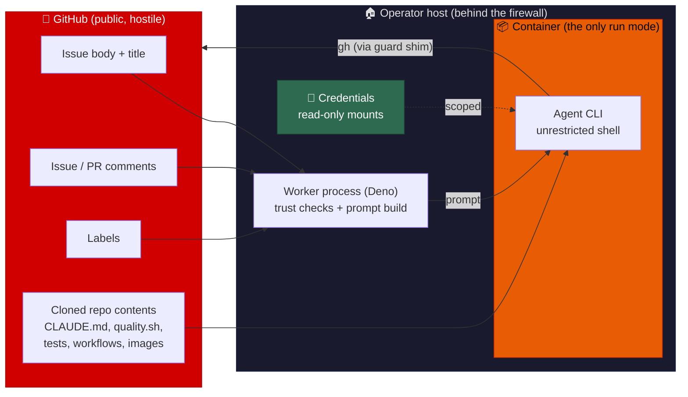
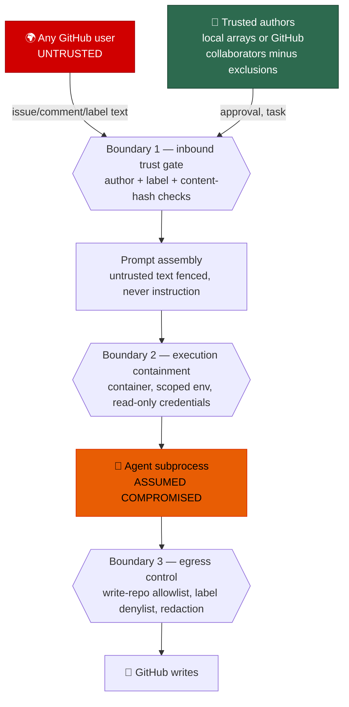

# 🛡️ Threat Model

**Status:** living document. **Audience:** anyone evaluating whether it is safe
to run this software, including readers with no access to this repository's
history.

This is the **design-level** threat model for the Vibe Coder worker: the
assets, the attacker capabilities per surface, the attack paths, the control
that answers each path, and the risks that remain. It is written to stand
alone.

Its companion, [SECURITY.md](../SECURITY.md), is the **operator** document:
what a person deploying the worker must configure, check, rotate and monitor on
their own host, plus the implementation reference for each control named here.
Design questions ("what is trusted, and why is that safe?") belong here;
deployment questions ("what do I set?") belong there.

## 🎯 The risky core

One sentence generates this entire document:

> **Instructions written by strangers on the public internet are fetched from
> GitHub and executed on a machine behind the operator's firewall, by an agent
> CLI running with unrestricted shell access.**

The worker polls GitHub for issues, assembles their text into a prompt, and
spawns an agent CLI (`claude`, or another registered provider) with
`--dangerously-skip-permissions` — no per-command approval, because nobody is
at the keyboard. The agent edits a clone, runs the repository's own quality
gate, and pushes a branch and a pull request using the worker's GitHub
credentials.

Every input on the left of this diagram is attacker-influenceable on a public
repository:

## 💎 Assets

What an attacker is trying to reach. Each asset is referenced by id from the
attack paths below.

| Id | Asset | Why it is worth attacking |
| -- | ----- | ------------------------- |
| **A1** | **Provider credentials and tokens** — the GitHub token or App private key, and each agent provider's API credential | Direct: a stolen token is repository write access and, for the provider key, billable compute |
| **A2** | **The host filesystem and network** | The worker runs inside the operator's perimeter; code execution here reaches whatever that perimeter protects |
| **A3** | **Write access to monitored repositories** | Push branches, open PRs, edit issues and labels — a path to landing attacker code in someone else's project |
| **A4** | **Private repository contents** | Monitored repositories are cloned locally; a public repository in the same fleet is an exfiltration sink |
| **A5** | **Operator telemetry** — worker logs, the audit journal, run statistics, PR and comment bodies | These quote subprocess output, so they are where a secret leaks by accident and where an incident is reconstructed |
| **A6** | **Worker integrity state** — the content-approval snapshot store, the audit journal, the staged configuration | Corrupting these turns a blocking control into a passing one |

## 🔐 Trust boundaries

**Trusted:** the operator's host and the configuration file on it; the
current trusted-author set; the worker's own Deno process.

That trusted-author set is **not** always `allowed_authors`. Under
`author_source: "config"` (the default) it is the local
`allowed_authors` array. Under `"github"` it is each monitored repo's
write, maintain, or admin collaborators, minus the host login,
`service_accounts`, optional `exclusion_team` members, and bot-shaped
logins. Anyone who can grant write access on a monitored repo can
authorise an instructor of the worker. That is the intended design, and
it is a wider set than a hand-edited allowlist.

**Partially trusted:** `authorized_commenters` under `"config"` — they can
trigger PR feedback processing, but they do not widen the egress
boundary. Under `"github"` that key is parsed and ignored for trust; the
derived collaborator set fills both roles.

**Untrusted:** every byte that arrives from GitHub, and — by design — the agent
subprocess itself. See
[The assumption this model holds under](#-the-assumption-this-model-holds-under).

## 🕵️ Attacker capabilities, per surface

Enumerated per GitHub surface the worker reads. "Any user" means any GitHub
account, worldwide, with no relationship to the operator.

| Surface | Who can write to it | Capability it grants an attacker |
| ------- | ------------------- | -------------------------------- |
| **Issue body** | Any user (public repository) | Up to 50,000 characters of arbitrary text placed in the prompt; the primary injection surface |
| **Issue title** | Any user, and editable after posting | Short, high-salience text in the most authoritative position of the issue block |
| **Issue comments** | Any user, unlimited volume | Injection text, context flooding, and forged trust/boundary markers that try to impersonate the prompt's own structure |
| **PR review comments** | Any user on a public PR | The same, on the feedback path — plus, if the account is an `authorized_commenters` entry, the ability to trigger a run |
| **Labels** | Any user with triage permission (a common grant on public repositories) | Add or remove the labels that select routing, priority and processing mode; remove a blocking label to force a re-run |
| **Cloned repository contents** | Anyone who can land a commit, or open a PR whose head branch a run checks out | `CLAUDE.md` / `AGENTS.md` agent instructions, `quality.sh` and everything it runs, test names and assertion messages quoted back into remediation prompts, workflow files, symlinks, and committed images |
| **Attachments and images** | Any user, on any of the above | Text, QR codes or low-contrast overlays aimed at the agent — a channel no text delimiter can fence |
| **Upstream packages and toolchains** | Whoever compromises a registry or release | Code that runs on the host with the worker's own privileges, outside every GitHub-facing control |

## 💥 Attack paths

Each path names the controls that answer it (`C…`, defined in
[Traceability](#-traceability--control--code--test)) and the file where that
answer is enforced.

| Id | Attack path | Assets | Answering controls | Enforced in |
| -- | ----------- | ------ | ------------------ | ----------- |
| **AP-1** | **Prompt injection via issue body/title** → the model treats attacker text as instruction → arbitrary in-container execution | A1–A4 | C1, C4, C5, C11 | `worker/deno/lib/prompt_delimiter.ts` |
| **AP-2** | **Prompt injection via comments**, including forged per-comment trust headers, spoofed boundary markers, and context flooding that dilutes the real task | A1–A4 | C4, C5, C6, C11 | `worker/deno/lib/comment_trust_filter.ts` |
| **AP-3** | **Injection via repository-supplied text** — `CLAUDE.md`/`AGENTS.md` on the branch under work, quality-gate output, a fetched sub-issue body — reaching the model as instruction rather than data | A1–A4 | C7, C8 | `worker/deno/lib/repo_context_reader.ts` |
| **AP-4** | **Image-borne injection (GhostCommit)** — instructions inside an untrusted image, which text fencing cannot reach | A1–A4 | C9 | `worker/deno/lib/suspicious_image_handoff.ts` |
| **AP-5** | **Label abuse** — an untrusted triage actor adds `work-on`/`top-priority` to steer routing and priority, or parks an issue with a blocking label | A3, A6 | C2, C3, C15 | `worker/deno/lib/label_security.ts` |
| **AP-6** | **Unauthorised author / unauthorised commenter bypass** — triggering a run without being on the current trusted-author set | A1–A4 | C1, C2, C3, C29 | `worker/deno/lib/security.ts` |
| **AP-7** | **Edit after approval (TOCTOU)** — a trusted approval is captured, then the body or title is rewritten before the prompt is built | A1–A4, A6 | C10 | `worker/deno/lib/pickup_content_integrity.ts` |
| **AP-8** | **Exfiltration via GitHub writes** — a successful injection posts private repository contents as a comment, PR body or issue in a different, public repository | A4, A5 | C12, C13, C14, C16 | `worker/deno/lib/write_repo_allowlist.ts` |
| **AP-9** | **Exfiltration or denial of service via outbound fetch** — a hostile or hung server streams until the heap is exhausted, or never responds at all | A2, A5 | C17 | `worker/deno/lib/bounded_fetch.ts` |
| **AP-10** | **Supply-chain compromise** — a freshly published dependency, or a hijacked host toolchain release, executes on the host with the worker's privileges | A1, A2 | C18, C19 | `worker/deno/lib/npm_package_age.ts` |
| **AP-11** | **Credential theft from the agent's environment** — the injected agent reads a credential straight out of its own process environment or the credential directory | A1 | C20, C21 | `worker/deno/lib/claude_env.ts` |
| **AP-12** | **Host compromise beyond the work directory** — the agent reads or writes host material that is none of its business | A2, A4 | C21, C22 | `worker/deno/lib/container_launch.ts` |
| **AP-13** | **Secret leakage into a permanent public record** — a token echoed by a subprocess is quoted into a comment, PR body or log that cannot be un-published | A1, A5 | C23, C24 | `worker/deno/lib/secret_redaction.ts` |
| **AP-14** | **Credential drift / identity confusion** — the host's ambient credential resolves to a human account, so worker writes run with that person's broader permissions | A1, A3 | C25 | `worker/deno/lib/identity_guard.ts` |
| **AP-15** | **Committing a secret** — a credential file staged into a commit and pushed to a public repository | A1 | C26 | `hooks/pre-commit` |
| **AP-16** | **Grant write access to instruct the worker** — when `author_source` is `"github"`, adding a write collaborator authorises an instructor. Compromise of the worker token is now trust resolution, not just repo actions | A1–A4 | C1, C25, C29 | `worker/deno/lib/collaborator_permissions.ts` |

## 🔗 Traceability — control → code → test

Every control, the file that implements it, and the test that proves it. A
control with no enforcing test names a gap id instead, and that gap is listed
in [Known gaps](#-known-gaps--controls-with-no-enforcing-test). Both this table
and that list are machine-checked by
`worker/deno/tests/threat_model_docs_test.ts`, which asserts every path cited
here exists.

| Id | Control | Implemented in | Enforcing test |
| -- | ------- | -------------- | -------------- |
| **C1** | Author trust classification — only the current trusted-author snapshot is trusted (`allowed_authors` / `authorized_commenters` under `"config"`, or collaborators minus exclusions under `"github"`); everyone else's content is untrusted data | `worker/deno/lib/security.ts` | `worker/deno/tests/security_test.ts` |
| **C2** | Approval-label origin verification — the approval label counts only when a trusted author added it, verified against the GitHub timeline | `worker/deno/lib/issue_query.ts` | `worker/deno/tests/issue_query_test.ts` |
| **C3** | Operational-label trust verification — routing labels added by untrusted actors are ignored and audited | `worker/deno/lib/label_security.ts` | `worker/deno/tests/label_security_test.ts` |
| **C4** | Nonce-fenced untrusted boundaries with delimiter sanitising and literal (non-`$`-expanding) substitution | `worker/deno/lib/prompt_delimiter.ts` | `worker/deno/tests/prompt_delimiter_test.ts` |
| **C5** | Issue body and title classified, fenced and audited exactly as comments are | `worker/deno/lib/issue_content_trust_filter.ts` | `worker/deno/tests/issue_content_trust_filter_test.ts` |
| **C6** | Comment volume control — total budget, per-comment caps for untrusted authors, count cap, flood audit event | `worker/deno/lib/comment_rate_limiter.ts`, `worker/deno/lib/comment_trust_filter.ts` | `worker/deno/tests/comment_rate_limiter_test.ts`, `worker/deno/tests/comment_trust_filter_test.ts` |
| **C7** | Repository agent-instruction files rendered as fenced advisory context in the user turn, never as system instruction | `worker/deno/lib/repo_context_reader.ts` | `worker/deno/tests/repo_context_reader_test.ts` |
| **C8** | Quality-gate output fenced and redacted before any remediation prompt quotes it | `worker/deno/lib/untrusted_quality_output.ts` | **Gap G1** |
| **C9** | Image injection: detect-and-flag, mapped onto the guarded `needs-human` escalation chokepoint | `worker/deno/lib/suspicious_image_handoff.ts` | `worker/deno/tests/suspicious_image_handoff_test.ts` |
| **C10** | Content-hash approval snapshot, re-verified against the exact bytes sent to the model, judging every editor since approval | `worker/deno/lib/content_approval_tracker.ts`, `worker/deno/lib/pickup_content_integrity.ts`, `worker/deno/lib/issue_edit_actor.ts` | `worker/deno/tests/pickup_content_integrity_test.ts`, `worker/deno/tests/issue_edit_actor_test.ts` |
| **C11** | Suspicious-pattern detection on untrusted text, emitting a `[SECURITY]` audit event (advisory: logs, does not block) | `worker/deno/lib/security.ts` | `worker/deno/tests/security_multiline_3665_test.ts` |
| **C12** | Per-run write-repo allowlist enforced at the worker's single `gh` spawn chokepoint; undeterminable targets fail closed | `worker/deno/lib/write_repo_allowlist.ts`, `worker/deno/lib/gh_spawn.ts` | `worker/deno/tests/write_repo_allowlist_test.ts`, `worker/deno/tests/gh_spawn_test.ts` |
| **C13** | Agent-subprocess `gh` guard — a PATH shim re-applying the same decision, with the allowlist baked in and unknown roots refused | `worker/deno/lib/gh_guard_shim.ts`, `worker/deno/lib/gh_guard_decision.ts`, `worker/deno/lib/gh_guard_cli.ts` | `worker/deno/tests/gh_guard_shim_test.ts`, `worker/deno/tests/gh_guard_decision_test.ts`, `worker/deno/tests/gh_guard_cli_test.ts` |
| **C14** | Mutation classification and pflag normalisation, so attached and repeated flags cannot hide a write's target | `worker/deno/lib/audit_mutation_classifier.ts`, `worker/deno/lib/gh_flag_parser.ts` | `worker/deno/tests/audit_mutation_classifier_test.ts`, `worker/deno/tests/gh_pflag_spellings_test.ts` |
| **C15** | Reserved workflow labels refused in-process before the worker calls the labels API, and stripped when applied by an untrusted actor | `worker/deno/lib/worker_label_guard.ts`, `worker/deno/lib/reserved_label_strip.ts` | `worker/deno/tests/worker_label_guard_test.ts`, `worker/deno/tests/reserved_label_strip_test.ts` |
| **C16** | Tamper-evident audit journal of every classified mutation, including blocked ones | `worker/deno/lib/audit_journal.ts` | `worker/deno/tests/audit_journal_test.ts` |
| **C17** | Bounded outbound fetches — mandatory timeout and streamed size cap on every call | `worker/deno/lib/bounded_fetch.ts` | `worker/deno/tests/bounded_fetch_test.ts` |
| **C18** | Dependency release-age quarantine, verified against the registry and fail-closed on what it cannot read | `worker/deno/lib/npm_package_age.ts`, `worker/deno/lib/bump_age_audit.ts` | `worker/deno/tests/npm_package_age_test.ts`, `worker/deno/tests/bump_age_audit_test.ts` |
| **C19** | Host toolchain upgrades gated on release age and pinned to the version the gate approved | `worker/deno/lib/tool_release_age.ts` | `worker/deno/tests/tool_release_age_test.ts` |
| **C20** | Agent child environment built by denying credential-shaped variables by default | `worker/deno/lib/claude_env.ts` | `worker/deno/tests/claude_env_test.ts` |
| **C21** | Non-interactive credential provisioning into one owner-only directory, mounted read-only per provider sub-directory | `worker/deno/lib/credential_preflight.ts`, `worker/deno/lib/container_launch.ts` | `worker/deno/tests/credential_preflight_test.ts`, `worker/deno/tests/container_launch_test.ts` |
| **C22** | Execution containment — a disposable container with an explicit mount set, no host networking and no published ports | `worker/deno/lib/container_launch.ts`, `worker/deno/lib/container_runtime.ts` | `worker/deno/tests/container_containment_test.ts` |
| **C23** | Secret redaction rules applied per outbound sink, linear-time over untrusted input | `worker/deno/lib/secret_redaction.ts` | `worker/deno/tests/secret_redaction_test.ts`, `worker/deno/tests/secret_redaction_redos_test.ts` |
| **C24** | Structural redaction chokepoints — the patched console, worker `gh` bodies, and agent-authored `gh` bodies including `--body-file` | `worker/deno/lib/console_redaction.ts`, `worker/deno/lib/gh_body_redaction.ts` | `worker/deno/tests/console_redaction_test.ts`, `worker/deno/tests/gh_body_redaction_test.ts` |
| **C25** | Worker identity guard — the authenticated login must match the configured service-account allowlist | `worker/deno/lib/identity_guard.ts` | `worker/deno/tests/identity_guard_test.ts` |
| **C26** | Commit safety — the enforced ignore allowlist plus a fail-closed pre-commit hook that blocks staged credential files | `worker/deno/lib/gitignore_enforcer.ts`, `hooks/pre-commit` | `worker/deno/tests/gitignore_enforcer_test.ts`, `worker/deno/tests/hidden_files_safety_integration_test.ts` |
| **C27** | Repository allowlist and git-URL validation before any clone or query | `worker/deno/lib/config_validator.ts` | `worker/deno/tests/config_validator_test.ts` |
| **C28** | Automated-failure comment path masks secrets before posting | `worker/deno/lib/label_failure.ts` | **Gap G2** |
| **C29** | Fail-closed trusted-author refresh — any collaborator or exclusion-team fetch failure skips the cycle rather than widening trust; `service_accounts` and the host login are excluded so a fleet account cannot authorise itself | `worker/deno/lib/run_core.ts`, `worker/deno/lib/collaborator_permissions.ts`, `worker/deno/lib/trust_exclusions.ts` | `worker/deno/tests/run_core_trust_refresh_test.ts`, `worker/deno/tests/trust_exclusions_test.ts` |

## 🕳️ Known gaps — controls with no enforcing test

Listed rather than omitted. Each is a control that exists in code but that no
test pins, so a refactor could remove it silently.

| Gap | Control | What is unproven | If it regresses |
| --- | ------- | ---------------- | --------------- |
| **G1** | C8 — quality-gate output fencing (`fenceQualityOutput()`) | No test imports `worker/deno/lib/untrusted_quality_output.ts` or exercises the helper, so nothing proves remediation prompts still fence and redact the branch's own test names, assertion messages and linter diagnostics | Attacker-authored text from the branch under repair reaches the model unfenced, and credentials echoed by the quality gate become quotable into a public comment |
| **G2** | C28 — failure-comment redaction | No test imports `worker/deno/lib/label_failure.ts`; the sink is named only in the documentation-standard test, so nothing asserts the posted body is masked | A tokenised remote URL or `GH_TOKEN` in a subprocess tail is published to a permanent, public failure comment |

Closing a gap is a code change with its own issue, not an edit to this
document. This section is the standing list of what is claimed but unproven.

## ⚖️ Residual risks

Accepted, because closing them is impractical or would remove the product's
function. They are stated so a reader can decide whether the trade is one they
accept.

| Id | Residual risk | Why it is accepted |
| -- | ------------- | ------------------ |
| **R1** | **The agent guard is containment, not a sandbox.** An agent that calls the real `gh` binary by absolute path, rewrites `PATH`, or reaches the API without `gh` bypasses C13, and the guard child logs its refusals without journalling them | The durable fix is a per-run GitHub App token scoped to the single target repository; until then the shim raises the cost of the obvious path without claiming to close every path |
| **R2** | **Suspicious-pattern detection is advisory.** C11 logs and never blocks | Blocking on pattern matches would stop ordinary issues that quote an attack; the boundary fencing (C4) is the control that must hold, and it does not depend on detection |
| **R3** | **Sophisticated social engineering.** Plausible, well-formed untrusted guidance that trips no detector | No automated system reliably separates this from genuine community input; the compensating control is that a human reviews every PR before merge |
| **R4** | **Trusted-account compromise.** A compromised trusted-author account has full trusted access. Under `"github"` the instructor set is whoever holds write access, so a write-grant is an instructor-grant | Inherent to any trust-based system; compensated by two-factor authentication, short-lived tokens, tight repository-permission hygiene, and the audit journal |
| **R5** | **A checkout older than Issue #4 can still run a host mode.** The `native` and `seatbelt` opt-ins were removed (containment is mandatory); a fleet host that has not pulled the removal could still launch outside C22 | Current code refuses the removed modes loud and never falls back to the host; the green-gate report counts any host-mode launch record as NOT GREEN, so a stale host is visible rather than silently uncontained |
| **R6** | **Repository-supplied build scripts execute.** The agent runs the monitored repository's own `quality.sh` and its test suite | Running the repository's gate is the product; the boundary that must hold is containment (C22) and egress control (C12, C13), not the contents of that script |
| **R7** | **The model is not deterministic.** No prompt-level control can guarantee an instruction is never followed | Which is exactly why the boundaries below the prompt exist — see the next section |
| **R8** | **Worker-token compromise now includes trust resolution.** A stolen worker token can list collaborators and, with a write-grant, add an instructor. A failed fetch does not widen trust (C29), but a successful fetch as the attacker does | Accepted when choosing `"github"`: GitHub's permission model *is* the allowlist. Compensate by scoping the token, rotating it, and treating collaborator-admin as a privileged role |

## 🧨 The assumption this model holds under

> **The model must hold assuming the agent inside the container is fully compromised.**

Prompt-level controls (C4–C9, C11) reduce the probability that untrusted text
becomes instruction. They are not the boundary. The boundary is everything that
holds *after* the agent has already been persuaded:

- it may only write to the repositories on the run's allowlist (C12, C13),
- it may not apply reserved workflow labels (C15),
- its writes are classified and journalled (C14, C16),
- its bodies are redacted before publication (C24),
- it never sees a credential it does not need (C20), and the ones it does see
  are read-only mounts of a single provisioned directory (C21),
- it runs in a disposable container with an explicit mount set, no inbound
  ports and no host networking (C22).

A change that weakens one of these in exchange for a stronger prompt-level
defence is a bad trade, and this document exists to make that visible.

## 📌 Change process

- **A new inbound surface** — anything new that the worker reads from GitHub or
  from a clone — needs a row in
  [Attacker capabilities](#-attacker-capabilities-per-surface) and an attack
  path, before it ships.
- **A new control** needs a row in
  [Traceability](#-traceability--control--code--test) naming its code and its
  test; with no test, it needs a gap id instead.
- **A removed or renamed file** breaks
  `worker/deno/tests/threat_model_docs_test.ts`, which is deliberate: the model
  fails loudly rather than rotting quietly.

Vulnerability reports follow the
[responsible disclosure policy](../SECURITY.md#-responsible-disclosure-policy).
