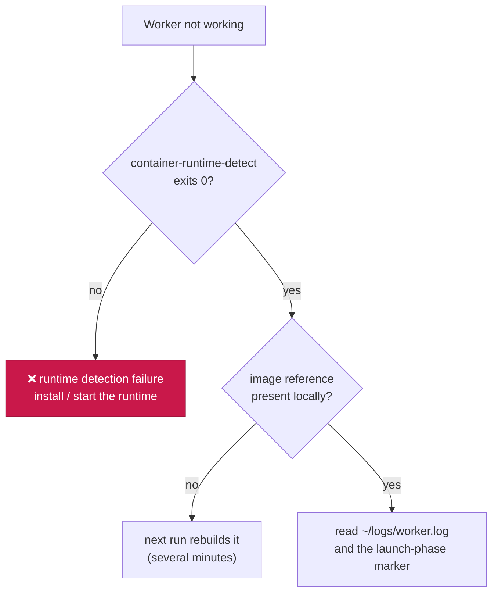
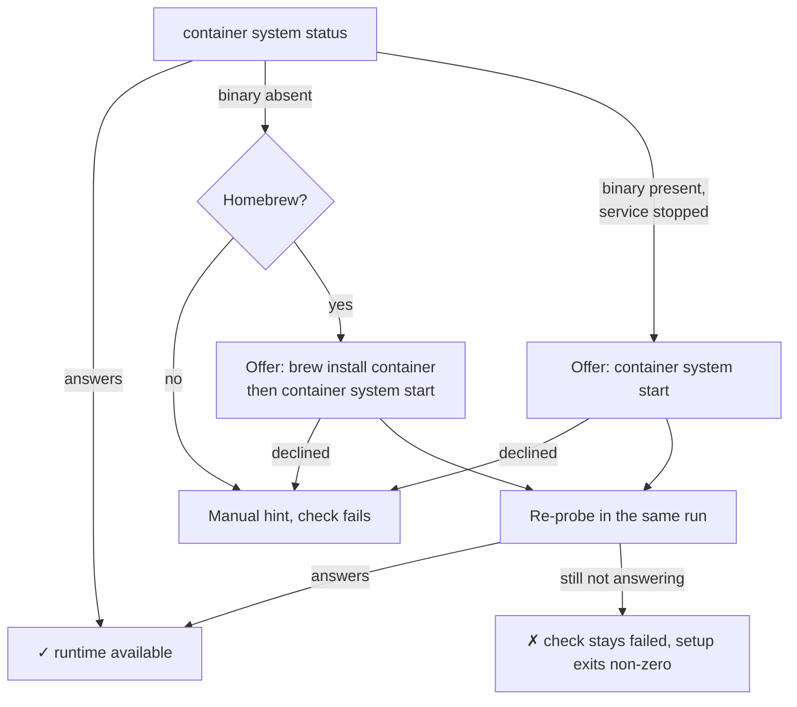
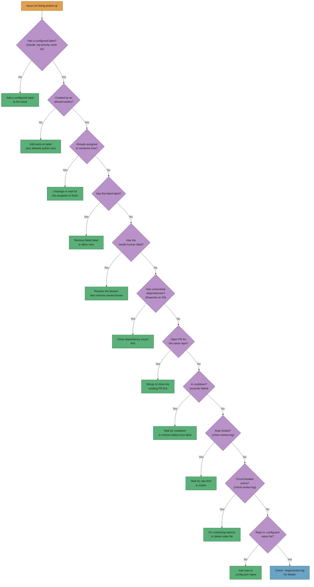

# 🔧 Troubleshooting

Common issues and their solutions. For a quick overview, see the
[main README](../README.md).

## 🐳 The worker runs in a container — where to look first

The worker runs inside the container image — `container` is the default and
the only run mode (Issue #4) — so host-level diagnosis starts with the runtime,
the image and the mounted log
directory ([Containment](CONTAINMENT.md), [Container Image](CONTAINER.md)).
Everything below is run on the host, from the checkout — no `exec` into the
container is needed.

**Check the run-mode setting first.** A `.config.json` (or `VIBE_RUN_MODE`)
that still names one of the removed host modes — `native` or `seatbelt`, gone
since Issue #4 — stops every launch before anything runs, with the removal
explained. Ask the launcher what this host resolves to; the only good answer
is `container`:

```bash
deno run --allow-env --allow-read worker/deno/mod.ts run-mode   # container
```

Nothing is ever coerced: a removed or misspelled mode is a loud failure, never
a container run the operator did not know they were getting — and a missing
container runtime never falls back to the host.



### Which image is this host meant to run?

The tag is a hash of the container definition, so a changed definition is a
different image:

```bash
deno run --allow-env --allow-read worker/deno/mod.ts container-image-hash
# vibe-coder:941c9bfe80fa

docker image inspect "$(deno run --allow-env --allow-read worker/deno/mod.ts container-image-hash)"
# Apple container: container images inspect <reference>
```

### Forcing a rebuild

The launcher rebuilds only when the reference is **absent locally**, so the way
to force a rebuild is to delete the image and run the launcher again:

```bash
IMAGE="$(deno run --allow-env --allow-read worker/deno/mod.ts container-image-hash)"
docker image rm "$IMAGE"        # podman image rm / container images delete
./run.sh
```

A rebuild takes several minutes. If the build itself fails, `run.sh` records
`image_build` in `${VIBE_STATE_DIR:-~/.vibe-coder}/last-launch-phase`, and the
self-heal escalation reports that phase through GitHub after two consecutive
failures.

### Where a launcher failure is reported

A launcher that fails before claiming work has no issue to comment on, so the
escalation files (or comments on) an issue in the worker's own repository,
titled `Vibe Coder launcher failing on <host> (<phase>)` — one issue per host
per phase, updated on the decaying re-notify schedule rather than re-filed
(Issue #556). A crash *during* an issue still reports on that issue. If neither
channel can deliver, the attempt is queued and the streak carries it, and
`self-heal-summary` shows it as `escalation_undeliverable` — a host that cannot
report is itself the thing to look at.

### The image store is filling the disk

It should not: every launch prunes each `vibe-coder` tag other than the one this
checkout resolves to, and names what it removed on the host log (
see [Container Image](CONTAINER.md#superseded-tags-are-pruned-every-launch)).
If old tags are still there, the prune is failing rather than idle, and the
launcher log says why:

```bash
grep container-image-prune ~/logs/cron.log | tail -n 20
```

A build that dies mid-export with "No space left on device" is the same symptom
seen from the other side. Check what the store actually holds, and remember the
**builder cache** is deliberately never pruned — it is what keeps a
definition-change rebuild cheap, and it is the operator's call to clear:

```bash
docker image ls        # container image list / podman image ls
docker builder prune   # operator-only: the launcher never touches the cache
```

### Where the logs land on the host

The container writes to `/home/vibe/logs`, which is the host's `~/logs` mounted
read/write — so the usual files are read on the host exactly as before:

```bash
tail -n 200 ~/logs/worker.log      # worker activity (symlink to the latest run)
tail -n 50 ~/logs/cron.log         # launcher output under cron
cat ~/.vibe-coder/last-launch-phase # runtime_detection | image_build | volume_init | container_run
```

`.config.json` is likewise the host's own file. The workspace is not: the
repositories live on the `vibe-work` named volume, mounted at
`/home/vibe/auto-issue-work` inside the container, so there is no
`auto-issue-work` directory to look for on the host — `WORK_DIR` has no host
default. Everything else the container writes is disposable and gone at the
next launch.

### A container that stopped answering (exit 87)

A container VM can wedge: `<runtime> exec` hangs, nothing new appears in
`~/logs/worker.log`, and the host-side `container run` client never exits. The
launcher no longer waits on it for ever — past the plan's
watchdog deadline it kills the container, SIGKILLs the host-side client and
runtime helper if the record survives that, and exits `87`:

```text
[run.sh] watchdog: vibe-coder-66770 is still running after 11400s - reaping it
Error: container vibe-coder-66770 wedged past the 11400s watchdog deadline and was reaped - exiting 87 so the next cycle runs
```

Nothing to do by hand: the next cycle launches a fresh container, and any
leftover `vibe-coder-*` container is reaped before it. Check whether the host
is wedging repeatedly — a chronic offender needs the runtime itself looked at:

```bash
deno run worker/deno/mod.ts self-heal-summary | grep container_wedged
```

### What a runtime-detection failure looks like

With no supported runtime, the launcher exits non-zero **before** doing
anything else — there is no host mode to switch to (Issue #4), so the
worker does not run at all:

```text
No supported container runtime is available on darwin.

Probed:
  - Apple container (container): `container` was not found on PATH

To fix this, install and start one of:
  - Apple container: install Apple container from https://github.com/apple/container and run `container system start`

Container mode has no host fallback (Issue #4): containment is mandatory, so this fails rather than running the worker on the host. Install a supported runtime (./setup.sh offers to) and launch again.
Error: cannot launch the Vibe Coder container (see above)
```

Reproduce the same decision directly:

```bash
deno run --allow-run --allow-env worker/deno/mod.ts container-runtime-detect
# /usr/local/bin/docker

OUTPUT_JSON=true deno run --allow-run --allow-env \
  worker/deno/mod.ts container-runtime-detect   # the whole descriptor
```

Presence on `PATH` is not availability: the probe contacts the daemon
(`container system status`, `docker version`, `podman version`) and a binary
whose daemon is stopped — or which does not answer within 15 seconds — is
reported unavailable. Start the runtime (`container system start`, the Docker
daemon, `podman machine start`) and re-run the probe — or run `./setup.sh` in a
terminal and accept its offer to do it for you. Under cron or launchd, also
confirm the runtime resolves on the unattended `PATH`.

### macOS: setup offers to fix it

On a terminal, `./setup.sh` offers to repair the macOS runtime itself, and the
two failure modes get different offers — a stopped service never triggers a
reinstall:



The re-probe decides the outcome, never the steps: a `brew install` that exits
zero but leaves the service unable to answer is still a failed check
. Without Homebrew nothing is offered and nothing is run — setup never
downloads a `.pkg` or an installer script. `VIBE_NO_AUTO_INSTALL=true` keeps
the report without the offer, and a non-interactive run (no TTY) never prompts —
in both cases the report says the offer was withheld and why (Issue #33), and
`./setup.sh --auto-install` consents in advance so a scripted run still installs.

### Linux: setup offers Docker, then Podman

The same offer runs on Debian/Ubuntu in the probe's own preference order —
Docker (`sudo apt-get install -y docker.io`) first, Podman only if Docker is
declined or has no plan, and one runtime is ever acted on. A binary that is
present but not answering is started (`sudo systemctl start docker`,
`podman machine start`) rather than reinstalled, and every sudo command is
shown in the prompt before it runs.

A fresh `docker.io` leaves you outside the `docker` group, so the re-probe
still fails with a permission error: setup reports it with the
`sudo usermod -aG docker "$USER"` plus re-login instruction and **never** edits
group membership itself. On a non-apt distribution nothing is offered and the
manual hints stand.

## 🌳 Every cycle logs `Checkout update failed` and the fleet runs stale code

The **launcher** updates the worker checkout to its default branch (read from
`origin/HEAD` — the example below shows `main`) on the host before each
container launch, and says so loudly when it cannot (Issues #512, #513). The
run still starts — on whatever the checkout already holds — so the symptom is
a host stuck on an old commit, with this in `~/logs/run_core.log` every cycle:

```text
Updating /Users/vibe/VibeCoder to origin/main
Checkout update failed: cannot update /Users/vibe/VibeCoder to origin/main:
git checkout main failed (exit code 1) — the worker checkout looks like an
active development tree (branch fix/x, 3 uncommitted change(s)). Commit or
stash that work, or give the worker its own dedicated clone.
```

The usual cause is exactly what the message says: the worker's clone is
doubling as somebody's development tree. Commit or stash the in-flight
work — or better, move development elsewhere and leave the appliance clone
alone (see [Deployment — dedicated clone](DEPLOYMENT.md#the-worker-needs-its-own-dedicated-clone)).
After three consecutive failures the host also files (or comments on) a
`Worker checkout update failing on <host>` issue against the worker
repository, so the stuck host is visible from GitHub rather than only in host
logs. The streak counter lives at `~/logs/checkout-update-failure-streak` and
resets on the first successful update. A checkout that is *meant* to be left
alone — a development tree, a CI merge commit — should set
`VIBE_SKIP_CHECKOUT_UPDATE=1` instead, which skips the update loudly and
raises nothing.

On a host running `update_mode: "frozen"` the same warning appears with a
different message (Issue #624):

```text
pinned_ref v9.9.9 does not resolve in /path/to/checkout — correct pinned_ref
in .config.json (it takes a commit SHA or a tag that exists on origin), or set
update_mode to "dynamic"
```

The pin is what the host is meant to run, so the launch continues on the
checkout it already has. Correct `pinned_ref` in `.config.json` — a tag has to
exist on `origin`, not only locally — or flip `update_mode` back to `dynamic`.
Three such runs escalate through the same streak above. A frozen host that is
working says so on every launch:
`Checkout update skipped: update_mode=frozen, pinned to <ref>` in
`run_core.log`.

## 🔔 "A new release of Vibe Coder is available"

A frozen host pinned behind the newest release says so once per launch, on
stderr and in `run_core.log` (Issue #690):

```text
A new release of Vibe Coder is available: 1.0.4 → 1.0.5. Run ./run.sh upgrade to install it.
```

Nothing is wrong and nothing has changed: the pin is still what the host runs,
and the notice is only telling you a newer release exists. Move the host when
you choose to — see
[Configuration — New-Release Notice](CONFIGURATION.md#-new-release-notice).

The check itself can fail, and never blocks a launch:

```text
[run.sh] warning: could not check for a newer release (status 1) - gh release
list failed with exit code 1: …
```

The launch continues on the checkout the host already has. The usual causes are
an unreachable GitHub or a `gh` that is not authenticated on the host — the
same material the launcher's other `gh` calls use.

### The notice never appears

Silence is the normal case, and it has four causes worth checking in this
order:

1. **The host is dynamic.** `update_mode` is `dynamic`, or absent and therefore
   loaded as `dynamic`. Such a host installs the newest release at every launch,
   so there is nothing to tell it. `grep update_mode .config.json` answers this
   one.
2. **The pin is a commit SHA.** A SHA cannot be ordered against a release tag,
   so the check stays silent rather than guessing. Pin to a release tag to be
   notified — see
   [Configuration — Choosing a pin](CONFIGURATION.md#choosing-a-pin).
3. **The host is already on the newest release**, or the repository has no
   `MAJOR.MINOR.PATCH` releases yet. Pre-releases and moving names such as
   `latest` are not part of the series.
4. **The check failed.** That is never silent: look for the
   `[run.sh] warning: could not check for a newer release` line above on stderr,
   and the matching `release-notice: failed …` line in `run_core.log`. Both
   land on every launch that could not complete the check.

Every warning line from this path goes to **both** places — stderr for whatever
launched the host (a cron log, a LaunchAgent log) and `~/logs/run_core.log` for
the record — so a host launched from cron still leaves the evidence behind.

### `./run.sh upgrade` says the release records no tool versions

```text
Release 1.0.5 carries no tool-versions.json asset — it was minted before
releases recorded the tool versions they ship with. Moving pinned_ref to 1.0.5
without the versions it ships with would leave this host partially pinned, so
nothing was written and /path/to/.config.json is unchanged. Pin an earlier
release that carries tool-versions.json, or cut a new one.
```

The newest release predates the tool-version manifest (Issue #688), so there is
nothing to pin the three tools to. The refusal is deliberate and complete:
`.config.json` is byte-identical afterwards, never a fresh `pinned_ref` beside
stale tool versions. Either pin an earlier release that does carry
`tool-versions.json`, cut a new release so the manifest is published, or move
the host by hand — see
[Configuration — Moving a pin by hand](CONFIGURATION.md#moving-a-pin-by-hand).
The manifest itself, and how a red publish step is re-run, are
[Release tagging — the tool-version manifest](RELEASE-TAGGING.md#the-tool-version-manifest).

The same all-or-nothing refusal covers an unreachable GitHub and a pin the
validator rejects: the command writes all four values or none of them.

## 🔐 The worker exits on a credential preflight error

The worker reads credential *files* and never an interactive login or a host
credential store, so `gh auth login` and an interactive
coding-agent login are not the fix — they are not even on the runtime path. The
preflight aborts before any work with a named cause: `credential-dir-missing`,
`credential-dir-empty`, `credential-dir-unreadable`, `github-credentials-missing`,
`provider-credentials-missing`, `credential-permissions-too-open`, or
`unexpected-credential-material`.

Re-provision the directory non-interactively from the host:

```bash
VIBE_LAUNCHAGENT_GH_TOKEN="ghp_your_token" \
VIBE_LAUNCHAGENT_ANTHROPIC_API_KEY="sk-ant-your_key" \
./setup.sh
```

The directory (`~/.vibe-coder/credentials`, `0700`, files `0600`) is mounted
read-only into the container one sub-directory at a time. See
[Credential Provisioning](DEPLOYMENT.md#-credential-provisioning-non-interactive).

## 🔧 A worker tool appears to be missing

`gh`, `jq`, `timeout`, the coding-agent CLI and the monitored repositories'
toolchains live **inside the image**, not on the host — installing them on the
host changes nothing. A tool reported missing at run time means the image is
stale or the wrong image is running: compare the running image with the
reference `container-image-hash` prints, then force a rebuild as above.

Host `PATH` still matters for the launcher itself: cron and launchd provide a
minimal environment, and `run.sh` must find `deno` and the container runtime. It
appends `/opt/homebrew/bin:/usr/local/bin:/usr/bin:/bin:/usr/sbin:/sbin` to the
caller's `PATH` and also probes `~/.deno/bin/deno`. When either tool lives
somewhere else, set `PATH` in the crontab entry itself:

```bash
*/5 * * * * PATH=/opt/custom/bin:/usr/bin:/bin /path/to/VibeCoder/run.sh >> ~/logs/cron.log 2>&1
```

## 📦 Dependency bumps never land on one host

A missing tool on the unattended `PATH` is silent by nature — the run still
succeeds, only the bump is dropped. Symptoms and remedies:

| Symptom                                                                    | Likely cause                                                                                        | Remedy                                                                                                                                                            |
| -------------------------------------------------------------------------- | ----------------------------------------------------------------------------------------------------- | ------------------------------------------------------------------------------------------------------------------------------------------------------------------ |
| Bumps land on every host except one; PRs from that host carry no dep bump   | The repo's `bump-deps.sh` failed its tool pre-flight, so the bump was reverted as `rejected_by_script` | The rejection WARNING is followed by a `bump-deps.sh output tail (last 20 lines)` block in `~/logs/worker.log` (secret-redacted) — read it for the cause (e.g. `ERROR: deno is required`), then confirm the tool resolves on that host's unattended `PATH` |
| A repo gets an auto-filed `bump-deps.sh` fails on every run issue | The script was rejected on 3 consecutive runs, so bumps are effectively disabled for that repo | Fix the script in that repo — the issue body carries the redacted output tail. Apply `work-on` to schedule it; the streak clears (and the worker stops reporting) as soon as the script exits `0` again |
| `ERROR: deno is required` from `bump-deps.sh` on a launchd/cron host        | Deno was installed by the official installer into `~/.deno/bin`, which the unattended `PATH` omits     | Confirm `~/.deno/bin/deno` exists; the bootstrap adds that directory to the driver and to spawned repo scripts, so a stale checkout of the worker is the usual cause  |
| A bump is reverted as `rejected_by_quarantine` | `bump-deps.sh` picked a version published inside `VIBE_BUMP_QUARANTINE_HOURS` (default 24h) | Expected — the embargo held. Re-run once the release has aged past the window, or fix the repo's script to honour `VIBE_BUMP_QUARANTINE_HOURS` itself |
| `[bump-deps] Ignoring VIBE_BUMP_QUARANTINE_HOURS=…` in the log             | The window was set to `0`, a negative, fractional, or non-numeric value; it fell back to 24h           | Set the variable to a positive whole number of hours, or unset it. `0` does **not** disable the embargo — there is deliberately no silent off switch                 |
| `Refusing screenshot setup: pinned npm package(s) did not clear the dependency-update quarantine window` | Either the pinned Playwright version was published inside the window, or its publish time could not be resolved (registry unreachable, 5xx, unknown version) — the message quotes which | The gate is fail-closed by design; re-run `setup.sh` once the npm registry is reachable, or wait for / re-pin a version that has aged past the window. There is no opt-out — an unverified version would otherwise be installed under `--allow-all` |

See [Deployment — note on cron `PATH`](DEPLOYMENT.md#-recommended-using-cron-5-minute-intervals)
for what the bootstrap covers.

## 🔍 Worker not picking up issues

**Quick diagnosis:** Run the `diagnose-repo` Deno command to get a detailed
report of why each issue is blocked:

```bash
cd worker/deno && deno run --allow-all mod.ts diagnose-repo --repo owner/repo --github-user github_user
```

This analyses all labelled issues in the repository and reports blocking reasons
(assignment, labels, cooldown, PR blocking, dependencies, sub-issues, milestone
occupancy) with actionable suggestions.

**Manual checklist:**

- Check the issue has one of the configured labels (`top-priority` or `claude`
  by default — label order determines priority)
- Check the issue is created by `ALLOWED_AUTHOR`
- Check the issue is not already assigned (unless assigned to the worker itself)
- Check there's no open PR for that repo (worker waits for PR review before
  starting new work)
- Check the issue doesn't have the `failed` label (permanently failed issues are
  skipped)
- Check the issue doesn't have the `needs-human` label (issues escalated to a
  human are skipped until the label is removed — see
  [Worker escalation via `needs-human`](USAGE.md#-worker-escalation-via-needs-human))
- **Check the worker log** at `~/logs/worker.log` for diagnostic information
  showing:
  - How many issues were returned from GitHub API
  - How many were filtered out due to being assigned to other users
  - How many were filtered out due to having the `failed` label
  - Summary when all issues were filtered out explaining why

### Diagnostic decision tree

Use the following flowchart to quickly identify why the worker is not picking up
an issue:



## 🛰️ Host reports unhealthy — `repos inaccessible`

The per-iteration health gate has a third condition alongside Claude health and
GitHub auth: **can this identity still see the repos it is configured to
monitor?** (incident.) When two consecutive issue-list probes
for a repo come back 404 / permission-denied, the host is marked unhealthy and
the repos are named on two surfaces:

- **Worker log** (`~/logs/worker.log`) — one greppable line per iteration:

  ```text
  [repo-access] host=host-3 status=inaccessible repos=TitlePage/bar,TitlePage/foo consecutive=2 — host marked unhealthy; continuing this cycle for the repos that remain accessible
  ```

  ```bash
  grep '\[repo-access\]' ~/logs/worker.log | tail -n 5
  ```

- **private-repo-6 dashboard** — the healthy heartbeat is suppressed, so the host's
  row goes **stale** instead of reporting green, and the end-of-run report
  carries `--message "repos inaccessible: TitlePage/bar, TitlePage/foo"`.

**What it means.** The worker authenticated fine — this condition sits *after*
the Claude and `gh auth` checks — but the account it authenticated as cannot see
the named repos. In the host-3 incident that was identity drift: valid
credentials for the wrong user. Rate limiting is not this condition: a 403
throttling response or a 429 is classified as transient and never counts towards
the threshold.

**What the worker keeps doing.** Unlike the first two conditions, this one does
**not** skip the cycle. The worker carries on scanning and working every repo
that is still accessible; only the health signal changes. Nothing is filed or
escalated automatically.

**Recovery is automatic.** One successful probe clears the repo's counter, so
the next iteration reports healthy again — no operator action, no restart.

**First thing to check — the worker identity** (see
Switching the Worker GitHub Identity,):

```bash
# Use the host's configured gh config dir if .config.json sets one.
gh auth status
gh issue list --repo <named repo> --limit 1
```

1. **Wrong identity** — `gh auth status` shows an account other than the
   expected service account, or the named repo 404s for it. On hosts with no
   `gh_config_dir` the ambient `gh` config is used, so a stray `gh auth switch`
   from any tooling on the host silently re-points the worker.
   Re-authenticate with `./switch-worker-identity.sh --user <service-account>`.
2. **Access never granted** — the repo is private, or newly added, and the
   service account is not a collaborator. Grant access, or remove the repo from
   the `repos` list in `.config.json`.
3. **Org SSO not authorised** — the token exists but has not been authorised for
   the organisation. Authorise it in the GitHub SSO settings for that org.
4. **Repo renamed or deleted** — fix or drop the entry in `.config.json`.

**Two states are themselves defects — raise an issue against the Vibe Coder if
you see either:**

- The host is unhealthy but **no repos are named** on the log or the dashboard
  payload — the operator has nothing to act on.
- The named repos probe successfully again but the host **stays unhealthy** —
  recovery is meant to need no intervention.

## 🎯 Milestone issues not being picked up

- Ensure the milestone is **open** (not closed) on GitHub
- Check each issue is assigned to the milestone via the sidebar
- Check each issue has one of the configured labels (`claude`, `top-priority`,
  or `work-on`)
- The worker processes one milestone issue at a time — if there is an open PR
  targeting the milestone branch, the next issue will wait until it is merged
- Check the worker log at `~/logs/worker.log` for milestone-specific messages

## ⚠️ Milestone branch has merge conflicts

The worker syncs the milestone branch with the default branch before starting
each new issue. If a merge conflict occurs during sync, the worker aborts the
merge and logs the conflict. To resolve:

1. Manually merge the default branch into the milestone branch and resolve
   conflicts
2. Push the resolved milestone branch
3. The worker will continue processing on the next scan

For more milestone troubleshooting, see the
[Milestone Workflow Guide](workflows/milestones.md#decision-points-and-exceptions).

## 🤫 Silent failures (Claude completes but produces invalid or empty output)

Sometimes Claude completes without error but produces no useful changes. Common
causes and remedies:

| Symptom                                    | Likely cause                                       | Remedy                                                                              |
| ------------------------------------------ | -------------------------------------------------- | ----------------------------------------------------------------------------------- |
| Claude exits 0 but no files changed        | Issue is ambiguous or already resolved             | Check issue description for clarity; add more detail                                |
| PR created with empty diff                 | Claude misunderstood the task scope                | Review the prompt template version; add `custom_instructions` for the repo          |
| `.pr_response_message` is empty            | Claude did not create the summary file             | Check Claude output in `~/logs/worker.log` for errors during execution              |
| Quality gate passes but CI fails           | Claude fixed the wrong thing                       | Review the annotations in the CI check run; the fix may address a different failure |
| Claude output is truncated                 | Hit `claude_timeout` or `claude_no_output_timeout` | Increase timeout values in `.config.json` or simplify the issue scope               |
| Commit message present but no code changes | Claude determined no changes were needed           | Check the PR comment — Claude explains why no changes were made                     |
| Run fails with `out_of_memory` (OOM)       | Claude exhausted heap memory (exit 137)            | Terminal by design — the worker errors out fast (not a rate-limit pause). Reduce issue scope or increase host memory; see INTERNALS "Out of memory is terminal" |

**Diagnosing silent failures:**

1. Check `~/logs/worker.log` for the Claude execution section — look for exit
   code, duration, and output size.
2. Check for rate limit messages (`rate limit`, `429`, `credit`, `quota`) which
   may cause early termination.
3. If the issue recurs, add `custom_instructions` to the repository config with
   hints for Claude.
4. For persistent silent failures on a specific issue, the worker applies the
   `failed-once` label after the first failure and `failed` after the second,
   preventing infinite loops.

## 💳 Rate limits and subscription usage limits

Two different things, handled two different ways:

- **Rate limit / overloaded** (API burst: `rate limit`, `429`, `overloaded`,
  `529`, credit/quota wording): a short jittered back-off, then a retry, then
  the model-fallback ladder. Transient — the right response is to wait a
  little and try again.
- **Usage limit** (the Max subscription's 5-hour / weekly window: `Claude
  usage limit reached`, `You've hit your limit`, `5-hour limit`, `weekly
  limit`, `out of extra usage`): **terminal for the call**. The worker does
  not retry and does not fall back to a cheaper model — the window is
  account-wide, so every model bills the same exhausted budget. It parses the
  reset time from the message when there is one (`resets 3am`, `|<epoch>`),
  writes the durable `.rate_limit_signal` in `WORK_DIR` for that long (an
  hour when no time is given), and the main loop pauses agent work until the
  window resets. Every other worker on the same volume sees the signal and
  waits too. The issue is **not** blamed: the failure classifies as
  infrastructure, so it keeps its `failed-once` retry rather than being
  labelled failed.

Both stderr and stdout are scanned — the CLI writes refusals to stderr, and a
refused run has no stream-json result on stdout at all.

The agent **health check** returns the same classification: a limited probe
writes the signal instead of the loop re-running a billed probe every 30 s for
the whole window.

Look for `USAGE_LIMIT` / `RATE_LIMIT` security-log lines and `Rate limit signal
active — pausing until reset …` in the worker log.

## 🔌 Circuit breaker activated (worker backing off)

The worker includes a rate-limit circuit breaker that activates
when all issues across all repos fail consecutively. When active:

- The worker increases its sleep interval exponentially (30s → 60s → 120s → 240s
  → 300s max)
- Log messages include `[CIRCUIT_BREAKER]` prefix
- State persists across restarts via a file at `WORK_DIR/.circuit_breaker_state`

**To resolve:**

- Check `~/logs/worker.log` for the underlying failure cause (e.g., rate limits,
  network issues, auth expiry)
- The circuit breaker resets automatically on any successful issue processing
- To force a reset, delete the state file: `rm WORK_DIR/.circuit_breaker_state`
- The threshold before activation is configurable via
  `circuit_breaker_threshold` in `.config.json` (default: 3 cycles)

## 🔁 Worker keeps retrying a failing issue

The worker tracks failure counts per issue using persistent state.
If an issue fails:

1. **First failure** — `failed-once` label applied, issue unassigned, retried on
   next scan
2. **Second failure** — `failed` label applied, issue permanently skipped

Failure state survives worker crashes and restarts. If you want the worker to
retry:

- Remove the `failed` label to allow two fresh attempts
- Check the issue comments for crash reports or error details
- The issue retry cooldown (`issue_retry_cooldown`, default: 600 seconds)
  prevents immediate re-attempts of recently failed issues

## 🤝 Worker stopped looking at an issue and posted a `needs-human` comment

When the worker cannot complete an issue autonomously, it adds the `needs-human`
label and stops retrying. Typical triggers:

- Credentials or access only a human can grant are required.
- A product or architectural decision only a human can make is blocking
  progress.

**Why the worker is not picking it back up:** discovery excludes any issue
carrying `needs-human` — this is by design so the worker does not loop on a task
it has explicitly handed back. See
[Worker escalation via `needs-human`](USAGE.md#-worker-escalation-via-needs-human).

**To resume work:**

1. Read the worker's escalation comment to understand the blocker.
2. Perform the action the comment requests (e.g. supply credentials, answer the
   product question).
3. Remove the `needs-human` label.
4. Ensure the issue still carries a configured label (`top-priority`, `claude`,
   or `work-on`) and is unassigned (or assigned to the worker). On the next scan
   cycle the worker will pick it up again.

> **📝 Note:** The worker never self-applies `top-priority` as an escalation
> signal — that label is strictly a human scheduling signal. If you see
> `top-priority` on an issue, a human added it.

## ⏱️ Operations timing out

If you see timeout-related errors in the logs, the worker wraps all GitHub CLI
and git operations with configurable timeouts (60 seconds default, 120 seconds
for merge/rebase). If operations are consistently timing out:

- Check your network connection
- Check GitHub's status page (githubstatus.com)
- Consider increasing timeout values if you're on a slow connection

The worker distinguishes timeouts from other failures and logs them clearly, so
you can tell whether an operation hung or genuinely failed.

## ⏳ Why did this run take three hours?

Nothing is wrong. The cycle deadline stops *new* claims; it does not kill work
already in flight, and `progress_extension_enabled` is **on by default**
(Issue #422), so a claim that keeps progressing keeps running. The whole model
— soft claim gate, untruncated budget, extensions, hard-cap kill with the work
in progress preserved — is on one page:
[The cycle-deadline model](CONFIGURATION.md#-the-cycle-deadline-model).

So a run past `claude_timeout` means the deadline was re-armed while the run
kept making progress. Reconstruct what happened from three places:

1. **The grants** — one line per extension in `worker-*.log`:

   ```bash
   grep '\[progress-extension\]' ~/logs/worker-*.log
   ```

   Each names the reason, the elapsed time, the extension count and the new
   deadline. `not extending after …` is the check that finally refused.

2. **The kill line** — states the truth rather than the configured budget:

   ```text
   Claude timed out after 5640s: base budget 3600s extended 4× by 2040s
   (final deadline 5640s); last extension refused: working tree unchanged
   despite tool activity 31s ago — killing process tree (PID 1234)
   ```

   The clause after the semicolon is the signal that stalled: stale tool
   activity, an unchanged working tree *with no descendant process doing work*
   (`working tree unchanged and no descendant process doing work (external
   idle) despite tool activity 31s ago`, Issue #508), or a working-tree probe
   that could not answer (`unknown` is never treated as progress). A trailing
   `Ns late` is the starved-timer signal and is measured against the **final**
   deadline — an extended run that dies on time reports no lateness.

3. **The issue** — the failure comment carries the same extension history, and
   the `## Issue run model stats` comment carries a **Deadline extensions**
   line, so extension frequency is reviewable across issues.

If the count looks unreasonable, lower `progress_extension_grant_seconds` (each
grant is shorter, so a stall is caught sooner), tighten
`progress_extension_stall_seconds`, or set `progress_extension_enabled` to
`false` to restore the unconditional one-hour kill. There is deliberately no
ceiling on the *number* of grants — the concurrency slot pool bounds the blast
radius to one slot — but there is one on wall clock: every grant is bounded by
the supervisor's cap (Issue #421).

### The hard cap was what stopped it

The cap is the **only** place a still-progressing agent is killed, and it is an
orderly stop: the ceiling holds back a reserve for the kill grace and the WIP
commit-and-push, so the work in progress is committed and pushed before the
supervisor's SIGTERM and the next cycle resumes it. Three log lines, in the
order they appear:

1. **The ceiling, at run start.** Grep `Run hard cap:` — it reports the cap
   *this* run is under, which is the number to trust rather than any figure
   copied into documentation:

   ```bash
   grep 'Run hard cap:' ~/logs/worker-*.log
   ```

   ```text
   Run hard cap: VIBE_RUN_MAX_SECONDS=10800s from run start; progress
   extensions may not push the deadline past 10650s elapsed (150s reserved
   for the kill grace and the WIP commit-and-push), leaving 10500s of runway
   ```

2. **A clamped grant**, normally the last one granted. The cap does not refuse
   a grant that would cross it — it shortens it, so the run uses the runway it
   has:

   ```bash
   grep 'grant clamped to the run hard cap' ~/logs/worker-*.log
   ```

   ```text
   [progress-extension] extending after <elapsed>s (extensions granted 4):
   grant clamped to the run hard cap: 200s of runway left, not the full 900s
   ```

3. **The refusal.** With no runway left the check refuses and the run stops
   itself:

   ```text
   [progress-extension] not extending after 10650s (extensions granted 5):
   run hard cap reached — no runway left before the supervisor terminates this
   run, so stopping now to preserve work in progress
   ```

Before that refusal the agent is handed its remaining budget so it can stop
waiting deliberately (Issue #508). Grep for it:

```bash
grep 'wind-down notice written' ~/logs/worker-*.log
```

```text
[progress-extension] wind-down notice written: 420s of runway left before the
run hard cap, so the agent can stop waiting and preserve its work in progress
```

The notice itself is `.vibe-run-budget.md` in the agent's checkout, refreshed
on every check inside the last ten minutes of runway and cleared at the start
of the next run. It is hidden, so the enforced `.gitignore` keeps it out of
every commit.

If the `Run hard cap:` line instead says the cap is not set, the run was
uncapped and no ceiling applied: `VIBE_RUN_MAX_SECONDS` is `0`, or the worker
was started outside `loop.sh`.

On the issue side such a run reads as a **scheduled release**, not a timeout
(Issue #424): the release comment says
`Released on schedule: … — WIP preserved, resumes next cycle` under the
`scheduled-release` category, no `failed-once` label is applied, and the next
claim resumes the branch. If you see "Claude ran out of time" instead, the run
really did exhaust its own `claude_timeout` — that is the case worth
re-scoping.

## 🎞️ Capturing a full agent transcript

The default observability for a long agent phase is the periodic
`[agent-progress]` line in `worker-*.log`. When that is not enough — a stuck
or misbehaving session you want to diagnose after the fact without re-running
it — set `VIBE_AGENT_TRANSCRIPT=true` (or `DEBUG=true`) and the worker tees
the agent's raw stream-json to `~/logs/agent-<runid>[-<issue>].jsonl`:

- Every line passes through the console secret redaction before
  hitting disk.
- Appends land per chunk, so a wedged session's transcript is inspectable
  while it is still wedged.
- Transcripts rotate with the other logs and age out with the worker-log
  cleanup; a 100 MB per-invocation cap stops a runaway stream.
- Without the flag, nothing extra is written.

## 💥 Worker crashed — what happened?

If the worker exits unexpectedly, it does its best to clean up after itself and
let you know:

- **Crash notifications** — if configured, the worker posts a
  comment on the GitHub issue it was working on and optionally fires a webhook.
  Check the issue for a crash report with the exit code, signal name, timestamp,
  work stage (what the worker was doing), elapsed time, system context (uptime,
  disk free, memory pressure), worker log tail (with key errors highlighted),
  and Claude output tail.
- **Automatic cleanup** — the crash cleanup handler unassigns the worker from
  any claimed issue and removes heartbeat files, so the issue becomes available
  for retry on the next run.
- **Persistent state** — failure counts and circuit breaker state survive the
  crash, so the worker won't blindly retry the same failing work on restart.

If crashes repeat on the same issue, the `failed-once` → `failed` label
progression kicks in to prevent infinite crash loops.

## 🧊 Issue stuck as "assigned" with no progress

The stuck issue detector runs on every scan cycle. If an issue has been assigned
to the worker but shows no heartbeat activity:

- After the **stuck timeout** (default 2 hours) — the issue is unassigned and
  made available for a fresh attempt.
- After the **no-heartbeat grace period** (default 30 minutes) — issues assigned
  without any heartbeat file at all (e.g., crash between claim and first
  heartbeat) are also recovered.

No manual intervention needed — the worker detects and self-heals these
situations automatically.

## 🛡️ Security scan failure modes

The worker's idle security scanner
([Security Scans — Operator Manual](SECURITY-SCAN.md)) runs as an
`idle-task` issue claimed through the standard priority dispatch. retired the per-host state files (`security_scan_idle.json`,
`security_scan.lock`, `security-scan-state.json`); the only persistent
state is the GitHub `idle-task` issue itself.

| Symptom                                                       | Likely cause                                                                                              | Remedy                                                                                                                                                                                                |
| ------------------------------------------------------------- | --------------------------------------------------------------------------------------------------------- | ----------------------------------------------------------------------------------------------------------------------------------------------------------------------------------------------------- |
| Logs repeat `[idle-task] action=skipped reason=duplicate`     | Every monitored repo already has an open `idle-task` issue, so the filer has nowhere to file a new one    | Let the worker claim and close the existing issues, or close stale ones by hand. The filer resumes on the next idle pass.                                                                              |
| Idle-task issue stuck "in progress" after a crash             | Worker died after claiming the idle-task issue                                                            | The standard stuck-issue recovery (see § "Stuck issues") unassigns the issue after the no-heartbeat grace window so a fresh worker can pick it back up.                                              |
| `security-scan-overflow` tracker issue created                | More than six findings in a single run                                                                    | Resolve the six filed issues (close, fix, or add a `security-scan-ignore` comment in source). Wait for the next idle trigger to run another batch.                                                    |
| Filed finding is a false positive                             | Scanner over-flagged                                                                                      | Close the issue (the dedup marker prevents re-filing) **or** add `security-scan-ignore: SEC-… — author=<login> expires=<YYYY-MM-DD> reason` at the cited line so future scans skip it.                                                    |

## 🔄 Checking if worker is running

```bash
# The driver's PID file lives in the log directory, not the checkout
# (Issue #514): /workspace is mounted read-only inside the container.
cat ~/logs/.run.pid  # Shows PID if running
ps -p $(head -1 ~/logs/.run.pid) 2>/dev/null && echo "Running" || echo "Not running"
```
