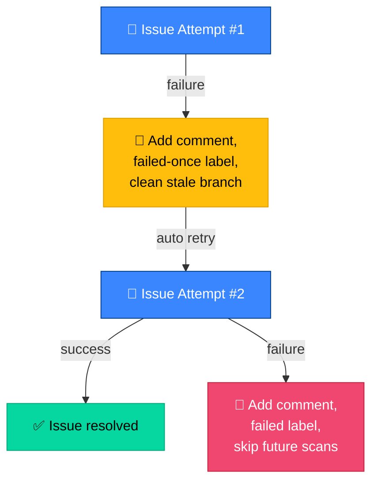
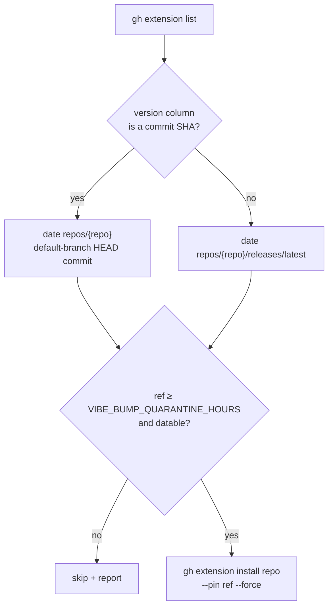

# 📖 Usage Guide

This document covers all usage patterns and features in detail. For a quick
overview, see the [main README](../README.md).

## 🏷️ Start here: label flows

Want the big picture of **which label to add when**, and what the worker
does next (`grill-me` ↔ `needs-human`, `planning` vs work tiers,
milestones, auto-merge)? Start with
**[Label Flows](workflows/label-flows.md)** — coloured journey diagrams
grounded in the real worker behaviour. Then come back here for the
detailed usage patterns below.

## 📋 Table of Contents

- [Start here: label flows](#-start-here-label-flows)
- [Creating an Issue](#creating-an-issue)
- [PR (Pull Request) Requirements by Issue Type](#pr-requirements-by-issue-type)
- [PR Summary File](#-pr-summary-file-docsarchivepr-summariespr-summary-issuemd)
- [Auto Squash Merge](#auto-squash-merge)
- [Skipping PR Reviewer Requests](#skipping-pr-reviewer-requests)
- [Work-On Label (External Issues)](#signaling-work-on-external-issues-work-on-label)
- [Ignoring Open PRs](#ignoring-open-prs-working-despite-pending-prs)
- [Clarification Phase](#clarification-phase-handling-unclear-or-complex-issues)
- [Issue Refinement Phase](#issue-refinement-phase-collaborative-issue-improvement)
- [Failed Issue Handling](#failed-issue-handling)
- [Worker Escalation via `needs-human`](#-worker-escalation-via-needs-human)
- [Question Clarification](#question-clarification)
- [Partial Answers on Timeout](#partial-answers-on-timeout)
- [Rate-Limit Circuit Breaker](#rate-limit-circuit-breaker)
- [One Issue per Repository/Milestone](#one-issue-per-repositorymilestone)
- [Self-Healing Disk Space](#self-healing-disk-space)
- [Claude CLI (Command-Line Interface) Auto-Update](#claude-cli-auto-update)
- [Health Check](#health-check)
- [Feature Availability](#feature-availability)
- [Reviewing and Requesting Fixes](#reviewing-and-requesting-fixes)
- [Reaction System](#reaction-system)
- [Security Scans (Idle)](#-security-scans-idle)
- [Automatic Spelling Check Fixes](#automatic-spelling-check-fixes)
- [Work Prioritisation Order](#-work-prioritisation-order)
- [Milestone Workflow](#milestone-workflow-grouped-issues)

## 📝 Creating an Issue

1. Go to one of the monitored repositories
2. Create a new issue with a clear description of what you want
3. Add one of the configured labels — in priority order: `top-priority`,
   `work-on`, `low-priority`, or `idle-task` (the lower tiers are fallbacks
   picked up only when no eligible higher-tier candidate exists in any scanned
   repo).
4. Leave it unassigned

The worker will:

- Detect the issue within `SLEEP_INTERVAL` seconds
- Self-assign the issue
- Create a feature branch
- Work on the issue using Claude Code
- Run quality checks
- Create a PR (Pull Request) that closes the issue
- Enable auto squash merge on the PR (if supported)

## 📋 PR Requirements by Issue Type

When creating a PR, the worker includes appropriate evidence based on the type
of change:

- **UI (User Interface) Changes**: Include a screenshot (see
  [Screenshot Support](DEPLOYMENT.md#screenshot-support-setup)). If a screenshot
  cannot be generated, you must explicitly state why in the PR summary.
- **Performance Changes**: Include benchmark results (before/after). If no
  measurable improvement, document this finding.
- **Bugs/Enhancements**: Follow TDD (Test-Driven Development); test the
  result/outcome, not the implementation method.

For detailed coding guidelines, see [AGENTS.md](../AGENTS.md).

## 📄 PR Summary File (docs/archive/pr-summaries/pr-summary-ISSUE.md)

Claude creates a `docs/archive/pr-summaries/pr-summary-{issue_number}.md` file
at the end of its work, **after all commits are complete**. This file is
committed to the repository as permanent documentation and contains:

- A summary of the changes made
- Evidence of the fix (screenshots, benchmarks, or test references)
- A test plan listing tests added or modified

The worker reads this file and includes its contents in the PR body. If no PR
summary file is created, a warning note is included in the PR body.

Issue #2173 moved every `pr-summary-*.md` file into `docs/archive/pr-summaries/`
so `docs/` root remains a curated table of contents. The worker still checks the
legacy `docs/pr-summary-{n}.md` location for older PRs (precedence order is
documented in `worker/deno/lib/pr_summary_loader.ts`).

For backwards compatibility, the worker also checks for a legacy `.pr_summary`
file in the repository root.

## 🔀 Auto Squash Merge

When a PR is created, the worker automatically enables auto squash merge using
GitHub's auto-merge feature:

- The PR will automatically merge (using squash) when all required checks pass
  and the review is approved
- No manual merge action is needed after approving the PR
- The commit history is kept clean with a single squashed commit per issue

**Requirements:**

- Auto-merge must be enabled in the repository settings (Settings > General >
  Allow auto-merge)
- Branch protection rules must require at least one approval or status check

**If auto-merge is not available**, the PR will still be created successfully
with a comment informing that manual merging is required.

**To disable** for a specific repository, add `skip_auto_merge: true` to the
repository's configuration in `.config.json`.

## ⏭️ Skipping PR Reviewer Requests

Some repositories only require CI (Continuous Integration) checks to pass and do
not require human review approval. To skip reviewer requests for a specific
repository:

```json
{
  "pr_reviewers": ["reviewer1", "reviewer2"],
  "repo_config": {
    "your-org/ci-only-repo": {
      "skip_reviewer_request": true
    }
  }
}
```

This setting only affects the specific repository it is configured for.

## 🏷️ Signaling Work on External Issues (work-on label)

To have the worker work on an issue **not** created by an allowed author:

1. Go to the issue you want worked on
2. Add the `work-on` label (configurable via `work_on_label` in `.config.json`)
3. Leave it unassigned

> **🔒 Security:** Only an allowed author (configured in `allowed_authors`) can
> add the `work-on` label to trigger work. The worker verifies who added the
> label via the GitHub timeline API (Application Programming Interface).

## 🔓 Ignoring Open PRs (Working Despite Pending PRs)

By default, the worker skips repositories with open PRs. The `ignore-open-prs`
label overrides this for specific issues.

**How it works:**

1. Add the `ignore-open-prs` label to the issue you want worked on
2. The worker will process the issue even if the repository has open PRs
3. Only an allowed author can add this label

| Setting                 | Default           | Description                                             |
| ----------------------- | ----------------- | ------------------------------------------------------- |
| `IGNORE_OPEN_PRS_LABEL` | `ignore-open-prs` | Label to bypass the open PR check (operational default) |

## ❓ Clarification Phase (Handling Unclear or Complex Issues)

The **clarification phase** runs before implementation and is important for
getting good results. It does three things:

1. **Is the issue clear?** If not, the worker posts questions on the issue and
   adds the `needs-human` label (Issue #2031 — the standalone
   `needs-clarification` label was retired in favour of the consolidated
   worker-to-human handoff signal). You reply on the issue and remove the label;
   the worker will re-assess on the next run.
2. **Is it small enough for a single PR / one run?** If the issue is too large,
   the worker posts an escalation comment asking a trusted human to add the
   `planning` label so the issue can be broken into smaller sub-issues. The
   worker does not add `planning` itself — see
   [Worker Label Policy](../README.md#-supported-labels).
3. **Is it too large for a single PR?** If the issue is clear but too complex
   for one implementation, the worker posts an escalation comment asking a
   trusted human to add the `planning` label — once added, the planning workflow
   breaks it into smaller sub-issues. No code is written until the issue is
   appropriately scoped.

To skip clarification, add the `documentation` label. The worker limits
clarification to 3 rounds (configurable) before proceeding with reasonable
assumptions.

For the full clarification workflow, including decision diagrams and
configuration, see
[Planning, Questions, Refinement, and Clarification](workflows/planning-and-questions.md).

## ✏️ Issue Refinement Phase (Collaborative Issue Improvement)

The refinement phase lets you collaborate with Claude to improve an issue
**before** implementation starts — no branches, commits, or PRs are created.

**Quick start:**

1. Add the `refine-issue` label to the issue
2. Post comments with your refinement guidance (e.g. "add acceptance criteria",
   "clarify the scope")
3. Wait for the worker to process — it will update the issue title/body, post a
   summary comment, and swap labels

**How you know it worked:**

- The `refine-issue` label is **removed**
- The `needs-human` label is **added** (handoff for human review)
- A `## Issue Refinement` summary comment appears
- Your feedback comments get an eyes (👀) reaction

**To refine again:** Post new feedback comments and re-add the `refine-issue`
label. `needs-human` alone is not a discovery trigger, so the worker will not
pick the issue up until `refine-issue` is reapplied. (Issue #2029 retired the
legacy `refined` completion label.)

**Protection mechanisms:** Atomic claiming prevents race conditions and eyes
reactions prevent double-processing.

For the full refinement workflow (including configuration, error handling, and
protection details), see
[Planning, Questions, Refinement, and Clarification](workflows/planning-and-questions.md).

## 📝 Planning Mode (Task Breakdown)

Planning mode lets you ask the Vibe Coder to break down an issue into sub-issues
and work packages **instead of implementing code directly**. Add the `planning`
label to an issue; the worker creates sub-issues, posts a summary comment,
removes the label, and closes the parent. Review the sub-issues and add
`work-on` labels to start implementation.

For the full planning workflow, see
[Planning, Questions, Refinement, and Clarification](workflows/planning-and-questions.md).

## ⚠️ Failed Issue Handling

The worker uses a **two-attempt strategy** for issues that fail to process.



**First failure**: Comment added, `failed-once` label applied, stale remote
branch deleted, issue unassigned for automatic retry.

**Second failure**: Comment added, `failed` label replaces `failed-once`, issue
skipped in future scans.

**To retry a permanently failed issue:**

1. Investigate the failure comments
2. Address the underlying problem
3. Remove the `failed` label
4. The worker will pick it up again with two fresh attempts

**Diagnosing why issues are not being picked up:** Run the `diagnose-repo` Deno
command to get a detailed report of blocking reasons for each issue in a
repository:

```bash
cd worker/deno && deno run --allow-all mod.ts diagnose-repo --repo owner/repo --github-user github_user
```

See also the
[Troubleshooting guide](TROUBLESHOOTING.md#-worker-not-picking-up-issues) for
the full diagnostic decision tree.

### 🕐 Timeout Behaviour

The worker uses a two-tier timeout architecture to detect stuck processes:
`claude_no_output_timeout` is the **stuck-process detector** (a background
monitor terminates Claude early once it produces no new output for that long),
and `claude_timeout` is the **hard ceiling** safety net (SIGTERM, then SIGKILL
after `claude_kill_after` seconds). The no-output timeout fires first for
genuinely stuck processes, while the hard ceiling catches edge cases where
Claude produces occasional output but never finishes. Exceeded time counts as a
failure.

The current defaults, the per-phase timeouts, and the full explanation live in
one place — see
[How timeouts interact](CONFIGURATION.md#%EF%B8%8F-how-timeouts-interact) in the
configuration reference (Issue #3600 de-duplicated the numbers so they cannot
drift apart).

### 💳 Rate Limit and Credit Exhaustion

The worker handles rate limits intelligently (Issue #620): when it receives an
HTTP (Hypertext Transfer Protocol) 429, it reads the `Retry-After` header and
sleeps for exactly the right duration rather than burning retries. It retries up
to `MAX_RATE_LIMIT_RETRIES` times with exponential backoff. If retries are
exhausted or total wait exceeds `MAX_RATE_LIMIT_WAIT` seconds, the issue counts
as a failure (with a distinct exit code so the caller knows it was rate-limited,
not a bug).

### 📏 Large Content Summarisation

When issue bodies or PR comments exceed the token limit
(`MAX_ISSUE_BODY_TOKENS`, default: 50000), content is automatically summarised
preserving technical requirements and code snippets.

### 🔄 Child Process Handling

When a timeout occurs or the worker exits, all descendant processes are properly
cleaned up:

1. SIGTERM sent (graceful shutdown)
2. SIGKILL after `CLAUDE_KILL_AFTER` seconds if process persists
3. All descendant processes recursively discovered and terminated
4. Common orphaned processes cleaned up as a safety net

### 🔧 Git Push Rejection Recovery

When automated tasks push commits to a PR branch, the worker automatically pulls
with rebase and retries the push. If the rebase fails due to conflicts, a fresh
branch is created.

### 🔄 Retry with Exponential Backoff

The `retry_with_backoff` utility (Issue #194) wraps any command with automatic
retry for transient errors.

**Transient errors (retried):** HTTP 5xx, 429, network timeouts, connection
refused, DNS (Domain Name System) failures, SSL/TLS (Secure Sockets Layer /
Transport Layer Security) errors, socket hang-ups.

**Permanent errors (not retried):** HTTP 4xx (401, 403, 404, 422), permission
denied, authentication failures.

**Backoff strategy:** Exponential (2s → 4s → 8s → ...), capped at
`RETRY_MAX_DELAY` (default: 60s), with jitter.

### ⏱️ Operation Timeouts

All GitHub CLI (Command-Line Interface) and git operations are wrapped with
configurable timeouts (Issue #619) to prevent indefinite hangs. The default is
60 seconds for most operations (120 seconds for merge/rebase). If an operation
times out, the worker logs the failure distinctly and moves on rather than
blocking the entire run.

## 🤝 Worker Escalation via `needs-human`

When the worker cannot complete an issue autonomously — for example it needs
credentials only a human can grant, or depends on a product decision only a
human can make — it **escalates** rather than looping or self-applying
`top-priority`.

**What the worker does when it escalates:**

1. Adds the `needs-human` label (creating it if it does not already exist,
   colour `fbca04`).
2. Posts a comment on the issue explaining what was attempted, why it could not
   complete, and exactly what a human needs to do next.
3. Stops work on the issue — no retry of the same failing step.

**Worker discovery skips any issue with `needs-human`.** The issue stays
assigned (or unassigned) as the worker left it, but it is excluded from every
subsequent scan until a human removes the label.

**When to expect a `needs-human` escalation:**

- An external service or credential (e.g. a deploy token, a cloud console
  action) is required.
- The issue raises a product or architectural question that only a human
  stakeholder can resolve.

**To resume work:**

1. Read the worker's comment to understand the blocker.
2. Perform the human action (e.g. add the missing credential, answer the
   question).
3. Remove the `needs-human` label from the issue.
4. On the next scan cycle the worker will re-evaluate the issue and pick it up
   again if it now has a configured label and is otherwise eligible.

> **📝 Note:** The worker uses `needs-human` exclusively for escalation. It
> **does not** self-apply `top-priority`, `work-on`, `low-priority`,
> `failed-once`/`failed` (those are internal failure-tracker labels, not
> escalation), `refine-issue`, `planning`, `question`, or `best-model`. The
> canonical pickup-priority order is `top-priority` > `work-on` > `low-priority`
>
>> `idle-task`; the single label the Vibe Coder may self-apply is `idle-task`.
>> Those labels are controlled by humans (and, for internal state labels, by the
>> worker's non-Claude code paths). If you see the worker stop retrying an issue
>> with no `needs-human` label, check `~/logs/worker.log` — it is probably in
>> cooldown or hit the `failed` threshold, not an escalation.

## ❓ Question Clarification

When a question-labelled issue needs more context before the worker can provide
a useful answer, the worker detects a "Clarification Needed" marker in Claude's
output and automatically:

1. Posts a clarification request as a comment on the issue
2. Removes the `question` label and adds the `needs-human` label (Issue #2031 —
   the clarification handoff was consolidated onto `needs-human`)
3. Unassigns itself from the issue

To continue, reply to the clarification comment with the requested information
and re-add the `question` label. The worker will re-process the question on the
next scan cycle.

## ⏳ Partial Answers on Timeout

When a question times out before Claude finishes its response, the worker
salvages what it can rather than discarding all progress:

1. Detects timeout exit codes (124 for SIGTERM or 137 for SIGKILL)
2. Posts the partial output as a comment with a disclaimer header explaining the
   answer is incomplete
3. Keeps the `question` label on the issue so users can request a more complete
   answer

This ensures that even timed-out questions provide some value rather than
appearing to silently fail.

## 🚦 Rate-Limit Circuit Breaker

The worker includes a rate-limit circuit breaker (Issue #650) that protects
against excessive API calls when GitHub returns HTTP 429 (Too Many Requests)
responses:

1. When a rate-limit response is detected, the circuit breaker trips and
   short-circuits all subsequent `gh` CLI calls for a cooldown period
   (`GH_RATE_LIMIT_COOLDOWN`, default: 300 seconds)
2. During cooldown, API calls return immediately with a rate-limit exit code
   instead of hitting the API
3. The circuit breaker resets automatically after the cooldown period expires

This prevents the worker from burning through retries and compounding rate-limit
issues. The cooldown is configurable via the `GH_RATE_LIMIT_COOLDOWN`
operational constant (see [Configuration Reference](CONFIGURATION.md)).

## 🔒 One Issue per Repository/Milestone

To prevent conflicts and ensure clean branches, the worker enforces a
one-issue-at-a-time policy (Issue #678):

- **Per repository**: Only one issue is worked on per repository at a time. If a
  repository already has an in-progress issue, other eligible issues in that
  repository are skipped until the current one completes.
- **Per milestone**: Within a milestone, only one issue is worked on at a time.
  If a milestone already has an assigned issue being processed, other issues in
  the same milestone are skipped.

This enforcement happens during issue selection and ensures that parallel
workers do not create conflicting branches or overlapping changes in the same
repository or milestone.

## 💾 Self-Healing Disk Space

At startup, the worker checks disk usage of the `WORK_DIR` filesystem and
applies a two-tier cleanup policy (Issue #1499) based on the cost of cleanup to
subsequent issue processing:

- **Gentle cleanup at 80%** — When usage reaches `DISK_CLEANUP_GENTLE_THRESHOLD`
  (default 80%) but stays below the aggressive threshold, only the incremental
  reclaim pass runs: `deno clean`, `npm cache clean`, removing stray
  `node_modules/`, `pip cache purge`, and (on macOS) `brew cleanup`. Cloned
  repositories are **preserved** to avoid the network and time cost of
  re-cloning on the next run.
- **Aggressive cleanup at 90%** — When usage reaches `DISK_CLEANUP_THRESHOLD`
  (default 90%), the same incremental reclaim runs first; if that is
  insufficient, the entire `WORK_DIR` (including cloned repositories) is deleted
  and recreated as a last resort.

| Variable                        | Default | Description                                                           |
| ------------------------------- | ------- | --------------------------------------------------------------------- |
| `DISK_CLEANUP_GENTLE_THRESHOLD` | `80`    | Gentle threshold — incremental reclaim only; cloned repos preserved   |
| `DISK_CLEANUP_THRESHOLD`        | `90`    | Aggressive threshold — may nuke `WORK_DIR` if reclaim is insufficient |

## 🔄 Claude CLI Auto-Update

At the start of each run, the worker automatically checks for and installs
Claude CLI updates. Failures are logged but do not block the worker.

| Variable                   | Default | Description                                     |
| -------------------------- | ------- | ----------------------------------------------- |
| `SKIP_CLAUDE_UPDATE`       | `false` | When `true`, skips automatic Claude CLI updates |
| `CLAUDE_UPDATE_TIMEOUT`    | `120`   | Timeout in seconds for the update command       |
| `CLAUDE_UPDATE_KILL_AFTER` | `10`    | Grace period before SIGKILL after SIGTERM       |

### Minimum-version floor (Issue #2622)

The update normally runs at most once per interval (7 days). That cadence is
wrong when a specific minimum version is required — e.g. `--model fable` support
needs a recent Claude CLI release, but a worker updated six days ago would not
re-check for another day. The **interval-OR-floor** rule fixes this: the update
runs when _either_ the interval has elapsed _or_ the installed version is below
a configured floor.

Floors are configured per tool in `.config.json` via `software_min_versions`
(see [Configuration](CONFIGURATION.md#-minimum-version-floor-issue-2622)). The
default floor pins `claude` to `2.1.170` — the oldest release verified to
support `--model fable`.

- Below floor → the update runs immediately, bypassing the timestamp gate.
- At/above floor → existing interval behaviour is preserved exactly.
- Unparseable `--version` output → falls back to interval behaviour with a
  warning (the worker is never blocked).
- After a floor-triggered update the version is re-read; if it is still below
  the floor a warning naming the tool, installed version, and required floor is
  logged once, and the floor update is not retried until the interval elapses
  (so an unreachable floor never retry-loops every iteration).
- `SKIP_CLAUDE_UPDATE=true` still wins, but logs that a version floor is unmet
  when it suppresses a floor-triggered update.

### Release-age quarantine (Issue #3655)

Every toolchain upgrade — Claude CLI, the `gh` binary, each installed `gh`
extension, and Deno — is additionally gated on the candidate release being at
least `VIBE_BUMP_QUARANTINE_HOURS` (default `24`) old, the same embargo this
repository applies to declared dependencies. A release published minutes ago is
deferred until it ages past the window, which is the interval in which a
hijacked upstream release is typically detected and yanked.

| Variable                      | Default | Description                                                     |
| ----------------------------- | ------- | --------------------------------------------------------------- |
| `VIBE_BUMP_QUARANTINE_HOURS`  | `24`    | Release-age window; a non-positive value falls back to `24`      |
| `SKIP_SOFTWARE_UPDATE`        | `false` | When `true`, skips the whole software-update step               |
| `SKIP_GH_UPDATE`              | `false` | When `true`, skips `gh` binary and extension upgrades           |
| `SKIP_DENO_UPDATE`            | `false` | When `true`, skips Deno upgrades                                |

Operational notes:

- **Fail-closed.** An unverifiable release age (registry unreachable, no dated
  upstream release, `gh api` failure) skips the upgrade with a warning rather
  than installing it. The worker is never blocked — it simply keeps the tool it
  already has and retries next cycle.
- **The quarantine outranks the version floor.** A tool below its
  `software_min_versions` floor whose only fix is a release inside the window
  stays on the old version for now; the unmet floor is still logged.
- **Deno upgrades are pinned** to the version that passed the age check
  (`deno upgrade <version>`), so nothing published between the check and the
  upgrade can slip in.
- **`gh` extensions are upgraded one at a time**, each gated on the ref its
  upgrade would actually install (Issue #3952) — the latest release tag for a
  binary/release extension, the default-branch HEAD commit for a git (script)
  extension, which `gh` upgrades by pulling that branch. The upgrade is then a
  pinned `gh extension install <repo> --pin <ref> --force`, so the ref that was
  dated is the ref that lands. An extension whose ref cannot be dated is left
  alone and reported. If `gh extension list` cannot be read, no extension is
  upgraded.


- All the skip flags above are honoured on every entry point, including the
  `run-entrypoint` driver `run.sh` uses.

## 💚 Health Check

After successful work, the worker can update a separate health tracking
repository to signal it is functioning correctly.

| Variable          | Default                                      | Description                                               |
| ----------------- | -------------------------------------------- | --------------------------------------------------------- |
| `FLEET_HEALTH_DIR`  | (empty)                                      | Directory of the private-repo-6 checkout. Disabled when empty. |
| `FLEET_HEALTH_REPO` | (empty)                                      | Git URL to clone into `FLEET_HEALTH_DIR` when that directory does not exist. Unset, the worker never clones (it logs that tracking is off) — no URL is assumed. |
| `FLEET_HEALTH_TIMEOUT_MS` | `600000` (10 minutes)                  | Timeout for the `helpers/repos.sh` health-report subprocess. Raised from 60s so a slow-but-healthy report run is not killed and the host wrongly marked dead (Issue #3127). |

These values can be configured via `setup.sh` using `VIBE_FLEET_HEALTH_DIR` or
persisted in `.config.json` as `fleet_health_dir` (Issue #535). Health
tracking is optional — a single host does not need it. `setup.sh` /
`setup.ps1` record `fleet_health_dir` only when the checkout exists (the
`../private-repo-6` sibling by default), and clone it there only when
`VIBE_FLEET_HEALTH_REPO` names your fleet's health repository; otherwise setup
prints one informational line and moves on.

## 🔌 Feature Availability

At startup, the worker checks which optional features are available and logs a
summary.

| Feature           | Check                                                  | Fallback when unavailable                     |
| ----------------- | ------------------------------------------------------ | --------------------------------------------- |
| `imgbb`           | `imgbb_api_key` in config or `VIBE_IMGBB_API_KEY` set  | Screenshots saved locally instead of uploaded |
| `health-tracking` | `fleet_health_dir` in config or `FLEET_HEALTH_DIR` set     | Health tracking silently skipped              |
| `github-status`   | `update_gh_user_status` true and `user` scope on token | Status updates silently skipped               |

> **📝 Note:** Deno is a **required** dependency (Issue #518) and is no longer
> listed as an optional feature.

Core functionality (issue processing, PR feedback) is never blocked by missing
optional features.

## 👀 Reviewing and Requesting Fixes

**Option 1: Using PR Comments**

For authorised commenters:

1. Add a comment describing what needs to be fixed
2. Wait for the worker to pick it up

For other reviewers:

1. Add a comment describing what needs to be fixed
2. React with a thumbs up (👍) to the comment
3. Wait for the worker to pick it up

**Option 2: Using GitHub's "Request Changes" Review**

1. Go to the PR's "Files changed" tab
2. Click "Review changes"
3. Write your feedback and select "Request changes"

The worker will process the feedback, push fixes, and dismiss the review.

**How the worker handles feedback:**

- Detect unprocessed comments or reviews
- Checkout the PR branch
- Analyse the feedback
- Either fix the code or respond with an explanation
- Always push unpushed commits
- Mark feedback as processed (👀 reaction for comments, dismissal for reviews)

## 👍 Reaction System

| Reaction | Meaning                                                                 |
| -------- | ----------------------------------------------------------------------- |
| 👍       | "Please fix this comment" (required only for non-authorised commenters) |
| 👀       | "This comment has been processed" (added by worker)                     |

## 🛡️ Security Scans (Idle)

The worker runs a MythOS-style four-phase security audit from the idle path:

- **Idle trigger** — when a full scan cycle ends with no claimable work in any
  monitored repo, the worker picks the oldest-scanned repo, runs the scanner,
  and files findings as `security`-labelled issues. State (idle counter,
  per-repo last-run timestamps, global lock) lives under `${HOME}/.vibe-coder/`.

Each finding is filed as its own issue with the `security` label only (no
workflow labels). A single run files at most six findings; the rest are rolled
into one `security-scan-overflow` tracker so the human triage queue stays
manageable.

For state file paths, finding-issue layout, suppression syntax, the
vulnerability taxonomy, and the operator playbook (lock recovery, overflow
rollover, scan crash recovery), see
[Security Scans — Operator Manual](SECURITY-SCAN.md). Upstream CVE advisories
follow a separate process documented in
[Upstream Security Advisory Triage](security-advisory-triage.md).

## 🔤 Automatic Spelling Check Fixes

When a spelling check fails on an open PR, the worker automatically detects it
and takes action:

1. Scans open PRs for failed check runs containing "spell", "cspell", "typo", or
   "codespell"
2. Extracts check annotations to understand the spelling issues
3. Either fixes genuine spelling mistakes or adds valid technical terms to the
   project dictionary
4. Commits, pushes, and comments on the PR explaining the fixes

No manual intervention required — fixes are pushed to the existing PR branch.

## 📊 Work Prioritisation Order

```mermaid
flowchart TD
    P1["🔴 Priority 1 — PR Feedback & Reviews"]
    P15["🟠 Priority 1.5 — Failed Spelling/Quality Checks"]
    P155["🟠 Priority 1.55 — Failed CI/Integration Checks"]
    P16["🟡 Priority 1.6 — PR Branch Updates (rebase/merge)"]
    P162["🟡 Priority 1.62 — Nudge Stalled CI (Issue #2100)"]
    P163["🟡 Priority 1.63 — Blocking-PR Stall Watchdog (Issue #4025)"]
    P165["🟡 Priority 1.65 — Auto-merge Catch-up"]
    P166["🟡 Priority 1.66 — Branch Cleanup (merged PRs, once at start-up)"]
    P167["🟡 Priority 1.67 — Issue Closure (merged PRs)"]
    P168["🟡 Priority 1.68 — Closed-PR Recovery (Issue #787)"]
    P17["🟢 Priority 1.7 — Milestone Completion (tracking issue + PR)"]
    P172["🟢 Priority 1.72 — Milestone Branch Sync"]
    P175["🟢 Priority 1.75 — Issue Refinement Requests"]
    P178["🟢 Priority 1.78 — Grill-Me Clarification (Issue #1619)"]
    P179["🟢 Priority 1.79 — Quorum Plan-Off (Issue #4112)"]
    P18["🔵 Priority 1.80 — Planning Mode Requests"]
    P185["🔵 Priority 1.85 — Question Answering Requests"]
    P19["🔵 Priority 1.9 — Stale Workflow Detection"]
    P2["🟣 Priority 2 — New Issues (globally oldest, label tiers `top-priority` > `work-on`)"]
    P25["🟤 Priority 2.5 — `low-priority` label (Issue #1721, fallback when no eligible higher-tier candidate exists in any repo)"]
    P29["⚪ Priority 2.9 — `idle-task` label (Issue #1959, worker-filed busywork; only self-appliable label)"]

    P1 --> P15 --> P155 --> P16 --> P162 --> P163 --> P165 --> P166 --> P167 --> P168 --> P17 --> P172 --> P175 --> P178 --> P179 --> P18 --> P185 --> P19 --> P2 --> P25 --> P29

    style P1 fill:#d00000,stroke:#9d0208,color:#fff
    style P15 fill:#dc2f02,stroke:#d00000,color:#fff
    style P155 fill:#e85d04,stroke:#dc2f02,color:#fff
    style P16 fill:#f48c06,stroke:#e85d04,color:#000
    style P162 fill:#f48c06,stroke:#e85d04,color:#000
    style P163 fill:#f48c06,stroke:#e85d04,color:#000
    style P165 fill:#faa307,stroke:#f48c06,color:#000
    style P166 fill:#ffba08,stroke:#faa307,color:#000
    style P167 fill:#ffdd00,stroke:#ffba08,color:#000
    style P168 fill:#ffee00,stroke:#ffdd00,color:#000
    style P17 fill:#aacc00,stroke:#80b918,color:#000
    style P172 fill:#aacc00,stroke:#80b918,color:#000
    style P175 fill:#55a630,stroke:#2b9348,color:#fff
    style P178 fill:#55a630,stroke:#2b9348,color:#fff
    style P179 fill:#55a630,stroke:#2b9348,color:#fff
    style P19 fill:#3a86ff,stroke:#023e8a,color:#fff
    style P18 fill:#007f5f,stroke:#005f46,color:#fff
    style P185 fill:#3a86ff,stroke:#023e8a,color:#fff
    style P2 fill:#8338ec,stroke:#5a189a,color:#fff
    style P25 fill:#6c4a3c,stroke:#3d2a22,color:#fff
    style P29 fill:#909090,stroke:#555,color:#fff
```



The worker selects the **globally oldest** eligible issue across all configured
repos (after filtering and open-PR blocking). Within priority 2 the canonical
configured-label tier is `top-priority` followed by `work-on`. The
`low-priority` tier (priority 2.5) is only consulted when no eligible
higher-tier candidate exists in any scanned repo. The `idle-task` tier (priority
2.9) sits strictly below `low-priority` and is the only label the Vibe Coder may
self-apply. The dispatch table in `worker/deno/lib/run_core.ts` is the source of
truth for the fractional priorities; the canonical documented ladder is the
table in [Workflows](workflows/README.md#-lifecycle-overview) and a test keeps both
diagrams in step with the code (Issue #3348). The canonical pickup-priority order is `top-priority` > `work-on` >
`low-priority` > `idle-task`. Repo order in `repos` affects scan order;
selection is by issue age, not repo position. See
[Workflows](workflows/README.md) and
[Issue Processing](workflows/issue-processing.md) for full detail.

## 🎯 Milestone Workflow (Grouped Issues)

The milestone workflow lets you group related issues into a single feature
branch. Create a GitHub milestone, assign issues to it, and add labels — the
worker handles the rest: creating the `milestone/<name>` branch, working on
issues one at a time, creating PRs to the milestone branch, creating a tracking
issue when all issues are complete, raising a final consolidation PR to the
default branch, and monitoring CI/integration test failures on the final PR
(automatically fixing them).

For the complete guide — setup steps, branch flow diagrams, PR references,
completion, and edge cases — see the
[Milestone Workflow Guide](workflows/milestones.md).
