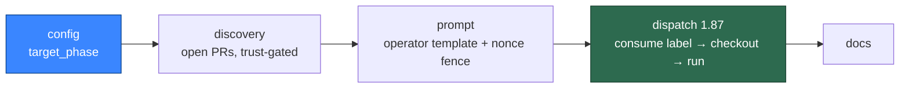

# PR-phase custom labels — the whole milestone in one change

Closes #1008
Closes #1009
Closes #1010
Closes #1011
Closes #1012

## Summary

`custom_label_prompts` could only ever work an **issue**. This adds the PR
phase end to end, as one vertical feature: a mapping now states the phase it
runs in, a `pr`-phase mapping is discovered against open PRs behind the same
trust gate the issue collectors use, its prompt is built from the operator's
private template with every piece of PR text nonce-fenced, it is dispatched at
a new priority 1.87 with a full checkout, and the documentation says so.

An operator who never sets `target_phase` gets byte-identical behaviour: every
existing entry parses as `issue` and dispatches exactly as it does today.

### Config → the mapping knows its phase (#1008)

- `CustomPromptTargetPhase = "issue" | "pr"`, and a **required**
  `targetPhase` on the validated `CustomLabelPromptMapping`, defaulted during
  parse — so no call site can dispatch a mapping without having considered
  its phase.
- `target_phase` joins `KNOWN_ENTRY_KEYS`; absent or `null` is `"issue"`.
  Anything else — `"review"`, `""`, `42`, `"PR"` — is refused through the
  existing `reject()` path naming `custom_label_prompts[<i>].target_phase`,
  the value and the accepted set.
- A `pr` target on an entry that **overrides** a built-in label is refused
  too. An override is dispatched by that label's own handler, which has no
  notion of a target phase, so accepting it would silently do nothing — the
  exact silent drop #843 exists to rule out.
- `custom_prompt_loader.ts` replaces the hardwired
  `CUSTOM_PROMPT_TEMPLATE_TYPE = "issue"` with a phase → template-type map
  (`issue` → `issue`, `pr` → `pr_feedback`), exported as
  `customPromptTemplateType()`. A placeholder failure now names both the
  target phase and the template type.
- `customDispatchMappings(config, phase?)` and
  `customLabelPromptLabels(config, phase?)` take an optional phase filter.
  `operationalDispatchLabels` keeps calling it **unfiltered** — the trust gate
  covers a custom label in either phase — while both dispatch paths filter.
- Priority 1.86 is now wired only when at least one **`issue`**-phase mapping
  is configured: a `pr`-only config must not add an issue-scanning row that
  can never match.

### Discovery → open PRs, trust-gated (#1009)

New `lib/custom_label_pr_finder.ts`. For each `pr`-phase mapping, in
configuration order, `gh pr list --repo <repo> --state open --label <label>
--json …`; `--state open` is the whole of the closed/merged exclusion. Each
candidate is gated with the existing `wasLabelAddedByAllowedAuthor`
(`lib/issue_query.ts`), passing the per-cycle collaborator-derived
`allowedAuthors` and the fleet logins from `resolveFleetMaintenanceAuthorSet`,
so a label the fleet applied to its own PR is never a trusted add. An add that
cannot be attributed — no `labeled` event, a null actor, an unreadable
timeline — **fails closed** with the reason logged. With no `pr` mapping
configured the finder issues **zero** `gh` calls.

### Prompt → the operator's template, PR text fenced (#1010)

`buildCustomPrPrompt` in `lib/prompt_builder.ts`, beside
`buildPrFeedbackPrompt` and following its structure. The one difference is
where the template comes from: the operator's file via the phase-aware
`loadCustomPromptTemplate`, never `loadPrompt`, and never a fallback to the
built-in `pr_feedback` template. `PR_NUMBER`, `QUALITY_INSTRUCTIONS` and
`VERBOSITY_INSTRUCTIONS` are substituted; PR title, body and review comments
ride this run's nonce fence with the matching boundary-integrity instruction,
so a forged closing delimiter or a forged `[TRUSTED] author=` header in a PR
body is inert.

### Dispatch → priority 1.87, one shot (#1011)

New `lib/custom_label_pr_dispatch.ts`, wired as an optional
`findAndProcessCustomLabelPrPrompts` dep at **priority 1.87**, immediately
after 1.86 and `agentBacked: true`. Like 1.86 the row exists only when a
mapping of that phase is configured.

The flow is: take the first candidate → **remove the label** → build the
prompt (which loads and validates the operator's file) → check out the PR head
branch with `preparePrBranch` → run the agent → verify the work reached the
remote with `verifyPushLanded` → post exactly one outcome comment.

**Deliberate departure from #1011's numbered steps.** The issue lists template
validation as step 2 and label removal as step 3. This removes the label
first, before the prompt file is even read. Validating first satisfies every
acceptance bullet but re-forms the #937 loop on the failure half — a broken
operator prompt would comment on the PR every cycle, forever. Removing first
means the worst case is one lost run the developer re-triggers by re-applying
the label. Every failure path still posts a comment naming the label and
saying it can be re-applied.

### Docs (#1012)

- `docs/CONFIGURATION.md` — `target_phase` in the JSON example (both an
  `issue` and a `pr` entry), the field semantics and its fail-loud rule, the
  per-phase placeholder contract, a new "How a `pr`-phase custom label
  dispatches" section with its own Mermaid flowchart, and the trust bullet
  reworded to cover both phases. The issue-flow heading is now explicitly
  "How an `issue`-phase custom label dispatches".
- `docs/INTERNALS.md` — 1.86 and 1.87 added to the priority ladder, with a
  note that each row exists only when a mapping of that phase is configured.
- `docs/CUSTOM-PROMPTS.md` — the operator guide opened with "works the issue
  with your prompt", which is now wrong rather than incomplete. The intro, the
  decision-tree diagram and the placeholder tables cover both phases, and the
  full PR semantics cross-reference `CONFIGURATION.md`.
- `docs/workflows/README.md` and `docs/USAGE.md` — 1.87 added to the canonical
  table and both flow diagrams. `tests/priority_ladder_docs_test.ts` caught
  these; they are not optional.

## Test Plan

Red before green throughout. New suites:

| Suite | Covers |
| --- | --- |
| `tests/custom_label_pr_finder_test.ts` | Trusted adder → candidate; untrusted adder → nothing, logged; unattributable add → fail closed, logged; fleet login → nothing; `--state open` asserted in the argv; issue-phase labels never scanned; zero `gh` calls when unconfigured; ordering; two labels on one PR; a `gh` fault on one repo does not stop the scan |
| `tests/custom_pr_prompt_test.ts` | Placeholders substituted; title/body/review comments inside the nonce fence; forged delimiters and `[TRUSTED] author=` inert; two builds, two nonces; missing and placeholder-incomplete files error naming label and path with no built-in fallback; guidelines and repo context |
| `tests/custom_label_pr_dispatch_test.ts` | Full happy-path call ordering; label removed before the agent (ordering assertion); removal via the labels endpoint; agent throws → label still consumed + failure comment; second pass finds nothing; broken prompt refuses with no agent run; failed checkout; unlanded push reported as failure; no candidates → no `gh` calls; 1.87 absent/present in the dispatch table |

Extended: `tests/custom_label_prompts_config_test.ts` (absent/null → `issue`,
both values, the rejection matrix, the override conflict, the phase filters),
`tests/custom_prompt_loader_test.ts` (both directions of the phase →
template-type map, each error naming phase and type),
`tests/custom_label_dispatch_test.ts` (a `pr`-only config wires 1.87 and
leaves 1.86 unwired; an `issue`-only config leaves 1.87 unwired).

**Existing tests modified, and why.** `targetPhase` is required on the
validated type, so ten fixture files that build `CustomLabelPromptMapping`
literals gained `targetPhase: "issue"`, and five equality assertions in
`custom_label_prompts_config_test.ts` gained the same field in their expected
value. No test was weakened, commented out or removed; each still asserts what
it asserted before, against a mapping that now states its phase.

### Verification

From `worker/deno`: `deno fmt`, `deno lint` (2159 files), `deno check` on every
changed module, `deno check mod.ts`, `deno check tests/` (this caught 38
fixture breakages `mod.ts` never reaches), the 91 suites importing the changed
modules (1157 passed), and `deno task test:unit`.

`deno task test:unit` reports only the known-acceptable unrelated failures:
`run_callbacks_integration_test.ts` and `callback_conformance_test.ts`
(Issue #1055), plus one load-dependent flake in
`claude_runner_killed_test.ts` that passes on its own.

No `.sh` launcher was touched, so no `.ps1` twin change was needed.

### Evidence

No UI change, so no screenshots. The behavioural evidence is the test suites
above — in particular the trust cases in the finder suite and the ordering
pair in the dispatch suite, which are the two properties this feature is
correct or incorrect on.
