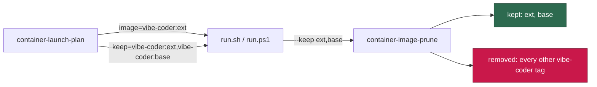

# Three findings from one container build log

Closes #1015, closes #1016, closes #1059.

All three came from a single reading of one operator build log, so they land
together rather than as a flood of one-line pull requests.

## #1015 — three permanent `npm warn using --force` lines

`npm cache clean --force` sat in the npm, markdownlint-cli2 and playwright-core
layers. Modern npm refuses to empty its cache without the protections-off flag
and warns whenever it is given one, so those three warnings printed on **every**
build, for ever. A warning that always fires is one nobody reads, and the build
log is the first thing an operator opens when an image build fails.

The clean was earning its place, so it was not simply dropped. Measured on this
host, installing the three pinned tarballs into a fresh cache directory:

| Layer                        | npm cache after the install |
| ---------------------------- | --------------------------- |
| `npm@12.0.2`                 | 2 988 KiB (2.9 MiB)         |
| `markdownlint-cli2@0.23.2`   | 13 928 KiB (+10.7 MiB)      |
| `playwright-core@1.61.0-…`   | 16 688 KiB (+2.7 MiB)       |

So 16.3 MiB would have landed in the image had the clean simply been deleted.
Instead `npm_config_cache` is an image-level `/tmp/npmc` and each `RUN` deletes
that directory in the same step, which leaves the layer exactly as small with
nothing to warn about. At run time `container/entrypoint.sh` already repoints
`npm_config_cache` at the durable state root, so the image default only ever
applies during the build.

`findContainerfileViolations` gained a rule so the instruction cannot come back.

## #1016 — the semgrep wheel was the one download asked of a resolver

The retry half of this issue shipped with #1026 (`CURL_RETRY` on all twelve
`curl` fetches, `PIP_RETRY` with `--resume-retries 20` on the pip download, and
three gate rules). What remained was the **URL** half, which a previous attempt
had to back out at 15 328 stripped bytes against the 15 000 cap.

It fits now. Both wheels are fetched by pinned `files.pythonhosted.org` URL with
`curl` and the shared `CURL_RETRY` policy, and `pip install` runs against the
local file only — `pip download` is gone from the file. The wheel's
compatibility-tag string doubles as the URL's path segment, so it is stated once
in the step and bumped with `SEMGREP_VERSION`; a stale value 404s rather than
installing the wrong bytes, and the existing per-architecture `sha256sum -c -`
is what makes fetching by URL safe.

## #1059 — the prune untagged the extension's own base image

`selectSupersededImages` removed every `vibe-coder:*` tag whose tag differed
from `--keep`. With #980's two-image build — `vibe-coder:<baseHash>` and
`vibe-coder:<extensionHash>` built `FROM` it — a launch keeps only the extension
tag, so the prune untagged the base its own `FROM` names, on every launch.

Nothing special-cases two tags. `--keep` now takes the launch's whole image
**dependency chain**, comma separated, and the chain is derived where it is
actually known: the launch plan resolves each image and the image it is built
from, and emits it as a new `keep` plan key that both launchers honour. A deeper
chain is a longer list and needs no further change.



`keep` is in `LAUNCH_PLAN_KEYS`, so a launcher that stopped honouring it fails
the parity contract rather than quietly pruning its own base.

## Evidence

**Containerfile size cap.** `CONTAINERFILE_SIZE_CAP_BYTES` is 15 000.

| | stripped bytes |
| --- | --- |
| `origin/main` | 14 908 |
| after #1015 | 14 883 |
| after #1015 + #1016 | **14 949** |

**Build log.** A full image build is impractical in this environment, so the two
Containerfile layers were built as standalone slices with Apple `container`
1.2.2, copied verbatim from the committed file.

- npm slice, current form: `EXIT=0`, `grep -c 'npm warn using'` → **0**, and the
  final step's `du -sk /root/.npm /tmp/npmc` reported *No such file or
  directory* for both — the layer did not grow.
- npm slice, previous form (`npm cache clean --force`): `EXIT=0` and two
  `npm warn using --force Recommended protections disabled.` lines, one per npm
  layer in the slice. The third occurrence is the playwright-core layer, which
  the slice omits.
- semgrep slice: `EXIT=0`, `/tmp/pip-26.2.1-py3-none-any.whl: OK`,
  `/tmp/semgrep-1.173.0-…-manylinux_2_34_aarch64.whl: OK`, the layer's own
  `semgrep --version | grep -qxF "1.173.0"` passed, and no
  `Attempting to resume incomplete download` line. The first attempt at this
  slice **failed** with `ERROR: Invalid wheel filename (wrong number of parts)`
  — pip reads a wheel's tags out of its file name, so the local copy keeps the
  wheel's own name rather than a short one. That defect is only visible in a
  build, which is why the slice was built.
- Both pinned wheel URLs were fetched whole and checksummed against the
  committed pins: `amd64` and `arm64` both `OK`.

## Test plan

**Red before green (#1059).** Against the unfixed `selectSupersededImages`, a
keep set naming an extension tag and its base produced:

```
AssertionError: Values are not equal.
    [Diff] Actual / Expected
    [
-     "vibe-coder:base00000001",
      "vibe-coder:superseded01",
    ]
```

and the three-deep chain case removed `middle000001` and `base00000001` as well.
Both pass after the change.

Tests added:

- `container_image_prune_test.ts` — the base a kept tag is built `FROM`
  survives; a chain of any depth survives; the prune keeps the base end to end;
  a `--keep` reference that does not parse prunes nothing rather than silently
  dropping an image out of the keep set.
- `container_launch_test.ts` — the `keep` token carries the whole chain and
  round-trips through the launcher framing.
- `run_sh_launcher_test.ts` and `run_ps1_launcher_test.ts` — each launcher hands
  the plan's `keep` value to `--keep` whole. The PowerShell twin was really
  executed (`pwsh` is installed on the test host), not assumed.
- `container_manifest_test.ts` — `findContainerfileViolations` reports a step
  that cleans the npm cache, and accepts one that deletes its cache directory.

Test modified, as the standard requires stating: the semgrep step assertion in
`container_manifest_test.ts` asserted `semgrep==${SEMGREP_VERSION}`, the pip
requirement specifier. Fetching by URL removes that string, so the assertion now
pins `semgrep-${SEMGREP_VERSION}-` — the version inside the wheel's own name —
and adds an assertion that no `pip … download` remains.

## Note for the #933 milestone branch

The two-image build this fixes (#980) lives on
`milestone/933-extension-framework-for-private-per-deployment`, not on `main`.
The mechanism lands here — list-valued `--keep`, the `keep` plan key, both
launchers, the prune rule — and on `main` the chain has exactly one entry. When
the milestone branch next merges `main`, appending the extension's base image to
`keepImages` is all that remains for a layered deployment to stop untagging its
own base.
