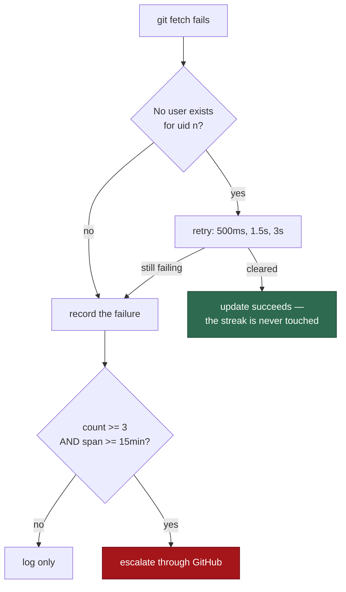

# PR Summary — Issue #1017

Closes #1017

## Summary

On GRQ-23 at 2026-09-04T09:47Z the worker checkout update failed three times in
eight seconds:

```text
Checkout update failed: cannot update /Users/nigelleck/src/VibeCoder to
origin/main: git fetch origin failed (exit code 128): No user exists for uid 501
fatal: Could not read from remote repository.
```

`No user exists for uid 501` is macOS Directory Services failing to resolve the
*invoking* user — 501 being the operator's own uid. `git` could not read the
passwd entry of the user it was already running as, so it could not find that
user's `~/.ssh` or `~/.gitconfig` and gave up, with git's "make sure you have
the correct access rights" boilerplate attached. It is neither a credentials
fault nor a network one, and it clears on its own.

Three defects followed from that one line, and all three are fixed.

**1. The diagnosis was wrong.** `diagnoseUpdateFailure` passed it through as a
generic fetch failure, sending an operator to deploy keys and SSH agents with
nothing wrong with either. It is now recognised by name and reported as what it
is — a host directory-services fault, naming the uid, saying it is transient and
self-clearing, and saying explicitly what it is *not*. The diagnosis is decided
before the development-tree one, because a dirty checkout is not why this
failed.

**2. It was not retried.** The condition typically clears within seconds, and
the launcher gave up on the first occurrence and ran on the stale checkout. Git
steps are now retried in place while *this specific* condition is the reason
they failed, on a short bounded backoff (500 ms, 1.5 s, 3 s), and a run that
recovers inside it never reaches the failure streak at all. Every other failure
returns immediately, exactly as before. A step that only succeeded because it
was retried says so in `pull.log`; a step that kept failing does not, because
the failure already reports itself and a "retried" line beside it would read as
though the retry had helped.

**3. The streak counted runs, not persistence.** `checkout-update-failure-streak`
went 1 → 2 → 3 between 09:47:44 and 09:47:52, tripping a threshold whose comment
says "3 consecutive runs" and whose author meant three hourly launches — an hour
of a host running stale code. A streak that can be exhausted faster than the
condition can clear is not measuring persistence. The file now carries the first
failure's timestamp beside the count, and escalation requires **both** the count
and a minimum elapsed span of fifteen minutes: well above any burst of launches,
well below the two hours three hourly launches span, so the case the threshold
was written for still escalates on its third failure.



## On "why three launches in eight seconds"

The issue also asked why three launches happened in eight seconds. Nothing in
this repository schedules them: `run.sh` runs the update once per launch, and
`loop.sh` sleeps the recorder's backoff between cycles, which is never under the
base cadence. That points at the host's own supervisor rather than at worker
code, and this checkout cannot settle it from here. The fix does not depend on
the answer: the span rule makes a burst of launches — from whatever source —
unable to manufacture an escalation, which is the behaviour the issue asked for
either way.

## Backwards compatibility

A host upgrades in place, and a launcher that died parsing its own state file
would be worse than the bug it was fixing. `parseCheckoutStreak` accepts the
JSON object written since this change *and* the bare decimal count every worker
wrote before it, and anything that stops the file meaning what it says — absent,
empty, malformed, negative — reads as no streak. A legacy count has no start,
which reads as "unknown", and an unknown start never *blocks* an escalation:
silencing a host running stale code is the worse of the two errors.

## Evidence

No UI change, so no screenshots. The regression evidence is
`updateCheckout - three failures inside a minute do not escalate (Issue #1017)`,
which replays the observed timestamps (09:47:44, 09:47:48, 09:47:52) against the
real on-disk streak and asserts nothing escalates. It fails against the unfixed
code, which escalates on the third.

## Test Plan

- `diagnoseUpdateFailure - a uid-lookup failure is a host fault, not an
  access-rights one (Issue #1017)`.
- `diagnoseUpdateFailure - the uid diagnosis wins over the development-tree one
  (Issue #1017)`.
- `directoryServicesUid - names the uid, and only for this condition`.
- `runGitStepWithRetry -` three cases: the condition clears and the step
  succeeds (with the retry noted); every other failure returns at once and never
  waits; a condition that never clears gives up, bounded, with no misleading
  retry note.
- `checkoutStreakEscalates - the count alone is not persistence` — eight seconds
  does not escalate, three hours does, the boundary is asserted from both sides,
  the count still has to be met however long the span, and an unknown start does
  not veto. Both directions, so the change cannot be satisfied by never
  escalating.
- `parseCheckoutStreak - reads the pre-#1017 file without crashing`.
- `updateCheckout - three failures inside a minute do not escalate`.
- `updateCheckout - the streak file lives under the log directory (Issue #513)`
  now drives an hourly clock and asserts the persisted start belongs to the
  streak, not to each failure.
- `tests/checkout_update_escalation_spool_test.ts` — all eight Issue #1018
  tests pass under an hourly clock, so the re-armed escalation and its spool are
  unchanged by the span rule.
