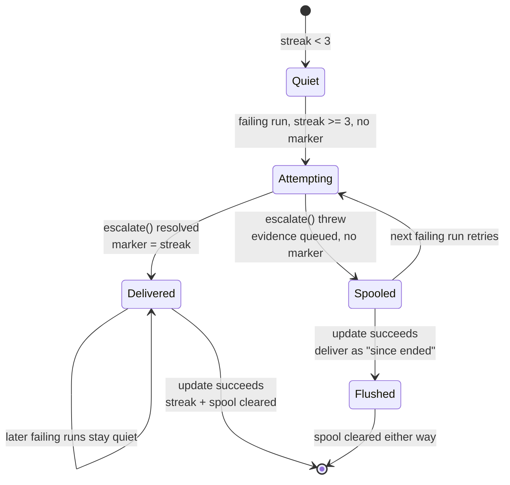

# Re-arm and spool the checkout-update escalation

## Summary

The checkout-update crash-loop escalation (Issue #4204) fired only on the single
run where the streak *equalled* the threshold, and its transport — `gh issue
create` against `api.github.com` — needs the network whose loss is the dominant
cause of the streak. The one firing observed on GRQ-23 threw, and the condition
was never escalated again: the host ran stale code with nothing but a log line.

This change re-arms and queues that escalation in
`worker/deno/lib/checkout_update.ts`:

- delivery is attempted on **every** failing run at or above the threshold
  until one report lands;
- the escalated-at marker is recorded **only** on a successful send, and it is
  believed only while the streak is later than the delivery it records, so a
  marker left behind by an earlier streak cannot silence a host for ever;
- evidence that could not be sent is spooled in
  `<logDir>/checkout-update-escalation` — a single JSON object, one entry per
  streak, overwritten, written atomically;
- the run that recovers delivers whatever is still queued, marked as an outage
  that has **since ended**, then clears the streak and the spool together, so an
  outage is reported after it ends and no queued report outlives the condition
  it describes;
- persistence failures fail loud: the log never says "spooled for the next run"
  over evidence that did not reach the disk.

Closes #1018.

## Evidence

Backend/CLI change with no web interface, so there is nothing to screenshot; the
evidence is the tests below and the full quality gate.



Behaviour before this change, from the live log the issue quotes: one attempt at
streak 3, which threw, and silence from streak 4 onwards. The new suite drives
the same sequence and asserts attempts at streaks `[3, 4, 5]`; run against the
unfixed guard (`streak === CHECKOUT_UPDATE_ESCALATION_THRESHOLD`) that assertion
is `[3]`.

```text
deno test --allow-all tests/checkout_update_escalation_spool_test.ts \
  tests/checkout_update_test.ts
ok | 31 passed | 0 failed (121ms)

./quality.sh
Result: PASSED (with skipped checks)
```

## Acceptance Criteria

<!-- vibe-spec-review inputs="diff+issue-body" -->

- **met** — a failed escalation attempt leaves the streak eligible; the next
  failing run attempts it again — evidence:
  `worker/deno/tests/checkout_update_escalation_spool_test.ts::updateCheckout - a failed escalation is retried on every later failing run (Issue #1018)`
  — reviewer: met
- **met** — a successful escalation marks the streak escalated and no second
  issue is raised for the same streak — evidence:
  `worker/deno/tests/checkout_update_escalation_spool_test.ts::updateCheckout - a delivered escalation silences the rest of the streak (Issue #1018)`
  — reviewer: met
- **met** — evidence from a failed escalation is spooled durably and delivered
  on the next run with connectivity — evidence:
  `worker/deno/tests/checkout_update_escalation_spool_test.ts::updateCheckout - undelivered evidence is spooled and delivered once (Issue #1018)`
  and `::updateCheckout - a successful update flushes the spool and clears it with the streak (Issue #1018)`
  — reviewer: partial — reason: the reviewer saw the first draft, where the
  drain ran only on a run whose update *also* failed, so a recovered host
  discarded the queued report; commit `990c625a` makes the recovering run
  deliver it (marked "since ended") and the write now goes through
  `atomicWrite`, both covered by the tests named above
- **met** — the spool holds at most one entry per streak and is cleared when the
  streak resets — evidence: `worker/deno/lib/checkout_update.ts`
  (`CheckoutEscalationState` holds a single `pending`, overwritten) and
  `worker/deno/tests/checkout_update_escalation_spool_test.ts::updateCheckout - a successful update flushes the spool and clears it with the streak (Issue #1018)`
  — reviewer: met
- **met** — `./quality.sh` passes — evidence: full gate run after the final
  edit, `Result: PASSED (with skipped checks)` — reviewer: met
- **unrequested** — `worker/deno/lib/slot_idle_accounting.ts` regains
  `parkedHostCapacity` — reviewer: unrequested — reason: the merge of `main`
  into the milestone branch dropped the function while
  `container_restart_backoff.ts:88` still imports it, so `deno check` and the
  test suite are red on the base branch; it is restored verbatim from `79ccb1e7`
  in its own commit (`6173fa38`) because no PR against that base can otherwise
  be green
- **unrequested** — the escalation issue body gains a "queued on …" paragraph, a
  recovered-outage opening, and the `spooledAt` / `recovered` context fields —
  reviewer: unrequested — reason: a late report that reads as a live one would
  send an operator to a host that is already fine

## Standards Review

<!-- vibe-standards-review inputs="diff+CODING-STANDARDS.md" -->

- **violation** — swallowed write errors while the log claimed the evidence was
  queued — evidence: `worker/deno/lib/checkout_update.ts:632` (as reviewed) —
  reason: fixed here — `defaultWriteEscalationState` now throws,
  `saveEscalationState` reports the failure and returns false, and the log says
  "the evidence could NOT be queued" when it did not reach the disk
- **violation** — an unremovable spool file treated as "nothing is queued",
  which would let a cleared condition be reported later — evidence:
  `worker/deno/lib/checkout_update.ts:624-626` (as reviewed) — reason: fixed
  here — only `NotFound` is ignored, any other removal failure is logged, and
  the marker is now believed only within its own streak so a leftover file
  cannot silence the host either
- **violation** — the new persistence layer's error and edge paths were
  untested — evidence: `worker/deno/tests/checkout_update_escalation_spool_test.ts`
  (as reviewed) — reason: fixed here — added a corrupt-store test, an
  unwritable-spool test, an undeliverable-flush test and a stale-marker test
- **violation** — no `docs/archive/pr-summaries/pr-summary-1018.md` — evidence:
  repo root (as reviewed) — reason: fixed here — this file
- **violation** (lower confidence) — DRY against the equivalent queue in
  `container_restart_backoff.ts` (Issue #343), which also records an
  `escalation_undeliverable` self-heal event — evidence:
  `worker/deno/lib/checkout_update.ts:770-907` — reason: stands. Sharing that
  machinery would pull the launcher's self-heal event store into a command that
  deliberately runs before the configuration load; the abandoned-report case is
  instead reported loudly in `run_core.log`, which is the surface this update
  already writes to
- **clean** — Australian English throughout; tests drive the real
  `updateCheckout` against real on-disk state under `Deno.makeTempDir` with only
  git and `gh` stubbed; no existing test removed (one modified case documents in
  file why a count-based assertion became a marker-based one); no hidden or
  credential-shaped paths staged; both docs surfaces updated with the code;
  `Result<T>` and the existing dependency-injection shape reused

## Test Plan

Added `worker/deno/tests/checkout_update_escalation_spool_test.ts`:

- a failed escalation is retried on every later failing run (attempts at streaks
  `[3, 4, 5]`, none reported as delivered);
- a delivered escalation silences the rest of the streak (throw once, then
  succeed: exactly one issue, attempts `[3, 4]`, marker persisted);
- undelivered evidence is spooled and delivered once, with the spooled
  timestamp, and the spool is empty afterwards;
- a successful update flushes the spool as a recovered outage, clears the streak
  and the spool, and the next streak escalates afresh;
- a flush that cannot be delivered still clears the spool and says so;
- a corrupt store re-escalates rather than silencing the host;
- a marker left over from an earlier streak does not silence the new one;
- a spool that cannot be written is reported as unqueued, naming the cause.

Modified `worker/deno/tests/checkout_update_test.ts`: the "fourth failure stays
quiet" case now states the escalated-at marker instead of inferring it from the
streak count, because the count alone no longer proves a report was delivered —
that is the defect this issue fixes. The recording dependency set gains the two
new escalation-state seams.
