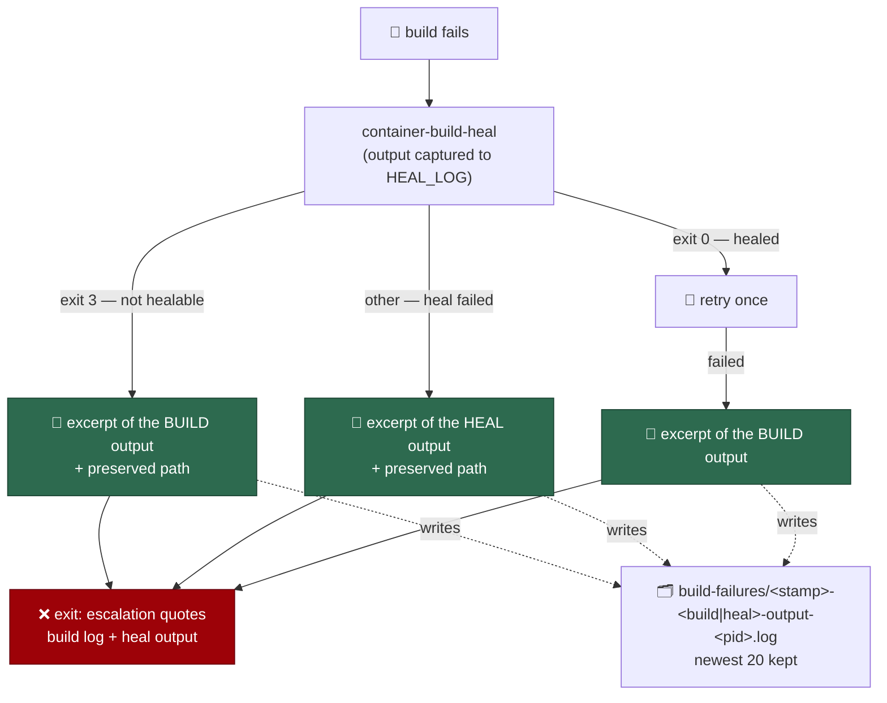

# The launcher records which reason, not which reason it was not

## Summary

`run_core.log` on GRQ-23 said
`build failed for a reason the builder heal does not cover` seven times in four
hours while `${BUILD_LOG}` — the one file that named the reason — was a `mktemp`
capture the EXIT trap reaped. Both launchers now write a bounded excerpt of the
failing step's own output into `run_core.log`, preserve the full output at a
named, timestamped path under the launcher's log directory, name that path in
the log line, and carry the heal's own words into the `image_build` escalation.
Retention is count-based, so the new directory cannot grow without limit.
Closes #1019.

## Evidence

Backend/CLI change with no web interface to screenshot. What a not-healable
build failure now writes (captured from the real `run.sh` under the launcher
harness):

```text
2026-09-05T09:06:31Z container-build-heal: vibe-coder:454fed0ea6b1 build failed for a reason the builder heal does not cover - full output preserved at .../logs/build-failures/20260905T090631Z-build-output-512355.log
2026-09-05T09:06:31Z build output (last 40 lines):
  | E: Unable to locate package libgrq23-dev
```



PowerShell was exercised, not merely written: `pwsh` 7.4.6 was installed in the
run container and every `run.ps1` and parity case ran green under it
(`VIBE_PWSH=… deno test tests/run_ps1_launcher_test.ts tests/launcher_parity_test.ts`
→ 59 passed, 0 failed). `./quality.sh` passes.

## Acceptance Criteria

<!-- vibe-spec-review inputs="diff+issue-body" -->

- **met** — a not-healable build failure writes a bounded excerpt of the build
  output to `run_core.log` — evidence:
  `worker/deno/tests/run_sh_launcher_test.ts::run.sh - a not-healable build failure records the build's own words, not only the classification (Issue #1019)`,
  `run.sh:472` (`log_run_core_excerpt`) — reviewer: met
- **met** — the full build log is preserved at a named, timestamped path and
  that path appears in the log line — evidence: `run.sh:449`
  (`preserve_build_failure_log`), `run.sh:498`; the test reads the directory and
  asserts the exact path string appears in `run_core.log` — reviewer: met
- **met** — preserved build logs are subject to bounded retention — evidence:
  `run.sh:428` (`prune_build_failure_logs`, newest 20),
  `worker/deno/tests/run_sh_launcher_test.ts::run.sh - preserved build logs are bounded, and the newest is never the one dropped (Issue #1019)`
  — reviewer: met
- **met** — the `could not heal the builder` branch records the heal attempt's
  own output — evidence: `run.sh:812` (`heal_builder` tees to `HEAL_LOG`),
  `run.sh:882`;
  `worker/deno/tests/run_sh_launcher_test.ts::run.sh - a heal that fails records the heal's own output (Issue #1019)`
  — reviewer: met
- **met** — the auto-filed launcher-failure issue carries the excerpt —
  evidence: `run.sh:898` appends the heal output to the evidence log before
  `EVIDENCE_LOG` is handed to `container-restart-backoff`;
  `…::run.sh - the image_build escalation carries the heal's words, not just the build's (Issue #1019)`
  — reviewer: met — reason: the reviewer noted the escalation carries the full
  logs rather than the 40-line excerpt, and does not name the preserved path;
  the full log is a superset of the excerpt, so the criterion stands as met
- **met** — `run.ps1` has the equivalent behaviour and its tests pass under
  pwsh — evidence: `run.ps1:384`, `:414`, `:449`, `:798`, `:876`; six
  `run_ps1_launcher_test.ts` cases plus
  `launcher_parity_test.ts::run.sh and run.ps1 - both record the failed build's own words…`
  — reviewer: partial — reason: the reviewer's environment had no `pwsh` so all
  PowerShell cases were `ignore`d for it; `pwsh` 7.4.6 was then installed here
  and every one of them ran green, which is what the criterion asks for
- **met** — `./quality.sh` passes — evidence: full gate run after the final
  edit, `Result: PASSED (with skipped checks)` — reviewer: missing — reason: the
  reviewer saw only the diff and could not run the gate; it was run here and
  passed
- **unrequested** — exit status 88 (the parked host, Issue #997) restored to the
  known-status table in `worker/deno/lib/launcher_failure_evidence.ts` —
  reviewer: unrequested — reason: the milestone merge (`23e8b808`) resolved a
  4th-parameter conflict by keeping only the extension-abort status, so
  `container_egress_park_test.ts` failed and `deno lint` errored on the branch
  base. Both statuses are known again; without it no PR from this branch could
  pass the gate
- **unrequested** — a third evidence branch,
  `container-build: <image> build failed (status N)`, on the generic failing
  exit — reviewer: unrequested — reason: it is what covers the
  heal-succeeded→retry-failed path, which otherwise still exits with no account
  of the build's own words

## Standards Review

<!-- vibe-standards-review inputs="diff+CODING-STANDARDS.md" -->

- **violation** — the preserve path swallowed its own failure cause
  (`cp … 2>/dev/null || return 1`, `catch { return "" }`) — evidence:
  `run.sh:449`, `run.ps1:384` — reason: fixed here; both now name the cause on
  stderr (`cannot preserve … - <reason>`) and are covered by
  `…::a preserve that cannot be made says why, and the launch still fails loud (Issue #1019)`
  on each launcher
- **violation** — empty `catch { }` in `Remove-OldBuildFailureLogs` — evidence:
  `run.ps1:369` — reason: fixed here; a prune that cannot run writes a warning
  naming the directory and the exception
- **violation** — the new error and edge-case branches had no tests — evidence:
  `run.sh:481`, `run.ps1:423` — reason: fixed here; the empty-capture branch and
  the unpreservable branch each have a case on both launchers (four new tests)
- **violation** — PowerShell/bash parity gap: `run.ps1` guarded the escalation
  append with `Test-Path` only, so a silent heal appended a bare
  `--- container-build-heal output ---` heading — evidence: `run.ps1:898` —
  reason: fixed in `3891880a`; the guard now also requires a non-empty file,
  matching `run.sh`'s `[[ -s ]]`, and `run_ps1_launcher_test.ts` covers the
  escalation
- **violation** — `docs/CONTAINER.md` named `~/logs/build-failures` as though it
  were unconditional — evidence: `docs/CONTAINER.md:591` — reason: fixed in
  `3891880a`; the prose now says the preserved logs follow the launcher's own
  log directory. `run.ps1` still ignores `LOG_DIR` for `run_core.log` itself —
  pre-existing and out of scope here, so the new artifact deliberately sits
  beside `run_core.log` on each launcher rather than in a third place
- **violation** — new decision logic (retention, path construction, excerpt
  selection) added to shell twice rather than to Deno — evidence: `run.sh:419`,
  `run.ps1:344` — reason: stands. The evidence being kept is launcher-local host
  state — the `mktemp` capture the EXIT trap owns, and the `run_core.log` the
  launcher already writes — and the log line has to name the path it kept, so a
  Deno command would still leave the naming and the lifetime in the launcher.
  The repository's own precedent for exactly this is `loop.sh:70`
- **violation** — `prune_build_failure_logs` duplicates `loop.sh:70`
  `prune_launch_logs` — evidence: `run.sh:428` — reason: stands. `run.sh` is the
  trusted containment boundary and deliberately sources no shared shell library;
  the two are ~10 lines each and a shared `source` would widen that boundary
- **clean** — Australian English throughout; fail-loud on the primary path (a
  failed build still exits non-zero with its status); tests spawn the real
  launchers through the harness and assert on files and exit codes rather than
  grepping source; no existing test removed or weakened (the
  `knownWorkerStatuses` assertion is extended with `88`); no hidden paths staged;
  cross-platform bash (`${arr[@]}` guarded, `mktemp`/`date -u`/`tail -n`/`sed`
  in portable spellings, `PIPESTATUS[0]` captured before `set -e` is restored);
  `shellcheck run.sh` clean; docs updated alongside the code

## Test Plan

- `worker/deno/tests/run_sh_launcher_test.ts` — six new cases: the not-healable
  excerpt and preserved path, the failed heal's own output, a silent build
  recorded as having said nothing, a preserve that cannot be made naming its
  cause, the escalation carrying the heal's words, and bounded retention that
  keeps the newest.
- `worker/deno/tests/run_ps1_launcher_test.ts` — the same six against `run.ps1`,
  all run green under `pwsh` 7.4.6.
- `worker/deno/tests/launcher_parity_test.ts` — both launchers record the failed
  build's own words, preserve it, and name the path.
- `worker/deno/tests/fixtures/launcher_harness.ts` — `STUB_BUILDER_HEAL_EXIT` /
  `STUB_BUILDER_HEAL_STDERR` let a test fail the step that would leave a usable
  builder, plus `buildFailureLogs` / `buildFailureLogDir` readers.
- `worker/deno/tests/launcher_failure_evidence_test.ts` — the known-status table
  assertion extended with the parked-host status `88`.
- Full gate: `./quality.sh` → `Result: PASSED (with skipped checks)`.
