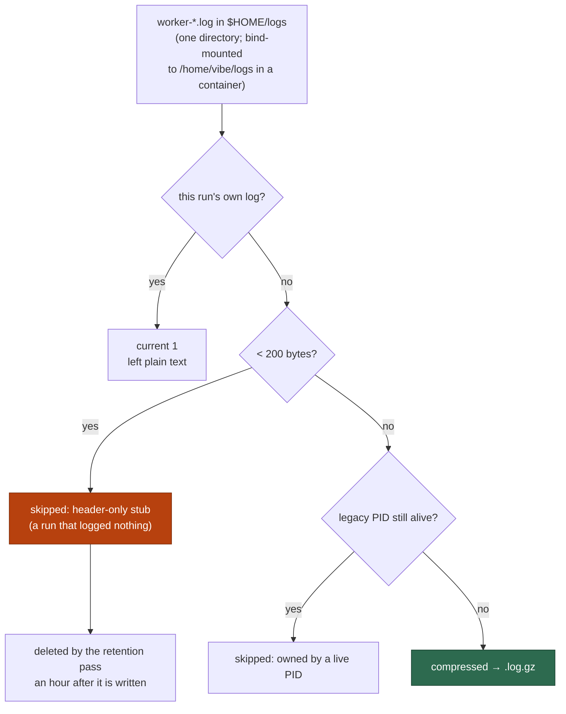

# PR Summary — Issues #1118, #1021

Closes #1118
Closes #1021

## Summary

Two issues, one of them already resolved on the default branch.

### #1118 — the default branch is red

**Already fixed; closed with evidence, no code change.** The report bisected
`run_core_slot_pool_test.ts` "a success is followed by the normal sleep and
another claim in the SAME slot (Issue #178)" as failing at `6aea71e`, `be9daca`
and `f4266bb`. It was fixed by
[#1137](https://github.com/stSoftwareAU/VibeCoder/pull/1137) (`b94d8449`,
"quality.sh is red on the milestone base branch: slot-pool and production-deps
tests fail with no change applied (Issue #1098)"), which landed after the last
commit the reporter bisected. The cause was tests inheriting the host's
`WORK_DIR` — the rule now written up in `CODING-STANDARDS.md` under "Never let a
unit test inherit the host's state".

Verified on `de1376b3` (`origin/main` at the time of writing), the exact
reproduction command from the issue:

```text
$ deno test -A tests/run_core_slot_pool_test.ts \
    --filter "a success is followed by the normal sleep" < /dev/null
slot pool - a success is followed by the normal sleep and another claim in the
SAME slot, not a pool drain (Issue #178) ... ok (35ms)
ok | 1 passed | 0 failed | 38 filtered out

$ deno test -A tests/run_core_slot_pool_test.ts < /dev/null
ok | 39 passed | 0 failed

$ deno test -A tests/run_core_production_deps_test.ts < /dev/null
ok | 23 passed | 0 failed
```

The second, intermittent failure the issue also mentions
(`createProductionRunCoreDeps - static trust refresh succeeds and does not
throw`) was fixed by the same PR and passes here too.

### #1021 — `worker log gzip: compressed 0, skipped 39`

**The count was arithmetically sound; the message was unfalsifiable.** The
disagreement the issue reports cannot come from the counter:

- `skipped` is incremented at most once per directory entry matching
  `/^worker-(\d+(?:-\d+)*)\.log$/`, so it can never exceed the candidates
  present. There is no overcount to fix.
- The "second log directory inside the container" hypothesis is wrong. The
  container mounts the host's `$HOME/logs` read-write at `/home/vibe/logs`
  (`container_launch.ts`, asserted by `container_launch_test.ts`), so the host
  and the container see one directory.
- The retention pass already covers that directory and already deletes a
  header-only stub older than an hour — both directions are pinned by
  `worker_log_cleanup_test.ts` ("deletes header-only stubs older than 1 hour",
  "preserves header-only stub younger than min age"), and `run_housekeeping.ts`
  passes the same `logDir` to both passes.

So the 39 were 39 real header-only stubs: 39 consecutive starts that wrote
nothing past their header line and therefore never reached the housekeeping
step that would have deleted them. A run that does work leaves a compressible
log *and* runs housekeeping, which is exactly why the counter only ever reset on
a run that logged `compressed 1`.

What was actually broken is that the line could not say any of that. It named no
directory, no cause, and did not account for the current run's own log — which
the pass passes over without counting — so the total could not be reconciled
against an `ls`. The fix makes the summary self-auditing:

```text
worker log gzip: /home/vibe/logs: 6 worker log(s) present = compressed 2 +
skipped 3 + failed 0 + current 1; skipped: 3 header-only stub(s) below the
200-byte size floor, 0 owned by a live PID
```

Every candidate now lands in exactly one bucket, the buckets sum to the
candidate count, and a rising stub figure reads as what it is — that many runs
that did nothing — rather than as a compression problem.

`GzipWorkerLogsResult` gains `logDir`, `candidates`, `skippedByReason`
(`belowSizeFloor` / `ownerStillRunning`) and `currentRunLogs`. `skipped` keeps
its meaning as the total.



## Evidence

No UI change, so no screenshots. The evidence for #1118 is the test output
above, reproduced from the issue's own command on the current default branch.
The evidence for #1021 is the regression test below, which fails against the
unfixed module (`Property 'candidates' does not exist on type
'GzipWorkerLogsResult'`, and the old message contains neither the directory nor
a cause) and passes after it.

## Test Plan

Added to `worker/deno/tests/worker_log_gzip_test.ts`:

1. **"the summary names the directory and accounts for every candidate
   (Issue #1021)"** — a fixture directory holding one current log, three
   sub-200-byte stubs, two compressible logs, one `.log.gz` and one `pull.log.1`.
   Asserts the exact candidate count (6), the exact compressed/skipped/failure
   numbers, the per-reason breakdown, and that
   `compressed + skipped + failures + current === candidates`. A miscount fails
   immediately — this is the assertion that would have caught the reported
   disagreement.
2. **"a live owning PID is reported separately from a stub (Issue #1021)"** —
   the two skip reasons mean opposite things, so one total cannot serve both.
3. **"an unreadable directory is named in the summary (Issue #1021)"** — the
   missing-directory path names the path it could not read.

`worker/deno/tests/run_bootstrap_test.ts` updated for the widened result type.

Verification (from `worker/deno`):

```text
deno fmt --check / deno lint            clean on the changed files
deno check lib/worker_log_gzip.ts tests/worker_log_gzip_test.ts
                                        tests/run_bootstrap_test.ts   ok
deno check mod.ts                       ok
deno check tests/                       ok
deno test -A tests/run_bootstrap_test.ts tests/worker_log_cleanup_test.ts \
           tests/worker_log_gzip_test.ts    50 passed, 0 failed
deno test -A tests/run_core_slot_pool_test.ts        39 passed, 0 failed
deno test -A tests/run_core_production_deps_test.ts  23 passed, 0 failed
```
