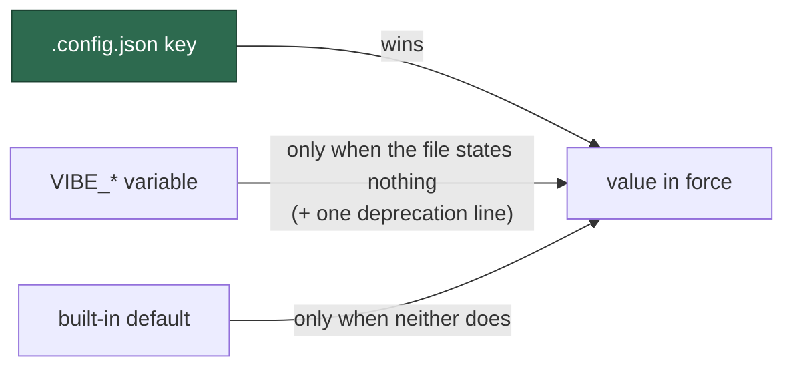

# The config file wins over the environment, in all three resolvers

## Summary

Three modules resolved a `.config.json` key against a `VIBE_*` variable and two
contradicted the rule Issue #289 settled: `optional_feature_env.ts` reproduced
the bash-era `${VAR:-config}` expansion, and `agent_provider.ts` documented
environment-then-config on itself. Both now resolve through `resolveSetting`,
so **`config → env → default` holds everywhere** and
`DECLARED_PRECEDENCE_EXCEPTIONS` is empty.

`warnDeprecatedEnvSetting` states the deprecation **once per setting per run**,
naming the config key that replaces the variable — the provider seam resolves
per invocation, so a line on every read would be noise an operator learns to
filter.

This is a behaviour change, not a fix, and is recorded as such in the 2.0.0
section of `docs/RELEASE-NOTES.md`: a host that sets both sources now takes the
file for `imgbb_api_key`, `agent_provider` and `agent_providers` — and for
`update_gh_user_status`, which shares the migrated module.

Closes #1032.

## Evidence

Backend/CLI change with no web interface to screenshot. The evidence is the
suite and the gate.

- `./quality.sh` — **PASSED** (17 493 tests; deno tests, lint, type check, fmt,
  markdownlint, mermaid, semgrep all green).
- **The conformance test still bites.** A throwaway `lib/zz_precedence_probe.ts`
  resolving `VIBE_IMGBB_API_KEY` against `"imgbb_api_key"` without
  `resolveSetting` was added; `config precedence - no undeclared module decides
  the rule for itself` **failed**, and passed again once the probe was deleted.
  With the exception list empty there is nothing left to hide behind.
- **The gate was red before this branch.** `mod_test.ts` expected 148 commands
  while the milestone branch carries 149 — Issue #873's `log-dir` landed without
  the count following it, the unnoticed red the assertion's own comment
  describes (`milestone/*` requires no checks). Corrected here so this PR's gate
  means something.

## Test Plan

- `worker/deno/tests/config_precedence_test.ts` — `DECLARED_PRECEDENCE_EXCEPTIONS`
  emptied; three new tests for the warn-once helper (one line however often a
  setting is resolved; silence when the file or the default supplied it; each
  setting reported on its own).
- `worker/deno/tests/optional_feature_env_test.ts` — the two assertions that
  pinned "environment wins" are **inverted** and marked with the issue (a
  documented business-logic change, not a deletion); added the config-alone /
  environment-alone / both-set cases and the deprecation-warning assertions.
- `worker/deno/tests/agent_provider_test.ts` — added the both-set behaviour
  change for `agent_provider` and `agent_providers`, config-alone and
  environment-alone for each, and a warn-once test per setting.
- `worker/deno/tests/agent_provider_deepseek_test.ts` — the
  `VIBE_AGENT_PROVIDER=deepseek overrides configuration` test is **inverted**:
  the variable now selects DeepSeek only where the file selects nothing.
- `worker/deno/tests/mod_test.ts` — command count 148 → 149, naming `log-dir`.

## Documentation

`docs/RELEASE-NOTES.md` (new 2.0.0 section: what changed, the breaking table,
the migration, the rollback), `docs/CONFIGURATION.md` (the rule stated once,
plus the `agent_provider`, `agent_providers` and `imgbb_api_key` rows),
`docs/CONTAINER.md`, `docs/SETUP.md`, `docs/DEPLOYMENT.md`, `README.md`, and the
`VIBE_ENV_REGISTRY` notes that still called the two provider variables
overrides.
