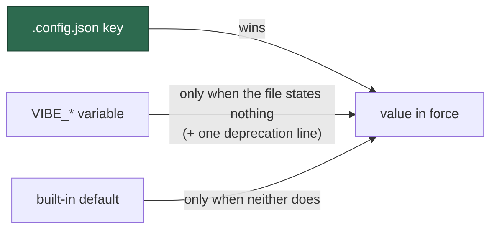

# The config file wins over the environment, in all three resolvers

## Summary

Three modules resolved a `.config.json` key against a `VIBE_*` variable and two
contradicted the rule Issue #289 settled: `optional_feature_env.ts` reproduced
the bash-era `${VAR:-config}` expansion, and `agent_provider.ts` documented
environment-then-config on itself. Both now resolve through `resolveSetting`,
so **`config → env → default` holds everywhere** and
`DECLARED_PRECEDENCE_EXCEPTIONS` is empty.

`warnDeprecatedEnvSetting` states the deprecation **once per setting per run**,
naming the config key that replaces the variable — the provider seam resolves
per invocation, so a line on every read would be noise an operator learns to
filter.

This is a behaviour change, not a fix, and is recorded as such in the 2.0.0
section of `docs/RELEASE-NOTES.md`: a host that sets both sources now takes the
file for `imgbb_api_key`, `agent_provider` and `agent_providers` — and for
`update_gh_user_status`, which shares the migrated module.

Closes #1032.

## Evidence

Backend/CLI change with no web interface to screenshot. The evidence is the
suite and the gate.

- `./quality.sh` — **PASSED** (17 493 tests; deno tests, lint, type check, fmt,
  markdownlint, mermaid, semgrep all green).
- **The conformance test still bites.** A throwaway `lib/zz_precedence_probe.ts`
  resolving `VIBE_IMGBB_API_KEY` against `"imgbb_api_key"` without
  `resolveSetting` was added; `config precedence - no undeclared module decides
  the rule for itself` **failed**, and passed again once the probe was deleted.
  With the exception list empty there is nothing left to hide behind.
- **The gate was red before this branch.** `mod_test.ts` expected 148 commands
  while the milestone branch carries 149 — Issue #873's `log-dir` landed without
  the count following it, the unnoticed red the assertion's own comment
  describes (`milestone/*` requires no checks). Corrected here so this PR's gate
  means something.

## Acceptance Criteria

<!-- vibe-spec-review inputs="diff+issue-body" -->

- **met** — All three modules resolve through `resolveSetting` — evidence:
  `worker/deno/lib/optional_feature_env.ts:88`,
  `worker/deno/lib/agent_provider.ts:840` and `:1112`,
  `worker/deno/lib/host_disk.ts:185` — reviewer: met
- **met** — `DECLARED_PRECEDENCE_EXCEPTIONS` is empty and the conformance test
  still fails on a newly divergent module — evidence:
  `worker/deno/tests/config_precedence_test.ts::config precedence - no
  undeclared module decides the rule for itself`, verified by adding a
  throwaway divergent module and watching it fail — reviewer: met
- **met** — A run that takes any of the three from the environment logs one
  warning naming the config key — evidence:
  `worker/deno/tests/agent_provider_test.ts::agent provider - a provider taken
  from the environment is deprecated once, naming the config key` and
  `worker/deno/tests/optional_feature_env_test.ts::resolveOptionalFeatureEnv -
  the environment applies when the file states nothing, and is deprecated once`
  — reviewer: met
- **partial** — The 2.0.0 migration notes name the three settings and the
  direction of the change — evidence: `docs/RELEASE-NOTES.md` (the Was/Now
  table names all four settings, with migration and rollback) — reviewer:
  partial — reason: the reviewer marked it partial because `.release-floor` is
  still `1.4.0`, so nothing mints a 2.0.0 tag. The floor is not raised here: it
  takes effect on the merge to `main`, and this PR targets
  `milestone/configuration-one-source-of-truth`, so raising it would decide the
  whole milestone's release number. The notes now say so explicitly and name
  the merge that moves it.
- **met** — `./quality.sh` passes — evidence: full gate run after the final
  edit, `Result: PASSED (with skipped checks)`, 19 checks, 0 failures —
  reviewer: met — reason: the reviewer ran the gate itself at an earlier commit
  and saw the same result; the run recorded here is the final one.
- **missing** — Ship the deprecation warning in a 1.x release before the flip —
  reviewer: missing — reason: correct, and it cannot be done from this branch:
  a 1.x release is cut from `main`, and this milestone branch is where 2.0.0 is
  assembled. The false claim that it had shipped was removed from the release
  note rather than left standing.
- **unrequested** — `update_gh_user_status` / `UPDATE_GH_USER_STATUS`
  precedence flipped too — evidence:
  `worker/deno/lib/optional_feature_env.ts:82` — reviewer: unrequested —
  reason: it is the second key of the migrated module, and leaving it on
  env-wins would put two precedence orders inside one module, which is the
  defect the issue removes. Disclosed as a fourth row in the release note.
- **unrequested** — `worker/deno/tests/mod_test.ts` command count 148 → 149 —
  evidence: `worker/deno/tests/mod_test.ts:219` — reviewer: unrequested —
  reason: the milestone branch was already red (Issue #873's `log-dir` landed
  without the count), and `./quality.sh` passing is an acceptance criterion of
  this issue, so the gate had to be made honest before it could mean anything.
- **unrequested** — `clearDeprecatedEnvWarnings()` exported for tests —
  evidence: `worker/deno/lib/config_precedence.ts:191` — reviewer: unrequested
  — reason: the warn-once state has to be resettable to assert "exactly once",
  and this follows the existing `clearDeepSeekEffortWarnings` precedent rather
  than inventing a pattern.
- **unrequested** — doc rewrites beyond the migration notes (`README.md`,
  `docs/CONFIGURATION.md`, `docs/CONTAINER.md`, `docs/SETUP.md`,
  `docs/DEPLOYMENT.md`, and the `VIBE_*` doc comments in `types.ts`,
  `config.ts`, `agent_provider_config.ts`, `container_image_hash.ts`,
  `setup/agent_providers.ts`, `setup.sh`, `setup.ps1`) — reviewer: unrequested
  — reason: "A Code Change Owes a Docs Change" — every surface calling these
  variables *overrides* became false with this diff. The reviewers found the
  first sweep incomplete; it is complete now.

## Standards Review

<!-- vibe-standards-review inputs="diff+CODING-STANDARDS.md" -->

- **violation** — fail-loud regression: an unsupported `VIBE_AGENT_PROVIDER` /
  `VIBE_AGENT_PROVIDERS` was silently ignored once the file won, while the
  docstring still promised it failed loudly — evidence:
  `worker/deno/lib/agent_provider.ts:840` — reason: **fixed here** — both
  resolvers now validate the variable whichever source binds
  (`agent_provider.ts:851` and `:1120`), covered by
  `agent_provider_test.ts::agent provider - an unsupported environment id still
  fails loudly when the file wins`.
- **violation** — `agent_provider`'s `parse` throws where
  `resolveSetting` documents a `null` return — evidence:
  `worker/deno/lib/config_precedence.ts:59` — reason: **fixed in the doc, not
  the code** — falling through is right for a number and wrong for a provider
  id (it would run another vendor's agent), so the contract now states when a
  caller may throw and why.
- **violation** — `docs/CONFIGURATION.md` claimed every environment fallback
  warns, but `host_disk.ts` resolves without warning — evidence:
  `docs/CONFIGURATION.md:2265` — reason: **fixed here** — the claim is narrowed
  to the settings that actually warn.
- **violation** — stale "overrides" prose in eight surfaces the flip made false
  — evidence: `worker/deno/types.ts:1055`, `worker/deno/lib/config.ts:530`,
  `worker/deno/lib/agent_provider_config.ts:108`,
  `worker/deno/commands/container_image_hash.ts:99`,
  `worker/deno/setup/agent_providers.ts:40`, `setup.sh:838`, `setup.ps1:956`,
  `docs/DEPLOYMENT.md:571` — reason: **fixed here** — all swept.
- **violation** — `docs/RELEASE-NOTES.md` asserted the deprecation warning
  shipped in a 1.x release before the flip; it does not — evidence:
  `docs/RELEASE-NOTES.md:66` — reason: **fixed here** — the note now says the
  warning arrives with the flip, and the `.release-floor` position is stated
  rather than implied.
- **violation** — DRY: `capturingWarnings` was added verbatim in three test
  files — evidence: `worker/deno/tests/config_precedence_test.ts:130` —
  reason: **fixed here** — moved to
  `worker/deno/tests/support/warnings.ts`, the repo's declared home for shared
  test helpers.
- **violation** — module-level mutable `Set` plus a test-only reset export,
  where an injected sink was suggested — evidence:
  `worker/deno/lib/config_precedence.ts:180` — reason: **stands** — warn-once
  per process is what the requirement asks for, `clearDeepSeekEffortWarnings`
  is the existing precedent, and Deno runs test files in separate workers so
  the state cannot leak between suites. Threading a sink through every provider
  call site buys nothing the reset does not.
- **violation** — the #289/#874 history is re-narrated in several places —
  evidence: `worker/deno/lib/config_precedence.ts:5` — reason: **stands**, and
  the module header was in fact *shortened* here; the repo's prose style is
  deliberately narrative and the reviewer scored this low-confidence itself.
- **clean** — Australian English throughout; no hidden or secret paths staged;
  every new test calls real functions and asserts on returned values or
  captured output (no source-grepping); inverted assertions carry an inline
  "Issue #1032" note rather than being deleted; every test states its own `env`
  lookup instead of mutating the process; secrets never reach the warning (it
  names variables and keys, never values); commits reference the issue and
  carry the run-id trailer, with `feat!:` marking the break.

## Test Plan

- `worker/deno/tests/config_precedence_test.ts` — `DECLARED_PRECEDENCE_EXCEPTIONS`
  emptied; three new tests for the warn-once helper (one line however often a
  setting is resolved; silence when the file or the default supplied it; each
  setting reported on its own).
- `worker/deno/tests/optional_feature_env_test.ts` — the two assertions that
  pinned "environment wins" are **inverted** and marked with the issue (a
  documented business-logic change, not a deletion); added the config-alone /
  environment-alone / both-set cases and the deprecation-warning assertions.
- `worker/deno/tests/agent_provider_test.ts` — added the both-set behaviour
  change for `agent_provider` and `agent_providers`, config-alone and
  environment-alone for each, and a warn-once test per setting.
- `worker/deno/tests/agent_provider_deepseek_test.ts` — the
  `VIBE_AGENT_PROVIDER=deepseek overrides configuration` test is **inverted**:
  the variable now selects DeepSeek only where the file selects nothing.
- `worker/deno/tests/mod_test.ts` — command count 148 → 149, naming `log-dir`.
- `worker/deno/tests/support/warnings.ts` — new shared `capturingWarnings`
  helper, used by the three suites that assert on the deprecation line.
- Fail-loud regression cover added after review: `agent provider - an
  unsupported environment id still fails loudly when the file wins`, for both
  the active provider and the enabled set.

## Documentation

`docs/RELEASE-NOTES.md` (new 2.0.0 section: what changed, the breaking table,
the migration, the rollback), `docs/CONFIGURATION.md` (the rule stated once,
plus the `agent_provider`, `agent_providers` and `imgbb_api_key` rows),
`docs/CONTAINER.md`, `docs/SETUP.md`, `docs/DEPLOYMENT.md`, `README.md`, and the
`VIBE_ENV_REGISTRY` notes that still called the two provider variables
overrides.
