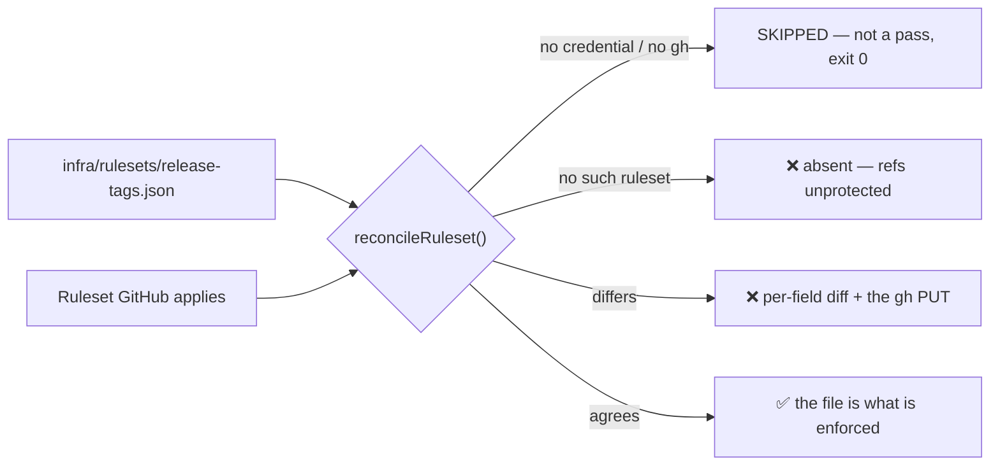

# Reconcile the applied release-tag ruleset against the committed payload

## Summary

`infra/rulesets/release-tags.json` called itself the source of truth for this
repository's tag ruleset, and nothing compared it against GitHub. The applied
ruleset carried `deletion` and `non_fast_forward` but not `update`, so a
released tag could still be fast-forwarded onto a later commit while the file,
`docs/RELEASE-TAGGING.md` and `release_tag_ruleset_test.ts` all said it could
not. The missing rule was the symptom; the absent comparison was the defect.

**The open question is settled.** GitHub **does** accept `update` on a
tag-target ruleset — `gh api --method PUT repos/stSoftwareAU/VibeCoder/rulesets/22264472 --input infra/rulesets/release-tags.json`
read back `["deletion","non_fast_forward","update"]`. So the rule was dropped
when a human applied the payload for Issue #869, not rejected by the API. The
committed file was already correct and is unchanged; the **live ruleset** was
corrected, which is why there is no deliberate difference to record in the
file.

This adds the comparison that would have caught it: `check-release-tag-ruleset`
and a `release-tag ruleset` stage in the local quality gate. The fetch and the
drift / absent / skipped semantics move into `worker/deno/lib/ruleset_reconcile.ts`,
shared with the `main`-branch check of Issue #858 rather than duplicated.

Closes #1049.

## Evidence

Backend/CLI only — no web interface to screenshot.

**The drift, before and after.** The `PUT` is the whole experiment the issue
asked for:

```console
$ gh api repos/stSoftwareAU/VibeCoder/rulesets/22264472 --jq '[.rules[].type]'
["deletion","non_fast_forward"]

$ gh api --method PUT repos/stSoftwareAU/VibeCoder/rulesets/22264472 \
    --input infra/rulesets/release-tags.json --jq '[.rules[].type]'
["deletion","non_fast_forward","update"]
```

**The check against the live repository**, which is the point of the issue:

```console
$ deno run --allow-all worker/deno/mod.ts check-release-tag-ruleset
Ruleset "Release tags" (22264472) on stSoftwareAU/VibeCoder matches
infra/rulesets/release-tags.json.
$ echo $?
0
```

**The skip, proven rather than asserted** — run with an invalid credential in
the environment, it exits `0` and says in as many words that nothing was
compared:

```console
$ deno run --allow-all worker/deno/mod.ts check-release-tag-ruleset
SKIPPED: the stSoftwareAU/VibeCoder rulesets could not be read — gh command
failed (exit 1): gh: Bad credentials (HTTP 401). Nothing was compared; this is
not a pass.
$ echo $?
0
```

**The quality gate**, `./quality.sh < /dev/null` → `Result: PASSED (with skipped
checks)`, with the new stage visible in the summary:

```text
  semgrep                        PASSED
  release-tag ruleset            PASSED
  deno tests                     PASSED
```



## Acceptance Criteria

<!-- vibe-spec-review inputs="diff+issue-body" -->

- **met** — The live ruleset and the committed file agree, with any deliberate
  difference recorded in the file as a comment naming why — evidence: the `PUT`
  and read-back above; `infra/rulesets/release-tags.json` is unchanged because
  no deliberate difference remains — reviewer: met — reason: the reviewer
  confirmed this against the live API, noting the diff alone cannot show that
  the `PUT` ran.
- **met** — A check compares the two and fails with a per-field diff when they
  drift — evidence: `worker/deno/lib/ruleset_reconcile.ts:diffRulesetPayloads`,
  exercised by `worker/deno/tests/release_tag_ruleset_check_test.ts` — reviewer:
  met.
- **met** — The check skips cleanly with no credential, and is proven to skip
  rather than pass — evidence:
  `worker/deno/tests/release_tag_ruleset_check_test.ts::checkReleaseTagRuleset - the literal no-credential cases skip`
  and `::runReleaseTagRulesetQualityCheck - no credential SKIPS, it does not pass`
  — reviewer: partial — reason: the reviewer was right and this was fixed after
  the review. `SKIP_CATEGORIES` matched HTTP shapes only, so an unauthenticated
  CLI (`gh auth login`), a missing `gh` binary and a 404 fell through as
  `unknown` and reddened the gate — the exact fork failure the skip exists to
  avoid. Commit `f8fb5b5` classifies all three as skips, routes the ruleset
  *detail* read through the same handling, and pins every outcome in tests.
- **met** — `docs/RELEASE-TAGGING.md` states how the file is enforced —
  evidence: `docs/RELEASE-TAGGING.md` "Reconciling it", plus the corrected
  paragraph under "Verifying it" that had claimed the `update` rule was still
  unapplied — reviewer: met.
- **met** — `./quality.sh` passes — evidence: full gate run after the final
  edit, `Result: PASSED (with skipped checks)` — reviewer: met — reason: the
  reviewer ran the gate itself and confirmed exit 0.
- **unrequested** — the Issue #858 `main`-branch check was refactored onto the
  new shared `ruleset_reconcile.ts` — reviewer: unrequested — reason: kept.
  Duplicating the ~140-line fetch/skip/absent path would have been the
  alternative, and the repo already set this precedent when `ruleset_payload.ts`
  was extracted for the same two rulesets. Its public API is unchanged and both
  existing suites pass untouched.
- **unrequested** — `--repo owner/repo` on the new command — reviewer:
  unrequested — reason: kept, mirroring `check-main-ruleset`'s identical flag;
  the docs now state the default and what the flag is for.
- **unrequested** — the quality gate performs live `gh` I/O (~0.9s, two calls),
  the first gate stage to do so — reviewer: unrequested — reason: kept. The
  issue asked for the check to run "where an operator sees it: the quality gate
  when a token is available". It is guarded on the committed payload being
  present, so the worker's gate over a monitored repo never runs it.
- **unrequested** — `docs/MERGE.md` gains an entry for the shared module —
  reviewer: unrequested — reason: kept; a code change owes a docs change, and
  that file's "Related implementation" list names the module the reconciliation
  moved out of.

## Standards Review

<!-- vibe-standards-review inputs="diff+CODING-STANDARDS.md" -->

- **violation** — no `docs/archive/pr-summaries/pr-summary-1049.md` — evidence:
  the archive directory — reason: fixed here; this file.
- **violation** — `payloadExists` swallowed every error, so a permission fault
  would drop the gate stage with neither FAILED nor SKIPPED — evidence:
  `worker/deno/lib/quality_gate.ts:912` — reason: fixed in `f8fb5b5`; only
  `Deno.errors.NotFound` is swallowed, anything else propagates.
- **violation** — the gate stage and its registration guard had no tests, so
  deleting the wiring left the suite green — evidence:
  `worker/deno/lib/quality_gate.ts:934` — reason: fixed in `f8fb5b5`;
  `runReleaseTagRulesetQualityCheck` takes an injectable reconciler and all four
  outcomes are pinned in `worker/deno/tests/quality_gate_test.ts`.
- **violation** — `repoRoot()` copied verbatim from `commands/check_main_ruleset.ts`,
  and it only reproduced the library's own default — evidence:
  `worker/deno/commands/check_release_tag_ruleset.ts:22` — reason: fixed; both
  the helper and the `root:` argument are gone.
- **violation** — "Three outcomes" followed by a four-row table — evidence:
  `docs/RELEASE-TAGGING.md` "Reconciling it" — reason: fixed.
- **violation** — a tautological assertion that cannot fail given the line above
  it — evidence: `worker/deno/tests/release_tag_ruleset_check_test.ts:163` —
  reason: fixed; removed.
- **violation** — the gate-stage list in `CODING-STANDARDS.md` was not updated —
  evidence: `CODING-STANDARDS.md:214` — reason: fixed; the reconciliation is
  named there now.
- **violation** — new 302-line `ruleset_reconcile.ts` has no
  `tests/ruleset_reconcile_test.ts` of its own — evidence:
  `worker/deno/lib/ruleset_reconcile.ts:1` — reason: stands. Every exported
  function is driven through the two check suites that own it, and
  `diffRulesetPayloads` is now also called directly for the bypass-actor cases.
  A third file asserting the same behaviour through a thinner wrapper would be
  duplication, not coverage.
- **violation** — `diffRequiredStatusChecks` newly exported but tested only via
  `diffLiveRuleset` — evidence: `worker/deno/lib/main_branch_ruleset.ts:111` —
  reason: stands. It is exported so `main_branch_ruleset_check.ts` can pass it
  as the `extraDiff` hook; the six existing `diffLiveRuleset` tests cover its
  behaviour and were not modified, which is what proves the refactor
  behaviour-preserving.

Also raised by the reviewer and **not** changed: rule *parameters* are compared
only by `type`. The issue enumerates the fields to compare — rule types,
`enforcement`, `bypass_actors`, both `ref_name` lists — and neither live ruleset
carries rule parameters today.

- **clean** — Australian English throughout; fail-loud on every path (an
  unrecognised `gh` error propagates, an absent ruleset fails rather than
  skipping, a skip says "this is not a pass"); tests call real functions with
  injected stubs rather than grepping source; no hidden paths staged; new files
  are 49–302 lines and focused; both new modules carry a Mermaid-documented
  behaviour in `docs/RELEASE-TAGGING.md`.

## Test Plan

Added `worker/deno/tests/release_tag_ruleset_check_test.ts` — 18 tests:

- **One per drift direction**, each asserting the field is named: a missing
  rule (`update` — the drift this issue was filed for), an extra rule,
  `enforcement` moved to `evaluate`, a non-empty `bypass_actors`, a changed
  `ref_name` include, and a changed `ref_name` exclude.
- **A swapped bypass actor at equal count**, which the count-only comparison
  read as agreement, plus the identical-list case that must stay quiet.
- **The negative direction**: an identical live ruleset passes, and the
  no-credential runs skip — 401, 403, `gh auth login`, a missing `gh` binary,
  a 404, an unreachable host, and a detail read that 403s after a successful
  list.
- **Absent fails loud, never skips**: no ruleset of that name, and a *branch*
  ruleset sharing the name (matching is by name **and** target).
- **Nothing is swallowed**: an HTTP 422 and unparseable output both throw; an
  unsafe repo slug is rejected before any call.

Added to `worker/deno/tests/quality_gate_test.ts` — 4 tests pinning the gate's
status mapping with the reconciliation injected: `ok` → PASSED, `drift` and
`absent` → FAILED, `skipped` → SKIPPED, and a thrown error → FAILED.

Updated `worker/deno/tests/mod_test.ts` — command count 146 → 147.

Unchanged and still passing, which is what makes the shared-module refactor
behaviour-preserving: `worker/deno/tests/main_branch_ruleset_check_test.ts`
(8), `worker/deno/tests/main_branch_ruleset_test.ts` (12),
`worker/deno/tests/release_tag_ruleset_test.ts` (10), and
`worker/deno/tests/release_integrity_docs_test.ts`.

`./quality.sh < /dev/null` → `Result: PASSED (with skipped checks)`.
