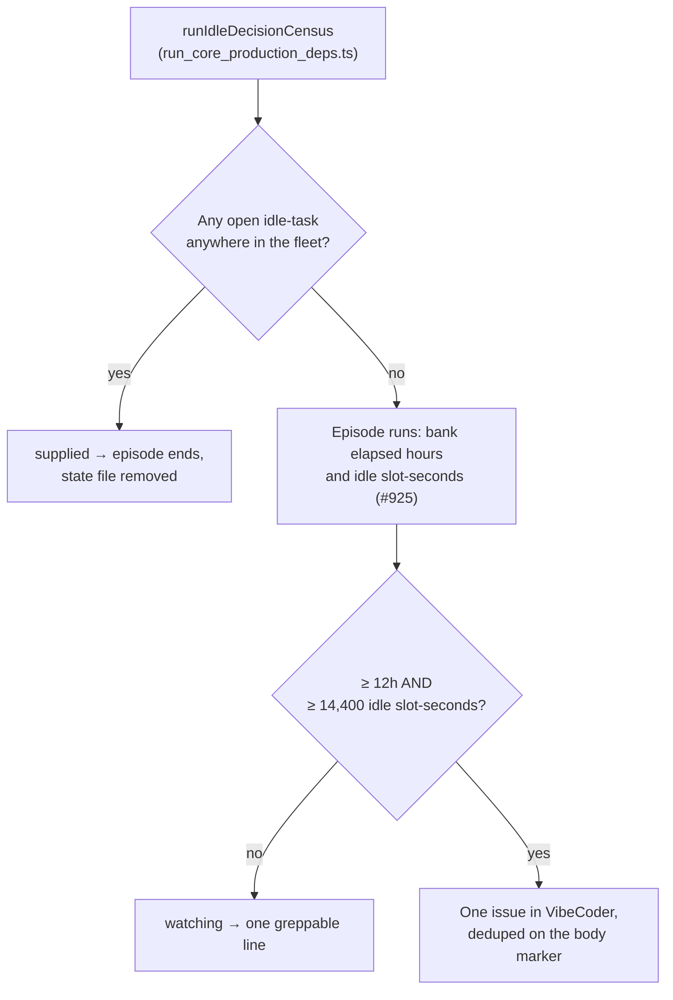

# PR Summary — Issue #1052

## Summary

Closes #1052.

The fleet filed no `idle-task` issue for **ten days** — last created
2026-08-26, zero open across all eighteen monitored repos — while slot capacity
sat unused, and nothing escalated. The operator found it by noticing the fleet
did not look busy.

Every instrument needed to notice was present, running and correct, and all
three end at `log(...)`:

```text
slot-utilisation: slots=2 available=1616s occupied=171s occupied_pct=10.6
idle_pct=31.4 unstaffed=937s occupied_by_slot=s2=171s
[idle-hooks] … skipping=idle-task-filer reason=audit_found_claimable
claimable_total=24 streak=2
[idle-census] repo=… availability=available …   (× 18, every cycle)
```

`idle_inversion_streak.ts` (Issue #321) exists for exactly this class of
failure, but it gave a memory to one signal only: a **per-repo** claim
inversion. What happened here is a **fleet-level** condition — capacity idle,
nothing filed, for days — and nothing watched it.

`lib/idle_starvation_escalation.ts` watches the outcome, and needs both halves
of it before it says anything: **no idle task anywhere in the monitored set for
12 consecutive hours, while the Issue #925 accounting measured at least 14,400
idle slot-seconds (four slot-hours) over the same span.**

### Why both halves, and why those numbers

- A **busy** fleet files no idle task for days by design; its slots are
  occupied, so the capacity half never trips.
- A **genuinely quiet** fleet files an idle task, and `maybe-file-idle-task`
  keeps at most one open across the whole monitored set — so one open wrapper
  is the healthy steady state, which ends the episode and restarts the clock.
- Idle capacity with **no** idle task is neither, and is the state that went
  unnoticed for ten days.

The incident measured `idle_pct=31.4` on a two-slot host — roughly 2,250 idle
slot-seconds per wall hour — so a fleet idling like that meets the capacity half
in under seven hours and the alert lands on the elapsed half at twelve. Half a
day is long enough that a fleet working a large milestone overnight is never
asked about it, and short enough that a ten-day gap is caught twenty times over.
An alert that fires on a healthy fleet gets muted, and then it is #321's lesson
all over again.

### Persistence, because #1051 was inert without it

The counter this replaces lived in memory for the length of one run, so it never
reached any threshold. The episode is written atomically to
`idle_starvation.json` in the work directory: its start instant, the idle
slot-seconds banked across every run since, the run whose ledger reading was
last banked, and the latest evidence. The #925 ledger is itself per-run, so each
observation banks the **delta** of that run's cumulative reading against what the
episode last saw from it — a restarted run contributes its whole reading, and
the episode's measurement survives the restart intact.

### Shape, deliberately copied from `idle_inversion_streak.ts`

- A small JSON file written through `atomicWrite`, guarded by `withStateLock`.
- Marker-based dedup on the issue **body** (`<!-- VIBE_IDLE_STARVATION -->`), as
  `run_failure_issue.ts` does, so two hosts observing one episode converge on
  one issue: whichever files first, the other's search finds the marker and
  adopts that issue number.
- One issue per **episode**, not per cycle. A continuing episode does not file
  again; a later episode, after the fleet recovered and the earlier issue was
  closed, does.
- Filed into `stSoftwareAU/VibeCoder` for the Issue #459 reason: the slot
  accounting, the census, the idle hooks and the filer are all worker code, so
  no change in a monitored repo can fix what this reports.
- Best-effort throughout — it never throws, and every failure is logged. A
  search that fails files nothing, because a duplicate is worse than a delay.

### The body arrives diagnosable

The lesson of Issues #1019 and #1020 is that an alert naming no cause makes a
human reproduce what the machine already saw. The issue body carries the latest
`slot-utilisation:` line, the last `[idle-hooks]` refusal reason with its
`claimable_total`, the per-repo availability census (capped, with the tail
counted rather than dropped silently), and how long the fleet has gone without
an idle task. Every piece of evidence is escaped so census text cannot forge the
dedup marker or close the fence.

### Wiring



The detector is called from `runIdleDecisionCensus` in
`run_core_production_deps.ts`, immediately after the Issue #321 streak — the
seam where the census, the audit's claimable total and the slot ledger are all
in scope at once, and the established home for this class of detector.
`run_core.ts` is untouched. The audit's `claimableTotal` is now also kept in a
factory-scoped variable so the refusal that suppressed the filer can be named as
evidence.

Every observation emits one line, so "the detector ran and decided nothing"
stays distinguishable from "the detector never ran" — which is the failure this
issue is about:

```text
[idle-starvation] action=watching hours=3.5 idle_slot_seconds=7800 open_idle_tasks=0
```

## Evidence

No UI change, so no screenshots. The evidence is the red/green matrix below:
each row is a deliberate mutation of the shipped module, and the tests that go
red under it. Every mutation was reverted immediately after the run.

| Mutation (the defect it re-introduces) | Tests that go red |
| --- | --- |
| Threshold never met — the detector escalates nothing (the pre-fix world, and #1051's inertness) | ten-day case, two-host dedup, restart persistence, one-issue-per-episode, failed search, marker forging, threshold override — 7 of 12 |
| `openIdleTasks` ignored — the alert fires on a healthy fleet | quiet fleet, one-issue-per-episode — 2 of 12 |
| Marker search skipped — no cross-host dedup | two-host dedup, failed search — 2 of 12 |
| Episode read from memory only, never from disk (**exactly** #1051's defect) | ten-day case, two-host dedup, restart persistence, one-issue-per-episode, failed search, marker forging, threshold override — 7 of 12 |
| Filed issue number not recorded — one issue per *cycle* | one-issue-per-episode — 1 of 12 |
| Idle slot-seconds half dropped — elapsed time alone escalates | busy fleet — 1 of 12 |

Unmutated, all 12 tests pass.

## Test Plan

`worker/deno/tests/idle_starvation_escalation_1052_test.ts` — 12 tests, each
driving the real `recordIdleStarvationObservation` against a `gh` fake that
models the API's own rules (it honours the `--search "<marker>" in:body` term
and `--state open`, so a lookup asked the wrong way round receives a truthfully
wrong answer, and issues it creates are visible to every host sharing it).

1. **The ten-day case, replayed** — 240 hourly observations at the incident's
   measured idle rate with `reason=audit_found_claimable` and zero idle tasks:
   exactly one `gh issue create`, filed twelve hours in, its body naming the
   duration (`12.0h`) and the measured idle slot-seconds
   (`29250s (8.1 slot-hours)`), and carrying the slot line, the refusal reason,
   the `claimable_total` and the census.
2. **A quiet fleet with an open idle task never escalates** — ten days of idle
   capacity with one open wrapper: every decision is `supplied`, no `gh` call is
   made at all, and no episode is left on disk.
3. **A busy fleet never escalates** — ten days with no idle task but only 30
   idle slot-seconds an hour: `watching` throughout, nothing filed.
4. **Two hosts converge on one issue** — two state files, one shared `gh`: one
   host files, the other adopts the same number through the body marker; one
   `create` in total.
5. **Restart persistence, asserted directly** — six hours banked under `run-a`,
   then a new run id whose ledger reading starts again at zero: the persisted
   episode still starts where it started and totals 15,000 slot-seconds across
   both runs, and the post-restart observation files. An in-memory counter would
   be at zero on both halves.
6. **Deltas, not double counting** — a cumulative reading observed twice within
   one cycle adds nothing (the census runs several times per cycle).
7. **One issue per episode** — five further days file nothing more; recovery
   clears the episode; a new episode after the first issue was closed files a
   second, different issue.
8. **A failed search files nothing** — the failure is returned as `gh-failed`
   and logged, no `create` is attempted, and the episode survives so the next
   cycle can still escalate.
9. **A corrupt episode file restarts the clock** rather than alerting on
   rubbish.
10. **Census text cannot forge the marker** — an injected
    `<!-- VIBE_IDLE_STARVATION -->` is escaped, and the real marker appears
    exactly once.
11. **Thresholds are overridable and both must be met** — hours alone and
    capacity alone each stay `watching`.
12. **The refusal reason mirrors the `[idle-hooks]` vocabulary**.

Verification run (not `./quality.sh`, which takes 15+ minutes):

- `deno fmt --check` on the three changed/added TypeScript files — clean.
- `deno lint` on both changed library files — clean.
- `deno check` on both changed library files and `mod.ts` — clean.
- `deno test tests/idle_starvation_escalation_1052_test.ts` — 12 passed.
- `deno test tests/idle_inversion_streak_test.ts
  tests/slot_idle_accounting_925_test.ts` plus the new suite — 46 passed.
- Every suite importing `run_core_production_deps.ts` (10 files) — 125 passed.
- All 43 `tests/idle*_test.ts` suites — 667 passed.
- `markdownlint-cli2 docs/IDLE-TASK-FRAMEWORK.md` — 0 errors.

## Documentation

`docs/IDLE-TASK-FRAMEWORK.md` gains a section under Coordination — *Idle
capacity that files no idle task (Issue #1052)* — recording the incident, the
two-halves rule, the thresholds and why they are what they are, the persistence
model, and the per-observation log line; and the Regression coverage section now
names both escalation suites.
