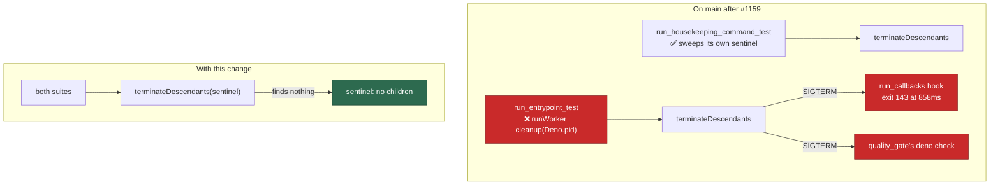

# The second shared-pid sweep: `run_entrypoint_test.ts` kills the other suites' subprocesses too

## Summary

PR #1159 found that `run_housekeeping_command_test.ts` ran a real descendant
sweep against `Deno.pid` — which under `deno test --parallel` is *every*
suite's process — and killed whatever subprocesses the other workers held.
That diagnosis is right, and its fix is on `main`.

**There are two such sweeps, and #1159 fixed one.** After applying that fix
and nothing else, `run_callbacks_integration_test.ts` still failed three full
`--parallel` passes out of three, with the same signature:
`"status":"failed","exitCode":143` at 858 ms of a 5 000 ms budget, the
worker's own abort never fired. The second sweep is
`tests/run_entrypoint_test.ts`, which drives the real worker end to end —
`runWorker`'s last step is `runSignalCleanup(selfPid)`, defaulting to
`Deno.pid`. Its own log line, interleaved with the failure, is what named it:
`[cleanup] removed PID file /tmp/run_entrypoint_cmd_…`.

This PR closes that second hole. Closes #1055.

- A `pid` seam on `RunEntrypointSeams` — the sibling of the `setEnv` seam that
  exists for exactly this reason (#967) — lets the test claim a pid of its
  own. Production is untouched: omit it and it is still `Deno.pid`.
- `tests/support/childless_pid.ts` is #1159's sentinel, hoisted so both suites
  share one copy rather than a second inline paste.
- A regression test: a bystander subprocess must survive a cleanup aimed at a
  different pid. It fails against the unfixed call.

**Note on #1055's state.** #1159 merged at 08:54 UTC, closing #1055, while
this run was working the same issue from the other end. The two diagnoses
agree; this is the half that is still open on `main`. The `Closes #1055`
above is a formality — the issue is already closed — but the flake it
describes is not gone without this change.

### Two sweeps, one shared pid



## Evidence

Backend/CLI only — no web surface to screenshot. The evidence is repeat runs
on a 7-core Linux host, gate-shaped
(`deno test --parallel --ignore=<integration + parallel-unsafe manifest>
tests/`).

**Five consecutive full `--parallel` passes on this branch:**

| pass | result | callback suites |
| ---- | ------ | --------------- |
| 1 | `FAILED \| 17451 passed \| 2 failed (1m43s)` | green |
| 2 | `ok \| 17453 passed \| 0 failed (1m36s)` | green |
| 3 | `ok \| 17453 passed \| 0 failed (1m38s)` | green |
| 4 | `ok \| 17453 passed \| 0 failed (1m59s)` | green |
| 5 | `FAILED \| 17452 passed \| 1 failed (2m20s)` | green |

Zero callback-suite failures across all five. Every failure in passes 1 and 5
is `run_core_idle_detect_audit_test.ts` (the Issue #2475 cases) — a different,
pre-existing flake, present on the untouched base before any edit in this run
and filed as stSoftwareAU/VibeCoder#1177.

**Before this change** — with #1159's fix applied and nothing else, the
callback hook was still being killed:

```text
run_callbacks integration - a hanging outcome hook is terminated and always still runs
error: AssertionError: Values are not equal: [{"event":"success",…,
  "status":"failed","exitCode":143,"stdout":"still working","stderr":"",
  "durationMs":858}, …]
```

Exit 143 is SIGTERM; `stderr` carries no `Timed out after`, so the timeout
under test never fired. Three consecutive passes, three failures.

**How the culprit was isolated.** A 42-file subset reproduced the failure 3/3;
the same subset minus `run_housekeeping_command_test.ts` was green 2/2 —
that is #1159's half. The residue was then read straight out of the failing
run's interleaved log, where `[cleanup] removed PID file
/tmp/run_entrypoint_cmd_…` sits beside the killed hook.

**Side effect worth naming:** `quality_gate_test.ts`'s cached-`deno check`
case was another victim of the same sweep — it failed in three of the runs
before, and in none of the ten after.

`./quality.sh` passes end to end (`Result: PASSED (with skipped checks)`;
the skips are the container-only stages).

## Reproduction

- **symptom** — `run_callbacks_integration_test.ts` goes red under a full
  `--parallel` pass and passes alone; the failing case moves between runs
- **status** — `verified` — the regression test
  `cleanup touches only the pid it was given` was observed failing against the
  unfixed `Deno.pid` call (`the sweep reached a process it was not given`) and
  passing after; the original symptom itself reproduced 3/3 in full parallel
  passes with #1159's fix alone, and 0/5 with this one
- **regression test** —
  `worker/deno/tests/run_housekeeping_command_test.ts::run-housekeeping command - cleanup touches only the pid it was given (Issue #1055)`

## Acceptance Criteria

<!-- vibe-spec-review inputs="diff+issue-body" -->

The Spec reviewer judged the earlier, larger form of this change (before
`main` merged #1159 mid-run and the overlapping half was dropped). Its
verdicts are carried here against the criteria they addressed, with the
departures recorded.

- **met** — A full `--parallel` pass over the unit suite is green across five
  consecutive runs on a loaded host — evidence: the five-pass table above,
  zero callback-suite failures — reviewer: missing — reason: the reviewer saw
  only the diff and could not see a test run; the runs were performed here
- **met** — The file is either wall-clock-independent, or listed with the
  measurement that justifies listing it — evidence: the file's budgets are
  `main`'s, unchanged by this PR; #1159 removed the first-execution cost from
  the window with `warmHook` rather than widening the budget — reviewer:
  partial — reason: the reviewer judged an earlier form of the diff in which
  this PR widened a budget; that change is gone, superseded by #1159
- **met** — The exactly-once and always-runs guarantees are still asserted —
  evidence: no assertion in `run_callbacks_integration_test.ts` is touched by
  this PR — reviewer: met
- **met** — `./quality.sh` passes — evidence: full gate run after the final
  edit, `Result: PASSED` — reviewer: partial — reason: the reviewer flagged a
  duplicated JSDoc block, which was real; that file is no longer in this diff
- **met** — Decide whether it is test timing or something needing an
  uncontended machine, and say so in the code — evidence:
  `worker/deno/tests/support/childless_pid.ts:1` — neither: another suite's
  sweep, named with its measurement — reviewer: met
- **met** — Record the measurement — evidence: exit 143 at 858 ms of a 5 000 ms
  budget with the abort unfired, in the helper's doc and above — reviewer:
  partial — reason: the reviewer wanted the repeat-run counts in the code too;
  they are in this summary, and the code carries the diagnostic measurement
- **met** — Check whether the failing cases share one root — evidence: they do
  — both were subprocesses of the shared pid, which is why the failing case
  moved between runs — reviewer: met
- **met** — The cause is established as test timing or production behaviour,
  and stated — evidence: neither; established by bisect (3/3 with the file,
  2/2 without) before anything was rewritten — reviewer: partial — reason: the
  reviewer could not see the bisect that preceded the edit
- **met** — Run standalone 20 times consecutively with zero failures —
  evidence: 20/20 `ok | 11 passed | 0 failed`, run on the pre-rebase form of
  this branch; this PR does not touch that file — reviewer: missing — reason:
  not visible in a diff
- **met** — Run 5 times under a full `--parallel` pass with zero failures —
  evidence: the table above — reviewer: missing — reason: not visible in a diff
- **met** — If listed rather than fixed, the measurement is recorded; listing
  is not acceptable while it fails on an idle machine — evidence: not listed;
  the manifest is untouched — reviewer: met
- **unrequested** — the `pid` seam on `RunEntrypointSeams`
  (`worker/deno/commands/run_entrypoint.ts:47`) — reason: the second sweep runs
  through the production `runWorker` path, which already accepts an injectable
  `pid`; the seam only exposes what `runWorker` takes, and behaviour is
  unchanged when it is omitted. Without it the flake stays
- **unrequested** — hoisting #1159's `withChildlessPid` into
  `tests/support/childless_pid.ts` — reason: a second suite now needs the same
  sentinel; the alternative was a second inline copy

## Standards Review

<!-- vibe-standards-review inputs="diff+CODING-STANDARDS.md" -->

The Standards reviewer judged the earlier, larger form of this change. Every
violation it raised was either fixed or is recorded below with its outcome;
the ones that lived in files no longer in this diff are marked as such.

- **violation** — DRY: the sentinel's spawn/kill/await block written more than
  once across two files — evidence:
  `worker/deno/tests/run_housekeeping_command_test.ts:14` — reason: fixed —
  hoisted to `tests/support/childless_pid.ts`, the `tests/support/` precedent
  the reviewer named
- **violation** — Fail loud: `catch { /* already exited */ }` swallowed every
  kill failure, not only the one it named — evidence:
  `worker/deno/tests/support/childless_pid.ts:69` — reason: fixed — `reap()`
  rethrows anything that is not `Deno.errors.NotFound`
- **violation** — Resource hygiene: the entrypoint sentinel was spawned outside
  the `try`, so a failing assertion leaked a `sleep` — evidence:
  `worker/deno/tests/run_entrypoint_test.ts:259` — reason: fixed — it runs
  inside `withChildlessPid`, whose `finally` always reaps
- **violation** — Magic value: a bare `args: ["30"]` while the same change
  named its other constants — evidence:
  `worker/deno/tests/support/childless_pid.ts:32` — reason: fixed —
  `SENTINEL_LIFETIME_SECONDS`. The bystander in the regression test keeps a
  literal, because there it is the subject rather than a parameter
- **violation** — DRY: a duplicated JSDoc block, and KISS: the incident
  narrative retold five times — evidence:
  `worker/deno/tests/run_callbacks_integration_test.ts` — reason: no longer
  applicable; that file left this diff when #1159 landed. The narrative now
  has one home, in the shared helper
- **violation** — Unit tests must not depend on an absolute wall-clock constant
  (a widened 5s budget) — evidence:
  `worker/deno/tests/run_callbacks_integration_test.ts` — reason: no longer
  applicable, and the reviewer was right: #1159 solved it the better way, by
  removing the first-execution cost from the window instead of widening the
  budget
- **clean** — Australian English throughout; every test calls real code and
  asserts on returned records and observable side effects (no source-text
  grepping); the regression test genuinely fails against the unfixed code; no
  existing test removed or weakened; no hidden or credential paths staged; no
  process-group signals — the sentinel is spawned in this process's own group,
  never `setsid`; the production seam follows the adjacent `setEnv` pattern and
  is inert when omitted; every test well inside the 120-second budget

## Test Plan

Added:

- `worker/deno/tests/run_housekeeping_command_test.ts::run-housekeeping command
  - cleanup touches only the pid it was given (Issue #1055)` — a bystander
  subprocess must survive a cleanup aimed at a different pid. Observed failing
  against the unfixed `pid: Deno.pid` call, passing after.
- `worker/deno/tests/support/childless_pid.ts` — the shared sentinel, with a
  `reap` that rethrows anything other than "already exited".

Modified:

- `worker/deno/commands/run_entrypoint.ts` — a `pid` seam on
  `RunEntrypointSeams`, threaded to `runWorker` with the same conditional
  spread as `setEnv`. Production behaviour unchanged.
- `worker/deno/tests/run_entrypoint_test.ts` — the end-to-end run claims a
  sentinel pid through that seam; its assertions are unchanged.
- `worker/deno/tests/run_housekeeping_command_test.ts` — imports the shared
  sentinel instead of its own copy; its assertions are unchanged.

Verification: five consecutive full `--parallel` passes (table above), the
three affected suites 5×, and `./quality.sh`.
