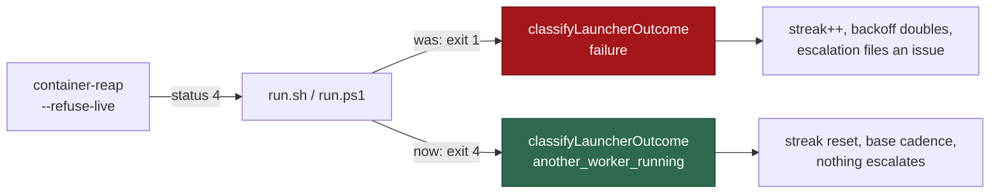

# PR Summary — Issue #1056

Closes #1056

## Summary

One worker per host is a design invariant (Issue #26): the work volumes are
per-host singletons, so `container-reap --refuse-live` stops a second launch
rather than letting it fail on a storage attachment. Both launchers implemented
that stop by exiting **1**, and 1 is the status the outcome recorder describes
as *"a bootstrap, config or loop failure the worker reported itself"*. A host
whose worker was legitimately mid-run therefore counted itself a failure, climbed
the escalation ladder and — at the threshold — filed a launcher-failure issue
against itself, positively asserting a cause that had not happened. Under cron
or launchd, where the scheduler's fixed interval is the retry, that is the
normal case rather than an edge one.

The status the recorder's table already described — 4,
`ANOTHER_WORKER_RUNNING_STATUS`, *"another worker already running"* — was
unreachable by construction, because no launcher ever produced it.

Both launchers now carry the reaper's own status out unchanged, and the recorder
classifies it as a non-failure of its own, alongside the quota pause of
Issue #342 and the unreachable GitHub of Issue #949: the streak resets, the wait
is the base cadence, and nothing escalates. Waiting longer does not make the
running worker finish any sooner, and there is nothing for a human to fix.

The stop stays loud — the launcher's stderr line is unchanged, the supervisors
name it in their own logs, and it is a structured `another_worker_running`
self-heal event — it is simply not a fault.

## Changes

- `run.sh` exits `ANOTHER_WORKER_RUNNING_EXIT` (4) rather than 1.
- `run.ps1` exits 4 through `Exit-Launcher`, so — like `run.sh`'s EXIT trap —
  the outcome is recorded rather than dropped on this one path.
- `worker/deno/lib/container_restart_backoff.ts` gains the
  `another_worker_running` outcome kind, its classification and its
  non-failure state transition, and emits the self-heal event for it.
- `loop.sh` / `loop.ps1` name the condition in the supervisor's own log
  instead of "exited with status 4 — backing off and retrying".
- `docs/DEPLOYMENT.md` documents the outcome beside the quota pause and the
  signalled stop.

## Evidence

No UI change, so no screenshots. The evidence is the tests below: the
recorder test drives status 4 six times — twice the escalation threshold — and
asserts no escalation, a reset streak and the base cadence, and fails against
the unfixed recorder, which classifies 4 as a plain failure.

## Test Plan

- `tests/container_restart_backoff_test.ts`
  - `classifyLauncherOutcome - one worker per host is a by-design stop, not a
    crash (Issue #1056)` — and the neighbouring statuses (1, 3, 5) stay
    failures, so the new class cannot swallow a real fault.
  - `recordContainerRestartOutcome - a host whose worker is already running
    never escalates (Issue #1056)`.
  - `recordContainerRestartOutcome - the by-design stop clears a streak and is
    visible, without claiming a recovery (Issue #1056)`.
  - `recordContainerRestartOutcome - a genuine crash after a by-design stop
    still backs off (Issue #1056)` — both directions, so the change cannot be
    satisfied by never escalating.
- `tests/run_sh_launcher_test.ts` and `tests/run_ps1_launcher_test.ts` — the
  existing Issue #26 tests now assert the exact status, imported from
  `container_reap.ts` so the launcher and the command cannot drift.
- `tests/loop_supervisor_test.ts` — `loop.sh` names the by-design stop, does
  not describe it as backing off from a failure, and keeps iterating.
