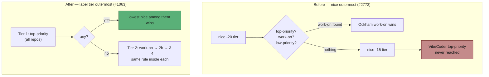

## Summary

`top-priority` was only top priority *within a repository's `nice` tier*. Issue
#2773 had made `nice` the outermost partition of `selectHighestPriority`, so
NEAT-AI-Ockham's six ordinary `work-on` issues at `nice: -20` were drained
before VibeCoder's two `top-priority` issues at `nice: -15` were even
considered.

Implements the operator's recorded decision (option 2): the **label tier is the
primary ordering across the whole fleet** — `top-priority` > `work-on` >
self-scheduled diagnostic > `low-priority` > `idle-task` — and **`nice` orders
repos within a label tier**. `nice` is a tie-breaker inside a priority band,
never a band of its own: the label expresses urgency, `nice` shapes throughput
between repos that are equally urgent. This restores the contract
`lib/issue_priority.ts`'s own header always documented and closes the "known
divergence from F4a" recorded in `DESIGN-PRINCIPLES.md`.

`selectWithinNiceTier` and its two-pass driver are replaced by a single tier
ladder over a `selectAcrossNiceTiers` helper. Issue #2812's `idle-task`
fleet-global floor now falls out of the ladder directly — `idle-task` is the
last tier walked, so it is reached only when no repo has selectable real work.

Also widens the Issue #1718 selection-reasoning line from `work-on` winners to
every non-`top-priority` winner, so a passed-over `top-priority` is visible in
the ordinary worker log without `ISSUE_FINDER_DEBUG`.

Closes #1063.



## Evidence

Backend/CLI change — no web interface to screenshot. Verified by tests.

**New 4×4 selection matrix**, over the reported live shape (Ockham `nice: -20`,
VibeCoder `nice: -15`), asserting the winner for every label combination in
both directions:

```
$ deno test --allow-all tests/issue_priority_label_tier_test.ts
selection matrix - label tier decides first; nice only breaks ties within a tier ... ok
selection - top-priority at nice -15 beats work-on at nice -20 ... ok
selection - top-priority at nice -20 beats top-priority at nice -15 ... ok
selection - work-on at nice -20 beats work-on at nice -15 ... ok
selection - work-on at nice -15 beats low-priority at nice -20 ... ok
selection - nice still orders repos when every candidate shares a tier ... ok
selection - configured-label ordering outranks nice within tier 1 ... ok
selection - an unbounded low-nice work-on backlog never starves a high-nice top-priority ... ok
selection - idle-task in the lowest-nice repo still loses to real work anywhere ... ok
selection - idle-task is selected once every real-work tier is drained fleet-wide ... ok
selection - a blocked top-priority still suppresses work-on in the same repo+milestone ... ok
selection - Issue #2164 repo suppression of low-priority survives the re-ordering ... ok
ok | 12 passed | 0 failed
```

**Red before, green after:** the matrix, the live-symptom row, the
`low-priority`-vs-`work-on` row, the labelIndex row and the starvation test all
failed against the unfixed selector (`5 failed`) and pass after. The widened
#1718 log line was likewise observed failing with the old
`source === "work-on"` condition and passing with the new one.

**Quality gate.** `./quality.sh` is green on every check except `deno tests`,
which reports one failure —
`createProductionRunCoreDeps - static trust refresh succeeds and does not throw`
(`tests/run_core_production_deps_test.ts:185`). **This failure is pre-existing
and unrelated to this change:** `./quality.sh` was run on the parent commit in a
separate worktree and produced the identical single failure
(`FAILED | 16866 passed | 1 failed`, versus `16879 passed | 1 failed` here — the
13 extra passes are this PR's new tests). The test performs a live GitHub
trusted-author refresh and passes in isolation (`1 passed`, 13s); it fails only
under the full parallel suite in this container.

## Acceptance Criteria

<!-- vibe-spec-review inputs="diff+issue-body" -->

Both the issue body's criteria and the operator's superseding criteria are
answered; the superseding set is authoritative where they differ.

- **met** — the chosen ordering is implemented and stated in the documentation next to both `nice` and the labels — evidence: `worker/deno/lib/issue_priority.ts:10-44`, `docs/CONFIGURATION.md` (`nice` section + `repo_config` table row), `README.md` (Issue-labels row), `docs/workflows/issue-processing.md`, `DESIGN-PRINCIPLES.md` — reviewer: met
- **met** — a `top-priority` issue in a higher-`nice` repo beats a `work-on` issue in a lower-`nice` repo — evidence: `worker/deno/tests/issue_priority_label_tier_test.ts::selection - top-priority at nice -15 beats work-on at nice -20 (Issue #1063)` — reviewer: met
- **met** — `nice` still orders repos for everything the rule leaves to it — evidence: `worker/deno/tests/issue_priority_label_tier_test.ts::selection - nice still orders repos when every candidate shares a tier (Issue #1063)`, plus the untouched `find_oldest_issue_nice_test.ts` suite — reviewer: met
- **met** — a passed-over `top-priority` candidate is visible in the log without extra diagnostics — evidence: `worker/deno/lib/find_oldest_issue.ts` (condition widened to every non-`configured-label` winner; `logSelectionReasoning` writes unconditionally) and `worker/deno/tests/find_oldest_issue_test.ts::findOldestIssue - emits selection-reasoning when a low-priority issue is selected and top-priority is blocked (Issue #1063)` — reviewer: met
- **met** — `selectHighestPriority` partitions by label tier first, then by `nice` within each tier — evidence: `worker/deno/lib/issue_priority.ts` tier ladder + `selectAcrossNiceTiers` — reviewer: met
- **met** — all four rows of the operator's table asserted as tests, in both directions — evidence: the four named tests plus the exhaustive 4×4 matrix in `worker/deno/tests/issue_priority_label_tier_test.ts` — reviewer: met
- **met** — the fix does not degenerate into ignoring `nice` — evidence: as above, plus `issue_priority_test.ts::selectHighestPriority - lower-nice repo is drained before any higher-nice repo` (unchanged and passing) — reviewer: met
- **met** — the Issue #2812 `idle-task` fleet-global floor is preserved — evidence: `worker/deno/tests/issue_priority_label_tier_test.ts` (two idle-task tests) and the untouched `work_on_beats_idle_task_fleet_test.ts` / `issue_priority_test.ts` #2812 tests — reviewer: met
- **met** — `lib/issue_priority.ts`'s header and `docs/CONFIGURATION.md` state the rule next to both `repo_config.nice` and the labels — evidence: `issue_priority.ts:10-44`, `docs/CONFIGURATION.md` — reviewer: partial — reason: the reviewer found the `SelectionOptions.repoNice` JSDoc and the `find_oldest_issue.ts` call-site comment still describing the superseded #2773 rule; both were rewritten after the review, so the criterion is now met
- **partial** — `./quality.sh` passes — evidence: full gate run after the final edit; every check green except one pre-existing, unrelated failure reproduced identically on the parent commit (see Evidence) — reviewer: missing — reason: the reviewer was asked not to run the gate; it was run here and the single failure is pre-existing, not introduced by this diff
- **unrequested** — the #1718 selection-reasoning line now fires for every non-`top-priority` winner, not only `work-on` — reason: required by the issue body's fourth criterion (a passed-over `top-priority` must be visible without extra diagnostics); with the label tier outermost, a `top-priority` can now be passed over by a self-diagnostic, `low-priority` or `idle-task` winner too, and those cases were silent
- **unrequested** — `labelIndex` is ordered ahead of `nice` inside a tier — reason: `labelIndex` distinguishes distinct configured discovery labels, so a second-choice label in a low-`nice` repo must not outrank the first-choice label elsewhere; this is the same "label before `nice`" rule applied consistently. Dormant today (`issue_labels` is hardwired to a single `top-priority`)

## Standards Review

<!-- vibe-standards-review inputs="diff+CODING-STANDARDS.md" -->

- **violation** — stale JSDoc on `SelectionOptions.repoNice` still described the superseded #2773 rule — evidence: `worker/deno/lib/issue_priority.ts:112` — reason: rewritten in this diff to state the within-tier rule
- **violation** — the same superseded sentence repeated at the `selectHighestPriority` call site — evidence: `worker/deno/lib/find_oldest_issue.ts:441` — reason: rewritten in this diff
- **violation** — the `(labelIndex, nice)` group key was encoded into a string and parsed back with an unchecked cast, which would degrade to `NaN` ordering rather than failing loudly (KISS) — evidence: `worker/deno/lib/issue_priority.ts:424` — reason: replaced with two plain minimum-and-filter steps; the round trip and its dead fall-through loop are gone. The separator had also become a literal NUL byte, which the rewrite removes (repo re-scanned: no NUL bytes remain)
- **violation** — the `nice` worked example still read "picked up only when every lower-`nice` repo is idle", contradicting the new rule three paragraphs above it — evidence: `docs/CONFIGURATION.md:3116` — reason: corrected to "no lower-`nice` repo has a candidate in the same label tier", with an explicit counter-example
- **violation** — the four-row winner matrix was duplicated verbatim in two documents (DRY / token economy) — evidence: `docs/workflows/issue-processing.md:163` — reason: the workflow doc now links to the canonical table beside the setting in `CONFIGURATION.md`
- **clean** — Australian English throughout; TDD with real function calls and no source-grepping; the one existing test whose business logic changed was inverted in place with the reason recorded, not deleted; prior invariants (#2812 floor, #2164/#2610 suppression, blocked-label suppression) re-pinned with explicit tests; new tests in a focused new file rather than growing the 1600-line existing one; no catch-and-ignore or swallowed exit codes; nine tracked files staged, no hidden paths or credential patterns; Deno-native tooling only

## Test Plan

- **Added** `worker/deno/tests/issue_priority_label_tier_test.ts` — 12 tests: the exhaustive 4×4 tier×tier selection matrix, the operator's four named rows, `nice`-still-orders-within-a-tier, labelIndex-ahead-of-`nice`, the 200-issue starvation direction, two `idle-task` floor tests, and two suppression-unchanged tests.
- **Added** `worker/deno/tests/find_oldest_issue_test.ts::findOldestIssue - emits selection-reasoning when a low-priority issue is selected and top-priority is blocked (Issue #1063)` — the widened #1718 log line; verified red against the old `source === "work-on"` condition.
- **Modified** `worker/deno/tests/issue_priority_test.ts::selectHighestPriority - label tier gates nice across repos (Issue #1063)` — **documented business-logic change**: this test asserted the inverse rule (`nice` outermost) that the operator's decision supersedes. It is inverted in place, not removed, with the rationale recorded in the test body.
- **Unchanged and still passing:** `issue_priority_self_diagnostic_test.ts`, `work_on_beats_idle_task_fleet_test.ts`, `find_oldest_issue_nice_test.ts`, `find_oldest_issue_low_priority_test.ts`, `collect_low_priority_candidates_test.ts`.
