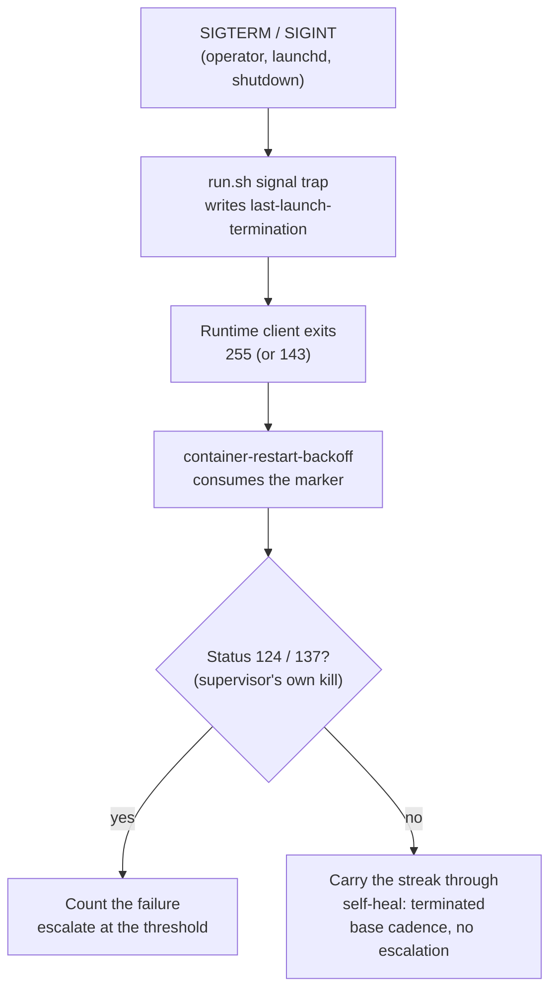

## Summary

A launcher run that was **stopped from outside** is now recorded as a stop, not
as a failure of the host. Closes #1072.

`run.sh` forwards SIGTERM/SIGINT to the container runtime client and exits with
**that client's** status — 255 on the fleet's macOS hosts when the container is
stopped under it. So an operator's `kill`, a launchd stop or a host shutdown was
indistinguishable from a crash: it climbed the consecutive-failure ladder and,
at three, escalated a host that was working — with a report advising the reader
to look at the container runtime, which for a stop is a phantom.

That is exactly what this issue reports (`worker_run`, exit 255, three
consecutive failures, and a 40-line log tail of a worker finishing a 391 s cycle
normally). It is the **second sighting**: the operator who closed #879 — the
same host, the same status — recorded the cause and asked for it to be raised if
it recurred:

> a deliberate kill is indistinguishable from a crash here … the report then
> advised looking at the container runtime, which for that one would have been a
> phantom. A killed run could record that it was signalled, so the streak does
> not count it. Raise that separately if it recurs.

The exit status cannot carry the fact, so the launcher declares it. `run.sh`'s
signal trap writes `${VIBE_STATE_DIR:-~/.vibe-coder}/last-launch-termination`,
and `container-restart-backoff` **consumes** it — the same pattern the
quota-pause marker already uses.

A declared stop is counted **neither up nor down**: the streak it interrupted is
carried through untouched (it is not this host failing, and an operator
restarting a broken host must not erase the evidence either), nothing escalates,
no recovery is claimed, and the next attempt comes at the base cadence.

Three defences stop a leftover marker silencing a real failure: the launcher
clears it at the start of every launch, the recorder consumes it, and a marker
older than an hour is refused **loudly**. The supervisor's **own** deadline kill
(`timeout`'s 124/137) is exempt and stays a failure — a cycle that had to be
killed is a fault the host must escalate for (Issue #322).

## Evidence

Backend/CLI change with no web interface to screenshot; the evidence is the
tests below and the red→green runs recorded with them.

Before this change, the same sequence produced `consecutiveFailures: 1` per stop
and a `Vibe Coder launcher failing on <host> (worker_run)` escalation on the
third — this issue, and #879 before it.

## Reproduction

- **symptom** — a run stopped by a signal exits with the runtime client's status
  (255), is counted as a `worker_run` failure, and three of them escalate a
  working host
- **status** — `verified` — with `record_termination` disabled in `run.sh` the
  end-to-end launcher test fails on `consecutiveFailures` (actual 1, expected
  0), and with the classification branch removed from
  `classifyLauncherOutcome` all five recorder tests fail; both pass with the fix
- **regression test** —
  `worker/deno/tests/run_sh_launcher_test.ts::run.sh - a signalled run declares the stop so it is not counted as a failure (Issue #1072)`

## Test Plan

- **New** `worker/deno/tests/launcher_termination_test.ts` — the marker is
  declared and consumed once; a missing marker is the silent ordinary case; a
  stale leftover is refused loudly and still consumed; unparseable content and a
  marker with no declaration time are discarded and reported; a declaration with
  no signal name still counts.
- **New in** `worker/deno/tests/container_restart_backoff_test.ts` —
  `classifyLauncherOutcome` calls a signalled 255 a stop and an undeclared 255 a
  crash, and refuses to launder the supervisor's 124/137; a stop does not climb
  the ladder and emits a `terminated` self-heal event rather than
  `restart_backoff`; three stops in a row escalate nothing; a stop neither
  counts nor clears a real streak (2 failures → stop → the third failure still
  escalates); a crash after a stop is judged on its own evidence; the command
  consumes the marker end to end.
- **New in** `worker/deno/tests/run_sh_launcher_test.ts` — the real `run.sh`,
  signalled mid-launch with a stub client that exits 255, drives the real
  outcome recorder to `consecutiveFailures: 0`, a `terminated` event naming
  `SIGTERM`, and a consumed marker; and a launch that ends on its own clears a
  leftover marker.
- Full gate: `./quality.sh` — every check passes except
  `run_core_production_deps_test.ts::createProductionRunCoreDeps - static trust
  refresh succeeds and does not throw`, which is **pre-existing**: it fails the
  same way on the base commit (`f0d67a7`, this change reverted) and is already
  filed as stSoftwareAU/VibeCoder#1118, which names this exact test as an
  intermittent failure of the parallel pass. It passes in isolation, and nothing
  in this change is reachable from it.

## Docs

- `docs/workflows/resilience-and-concurrency.md` — a fifth failure mode and the
  flowchart branch for it.
- `docs/DEPLOYMENT.md` — the self-healing bullet and the
  `VIBE_LAUNCH_TERMINATION_FILE` variable.
- `docs/TROUBLESHOOTING.md` — what an operator sees for a run they stopped
  themselves, and what it means if an escalation appears anyway.

## Scope note

Windows is unchanged: `run.ps1` has no signal seam to declare from — a console
control event is delivered by the OS straight to the runtime CLI — so no marker
is ever written there and the recorder's behaviour on that host is exactly as
before.
