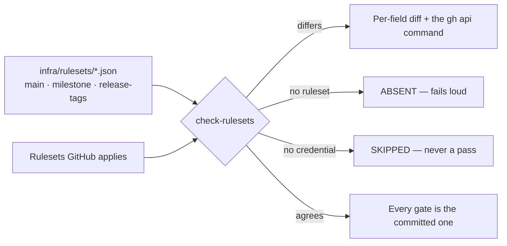

## Summary

The `Milestone` branch ruleset required exactly two status checks — `gitleaks`
and `semgrep` — so a PR into a milestone branch could merge with the entire
test suite red. That is how PR #1039 landed with `validate (tests 1/4)` failing
and rode a resurrected `fleet_health.ts` onto a milestone branch (Issue #1042).

This change commits the milestone ruleset beside the `main` and tag payloads,
gives it every context `main` requires plus the milestone-only
`milestone-resurrection` check, records the deliberate differences between the
two branch rulesets, and adds one reconciliation — `check-rulesets` — that
compares all three committed payloads against what GitHub actually applies.
Closes #1073.

- `infra/rulesets/milestone.json` — 14 required contexts (the 13 on `main`,
  plus `milestone-resurrection`), `active`, no bypass actors, strict policy.
- `infra/rulesets/README.md` — the payload index and every deliberate
  `main` / `Milestone` difference with its reason.
- `worker/deno/lib/committed_rulesets.ts` — the registry of every payload under
  `infra/rulesets/` and the shared reconciliation; a payload nobody registers
  fails the suite.
- `worker/deno/commands/check_rulesets.ts` — `check-rulesets`, read-only,
  exits non-zero on drift.

Applying a ruleset needs **admin**, which the fleet's service account does not
hold (`gh api repos/stSoftwareAU/VibeCoder --jq .permissions` →
`"admin": false`), so this change makes the gap loud and prints the `gh` call;
an operator applies it.

This PR targets `main`, not the milestone branch. The work started on
`milestone/ci-gates-and-repository-rulesets`, which was merged by PR #1168 and
deleted while this run was in progress; the three commits were rebased onto
`main` (the branch's own feature branch was force-pushed once, after the
rebase, so the PR shows only this change).

## Evidence

Backend/CLI only — no web interface to screenshot. The evidence is the live
run and the test suite.

`deno run --allow-all worker/deno/mod.ts check-rulesets` against the live
repository, before the operator applied the `main` payload (exit 1):

```text
DRIFT — infra/rulesets/main.json (the default branch)
  - required_status_checks: "validate" is not required — a PR can merge with it red
  - required_status_checks: "validate (no-runtime)" is not required — a PR can merge with it red

DRIFT — infra/rulesets/milestone.json (milestone branches)
  - required_status_checks: "changes" is not required — a PR can merge with it red
  - required_status_checks: "container" is not required — a PR can merge with it red
  - required_status_checks: "markdownlint" is not required — a PR can merge with it red
  - required_status_checks: "milestone-resurrection" is not required — a PR can merge with it red
  - required_status_checks: "supply-chain-gate" is not required — a PR can merge with it red
  - required_status_checks: "validate" is not required — a PR can merge with it red
  - required_status_checks: "validate (container)" is not required — a PR can merge with it red
  - required_status_checks: "validate (no-runtime)" is not required — a PR can merge with it red
  - required_status_checks: "validate (tests 1/4)" is not required — a PR can merge with it red
  - required_status_checks: "validate (tests 2/4)" is not required — a PR can merge with it red
  - required_status_checks: "validate (tests 3/4)" is not required — a PR can merge with it red
  - required_status_checks: "validate (tests 4/4)" is not required — a PR can merge with it red
  - do_not_enforce_on_create: applied false, committed true — enforcing on create
    refuses a new branch whose tip has no checks yet

OK — infra/rulesets/release-tags.json (release tags)
```

Both live drifts the issue named were flagged (Failure Detection #5). A later
run shows `main` now `OK` — an operator applied `infra/rulesets/main.json`
during this run — while `Milestone` still drifts, which is what an admin has to
apply next.



`./quality.sh` passes (full gate, 19 checks; 3 skipped for missing optional
tooling). One caveat a reviewer should know: the gate's parallel test pass is
flaky on this milestone base branch independent of this change — a run on the
unmodified base commit fails on
`run_core_idle_detect_audit_test.ts:474`, and a run on this branch failed on
`quality_gate_test.ts:553` (`runDenoCheck - PASSED when every .ts file
type-checks`), which passes in isolation on both branches. Neither test is
touched by this diff; this is the class Issue #1098 recorded.

## Acceptance Criteria

<!-- vibe-spec-review inputs="diff+issue-body" -->

- **partial** — A PR into a milestone branch cannot merge with any test shard
  red — evidence: `infra/rulesets/milestone.json` (14 contexts),
  `worker/deno/tests/milestone_branch_ruleset_test.ts::milestone ruleset - a test shard red blocks the merge`
  — reviewer: partial — reason: the payload is committed and the drift is
  reported, but applying it to GitHub needs admin the fleet account does not
  hold, so the live gate changes only when an operator runs the printed
  `gh api --method PUT`.
- **partial** — Both branch rulesets are committed under `infra/rulesets/` and
  match what GitHub has — evidence: `infra/rulesets/main.json`,
  `infra/rulesets/milestone.json`, live `check-rulesets` output above —
  reviewer: partial — reason: `main` and the tag ruleset now match; `Milestone`
  still differs until an admin applies the payload, which is the drift this
  check exists to surface.
- **met** — Any deliberate difference between `main` and `Milestone`
  protection is recorded with its reason — evidence:
  `infra/rulesets/README.md` (differences table plus the two same-on-both
  fields and the `milestone/**` versus `milestone/*` note) — reviewer: met —
  reason: the reviewer's two blemishes were fixed in this diff — the
  `do_not_enforce_on_create` row is no longer presented as a difference, and
  the `pull_request` row now addresses the unattributed-change approval.
- **met** — A check fails when the live ruleset and the committed definition
  drift apart — evidence: `worker/deno/tests/committed_rulesets_test.ts` (one
  fixture per drift direction), live run exits 1 — reviewer: partial — reason:
  the reviewer marked it partial because nothing invokes `check-rulesets`
  automatically. Wiring the branch rulesets into `./quality.sh` today would
  turn the gate red on every PR until an admin applies both payloads, so the
  check stays operator-invoked like `check-main-ruleset` (Issue #858), and
  `infra/rulesets/README.md` says so plainly.
- **met** — `./quality.sh` passes — evidence: full gate run after the final
  edit — reviewer: missing — reason: the reviewer saw only the diff and could
  not run the gate; it was run here and passed, with the pre-existing base-branch
  flake noted above.
- **unrequested** — `MILESTONE_EXEMPT_CONTEXTS` in
  `worker/deno/lib/pr_check_contexts.ts` and the milestone offline
  reconciliation test — reason: without it the required set for the milestone
  ruleset would be a remembered list, which is the drift Issue #858 closed for
  `main`; it also proves `milestone-resurrection` belongs in the payload.
- **unrequested** — `do_not_enforce_on_create` added to the per-field
  comparison (`worker/deno/lib/main_branch_ruleset.ts`) — reason: with the full
  context set required, `false` refuses the push that creates a new milestone
  branch, so the recorded decision needs a check behind it.
- **unrequested** — `--repo` on `check-rulesets` — reason: matches the two
  existing ruleset commands, so the payloads can be reconciled against a fork.

## Standards Review

<!-- vibe-standards-review inputs="diff+CODING-STANDARDS.md" -->

- **violation** — the payload covers `refs/heads/milestone/**` while the
  workflows filter `milestone/*`, so a nested branch would require 14 contexts
  no workflow reports — evidence: `infra/rulesets/milestone.json:9` — reason:
  the condition matches the applied ruleset and is the safer direction (a
  nested branch stays protected). The invariant behind it is now pinned by
  `milestone_branch_ruleset_test.ts::milestone ruleset - the ref condition
  covers every branch name the fleet creates`, which fails if
  `createMilestoneBranchName` ever emits a nested slug, and the reasoning is
  recorded in `infra/rulesets/README.md`.
- **violation** — the new reconciliation test only exercised `milestone/example`
  — evidence: `worker/deno/tests/pr_check_contexts_test.ts:1042` — reason: the
  nested-branch case is now covered by the branch-name invariant test above,
  which is where the risk actually lives.
- **violation** — DRY: the registry re-read the payload files instead of
  delegating to each payload's own loader — evidence:
  `worker/deno/lib/committed_rulesets.ts:96` (before) — reason: fixed in this
  diff; each entry now carries `load`, reusing `loadMainBranchRuleset`,
  `loadMilestoneBranchRuleset` and `loadReleaseTagRuleset`.
- **violation** — the sequential-sweep comment claimed the opposite of the
  code's behaviour — evidence: `worker/deno/lib/committed_rulesets.ts:157` —
  reason: rewritten to say what it does — an unrecognised failure propagates
  and stops the sweep.
- **violation** — `infra/rulesets/README.md` claimed the reconciliation reports
  `do_not_enforce_on_create` drift when nothing compared that field — evidence:
  `infra/rulesets/README.md:51` (before) — reason: fixed by adding the
  comparison (`main_branch_ruleset.ts`) and a test, so the statement is now
  true.
- **violation** — docs owed by the code change: `EXEMPT_CONTEXTS` gained a
  sibling and `requiredContexts` gained a parameter, with `docs/MERGE.md` still
  describing `main` only — evidence: `docs/MERGE.md:527` — reason: fixed; the
  milestone section now records that the same derivation runs for a
  `milestone/` base with `MILESTONE_EXEMPT_CONTEXTS`.
- **violation** — three commands now reconcile overlapping payloads
  (`check-rulesets`, `check-main-ruleset`, `check-release-tag-ruleset`) —
  evidence: `worker/deno/mod.ts:384` — reason: stands. The duplicated *loader*
  was removed, but the two older commands are documented entry points and one
  of them is wired into the quality gate; removing them is a separate change
  from this issue.
- **clean** — Australian English throughout; no hidden or credential paths
  staged; every test calls real exported functions with real payloads and an
  injected `gh` stub, none grep source; drift / absent / skipped stay distinct
  and an unrecognised `gh` failure propagates; new modules are small
  (≤180 lines); `deno check`, `deno lint` and `deno fmt --check` clean; the
  command-count guard in `mod_test.ts` updated with its reason.

## Test Plan

- `worker/deno/tests/milestone_branch_ruleset_test.ts` (new, 10 tests) — the
  committed payload's target, enforcement and bypass set; every `main` context
  required; all four shards; the resurrection check required here and not on
  `main`; strict policy and create exemption; the 2026-08-30 live fixture
  reproducing the two-context bug; the create-enforcement drift; the
  branch-name/`milestone/**` invariant.
- `worker/deno/tests/committed_rulesets_test.ts` (new, 11 tests) — every
  payload under `infra/rulesets/` is registered; all three reconcile clean
  against a stubbed API; one fixture per drift direction (missing context,
  extra context, `enforcement: evaluate`, bypass actor), each naming the field;
  a deleted ruleset is `absent`, not skipped; no credential skips and says
  `SKIPPED`; an unexpected `gh` failure propagates; an unsafe repo slug is
  rejected.
- `worker/deno/tests/pr_check_contexts_test.ts` (2 added) — every check a PR
  into a milestone branch reports is required or exempt, and the resurrection
  check is not exempt there.
- `worker/deno/tests/mod_test.ts` — command count 148 → 149 for
  `check-rulesets`.
