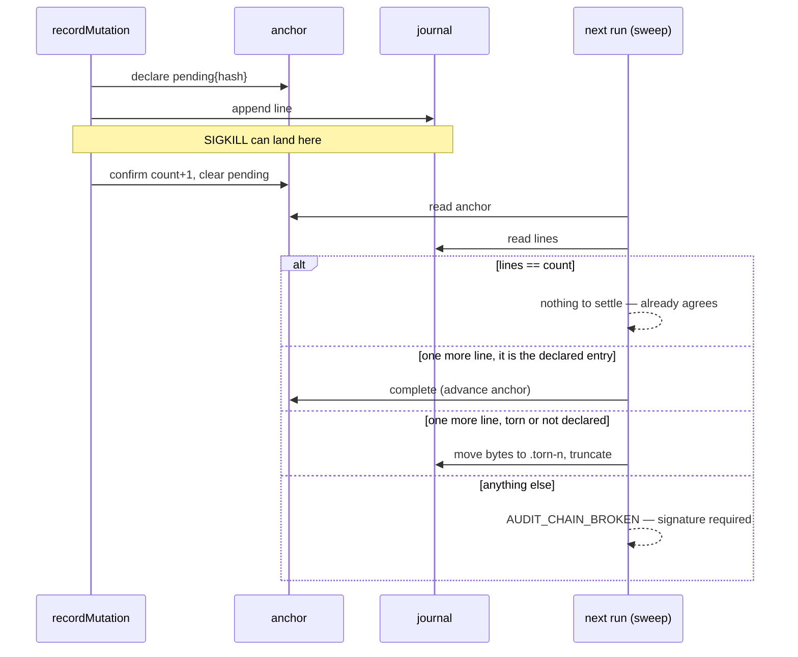

# PR Summary — Issue #1074

## Summary

An audit append is now crash-safe, so a killed run no longer leaves a chain
that asks an operator to sign for the kill. Closes #1074.

The issue asked which of two causes was behind
`AUDIT_CHAIN_BROKEN … at entry 29: malformed JSON`, and said to establish that
before changing code, because the two causes need opposite fixes. Both were
tested rather than assumed:

- **Hypothesis 2 (a writer bypassing `recordMutation`, or an early stale-lock
  break) is ruled out.** A source check of every write into the audit
  directory leaves exactly one appender to a *journal* —
  `worker/deno/lib/audit_journal.ts:525` — reached only through
  `recordMutation`; the other writers touch the anchor and roster sidecars.
  `withFileLock` could not break a lock under `DEFAULT_STALE_MS` (120 s), and
  an append takes milliseconds.
- **Hypothesis 1 is right in substance and wrong in mechanism.** SIGKILLing a
  live writer 34 times produced **no torn line at all**: a single `write(2)`
  of one line to a regular file is not interruptible, so a kill cannot tear
  one. What a kill *does* leave, in 5 of 14 runs, is a **complete entry past
  the anchored head** — the same demand for a manual signature, from the same
  cause. A torn line comes from below the process (an unflushed page cache
  lost with the machine, a short write from a full or failing volume), and
  its bytes land past the anchored head for the same reason the complete
  entry does: the anchor is only advanced after the append returns.

The live journal on the reporting host (`vibe-coder-73904`) could not be
read — this run is on `vibe-coder-78693`, whose own journal verifies clean,
and the volume is per-host with no synced copy. The cause is therefore
established from a reproduction and a source audit rather than from that
file; the reproduction is stronger evidence than the single observation would
have been, because it covers both damage shapes the same kill produces.

**The fix.** The writer declares each append in its anchor *before* making it
(`pending: { hash, startedAt }`, naming the entry by its chain hash), and
`settleInterruptedAppend` finishes the append or sets the tail aside on the
next run. The declaration is what separates a crash from a forgery, so the
self-heal never has to guess:

| On disk | Verdict |
| --- | --- |
| Declared append, journal still at the anchored length | nothing to do — the chain already agrees with its anchor |
| Declared append, one further line that *is* the declared entry | heals — completed, entry kept |
| Declared append, one further line torn or not the declared entry | heals — discarded to a `.torn-<n>` sidecar |
| Unterminated, unparseable trailing bytes, no declaration (pre-#1074 journal) | heals — discarded to a `.torn-<n>` sidecar |
| A further line that parses, with no declaration | **broken** — the forged-tail shape (#3949) |
| More than one line past the anchor | **broken** |
| Any change at or before the anchored head | **broken** |

Only bytes past the anchored head are ever touched, discarded bytes are moved
to a sidecar rather than deleted, a tail claiming the declared hash must
re-derive it from its own payload (so satisfying a pending record with
different content is a SHA-256 second preimage), and a journal an operator
has already signed for with `--acknowledge-damage` is never healed — the
signature is pinned to its bytes, and repairing them would lapse it.

**A second fault the reproduction exposed.** A run killed while holding the
append lock leaves the lock behind — and it has to be holding it to damage
the chain, so the two arrive together and the recovery above cannot run until
the lock is cleared. `holderAlive` could never see the dead holder: Deno
refuses `/proc` reads without `--allow-all`, the worker runs on granular
permissions, so the stat threw `NotCapable`, the catch read that as "assume
alive", and the lock survived to the twenty-minute hard-stale backstop. Every
append in that window failed to journal.

The break is deliberately narrow, because breaking a lock whose holder is
*alive* puts two writers in one journal — the corruption #491 exists to
prevent. It needs the record to name the same host this process runs under
(pids are namespaced per container, and a `ps` miss on another container's
pid proves nothing), and `ps -p` to report that pid gone — asked once per
contended acquisition, never by signalling a pid this repository cannot prove
is its own. An **ownerless** lock file is the same kill caught inside the op
that creates and fills it (now a single `Deno.writeFile`, not an
open-then-write pair), and is broken on its second sighting. Past the stale
age the change runs the other way: only a *conclusive* liveness answer
protects a lock, where an inconclusive one used to.

## Evidence

Backend/CLI change with no web interface, so the evidence is measurement, not
a screenshot. The same harness — spawn a writer, SIGKILL it mid-run, sweep —
was run against the code at `main` and against this branch.

**Before** (14 real SIGKILLs, `verifyAllChains` at `main`): 5 broken chains,
each demanding `--acknowledge-damage`.

```
6  raw={"extra":1} sweep={"broken":["entries appended past the anchor — 220 entries present, anchor records 219"]}
7  raw={"extra":1} sweep={"broken":["entries appended past the anchor — 145 entries present, anchor records 144"]}
10 raw={"extra":1} sweep={"broken":["entries appended past the anchor — 143 entries present, anchor records 142"]}
11 raw={"extra":1} sweep={"broken":["entries appended past the anchor — 281 entries present, anchor records 280"]}
14 raw={"extra":1} sweep={"broken":["entries appended past the anchor — 269 entries present, anchor records 268"]}
```

**After** (14 real SIGKILLs, this branch): no broken chains; the kill that
landed in the window was settled and its entry kept.

```
6  raw={"extra":1,"pending":true} sweep={"broken":[],"recovered":["completed"]}
   (13 others: raw={"extra":0,"pending":false} sweep={"broken":[],"recovered":[]})
```

No torn line appeared in any of the 34 process-kill rounds, which is the
observation that settles the mechanism.

The flow the fix adds:



## Reproduction

- **symptom** — `[SECURITY] [AUDIT_CHAIN_BROKEN] … at entry 29: malformed
  JSON`, offering a manual `--acknowledge-damage`, after a run was killed
- **status** — `partial` — reason: the kill-induced breakage was reproduced
  live and watched go from red to green (the before/after tables above, and
  `worker/deno/tests/audit_append_recovery_test.ts::audit recovery - a real
  SIGKILL mid-append needs no signature`, which failed on this branch until
  the lock fix landed), but the reporter's exact damage — a *torn* line — is
  not reachable by killing a process, so its regression test uses a fixture
  rather than a live tear
- **regression test** — `worker/deno/tests/audit_append_recovery_test.ts::audit recovery - a torn final line heals back to the anchored head`

## Acceptance Criteria

<!-- vibe-spec-review inputs="diff+issue-body" -->

- **partial** — the cause is established from the live journal, and stated in the fix — evidence: `docs/AGENT-ACCOUNTABILITY.md` "the two candidate causes needed opposite fixes" — reviewer: partial — reason: the reporting host's journal is on a per-host volume this run cannot reach, and this host's own journal verifies clean, so the cause is established from a 34-kill reproduction and a source audit rather than from that file; the reviewer is right that the one observation the issue named was never captured and now cannot be
- **met** — a SIGKILL mid-append does not leave a chain that needs a manual signature — evidence: `worker/deno/tests/audit_append_recovery_test.ts::audit recovery - a real SIGKILL mid-append needs no signature`, plus the before/after kill tallies above — reviewer: met
- **met** — a torn line in the middle still fails loudly and still requires acknowledgement — evidence: `worker/deno/tests/audit_append_recovery_test.ts::audit recovery - a torn middle line still fails loudly` and `::a rewritten middle entry still fails loudly` — reviewer: met
- **met** — any self-heal reports exactly what it dropped, and cannot silently discard entries — evidence: `worker/deno/lib/audit_append_recovery.ts` `discardTornTail` writes the sidecar `createNew` before truncating; `::the report names what was dropped and where` and `::a very long dropped line is quoted, not copied whole` — reviewer: met
- **met** — `./quality.sh` passes — evidence: full gate run after the final edit, `Result: PASSED (with skipped checks)` — reviewer: missing — reason: the reviewer's own word was "unverified" ("not run per instructions"), which is not one of the four verdicts, so the nearest is recorded here; the gate was run in this session and passed, with the markdownlint failure it reported fixed first
- **met** — make an append crash-safe, or self-heal exactly one truncated final line — evidence: `worker/deno/lib/audit_journal.ts` declares each append before making it; `worker/deno/lib/audit_append_recovery.ts` settles it — reviewer: met
- **partial** — find the bypassing writer or fix the breaker; a source check that every append to the audit directory goes through `recordMutation` — evidence: `worker/deno/lib/audit_journal.ts:525` is the only journal appender — reviewer: partial — reason: the reviewer is right that the roster sidecar appends outside `recordMutation` with the same non-atomic call and no recovery, so a torn roster line fails the whole sweep with no acknowledgement path; that is a separate root cause and is filed as stSoftwareAU/VibeCoder#1202 rather than folded in here
- **met** — record in the documentation which failure modes are self-healing and which demand a signature — evidence: `docs/AGENT-ACCOUNTABILITY.md`, eight-row decision table — reviewer: met
- **unrequested** — the lock's liveness probe and immediate break (`worker/deno/lib/file_lock.ts`) — reviewer: unrequested — reason: load-bearing rather than optional, because the kill that damages the chain has to be holding the lock, so the recovery cannot run until the lock is cleared; the reviewer's objection to the first version's blast radius was right and the break was narrowed to a same-host record with a conclusive `ps` verdict, with two new tests pinning that a foreign-host record is never broken early
- **unrequested** — `worker/deno/lib/audit_entry.ts`, a 99-line extraction of the entry type and chain hashing — reviewer: unrequested — reason: the recovery module has to re-derive an entry's hash, and an import cycle in the module holding the worker's tamper evidence is worse than a move; every name is re-exported, so no caller changed
- **unrequested** — a missing journal whose anchor records zero entries is no longer reported as a deletion — reviewer: unrequested — reason: needed for a writer killed before its first line; narrowed after review so it applies only when the anchor also declares a pending append, which is the crash shape and not a deletion

## Standards Review

<!-- vibe-standards-review inputs="diff+CODING-STANDARDS.md" -->

- **violation** — an absolute wall-clock threshold in a unit test — evidence: `worker/deno/tests/file_lock_test.ts` (the `Date.now() - started < 1_000` assertion) — reason: removed in this diff; taking the lock at all already proves the break, because the 2 s timeout is far below the 120 s stale age
- **violation** — a wall-clock sleep in a unit test — evidence: `worker/deno/tests/audit_append_recovery_test.ts` (`setTimeout(resolve, 250)` in the kill loop) — reason: replaced with a rendezvous — the child announces itself once it is fifty appends deep and the parent kills on that line, which also cut the test from ~10 s to ~3 s
- **violation** — signalling a pid without proving it is still ours — evidence: `worker/deno/lib/file_lock.ts` (`Deno.kill(pid, "SIGURG")`) — reason: removed; the probe is `ps -p`, and no signal is sent at all
- **violation** — a permission failure swallowed as "assume alive", reproducing the defect it replaced — evidence: `worker/deno/lib/file_lock.ts` `holderGone` — reason: the probe is now three-state, and an inconclusive answer no longer protects a lock past the stale age; `deno.json` also grants `audit-chain-verify` the permissions the probe needs, which the reviewer showed it lacked
- **violation** — the same recovery line logged twice on the sweep path — evidence: `worker/deno/lib/audit_journal.ts` and `worker/deno/commands/audit_chain_verify.ts` — reason: fixed; `verifyAllChains` returns the recoveries and the command reports them, so the query no longer prints
- **violation** — dead state on an interface — evidence: `worker/deno/lib/audit_append_recovery.ts` (`JournalBytes.text`) — reason: removed
- **violation** — a new module with no corresponding test file — evidence: `worker/deno/lib/audit_entry.ts` — reason: fixed; `worker/deno/tests/audit_entry_test.ts` adds six cases over the hashing contract
- **violation** — untested error paths on new public functions — evidence: `worker/deno/lib/audit_append_recovery.ts` (sidecar exhaustion, the `Result` error branch, `formatAppendRecovery`) — reason: fixed; four cases added, including one that fills all 100 sidecars and asserts the repair refuses rather than overwriting
- **violation** — an unbounded verbatim copy of discarded bytes into a log line and a JSON result — evidence: `worker/deno/lib/audit_append_recovery.ts` `droppedText` — reason: fixed; quoted to 512 characters with the byte count named, while the sidecar keeps every byte
- **violation** — the mandated PR summary was untracked at review time — evidence: `docs/archive/pr-summaries/pr-summary-1074.md` — reason: committed with this change
- **clean** — Australian English throughout; no hidden or forbidden paths staged; no secrets or key material; `Result<T>` at the module boundary with errors carrying context; the self-heal is loud and greppable at every call site; the security posture of the recovery (only bytes past the anchored head touched, sidecar written `createNew` before truncation, `isDeclaredEntry` re-deriving rather than trusting the claimed hash, `#3949` and at-or-before-the-anchor shapes still failing with matching tests, a malformed `pending` rejected outright); recovery held under the audit lock on both the write and sweep paths; doc comments with `@param`/`@returns` on the exported functions; tests call real code, use their own temp directories, and inherit no ambient state; docs updated in the same change; commit messages carry the issue number and the run-id trailer

## Test Plan

Added `worker/deno/tests/audit_append_recovery_test.ts` (17 tests):

- a torn final line heals back to the anchored head, and the dropped bytes
  are readable from the sidecar afterwards
- a declared entry that landed is kept, not discarded
- a declared append that never landed needs no repair, and the next append
  overwrites the stale declaration
- an undeclared valid tail still fails loudly (#3949 unchanged)
- a rewritten middle entry still fails loudly
- a torn middle line still fails loudly, even with a pending record present
- two torn lines do not self-heal
- a torn line followed by a valid one does not self-heal
- a tail claiming the declared hash is refused and the anchor is not advanced
- a legacy torn tail with no intent record heals
- a real SIGKILL mid-append needs no signature (three kill rounds, real
  processes)
- recording continues in the same journal after a heal
- a malformed intent record is a tamper signal
- an unreadable anchor is an error, not a repair
- a journal out of `.torn-<n>` sidecars refuses to discard rather than
  overwriting an earlier repair's bytes
- the report names what was dropped and where
- a very long dropped line is quoted, not copied whole

Added `worker/deno/tests/audit_entry_test.ts` (6 tests) over the chain-hashing
contract the recovery depends on: digest shape, determinism, key-order
independence, sensitivity to every field, the predecessor as part of the
digest, and an absent optional field not hashing as an empty one.

Added to `worker/deno/tests/file_lock_test.ts` (3 tests):

- a fresh lock whose holder is provably dead is broken immediately, under the
  worker's own granular permissions — the case where the old `/proc` probe
  silently answered "assume alive"
- an ownerless lock is broken on a second look, never on the first
- a lock recorded on another host is never broken early, whatever `ps` says
  about a pid from a namespace this process cannot see

Existing suites re-run unchanged: `audit_journal_test.ts`,
`audit_anchor_test.ts`, `audit_chain_verify_command_test.ts`,
`audit_journal_concurrency_test.ts` (the N-writers-one-chain case the issue
asks for), `audit_log_tail_command_test.ts`, `audit_hook_test.ts`,
`gh_mutation_fail_closed_test.ts`, `run_housekeeping_test.ts`.
