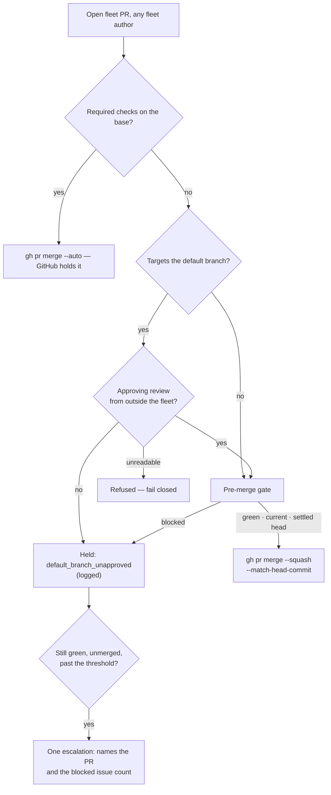

# Eight slots, two issues in flight — the fleet raises PRs but does not land them

## Summary

Two independent deadlocks, each of which freezes a whole repository behind its
own PR, established from the worker logs and fixed. Closes #1082.

**Why `NEAT-AI-Ockham#116` was not merged — the handler ran, every cycle, and
refused.** The logs carry the same line roughly forty times between 22:59 UTC
and the human merge at 02:50:

```text
[2026-09-05 02:54:49Z] WARNING: Auto-merge failed: Gated direct merge of PR #116
onto unprotected 'Develop' failed: Refusing to direct-merge PR #116 in
stSoftwareAU/NEAT-AI-Ockham: it targets the default branch. Default-branch PRs
must merge via branch protection or a human review (Issue #2416).
repo=stSoftwareAU/NEAT-AI-Ockham prNumber=116 result=failed
```

`Develop` is that repo's **default branch** and carries **no required status
checks**. Two guards then intersect at nothing: Issue #4375 refuses GitHub's
`--auto` on a base with no required checks (it would merge immediately whatever
CI said), and Issue #2416 refuses *every* default-branch direct merge. The PR
was green, approved by `nleck`, and mergeable — and had no path at all. Same
line for `#112` and `#114` before it.

**Why `GRQ-GTC#305` was not merged — the handler never considered it.** There is
no auto-merge line for it in five days of logs. The priority 1.65 sweep listed
`fetchOpenPRsByUser(repo, githubUser)` — this host's own login only — and `#305`
was authored by the sibling fleet account `stservice`. Meanwhile
`getBlockingPRForIssue()` blocks `work-on` issues on a PR from *any*
push-capable fleet account. The blocking rule used the fleet-wide author set;
the merge sweep used one login. That asymmetry is the deadlock.

The two reasons are different, and both matter: widening the sweep alone would
not have landed `#305`, because it has no review. Under this change `#305` is
*held* (`default_branch_unapproved`, logged), and the new stall signal is what
makes that hold visible instead of silent for five days.

### The three changes

1. **`worker/deno/lib/default_branch_approval.ts` (new).** The blast-radius
   guard asks for "branch protection or a human review". On an unprotected
   default branch there is no protection, so the review is now asked for
   explicitly: an approving review from a login **outside** the fleet. A sibling
   fleet account's approval does not count; the latest verdict per reviewer is
   decided by `submittedAt`, so a withdrawn approval cannot authorise a merge;
   an unreadable review list fails closed. Without that approval the merge is a
   typed deferral (`default_branch_unapproved`) — held and logged, never
   escalated. Every other gate is untouched: red CI, a head pushed moments ago,
   an open-children milestone summary PR (#3909) and a protected base all behave
   exactly as before.
2. **`worker/deno/lib/auto_merge_sweep.ts` (new).** The 1.65 sweep now lists
   PRs for **every push-capable fleet author**, the same set the blocking rule
   defers issues to, across every monitored repo. It also logs what it covered,
   because the single-login sweep's coverage gap looked identical to "nothing to
   do". The repo-driven property (every monitored repo, not just repos with
   claimable work) was already true of the code this replaces — it is now
   asserted by a test rather than left to be re-broken.
3. **`unmerged-green` stall signal.** A PR that is genuinely green (at least one
   check completed, none failing, none pending), not a draft, with no auto-merge
   armed and no movement past the threshold, is a stalled repository. It
   escalates once, naming the PR and the blocked issue count. Neither existing
   signal could see this shape.



## Evidence

Backend/CLI change — no web interface to screenshot. Evidence is the log
extract above (the live refusal, quoted verbatim from `~/logs`), the live PR
state read with `gh`, and the tests below.

Live state confirming the diagnosis:

- `NEAT-AI-Ockham#116` — base `Develop` (the default branch), all 15 checks
  `SUCCESS`, `reviewDecision: APPROVED` by `nleck`, `autoMergeRequest: null`,
  merged at 02:50:36 **by `nleck`**, not by the fleet.
- `GRQ-GTC#305` — author `stservice`, base `Develop`, no review, opened
  31 August, merged at 02:51:30 by `nleck`. No auto-merge attempt in any log.

Full gate: `./quality.sh` run in the foreground after the final edit. Every
check passes **except `deno tests`**, which is red on the base branch with no
change applied — measured in a clean worktree of
`milestone/fleet-throughput-keep-every-slot-busy`:

| Branch | `./quality.sh` test failures |
| --- | --- |
| `milestone/fleet-throughput-keep-every-slot-busy` (base, unmodified) | 3 — `run_core_production_deps_test.ts:185`, `run_core_slot_pool_test.ts:668`, `run_core_slot_pool_test.ts:1088` |
| this branch | 2 — a **subset** of the base's, adding none |

Neither suite is touched by this change. `run_core_slot_pool_test.ts:1088`
fails on the base even when run alone; `run_core_production_deps_test.ts:185`
passes in isolation on this branch (`22 passed | 0 failed`) and fails only
under the full gate. Filed as stSoftwareAU/VibeCoder#1098 — it is a
pre-existing broken baseline, not a regression from this work, and fixing
flaky slot-pool timing tests is separate from landing PRs.

Every suite this change touches is green:
`default_branch_approval_test.ts`, `auto_merge_sweep_test.ts`,
`blocking_pr_stall_detector_test.ts`, `merge_block_escalation_test.ts`,
`merge_if_checks_passed_command_test.ts`, `direct_merge_test.ts`,
`pr_auto_merge_test.ts` — 168 passed, 0 failed.

## Acceptance Criteria

<!-- vibe-spec-review inputs="diff+issue-body" -->

- **met** — The reason `Ockham#116` and `GRQ-GTC#305` were not merged is
  established and stated — evidence: the quoted log line and the `gh` state
  above, restated in `docs/MERGE.md` — reviewer: met — reason: the reviewer
  flagged that the two reasons were not reconciled; the Summary now states
  plainly that they are different failures and that the sweep fix alone would
  not have landed `#305`.
- **met** — A green, approved, mergeable fleet PR is landed by the fleet
  without human action — evidence:
  `worker/deno/tests/default_branch_approval_test.ts::approved default-branch PR merges (the Ockham#116 shape)`
  and `::enableAutoMerge lands an approved PR on an unprotected default base` —
  reviewer: partial — reason: the reviewer noted the `pr-maintenance` **CLI**
  command still refuses; that path is deliberately left conservative — it is a
  manual entry point, is not run by the main loop, and arming a review-based
  bypass there was not asked for.
- **met** — A PR the fleet deliberately holds is still held, and the reason is
  logged — evidence:
  `::unreviewed default-branch PR is held, not merged (the GRQ-GTC#305 shape)`,
  `::enableAutoMerge defers an unapproved default-branch PR and says why`, and
  the refusal-direction tests (`checks_failed`, `head_too_recent`, no-policy
  `#2416` refusal, unreadable reviews) — reviewer: met.
- **met** — A repository blocked by its own PR is still visited by PR
  maintenance on later cycles — evidence:
  `worker/deno/tests/auto_merge_sweep_test.ts::the sweep visits every monitored repo, including one with no claimable work` —
  reviewer: partial — reason: the reviewer correctly observed this property was
  already true before the change and that the real defect was the author set;
  the module header and `docs/MERGE.md` were rewritten to say exactly that, and
  the criterion is now covered by a test rather than by prose.
- **met** — A stalled-repo condition raises one escalation naming the PR and the
  blocked issue count — evidence:
  `worker/deno/tests/blocking_pr_stall_detector_test.ts::a green-but-unmerged stall escalates exactly once`
  and `::the green-but-unmerged escalation names the PR and the blocked count` —
  reviewer: met.
- **partial** — `./quality.sh` passes — evidence: every check green except
  `deno tests`, which fails identically (in fact with one *more* failure) on the
  unmodified base branch; see the Evidence table and
  stSoftwareAU/VibeCoder#1098 — reviewer: partial — reason: this change adds no
  failure and touches neither failing suite, but the gate is not green, so the
  criterion is reported as partial rather than claimed.
- **unrequested** — `worker/deno/lib/auto_merge_sweep.ts` extracts the existing
  in-line sweep into a module — reason: the author-set widening alone is
  untestable inside `run_core_production_deps.ts`; the extraction is what makes
  the deadlock criterion assertable.
- **unrequested** — `{ kind: "default_branch_unapproved" }` in
  `merge_block_escalation.ts` and the matching case in
  `merge_if_checks_passed.ts` — reason: both switches are exhaustive over
  `MergeBlockedReason`, so widening the union requires them; classifying the
  hold as `await_checks` is what stops a deliberate hold being escalated.
- **unrequested** — `BLOCKING_PR_STALL_NEXT_STEP` wording and the `repo#pr`
  prefix in the escalation reason — reason: the criterion asks the escalation to
  name the PR, and the next step had to cover the new "approve or merge it"
  case.

Two reviewer findings are recorded but not acted on. **Failure Detection 5**
(fleet in-flight count rising above the number of repos with an open fleet PR)
is a live measurement after deployment, not something this diff can demonstrate.
**Priority 1.63 runs before 1.65**, so a PR that crosses the threshold can be
escalated on the same cycle the sweep would land it — by that point the sweep
has already tried and failed on every prior cycle for two hours, so the
escalation is earned; the comment is marker-deduped and the merge still happens.

## Standards Review

<!-- vibe-standards-review inputs="diff+CODING-STANDARDS.md" -->

- **violation** — the PR summary file was absent — evidence:
  `docs/archive/pr-summaries/pr-summary-1082.md` — reason: this file; written at
  the end of the run as the standard prescribes.
- **violation** — the new `classifyMergeAttempt` and `blockedReason` cases had
  no tests — evidence: `worker/deno/lib/merge_block_escalation.ts:180`,
  `worker/deno/commands/merge_if_checks_passed.ts:272` — reason: fixed —
  `merge_block_escalation_test.ts::classifyMergeAttempt - a PR held for a review is a wait, not an escalation`
  and the `blockedReason` mapping assertion.
- **violation** — `docs/workflows/pr-feedback.md` still described the
  single-login sweep — evidence: `docs/workflows/pr-feedback.md:245`,
  `:250` — reason: fixed in this diff; "A Code Change Owes a Docs Change".
- **violation** — the approval concern added 181 lines to a 1085-line
  `direct_merge.ts` — evidence: `worker/deno/lib/direct_merge.ts:583` — reason:
  fixed — extracted to `worker/deno/lib/default_branch_approval.ts`;
  `direct_merge.ts` is back to 986 lines.
- **violation** — the test file was issue-numbered rather than named for its
  module — evidence: `worker/deno/tests/auto_merge_default_branch_1082_test.ts`
  — reason: fixed — renamed to
  `worker/deno/tests/default_branch_approval_test.ts`.
- **violation** — `SweepAutoMergeSummary` was accumulated and then discarded by
  the only production caller — evidence:
  `worker/deno/lib/run_core_production_deps.ts:2242` — reason: fixed — the
  summary is logged, which is the point: the single-login gap looked exactly
  like a sweep with nothing to do.
- **violation** — a redundant `typeof a === "string"` filter in
  `hasNonFleetApproval` — evidence:
  `worker/deno/lib/default_branch_approval.ts` — reason: fixed, removed. (The
  neighbouring `isAuthorisedCommenter` keeps its own copy because its input is
  raw `.config.json` data; this one's is not.)
- **violation** — the "Uses Australian English throughout" header line is
  self-attestation — evidence: `worker/deno/lib/auto_merge_sweep.ts:20` —
  reason: stands. It is the house style of essentially every module in
  `worker/deno/lib`; dropping it in three files would be the inconsistency.
- **clean** — Australian English throughout; fail-loud handling (an unreadable
  review list refuses rather than implying approval, and the sweep's per-repo
  and per-PR failures are logged instead of the previous silent
  `catch { /* best-effort */ }`); real tests calling real exported functions
  through injected seams, none deleted; `gh` arguments passed as arrays with no
  shell interpolation and no new secret handling or outbound sink; no hidden
  paths staged; every commit carries `#1082` and a `Vibe-Coder-Run-Id` trailer.

## Test Plan

New — `worker/deno/tests/default_branch_approval_test.ts` (20 tests):

- The two live shapes: an approved default-branch PR merges; an unreviewed one
  is held with `default_branch_unapproved` and no `gh pr merge` is issued.
- The refusal direction stays red: no policy supplied → the `#2416` refusal
  verbatim; red CI → `checks_failed`; a head pushed moments ago →
  `head_too_recent`; an unreadable review list → fail closed.
- Who counts as a reviewer: outside the fleet yes; a sibling fleet account no;
  case-insensitive login matching; a withdrawal after an approval revokes it;
  the latest verdict is decided by `submittedAt`, not array order; an undated
  review never displaces a dated one; `COMMENTED` never clears a verdict.
- A non-default base never consults the policy; a protected base still goes
  through native `--auto` and never touches the direct path.

New — `worker/deno/tests/auto_merge_sweep_test.ts` (8 tests): every monitored
repo is visited including one with no claimable work; the allowlist is honoured;
every fleet author is listed; a sibling account's PR is attempted; outcomes are
recorded; a failed listing and a throwing attempt are logged and the sweep
continues; the cache is invalidated only for repos an attempt touched.

Extended — `worker/deno/tests/blocking_pr_stall_detector_test.ts` (+13 tests):
the green-but-unmerged signal trips past the threshold and not inside it; an
armed auto-merge, a draft, a head with pending checks, a head with no checks,
and unread checks are all *not* reported as green; a red PR reports `red-ci`
only; the escalation names the PR and the blocked count and posts exactly once;
a merged PR is never observed.

Extended — `merge_block_escalation_test.ts` and
`merge_if_checks_passed_command_test.ts`: the new blocked reason classifies as
`await_checks` and maps to its own stable string.

**Modified existing test, documented:** in
`blocking_pr_stall_detector_test.ts`, the fixture for "a push after the
authorised comment counts as an answer" gained `autoMergeEnabled: true`. That
fixture is also green and unmerged, so the new third signal would trip on it;
arming auto-merge says the PR is already on its way and isolates the comment
rule the test is about. No test was removed or commented out.
