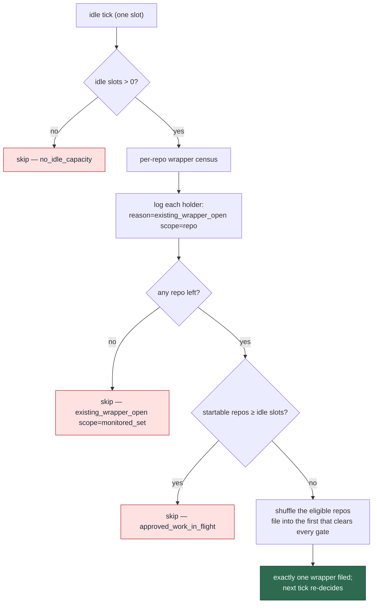

# Idle tasks fill every idle slot, one per repository (Issue #1083)

## Summary

Closes #1083.

Four Vibe Coders, eight slots, two issues in flight, fourteen empty
repositories — and exactly **one** idle task. Three independent caps stacked on
idle-task raising, each of which alone held the fleet at one:

1. **One wrapper fleet-wide.** `findAnyOpenIdleTaskWrapper` gated filing on
   *any* open `idle-task` issue across the whole monitored set, so idle
   capacity beyond the first slot could not be filled by design.
2. **One filing per idle episode per host.** `IdleFilerLatch` was a single
   boolean; its own comment treated "N slots going idle would file N issues" as
   the defect to prevent. Under the operator's rule that is the requirement.
3. **One startable issue suppressed everything.** The fleet-global gate asked
   "does *anything* anywhere have startable work?", so twenty-five `work-on`
   issues waiting in one repository suppressed idle filing across all eighteen.

They are the same defect wearing three hats: each assumes idle work is a scarce
fallback, when it is the mechanism that keeps every slot busy. All three are now
answered by one question — **how many slots are idle right now, and how many
repositories can take an idle task?** — filing `min(idle slots, eligible
repos)`, one per repository, pseudo-randomly chosen, at most one per tick.

### What changed

| Cap | Before | After |
| --- | ------ | ----- |
| Wrapper exclusivity | One open wrapper across the entire monitored set | One per **repository**; holders are skipped and named in the log, and only an entirely-held set skips the tick |
| Filer latch | One filing per idle episode per host | One per idle **observer** per episode, bounded by the fleet's idle capacity |
| Startable-work gate | Boolean: one startable issue anywhere suppressed all filing | Count: suppress only when startable repositories reach the idle-slot count |

**Bounded by idle capacity, not by a constant.** `slot_idle_accounting.ts`
(#925) is the authority on how many slots are doing nothing, so it is now also
the authority on how much idle work the fleet may raise. A new
`SlotIdleLedger.idleSlotCapacity()` reports the configured slot count less the
slots currently holding a claim; `getIdleSlotCapacity()` exposes it. The latch
reads it at every attempt (not at construction — occupancy changes across an
episode), and `run_core_production_deps.ts` passes the same reading to the filer
as `--idle-slots`, where it bounds the startable-work comparison and the
`no_idle_capacity` short-circuit. Nothing in the chain is a hard-coded number.

**#2089's protection is preserved, not replaced.** Its fault was fan-out from a
shuffle — successive ticks each picking a different clean repo and scattering
wrappers. Kept: a repository never accumulates two open wrappers (the census
excludes it, and the per-repo dedup inside `checkRepoGates` catches the TOCTOU
race), and a single tick still files at most one wrapper, so the next tick
re-decides from fresh state.

**The refusal is logged.** A slot that declines to file because a repository
already holds a wrapper now says so, naming both:

```text
[idle-task] template=<name> repo=<owner/repo> issue=<n> action=skipped reason=existing_wrapper_open scope=repo
```

and the whole-tick refusal is distinguishable from it:

```text
[idle-task] template=<name> action=skipped reason=existing_wrapper_open scope=monitored_set held=<n>
```

The absence of that first line is why the fleet-wide cap took a week to notice.

**Idle-starvation detector.** `idle_starvation_escalation.ts` treated **one**
open wrapper as health ("one is health, not shortfall") because the fleet-wide
cap made one the ceiling. With that cap gone the detector could not see the
current state, so the observation now carries `expectedIdleTasks` — the idle
slot count — and an episode ends only when the fleet has raised as much idle
work as its idle slots can take. One wrapper is health beside one idle slot and
a shortfall beside six.

### Sequence



## Evidence

No UI and no performance claim, so no screenshots or benchmarks. The evidence is
the red-then-green regression coverage below: each behavioural assertion was run
against the unfixed code first and failed with the message quoted.

| Behaviour | Red message against unfixed code |
| --------- | -------------------------------- |
| Live shape: 14 empty repos, 6 idle slots, one repo holding a wrapper → file elsewhere | `AssertionError: Values are not equal: six idle slots and thirteen clean repositories must produce a filing` — actual `skipped`, expected `filed` |
| Quiet fleet: no idle slots → nothing filed | `AssertionError: Values are not equal.` — actual `filed`, expected `skipped` |
| One startable issue does not suppress the other thirteen repos | `AssertionError: Values are not equal: one startable issue must not suppress idle filing in thirteen other repos` — actual `skipped`, expected `filed` |
| Six idle slots on one host may raise six idle tasks | `AssertionError: Values are not equal: six idle slots on one host must file six idle tasks` — actual `1`, expected `6` |

## Test Plan

New — `worker/deno/tests/idle_task_capacity_1083_test.ts` (15 tests). The three
gates under test run their **real** implementations, driven by a `gh` fake that
models the API's own rules; only the surrounding per-repo gates are stubbed, so
a regression cannot hide behind a stubbed verdict.

- the live shape — a wrapper holder is skipped and a clean repo is filed, with
  the refusal line asserted by repo and issue number;
- the #2089 direction — one wrapper per tick with ten idle slots and fourteen
  empty repos, and the next tick re-decides from fresh state;
- per-repo exclusivity — the only repo already holds a wrapper, so nothing is
  filed however many slots are idle;
- the quiet fleet — zero idle slots files nothing;
- pseudo-random spread — eight seeded ticks choose more than one repository;
- one startable issue does not suppress filing elsewhere, and its
  counter-direction: startable work for every idle slot files nothing;
- `findOpenIdleTaskWrappers` reports every holder, and tolerates a per-repo `gh`
  failure;
- `countReposWithStartableWork` counts all holders and honours `stopAt`;
- `IdleFilerLatch` — six idle slots file six, one slot's 74 re-scans file one, a
  fully occupied fleet files none, a claim ends the episode.

Modified, with the business-logic change documented in place (CODING-STANDARDS
§TDD point 3):

- `tests/slot_idle_accounting_925_test.ts` — the latch tests now pin what #925
  was really protecting (74 re-scans are one filing) rather than "the first
  observer wins and the rest are refused"; the fleet test asserts two idle slots
  beside a busy one file two, not one.
- `tests/maybe_file_idle_task_test.ts` — the fleet-wide `existing_wrapper_open`
  test is split: a wrapper in one repo now files into the other (asserting the
  refusal line), and a new test covers every repo holding one.
- `tests/idle_task_multi_worker_end_to_end_test.ts` — the second cycle skips the
  repo holding a wrapper and files into the other, asserting exactly one
  `gh issue create` for the tick.
- `tests/idle_filer_gate_wiring_1050_test.ts` — renamed dependency stub.

Verification run (`./quality.sh` deliberately not run — 15+ minutes; the checks
below are the ones it would exercise for this change):

| Command | Result |
| ------- | ------ |
| `deno fmt --check` | 2151 files, clean |
| `deno lint` | 2145 files, clean |
| `deno check mod.ts` + every changed file | clean |
| `deno test` over the 72 suites importing the changed modules, plus the new one | 936 passed, 0 failed |
| `deno task test:unit` | 16863 passed, 4 failed — all four pass standalone and are the known-flaky parallel process/container suites (`run_callbacks_integration_test.ts` ×2, `callback_conformance_test.ts`) plus one docs-count guard fixed in this branch |
| `markdownlint-cli2` over the changed docs | 80 files, 0 errors |
