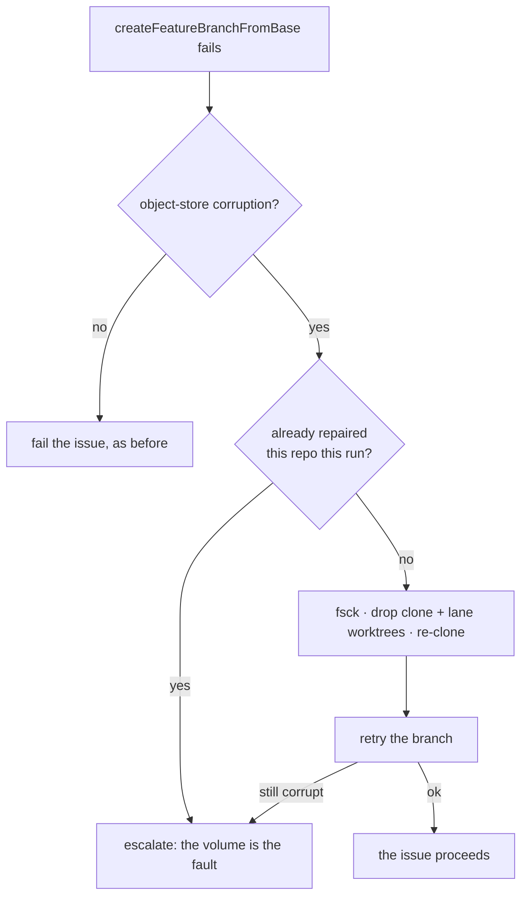

# PR Summary — three ways the worker wasted a slot or hid a fault

Closes #1092
Closes #1093
Closes #1094

Three defects from the GRQ-23 logs of 2026-09-05, each one the worker either
spending slot time on a fault it could not fix, or holding a fault it should
have said out loud.

## 1. A failing `always` callback never escalated (#1092)

**What it turned out to be.** The `always` hook failed on every issue across at
least five runs, cost ~100 s of slot time each time, and raised nothing.

The issue lists three sub-defects. Two of them — retrying a permanent 403 five
times with a rebase between each, and an unbounded carry-forward backlog — live
inside the operator's own hook at `/opt/vibe-hooks/always.sh` (the log lines are
prefixed `[grq:always]`, the hook's own logging). VibeCoder ships no such
script: the repository's only `always.sh` is the three-line archive example in
`docs/CALLBACKS.md` and the test fixtures. The worker's own push path already
gets this right — `detectPushRejection` matches `(fetch first)` and
`(non-fast-forward)` only, so a 403 is never rebase-retried.

The third sub-defect is squarely the worker's, and is what this change fixes:
a callback failing on every issue for days escalated nothing.

**Fix.** `lib/callback_failure_streak.ts` keeps a consecutive-failure count per
callback event in `$WORK_DIR/callback-failure-streaks.json` — durable, because
the condition outlives the run. On the third consecutive failing issue it files
(or comments on) one deduplicated issue in the worker's own repository through
the Issue #556 host-escalation channel, titled
`Post-run <event> callback failing on <host>`. Exactly one report per streak; a
single success clears the count. The report names the hook, the last run, the
exit code, the duration and the hook's redacted stderr, and tells the hook
author what the worker cannot enforce for them: fail fast on a permanent
authorisation failure, and bound anything carried forward between runs.

Wired into `run_core_production_deps.runIssueCallbacks`. It never throws, so a
reporting fault cannot alter a run's outcome — the boundary the callback layer
exists to hold.

## 2. A corrupt object in the shared clone failed the issue (#1093)

**What it turned out to be.** `VibeCoder#984` failed at `setup` with
`error: inflate: data stream error (unknown compression method)` — object-store
corruption, treated as an ordinary branch-creation failure. Because the lane
worktrees share one object store per repository (Issue #923), the next issue in
that repository would have failed identically, on every run, until a human
looked.

**Fix.** `lib/object_store_repair.ts` makes corruption its own class
(`inflate:`, `loose object … is corrupt`, `unable to read sha1 file`,
`object file … is empty`) — deliberately narrow, so a bad ref or a rejected push
stays an ordinary failure. `setup` now repairs rather than fails: `git fsck` for
evidence, remove the shared clone **and every lane worktree hanging off it** (a
surviving worktree directory makes `git worktree add` refuse the path, so every
lane would inherit the fault), re-clone, take a fresh lane worktree, retry the
branch. The claim is **once per repository per run**, not once per issue. Only a
repair that does not clear the corruption escalates, with the repository named
and deduplicated on `object-store-corrupt-<repo>` — at that point the work
volume is the fault rather than the objects.

`git fsck` is evidence, not a gate: the clones are shallow, so fsck is noisy in
both directions, and the checkout error is already the confirmation. Failing
towards the repair beats refusing one because fsck happened to say nothing.

## 3. `github-actions-audit` logged ERROR and omitted checks silently (#1094)

**What it turned out to be.** Two `ERROR` lines per run on any repository whose
token cannot read the Actions policy endpoints — a static property of the
token's scopes, not a fault — and an audit result that named neither the gap nor
the permission. An audit that silently omits checks reads as one that passed.

**Fix.** In `github_actions_audit_template.ts`, the repository-settings
`onLookupFailure` now classifies. `isNotPermittedLookup` recognises a permission
limit (HTTP 403 and the Actions-policy / not-accessible wordings) and logs it
once at `WARNING`, naming
`the repository "Actions policies" fine-grained read permission`. Everything
else — a 5xx, a network fault, a malformed response — still logs `ERROR`. Either
way the check is recorded as **skipped** and rendered into the audit's own
summary as `Checks skipped — NOT covered by this audit: …`, so a partial audit
can never read as a clean one.

Scope held to the repository-settings block the issue names; the worker-token
privilege check (Issue #599) keeps its existing loud behaviour.

## Evidence

No UI or performance change, so no screenshots or benchmarks. The evidence is
the tests: each defect has a test that cannot pass against the unfixed code.

## Test plan

All new tests are **unit** tests — behavioural, self-contained, fast and
parallel-safe. None drives a repository script, so none is an integration test;
none measures a duration, so none is a benchmark.

`worker/deno/tests/callback_failure_streak_test.ts` (8 tests, new)

- ten failing issues in a row produce exactly one report, at the threshold
- a single success clears the streak; the next fault is a fresh incident
- `timed_out` and `spawn_failed` extend the same streak as a non-zero exit
- streaks are per event — a failing `always` does not report a healthy `success`
- an undeliverable escalation is logged loud and alters nothing
- no callbacks configured reads, writes and reports nothing
- the streak survives the run boundary (real file, temp work directory)
- `workerCheckoutDir` honours `VIBE_BASE_DIR`, else the repository root

`worker/deno/tests/object_store_repair_test.ts` (9 tests, new)

- the four corruption wordings classify; a bad pathspec and a rejected push do
  not
- one repair per repository per run; a different repository is a different fault
- the repair drops the clone **and** all three lane worktrees, then re-clones
- a failed re-clone, and a failed removal, are loud failures naming the path
- **regression:** a corrupt store is re-cloned and the issue proceeds (fails
  against the unfixed phase, which returned `failure`)
- a repair that does not hold escalates with the repository named and the
  per-repository dedup marker
- the second issue of an already-repaired repository does not re-clone again
- an ordinary branch failure is not re-cloned

`worker/deno/tests/github_actions_audit_template_test.ts` (4 tests added)

- `isNotPermittedLookup`: 403 and the two 403 wordings yes; 404, 5xx, network
  and parse faults no
- the summary names skipped checks and the missing permission
- **regression:** a 403 on both Actions policy endpoints produces **no** ERROR
  line, two WARNINGs naming the scope, and a summary listing both checks
- a non-403 lookup failure still logs ERROR and is still named as skipped

## Verification

From `worker/deno`: `deno fmt` (2,197 files), `deno lint` (2,191 files),
`deno check` on every changed file, `deno check mod.ts`, `deno check tests/` —
all clean. Suites covering the change: the four above plus
`run_callbacks_test.ts`, `run_core_callbacks_test.ts`,
`callback_conformance_test.ts`, `setup_branch_resume_test.ts`,
`milestone_branch_rejection_test.ts`, `issue_worker_test.ts`,
`repo_settings_scanner_test.ts`, `idle_task_render_summary_test.ts`, and the
three manifest conformance suites — 206 + 86 passed, 0 failed.

`deno task test:unit`: parallel pass **PASSED**; serial pass 419 passed, 1
failed — `secret_redaction_bounds_test.ts` "near-miss provider prefixes do not
stall the new rules (Issue #36)", a `assertLinearGrowth` ratio assertion beaten
by machine load (4 of its 11 cases fail when the file is run alone on a loaded
host). It is one of the six known wall-clock timing failures already on `main`
and is untouched by this change — no file under `lib/secret_redaction.ts` or
`tests/support/growth.ts` is modified here.
