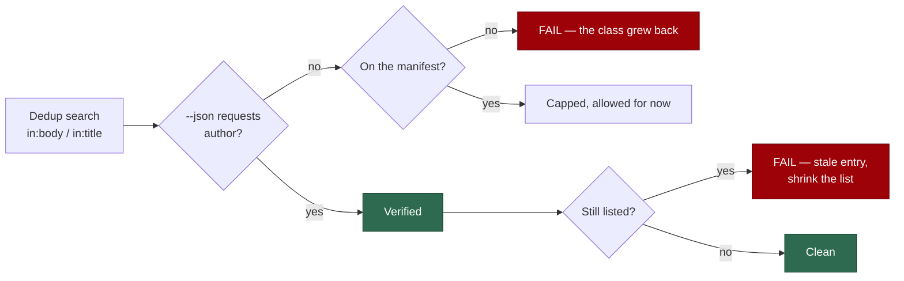

# Cap the unauthenticated-marker dedup class with a shrink-only manifest

## Summary

Issue #1097 is the design record for the five self-diagnostic escalations that
deduped on an unauthenticated body marker. Those five were fixed in #1095
(`14cd8d93`), and the ten marker-driven **action** sites in #1100 (`f4266bb2`) —
both verified here, not assumed. What the issue records as still outstanding is
the systemic half: *"nothing enforces the use of `ALERT_DEDUP_JSON_FIELDS`: this
class spread by copy-paste and will return the same way, so a shrink-only
manifest with a cap test in both directions is landing alongside."* That
manifest did not exist. This PR is it. Closes #1097.

`worker/deno/lib/dedup_author_manifest.ts` holds the invariant in code:

> every `--search` value carrying `in:body` or `in:title` must be paired with a
> `--json` field list that requests `author`

A static scanner reads the `gh issue list` / `gh pr list` argv arrays across
`worker/deno/{lib,commands,setup}` and classifies each dedup search. It finds
**36 dedup searches, 14 verified and 22 not**. The 22 are named one by one in
`UNVERIFIED_DEDUP_MANIFEST`, each with a stated reason, and
`UNVERIFIED_DEDUP_SITE_CAP` records the count as a literal so it moves visibly
in a diff.

The manifest is **shrink-only**, and that is enforced rather than asserted in
prose — the paired test fails in both directions:



So a copy-pasted dedup search that omits `author` fails the build, and fixing a
listed site is not complete until its entry is deleted and the cap lowered. A
list nobody is forced to shorten becomes a graveyard; this one cannot.

**The remaining 22 are exposure, not safety** — the manifest bounds the class,
it does not close it. Nineteen are the silence shape (seventeen idle-task
wrapper dedups keyed on a title, plus the audit-failure and carryover-tracker
alerts); three drive a write and are named as the ones to fix first:
`setup/best_practices_sync.ts` (sibling of the `best_practices_relabel.ts` that
#1100 fixed), `lib/idle_task_backfill.ts` (chooses which issue gets the
`idle-task` label written), and `lib/issue_query.ts` (decides from a PR title
that work is in progress). Draining the list to zero is tracked by **#1106**.

**Stated limit of the scan, not hidden.** It resolves a `--search` value written
inline or assigned once to a `const` in the same file. A search assembled at
runtime from several fragments is beyond a static scan and is not claimed to be
covered — which is why each entry carries a reason rather than the list being a
bare count. The list is the record of what is known, not proof that nothing else
exists.

## Evidence

Backend/CLI only — no web surface to screenshot. The evidence is the two
failure directions, each observed red before the change and green after.

**Direction 1 — the class grows back.** A copy-pasted unverified dedup search
was added at `worker/deno/lib/zz_copy_paste_probe.ts` and removed again:

```text
dedup manifest - every unverified search in the tree is listed ... FAILED
error: AssertionError: A dedup search keyed on an untrusted marker does not
request `author`. …
-     'worker/deno/lib/zz_copy_paste_probe.ts:12 "<!-- probe -->" in:body',
```

**Direction 2 — a site fixed, the manifest not shrunk.** `author` was added to
`baseline_carryover_tracker.ts`'s field list and reverted:

```text
dedup manifest - no entry outlives the site it describes ... FAILED
error: AssertionError: A manifest entry no longer matches an unverified dedup
search — the site was fixed or moved. Delete the entry and lower
UNVERIFIED_DEDUP_SITE_CAP to match.
-     'worker/deno/lib/baseline_carryover_tracker.ts "${title}" in:title',
```

**Both probe files were removed** — the diff adds only the manifest module, its
test, the SECURITY.md section and one cross-reference comment.

**Regression linkage.** Added
`worker/deno/tests/dedup_author_manifest_test.ts::scanContentForDedupSearches - flags the pre-#1095 unverified argv`,
which drives the scanner over the **verbatim argv `run_failure_issue.ts` carried
before #1095** (`--search '"${RUN_FAILURE_MARKER_PREFIX}:${failureClass}"
in:body'` paired with `--json "number,body"`) and asserts `authorVerified` is
`false`. Against the unfixed code that argv sat in the tree unflagged — nothing
read it — so the check did not exist and could not fail; the companion
conformance test
`worker/deno/tests/dedup_author_manifest_test.ts::dedup manifest - every unverified search in the tree is listed`
was **observed failing** with exactly that shape reintroduced (Direction 1
above) and passes with it removed. The pair reproduces the flaw and pins the
fix.

**Original trigger closed, no trivial bypass.** The original trigger — a marker
the fleet never wrote, matched in an issue body, read as "this alert already
exists" — is closed at the five named modules by #1095, and this PR verifies it
rather than trusting it:
`worker/deno/tests/dedup_author_manifest_test.ts::dedup manifest - the sites fixed by #1095 stay verified`
scans the live tree and fails if any of `run_failure_issue.ts`,
`idle_inversion_streak.ts`, `bump_script_failure_streak.ts`,
`pr_branch_update_failure_streak.ts` or `idle_starvation_escalation.ts` stops
requesting the author. What this PR closes is the **re-entry path**: the trivial
bypass for the class was writing the sixteenth copy of the argv without
`author`, and that now fails the build. The near-miss bypasses are each pinned
by test — a field list interpolating a *non*-author constant
(`${SOME_OTHER_FIELDS}`) is unverified, `authorAssociation` does not count as
`author`, omitting `--json` entirely is unverified rather than skipped, and a
search hoisted into a `const` is still resolved and classified. The one gap that
remains is stated above and in `SECURITY.md` §5d rather than papered over: a
search assembled at runtime from several fragments is outside a static scan.

## Test Plan

Added `worker/deno/tests/dedup_author_manifest_test.ts` — 17 tests, all
behavioural (every assertion calls a real exported function with real inputs; no
test greps source for patterns).

Scanner behaviour, against literal source text:

- `scanContentForDedupSearches - flags the pre-#1095 unverified argv`
- `scanContentForDedupSearches - accepts the shape #1095 landed`
- `scanContentForDedupSearches - a literal author field verifies`
- `scanContentForDedupSearches - an interpolated shared field list verifies`
- `scanContentForDedupSearches - a search with no --json cannot be verified`
- `scanContentForDedupSearches - resolves a search hoisted into a const`
- `scanContentForDedupSearches - ignores prose and non-marker searches`
- `fieldListRequestsAuthor - literal, interpolated and absent`

Audit behaviour, both directions:

- `auditDedupManifest - an unlisted unverified search is reported`
- `auditDedupManifest - a listed unverified search is not reported`
- `auditDedupManifest - a fixed site makes its entry stale`
- `auditDedupManifest - a verified search is never reported`

Conformance over the live source tree:

- `dedup manifest - every unverified search in the tree is listed`
- `dedup manifest - no entry outlives the site it describes`
- `dedup manifest - the cap matches the manifest and may only fall`
- `dedup manifest - every entry states a reason and a real path`
- `dedup manifest - the sites fixed by #1095 stay verified`

## Quality gate — one pre-existing failure, not from this change

`./quality.sh` reports every check PASSED except `deno tests`, which fails on

```text
slot pool - a success is followed by the normal sleep and another claim in the
SAME slot, not a pool drain (Issue #178)
  => worker/deno/tests/run_core_slot_pool_test.ts:1112
```

This is **pre-existing on the default branch**, not a regression from this PR.
It was bisected by checking out each commit and running the filtered test in
isolation: it fails identically at `f4266bb` (the default tip), `be9daca` and
`6aea71e`, and neither the test nor anything it imports is touched by this
change. A second test,
`run_core_production_deps_test.ts::createProductionRunCoreDeps - static trust
refresh succeeds and does not throw`, fails intermittently in the parallel pass
and passes in isolation — timing-sensitive under load. Both are captured, with
the reproduction and the bisect table, in **#1118**; fixing the slot-pool
behaviour is a separate root cause and out of scope for #1097.

This branch's own suite is green: `deno test --allow-read
tests/dedup_author_manifest_test.ts` → 17 passed, 0 failed.

## Security self-check

- **Input validation** — the scanner's inputs are repository source files, not
  external input; the tokeniser bounds every read and returns rather than
  throwing on an unterminated literal.
- **Secrets** — no credentials, tokens or hidden paths staged. Staged set:
  `SECURITY.md`, `worker/deno/lib/alert_dedup_authors.ts`,
  `worker/deno/lib/dedup_author_manifest.ts`,
  `worker/deno/tests/dedup_author_manifest_test.ts`, this summary.
- **Injection surface** — no new SQL, shell, filesystem-write or HTTP calls. The
  module reads files and returns data; it spawns nothing.
- **Fail loud** — the audit reports both directions as failures rather than
  returning a quiet pass, and the scan's boundary is stated in the module doc so
  an uncovered shape is visible rather than looking like coverage.
- **Dependencies** — none added.
