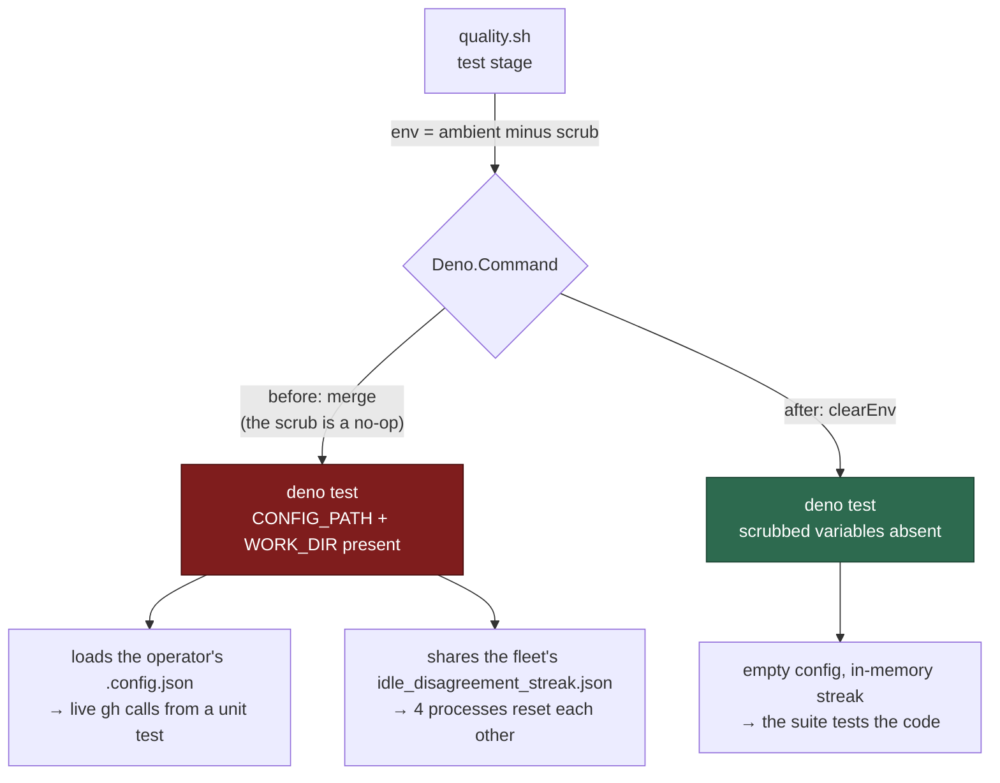

# quality.sh is green on the base branch again (Issue #1098)

## Summary

`./quality.sh` was red with no change applied, and the failing set drifted
between runs. It was three independent causes, none of them in the code under
test. Closes #1098.

1. **The gate's environment scrub never reached the suite.** `Deno.Command`
   *merges* a supplied `env` into the parent's, so removing a key from the
   object never unset it in the child — the Issue #891 `CONFIG_PATH` scrub has
   been a no-op for as long as it has existed. `deno test` kept receiving the
   container's config path, `run_core_production_deps_test.ts` loaded the
   operator's real `.config.json`, and a test that meant to read an empty
   config resolved trusted authors against the live monitored repositories. A
   `gh` call killed mid-flight is the `exit 143` that failed the stage.
   `runCommand` (and the local `unit_test_runner.ts`) now pass a supplied
   environment with `clearEnv`, and `WORK_DIR` joins `CONFIG_PATH` in the
   scrub: inherited, it pointed every suite that drives `runCoreLoop` at the
   **running fleet's** `idle_disagreement_streak.json`, one file shared by four
   `--parallel` worker processes, each resetting the others' streak (that is
   what failed `run_core_idle_detect_audit_test.ts` under the gate, and it was
   writing test timestamps into live worker state).
2. **A process-global cache keyed by a restarting counter.** The trusted-author
   resolver caches one result per `cycleId`, and every deps factory counted
   from 1 — so whichever consumer in the worker process resolved first decided
   the answer for the next, including a cached *failure* nobody made a call
   for. The key is now scoped per factory.
3. **Concurrency proved with a stopwatch.** The slot-pool tests held each run
   open for a fixed 10–20 ms so siblings could start, which is a statement
   about the host: under the gate's own parallel suite the first slot finished
   before the third had started (`expected 3 concurrent, saw 2`). They now
   rendezvous. The deterministic `:1088` failure was the same family — the
   trace it asserted on was shared with a sibling *idle* slot whose re-scan
   sleeps landed in it in scheduler order.

The behaviour of the pool itself was never wrong: the same slot took both
claims, from one pool invocation, with the settle sleep between them. The test
now asserts that from the pool's own `[sN repo#issue]` attribution as well as
from the trace.

## Evidence

Backend/CLI only — no web interface to screenshot. The evidence is the gate.

Before (base branch, clean worktree, no change applied), three runs of the
gate's own parallel pass, each a different set:

```text
run 1: run_core_slot_pool_test.ts:1088   run_core_slot_pool_test.ts:668    run_core_production_deps_test.ts:185
run 2: run_core_slot_pool_test.ts:1088   run_core_slot_pool_test.ts:203    run_core_idle_detect_audit_test.ts:428, :474
run 3: run_core_slot_pool_test.ts:1088   run_core_idle_detect_audit_test.ts:428
```

The diagnostic that named cause 1 — the resolve reaching the live API from a
unit test:

```text
{"ok":false,"reason":"could not resolve trusted authors from stSoftwareAU/GRQ:
 gh command failed (exit 143): — refusing to fall back to the local
 allowed_authors arrays"}
```

The disagreement streak resetting mid-run, from a sibling process writing the
same file:

```text
observer=cycle streak=1 elapsed=0s   bound=1200s persisted=true
observer=cycle streak=2 elapsed=540s bound=1200s persisted=true
observer=cycle streak=1 elapsed=0s   bound=1200s persisted=true   ← reset by another process
```

After — `./quality.sh < /dev/null`, both halves of the unit stage:

```text
Deno tests [parallel]: PASSED in 1m58s
Deno tests [serial]:   PASSED in 1m48s
Result: PASSED (with skipped checks)
```

The gate's parallel pass was additionally run five further times end to end,
green each time.



## Reproduction

- **symptom** — `./quality.sh` fails on a clean base-branch worktree with an
  unstable set of slot-pool, production-deps and idle-detect failures
- **status** — `verified` — each cause was reproduced red and then observed
  green: the `:1088` assertion failed on every run of the untouched file and
  passes after the rewrite; the cache collision was reproduced by poisoning
  `cycleId: 1` before building a factory (red against the unfixed
  `run_core_production_deps.ts`, green after); the env leak was reproduced by
  the new subprocess probe (red with the `clearEnv` removed, green with it)
- **regression test** —
  `worker/deno/tests/quality_gate_test_env_test.ts::test stage env - a scrubbed variable really is absent from the child (Issue #1098)`,
  `worker/deno/tests/run_core_production_deps_test.ts::createProductionRunCoreDeps - another consumer's cycle 1 is not served to this factory's first refresh (Issue #1098)`,
  and `worker/deno/tests/run_core_slot_pool_test.ts::slot pool - a success is followed by the normal sleep and another claim in the SAME slot, not a pool drain (Issue #178)`

## Acceptance Criteria

<!-- vibe-spec-review inputs="diff+issue-body" -->

- **met** — make `run_core_slot_pool_test.ts:1088` pass, or establish what
  regressed — evidence:
  `worker/deno/tests/run_core_slot_pool_test.ts:1133` — reviewer: met — the
  reviewer independently reproduced the failure against the untouched library
  and confirmed no production regression was hidden; the rewrite also adds the
  strictly stronger same-slot claim
- **met** — establish why `run_core_slot_pool_test.ts:668` passes in isolation
  and fails under the full gate — evidence:
  `worker/deno/tests/support/rendezvous.ts` and its call sites in
  `worker/deno/tests/run_core_slot_pool_test.ts` — reviewer: met
- **met** — establish why `run_core_production_deps_test.ts:185` passes in
  isolation and fails under the full gate — evidence:
  `worker/deno/lib/quality_gate.ts:171` (the scrub reaching the child) and
  `worker/deno/lib/run_core_production_deps.ts:441` (the per-factory cache
  key), each with its own regression test — reviewer: met
- **met** — no absolute wall-clock thresholds in the unit tests — evidence:
  `worker/deno/tests/support/rendezvous.ts` — reviewer: met — the one retained
  `setTimeout` proves an *absence* of overlap, where a slow host can only widen
  the window
- **met** — once green, the base branch's gate is the baseline again —
  evidence: `./quality.sh` PASSED, both unit passes green — reviewer: partial —
  reason: the reviewer found `unit_test_runner.ts` still spawning without
  `clearEnv`, so the documented local equivalent kept leaking; fixed in
  `worker/deno/unit_test_runner.ts:52` after the review
- **unrequested** — `CODING-STANDARDS.md` gains two standards sections —
  reviewer: unrequested — reason: the fix is only durable if the two rules it
  rests on are written down, and that file is where this repo keeps them
- **unrequested** — the rendezvous is applied to three slot-pool tests the
  issue did not name — reviewer: unrequested — reason: same failure class, same
  file; leaving them would have kept the gate's failing set unstable, which is
  the symptom the issue is about
- **unrequested** — `runCommand` becomes exported — reviewer: unrequested —
  reason: the regression test drives the real helper rather than re-deriving
  `Deno.Command`'s behaviour

## Standards Review

<!-- vibe-standards-review inputs="diff+CODING-STANDARDS.md" -->

- **violation** — the sibling slot hand-rolled the bounded tick loop the new
  helper encapsulates, re-hardcoding its bound — evidence:
  `worker/deno/tests/run_core_slot_pool_test.ts:1174` — reason: fixed here —
  extracted `waitUntil`, which the rendezvous is now built on and the slot-pool
  test calls
- **violation** — `DEFAULT_MAX_TICKS` exported with a single reference —
  evidence: `worker/deno/tests/support/rendezvous.ts:24` — reason: fixed here —
  it is now the shared bound for both `waitUntil` and the rendezvous
- **violation** — an unparseable comment was the sole justification for the one
  retained fixed sleep — evidence:
  `worker/deno/tests/run_core_slot_pool_test.ts:734` — reason: fixed here —
  rewritten to say why an absence proof stays a plain wait
- **violation** — no `docs/archive/pr-summaries/pr-summary-1098.md` — evidence:
  `docs/archive/pr-summaries/` — reason: fixed here — this file
- **clean** — Australian English throughout; every production change has a test
  that calls real code (no source-grep tests); no hidden paths staged; no
  absolute wall-clock assertion introduced and five removed; fail-loud
  preserved (an expired bound reports a count shortfall the caller's assertion
  turns red on); the only `runCommand` caller passing `env` supplies a complete
  environment, so `clearEnv` cannot silently strip another stage's variable;
  commit messages carry the issue and the run-id trailer

## Test Plan

- Added `worker/deno/tests/support/rendezvous.ts` (`createRendezvous`,
  `waitUntil`) and `worker/deno/tests/rendezvous_test.ts` — six tests covering
  the met rendezvous, the bounded shortfall, a later arrival, and both
  `waitUntil` outcomes.
- Added
  `quality_gate_test_env_test.ts::test stage env - a scrubbed variable really is absent from the child (Issue #1098)`
  — plants a variable in an intermediate process, calls the real `runCommand`,
  and asserts the grandchild does not inherit it. Red with `clearEnv` removed.
- Added `quality_gate_test_env_test.ts::test stage env - WORK_DIR is not handed to the suite`
  and `unit_test_passes_test.ts::unit passes - WORK_DIR is scrubbed from both passes`.
- Added
  `run_core_production_deps_test.ts::createProductionRunCoreDeps - another consumer's cycle 1 is not served to this factory's first refresh (Issue #1098)`
  — poisons the resolver's cache at `cycleId: 1`, then asserts a fresh factory
  still resolves. Red against the unfixed factory.
- Rewrote
  `run_core_slot_pool_test.ts::slot pool - a success is followed by the normal sleep and another claim in the SAME slot (Issue #178)`
  — the sibling slot is given work so it stays out of the trace, and the
  same-slot claim is asserted from the pool's own attributed log lines.
- Converted four slot-pool concurrency high-water assertions from fixed sleeps
  to the rendezvous.
- `./quality.sh < /dev/null`: PASSED (parallel and serial unit passes, lint,
  type check, fmt, semgrep, markdownlint, mermaid).
