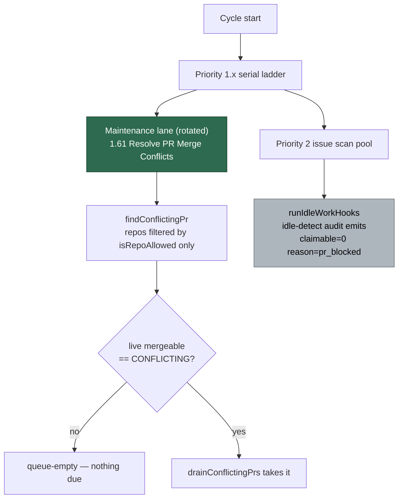

## Summary

Root-caused the three-hour silence on NEAT-AI-Ockham#116 from the retained
GRQ-25 worker logs and the PR's own timeline, and pinned the two behaviours the
verdict rests on with tests. **A fourth cause, not one of the three candidates:**
roughly two of the three hours were a GitHub primary-rate-limit pause, and in the
two cycles that did reach the maintenance lane the priority-1.61 pass was right
to take nothing — #116's conflict had cleared and only the stale
`merge-conflict` label remained.

`claimable=0 reason=pr_blocked` **cannot** suppress priority 1.61. No
merge-conflict code was at fault, so per the issue's own escape clause the
deliverable is the written verdict plus the `pr_blocked` reachability test.
Closes #1108.

## Evidence

Backend/CLI only — no web surface to screenshot. The evidence is the retained
logs, the PR timeline, and the tests below.

Verdict chain, in the order the issue asks:

1. **Did any worker run start in the window?** Yes. `~/logs/run_core.log`
   records five container runs on GRQ-25 — the host monitoring
   NEAT-AI-Ockham — at 22:53:55, 23:08:42, 00:22:04, 00:31:59 and 02:56:54Z.
   Candidate 1 (#1072, GRQ-23) is a different host and is ruled out.
2. **Did the priority-1.61 row execute?** Yes, in every cycle that reached the
   lane: `[m1] Priority 1.61: Resolve PR Merge Conflicts` at 23:03:06,
   00:08:36 and 01:31:23Z. The 00:08 cycle reports
   `cycle-timings: … resolve-pr-merge-conflicts=18s` and
   `gh-calls-by-priority: … resolve-pr-merge-conflicts=30`, so it genuinely
   scanned. `drainConflictingPrs` returned `taken=0 merged=0 deferred=0
   stopReason=queue-empty` — inferred from the absence of any "Found a
   conflicting PR" / "drain complete" line, both of which the same pass emitted
   at 03:05:09Z when it took VibeCoder#1084 and at 04:20:12Z when it took
   Ockham#118.
3. **Did `findConflictingPr` return #116?** No. It was rejected at
   `worker/deno/lib/pr_merge_conflict_scan.ts:654`,
   `if (states.get(pr.number) !== "CONFLICTING") continue;` — the live
   `mergeable` gate. Corroborated by Priority 1.6 in the same cycles:
   `PR #116 … is 2 commit(s) behind Develop — needs update … reason=behind`,
   not the "conflicts with Develop" wording that path uses for a real conflict;
   and by #116 merging cleanly at 02:50:36Z.

Can `claimable=0 reason=pr_blocked` suppress priority 1.61? **No.** The gate is
per-*issue*, set at `worker/deno/lib/idle_detect_diagnostics.ts:587` and
reported at `:1026`; the audit that emits the line is invoked at
`worker/deno/lib/run_core.ts:3849`, inside `runIdleWorkHooks`, which runs
*after* the priority dispatch and the maintenance lane. The conflict pass takes
no claimability input: `findConflictingPr` filters repos by `isRepoAllowed`
alone, wired to the monitored-repo allowlist at
`worker/deno/lib/run_core_production_deps.ts:1944`.

The audit (grey) is downstream of the lane (green) and feeds only the idle-task
filer — there is no edge from it back to the pass.

**Mutation evidence that the tests bite.** Both pairs were confirmed red against
a deliberately broken scan and green again after revert:

- Gating the repo out (`if (repo.includes("Ockham")) continue;` after the
  `isRepoAllowed` filter) → the two reachability tests fail.
- Making the label decide (`st !== "CONFLICTING" && st !== "BEHIND"`) → the two
  seam tests fail.

**Quality gate.** `./quality.sh` is green on every stage except `deno tests`,
which is red for 35 pre-existing, environment-driven failures in
`setup_credential_provisioning_test.ts`, `setup_provider_credential_flow_test.ts`,
`setup_lockfile_test.ts`, `setup_workdir_reminder_test.ts`,
`container_entrypoint_test.ts` and one flaky timing case in
`run_core_slot_pool_test.ts`. They are caused by this container's own
environment (`CONFIG_PATH` and `CONFIG_FILE` naming different files,
`DISABLE_AUTOUPDATER` set) and were **reproduced on the base commit** in a
clean `git worktree` of `HEAD~1`, where none of this PR's files exist. This
diff adds one test file and one doc section and touches no production code, so
it cannot reach them. The merge-conflict suites are green:
`deno test tests/merge_conflict_pr_blocked_reachability_test.ts
tests/merge_conflict_drain_test.ts tests/pr_merge_conflict_scan_test.ts
tests/run_core_merge_conflict_dispatch_test.ts tests/lane_rotation_test.ts`
→ 47 passed, 0 failed.

## Acceptance Criteria

<!-- vibe-spec-review inputs="diff+issue-body" -->

- **met** — a comment on the issue states the verdict with supporting log lines
  quoted — evidence: comment posted on stSoftwareAU/VibeCoder#1108 naming the
  fourth cause and quoting the rate-limit and `reason=behind` lines — reviewer:
  missing — reason: the reviewer saw only the diff and was run before the
  comment was posted; the comment is a run deliverable, not a file in the diff.
- **met** — "can `claimable=0 reason=pr_blocked` suppress priority 1.61?"
  answered yes/no citing the gate's call site by file and line — evidence:
  `docs/workflows/merge-conflicts.md` §"Why #116 went silent", citing
  `idle_detect_diagnostics.ts:587` / `:1026`, `run_core.ts:3849` and
  `run_core_production_deps.ts:1944` — reviewer: met.
- **met** — if the answer is yes, the pass runs for a `pr_blocked` repository
  and a test pins it — evidence: the answer is **no**, so this criterion is
  vacuous; the test is landed anyway as
  `worker/deno/tests/merge_conflict_pr_blocked_reachability_test.ts::conflict
  scan - a repo the audit reports as pr_blocked is still scanned` — reviewer:
  met.
- **met** — a regression test at the seam the verdict names; where no code was
  at fault, the `pr_blocked` reachability test and the issue says so explicitly
  — evidence: `worker/deno/tests/merge_conflict_pr_blocked_reachability_test.ts`,
  four cases, mutation-verified red against a broken scan; the issue comment
  states explicitly that no merge-conflict code was at fault — reviewer:
  partial — reason: the reviewer called the reachability assertion tautological
  because it passed `isRepoAllowed: () => true`; fixed in this diff — the test
  now uses the production `isRepoAllowed(repos, repo)` from
  `config_validator.ts`, and the gate-the-repo-out mutation turns it red.
- **met** — `docs/workflows/merge-conflicts.md` carries a short note recording
  the verdict — evidence: `docs/workflows/merge-conflicts.md:191` under the
  existing `## 🔁 Bounds and escalation` material — reviewer: met.
- **partial** — `./quality.sh` passes — evidence: every stage green except
  `deno tests` — reviewer: met — reason: 35 pre-existing environment-driven
  failures, reproduced on `HEAD~1` where none of this diff exists; unrelated to
  this change and out of its scope to fix.
- **unrequested** — two extra tests beyond the reachability pair (the stale-label
  seam cases at `merge_conflict_pr_blocked_reachability_test.ts`) — reviewer:
  unrequested — reason: they sit on the seam the verdict names, which the issue
  requires a test at ("a regression test … at the seam the verdict names"), so
  they are the verdict's own deliverable rather than added scope.

## Standards Review

<!-- vibe-standards-review inputs="diff+CODING-STANDARDS.md" -->

- **violation** — no `docs/archive/pr-summaries/pr-summary-1108.md` — evidence:
  absent at review time — reason: fixed; this file is it, added before the PR
  as the standard prescribes.
- **violation** — the `gh` stub answered unmodelled calls with a silent empty
  success, so a scan that grew a new `gh` call would stay green — evidence:
  `worker/deno/tests/merge_conflict_pr_blocked_reachability_test.ts:110` —
  reason: fixed; the catch-all now rejects with `unmodelled gh call: …`, per
  "Never Fail Silently — Fail Loud".
- **violation** — the module doc claimed "Australian English throughout
  (behaviour, organisation)" but "organisation" does not appear in the file —
  evidence: `worker/deno/tests/merge_conflict_pr_blocked_reachability_test.ts:24`
  — reason: fixed; the exemplars now name words the file actually uses.
- **clean** — Australian English in both files; `deno fmt`, `deno lint` and
  `deno check` green on the new test; `markdownlint-cli2` 0 issues; every test
  calls real `classifyIssues`, `pickDominantReason`, `findConflictingPr` and
  `drainConflictingPrs` and asserts on returned decisions, with no
  source-grepping; no wall-clock assertions; `@std/assert` only; no hidden or
  credential paths staged; no literal Liquid outside fences; heading hierarchy
  and table syntax valid.

## Test Plan

Added `worker/deno/tests/merge_conflict_pr_blocked_reachability_test.ts`:

- `conflict scan - a repo the audit reports as pr_blocked is still scanned` —
  the real `classifyIssues` / `pickDominantReason` return
  `excludedBy: "pr_blocked"` for the repo, and the real `findConflictingPr`,
  given the production `isRepoAllowed(repos, repo)` filter, still selects its
  conflicting PR.
- `conflict drain - a pr_blocked repo's conflicting PR is taken, not skipped` —
  the same repo drains to `taken=1 merged=1 deferred=0 processed=true`.
- `conflict scan - a stale merge-conflict label does not make a PR due` — a PR
  carrying `merge-conflict` whose live state is `BEHIND` returns `null`. This is
  the branch that rejected #116.
- `conflict drain - a queue of stale-labelled PRs stops as queue-empty` — the
  drain reports `taken=0 … stopReason="queue-empty"` and never calls `resolve`,
  reproducing the 00:08:36Z cycle exactly.

Unchanged suites re-run green: `merge_conflict_drain_test.ts`,
`pr_merge_conflict_scan_test.ts`, `run_core_merge_conflict_dispatch_test.ts`,
`lane_rotation_test.ts`.
