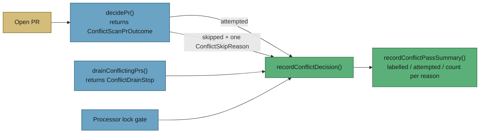

# Merge-conflict: a recorded reason for every decision, every pass

## Summary

Every PR the merge-conflict pass decides on now leaves exactly one
machine-readable reason behind, from a closed taxonomy, plus one pass-level
summary. Previously a skipped PR produced either nothing or an unstructured log
line, so "the label went on and then silence" — the #1076 symptom — was
indistinguishable from a pass that ran and correctly decided to wait.
Closes #1109.

What landed:

- **`ConflictSkipReason`** in `worker/deno/lib/pr_merge_conflict_scan.ts` — a
  discriminated union covering every exit out of `findConflictingPr`,
  `drainConflictingPrs` and the processor's lock gate, each member carrying the
  operands that make the decision checkable (`msUntilDue`, `attemptsSpent` /
  `maxAttempts`, `disruptedCount`, `lockHolder`, …).
- **Compile-time closure.** The scan's per-PR decision returns
  `ConflictScanPrOutcome` and the drain's loop returns `ConflictDrainStop`, so an
  exit added with no reason is a type error; `conflictReasonOperands` and
  `isQueuedConflictReason` switch exhaustively, so a reason added with no case is
  a type error too.
- **`findConflictingPr` returns `{ selected, decisions }`** instead of the bare
  selection, so a caller sees the whole set the pass walked and what happened to
  each.
- **Records and a summary through the existing logger** — no new sink, no new
  GitHub call. Every operand comes from data the pass already fetched.
- **Fail loud on an unreadable state.** A PR whose mergeable lookup failed is
  recorded as `scan-error` / `mergeable-state` at INFO, never as a clean
  `not-conflicting` at DEBUG.

Selection behaviour is unchanged: the pass takes the same PRs, in the same
order, on the same bounds.

## Evidence

Backend-only change — no web interface to screenshot. The evidence is the test
suite and the full quality gate.

```text
$ deno task test tests/pr_merge_conflict_scan_test.ts \
    tests/merge_conflict_drain_test.ts \
    tests/merge_conflict_decision_taxonomy_test.ts \
    tests/pr_merge_conflict_processor_test.ts \
    tests/merge_conflict_pr_blocked_reachability_test.ts
ok | 94 passed | 0 failed (5s)

$ ./quality.sh < /dev/null
Result: PASSED (with skipped checks)
```

One pass, as it now reads in the log:

```text
merge_conflict_decision=cooldown repo=org/repo pr=48
    repo=org/repo prNumber=48 decision=skipped reason=cooldown msUntilDue=10800000
merge_conflict_pass=scan labelled=3 attempted=0 considered=3 cooldown=1 needs-human=2
```



## Acceptance Criteria

<!-- vibe-spec-review inputs="diff+issue-body" -->

- **partial** — Every exit path in `findConflictingPr` and `drainConflictingPrs`
  yields exactly one reason from the closed taxonomy — evidence:
  `worker/deno/lib/pr_merge_conflict_scan.ts` (`decidePr`),
  `worker/deno/lib/merge_conflict_drain.ts` (`runDrain`) — reviewer: partial —
  reason: two **repo-level** exits (the allowlist and a listing failure) still
  yield no reason, because neither knows a PR to key a decision on; they are
  counted in the pass summary as `reposNotAllowed` / `reposListFailed` instead.
  The reviewer's other two findings on this criterion — the drain's default
  `cap` stop and a failed state lookup mis-mapped to `not-conflicting` — were
  fixed in this diff.
- **met** — Adding an exit that returns no reason fails to compile — evidence:
  `worker/deno/tests/merge_conflict_decision_taxonomy_test.ts::taxonomy compile
  gate - an exit that returns no reason fails to compile` — reviewer: partial —
  reason: the reviewer was right that the drain's `let stop = { kind: "cap" }`
  left the hole open; the loop is now a function returning
  `ConflictDrainStop`, and `deno check` refuses a `return` with no stop
  (verified by hand: `TS2322 ... 'undefined' is not assignable to type
  'ConflictDrainStop'`).
- **partial** — A pass over a fleet with N labelled PRs emits N per-PR records
  plus one summary, asserted against injected seams — evidence:
  `worker/deno/tests/pr_merge_conflict_scan_test.ts::findConflictingPr - every
  labelled PR gets a record, plus one summary` — reviewer: partial — reason: a
  scan pass ends at its selection, so PRs after the selected one are decided on
  the next call; walking past the selection would cost a label read and a
  comment page per PR, which the "no additional API calls" criterion forbids.
  The boundary is documented in `docs/workflows/merge-conflicts.md`.
- **met** — The `cooldown` record carries the milliseconds remaining; the
  `budget-spent` record carries attempts spent and the cap — evidence:
  `worker/deno/tests/pr_merge_conflict_scan_test.ts::findConflictingPr - the
  cooldown record carries the milliseconds still to run` and `::findConflictingPr
  - the budget-spent record carries the attempts and the cap` — reviewer: met.
- **met** — Selection behaviour is unchanged: an existing scan test over a fixed
  fleet selects the same PR — evidence: every pre-existing assertion in
  `worker/deno/tests/pr_merge_conflict_scan_test.ts` and
  `merge_conflict_pr_blocked_reachability_test.ts` is unchanged apart from
  reading `.selected` off the new result shape — reviewer: partial — reason: the
  reviewer's concern was the new author guard and its bespoke login matcher;
  the matcher is gone (the guard now calls the repo's `isFleetAuthor`, the same
  helper `pr_ci_nudge_scan.ts` uses for the identical guard), and the guard
  cannot fire on a listing `gh` already filtered by `--author`, so no PR the old
  code selected is skipped.
- **met** — No additional GitHub API calls per pass, asserted by counting calls
  on the injected `gh` seam — evidence:
  `worker/deno/tests/pr_merge_conflict_scan_test.ts::findConflictingPr - the
  records cost no extra gh calls` pins the exact four-call sequence — reviewer:
  met.
- **met** — `./quality.sh` passes — evidence: full gate run after the final edit,
  `Result: PASSED (with skipped checks)` — reviewer: met.
- **unrequested** — `author` added to `PR_FIELDS` and `PrEntry` — reviewer:
  unrequested — reason: the issue enumerates `out-of-scope-author` in the
  taxonomy, and without the author on the listing entry that reason has no
  producer. It rides the existing listing, so it costs no call.
- **unrequested** — taxonomy members `already-handled` and `scan-error` beyond
  the issue's enumerated list — reviewer: unrequested — reason: the first
  acceptance criterion requires *every* exit to yield a reason, and these are
  the exits the issue's list did not name.
- **unrequested** — `reposScanned` / `reposNotAllowed` / `reposListFailed` on the
  pass summary — reviewer: unrequested — reason: the repo-level exits have no PR
  to key on, so counting them is the only way they appear in the decision
  surface at all.
- **unrequested** — `lock-held` recorded from
  `pr_merge_conflict_processor.ts` rather than the scan — reviewer: unrequested —
  reason: the issue lists `lock-held` in the taxonomy and that exit lives in the
  processor; the duplicate prose line beside it was removed so the event is
  logged once.
- **unrequested** — the new section in `docs/workflows/merge-conflicts.md` —
  reviewer: unrequested — reason: the standards require a docs change to
  accompany a change in documented behaviour.

## Standards Review

<!-- vibe-standards-review inputs="diff+CODING-STANDARDS.md" -->

- **violation** — no `docs/archive/pr-summaries/pr-summary-1109.md` — evidence:
  `docs/archive/pr-summaries/` — reason: fixed here; this file is it.
- **violation** — a fourth, divergent login matcher (`normaliseLogin` stripping
  `[bot]`, more permissive than the repo's `isFleetAuthor`) — evidence:
  `worker/deno/lib/pr_merge_conflict_scan.ts:924` (pre-fix) — reason: fixed in
  this diff — the helper is gone and the guard calls
  `fleet_authors.ts::isFleetAuthor`.
- **violation** — doc comment naming a file that does not exist
  (`merge_conflict_decision_compile_test.ts`) — evidence:
  `worker/deno/lib/pr_merge_conflict_scan.ts:908` (pre-fix) — reason: fixed —
  it now names `merge_conflict_decision_taxonomy_test.ts`.
- **violation** — `sanitizeResources: false` disabling a failure detector that
  was not in the way — evidence:
  `worker/deno/tests/merge_conflict_decision_taxonomy_test.ts:375` (pre-fix) —
  reason: fixed — all three overrides removed, the file still passes.
- **violation** — the doc claimed "every labelled PR … every pass", which the
  scan's early return makes false — evidence:
  `docs/workflows/merge-conflicts.md:261` (pre-fix) — reason: fixed — the
  section is retitled and now states the three boundaries (early return, the two
  summary scopes, and the `attempted` + `lock-held` pair).
- **violation** — "One pass-level summary, always" is false when `resolve()`
  throws — evidence: `worker/deno/lib/merge_conflict_drain.ts:226` (pre-fix) —
  reason: fixed in the comment, not the code — the throw must keep propagating
  loudly, and it did before this change too.
- **violation** — a comment claiming the deferral is "recorded rather than left
  as an unstructured log line" directly above the retained unstructured line —
  evidence: `worker/deno/lib/merge_conflict_drain.ts:184`,
  `worker/deno/lib/pr_merge_conflict_processor.ts:495` (pre-fix) — reason: fixed
  — both duplicate lines removed, so each event is logged once.
- **violation** — `pr_merge_conflict_scan.ts` grew 813 → ~1260 lines against the
  "prefer smaller files" standard — evidence:
  `worker/deno/lib/pr_merge_conflict_scan.ts` — reason: stands. The issue
  requires the union to be defined in this module by name; splitting it out
  would leave two import paths for one taxonomy, which is the drift the
  single-source rule exists to prevent.
- **violation** (low confidence, per the reviewer) — the compile-gate test
  spawns `deno check` three times — evidence:
  `worker/deno/tests/merge_conflict_decision_taxonomy_test.ts` — reason: stands.
  The issue names the compile-time guard as the *earliest* failure-detection
  point, and a type error cannot be asserted without a type checker. It is ~1 s
  per run, spawns no repo script, binary or server, and contains no sleep or
  poll. The version-fragile assertion on compiler prose was replaced with the
  stable `TS2322` code.
- **clean** — Australian English throughout (`behaviour`, `labelled`,
  `summarise`); no hidden or credential-shaped path staged; every new exported
  function is called with real data and asserted on results, including error and
  edge cases; no existing test removed or commented out (pre-existing scan
  assertions were re-pointed at `.selected` only); `Result<T>` preserved; docs
  updated in the same change; both exhaustive switches end in a `never` guard
  that throws; no new GitHub call, asserted on the `gh` seam.

## Test Plan

New file `worker/deno/tests/merge_conflict_decision_taxonomy_test.ts`:

- every reason kind has a sample and renders its operands (drives every arm of
  the exhaustive switch);
- `conflictReasonOperands`, `isQueuedConflictReason`, `conflictDecisionContext`,
  `recordConflictDecision` (INFO vs DEBUG), `summariseConflictDecisions` and
  `recordConflictPassSummary`;
- three compile-gate tests: a well-formed fixture must type-check (the control),
  an exit with no reason must not, a reason with no case must not.

`worker/deno/tests/pr_merge_conflict_scan_test.ts` (added):

- one test per scan branch — attempted, `not-conflicting`, `out-of-scope-author`,
  a fleet author matched case-insensitively, `already-handled`, `scan-error` at
  each of the three stages, `needs-human`, `cooldown` (exact `msUntilDue`),
  `budget-spent` (attempts and cap), `disrupted-bound`;
- N labelled PRs → N records plus one summary with a count per reason;
- the repo-level counters on the summary;
- the exact `gh` call sequence, so a record built by re-fetching fails;
- `conflictCooldownMsRemaining` — due, mid-cooldown, elapsed, unparseable.

`worker/deno/tests/merge_conflict_drain_test.ts` (added): the `repo-leased`
record and decision list, and the summary for each of `cap`, `deadline` (with
`remainingMs`) and `queue-empty`.

`worker/deno/tests/pr_merge_conflict_processor_test.ts` (added): a locked PR
records `lock-held` with its holder.

All existing tests in these files are unchanged in substance; the pre-existing
scan assertions now read `result.value.selected` because `findConflictingPr`
returns the decision set alongside the selection, which the issue requires.
