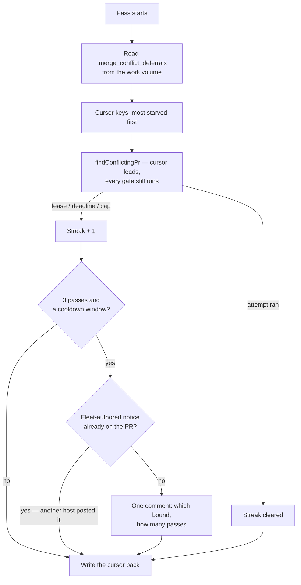

# Merge-conflict drain: a deferred PR leads the next pass, and says so if it keeps losing

## Summary

The drain's three cheap exits — the repository lease, the cycle deadline and
the per-cycle cap — each dropped a due PR with nothing written on the PR. The
scan re-derives the same order every pass, so the PR behind a busy repository,
or at position 6 of a persistent backlog, lost the same race for ever and the
only trace was a log line on whichever host happened to run.

This adds fairness and visibility, and nothing else:

- **A persisted deferral cursor** (`worker/deno/lib/merge_conflict_deferrals.ts`)
  on the work volume, in the style of `lane_rotation.ts` and for the same
  reason — runs get as few as one lane cycle each, so a run-local counter would
  never survive to have an effect. A PR any of the three bounds dropped is
  offered **first** next pass, as an ordering hint only: every gate in the scan
  still runs, so the cursor can never re-open a cooldown or a spent budget.
- **A once-per-streak notice.** After three consecutive deferrals spanning at
  least one cooldown window, one comment on the PR names the bound and the
  streak. Deduplicated by reading the PR's own thread — including the comment
  **author**, since a body is text anybody may post — so a restart or a second
  host cannot post it twice.
- **A deferral is not an attempt.** It spends neither the two concluded
  attempts nor the three disrupted ones; nothing on this path writes an attempt
  marker. The streak on the #1109 records (`repo-leased.deferralStreak`, the new
  `deferred-bound` reason, and `maxDeferralStreak` on the pass summary) is what
  separates "deferred once, fine" from "deferred nine times".

Closes #1111.

## Evidence

Backend/CLI only — the drain is a worker pass with no web interface, so there
is nothing to screenshot. The evidence is the test suites below and the full
quality gate.



Full gate, run after the final edit:

```text
deno tests PASSED · deno lint PASSED · deno type check PASSED · deno fmt PASSED
markdownlint PASSED · semgrep PASSED · mermaid PASSED
Result: PASSED (with skipped checks)
```

The first commit was red on `marker_grammar_test.ts` — the new marker had
copied the frozen `vibe-coder:` shape. It is now canonical
(`vibe-merge-conflict-deferred`), which is safe precisely because nothing has
posted it in the wild yet.

## Acceptance Criteria

<!-- vibe-spec-review inputs="diff+issue-body" -->

- **met** — a PR deferred by the lease is offered first on the next pass,
  across two consecutive drains — evidence:
  `worker/deno/tests/merge_conflict_drain_fairness_test.ts::drain fairness - a PR the lease deferred leads the next pass`
  (which carries a no-cursor control asserting today's order) — reviewer: met
- **met** — the same for the deadline and the cap — evidence:
  `worker/deno/tests/merge_conflict_drain_fairness_test.ts::drain fairness - a PR the deadline left behind leads the next pass`
  and `::drain fairness - a PR the cap left behind leads the next pass` —
  reviewer: met
- **met** — the cursor survives a simulated restart, read from the work volume
  — evidence:
  `worker/deno/tests/merge_conflict_drain_fairness_test.ts::drain fairness - the cursor is on the volume, not in the process`;
  every fairness test builds a fresh tracking object per pass — reviewer: met
- **met** — exactly one comment naming the bound and the streak, and no second
  in the same streak — evidence:
  `worker/deno/tests/merge_conflict_drain_fairness_test.ts::drain visibility - a starved PR gets exactly one comment per streak`
  (two passes plus a second simulated host) — reviewer: partial — reason: the
  reviewer found that a streak cleared without an attempt marker (a clone that
  would not set up) let a stale notice suppress the *next* streak for good;
  fixed in the second commit — the streak now clears only once an attempt
  actually ran, any conclusion closes the marker, and the host mark is set only
  by the host that posted, covered by
  `::drain fairness - an attempt that never ran leaves the streak standing` and
  `merge_conflict_deferrals_test.ts::announceDeferralStreak - an attempt since the notice opens the next streak`
- **met** — a successful attempt clears the streak — evidence:
  `worker/deno/tests/merge_conflict_drain_fairness_test.ts::drain fairness - an attempt clears the streak`
  — reviewer: met
- **met** — five deferrals spend neither budget: two attempts remain, zero
  disruptions — evidence:
  `worker/deno/tests/merge_conflict_drain_fairness_test.ts::drain visibility - five deferrals spend neither budget`,
  which asserts through the scan's own `parseConflictAttempts` and
  `hasExhaustedConflictAttempts` — reviewer: met
- **met** — `./quality.sh` passes — evidence: full gate run after the final
  edit, output above — reviewer: missing — reason: the reviewer ran the gate
  against the first commit, where `marker_grammar_test.ts` failed on the new
  marker's prefix; the rename it asked for is in the second commit and the gate
  is green
- **unrequested** — new `deferred-bound` member of the closed skip taxonomy —
  reviewer: unrequested — reason: the deadline and the cap leave a *queued* PR
  behind, and reusing the pass-level `deadline`/`cap` reasons would have
  mis-counted it as unqueued (`isQueuedConflictReason`); the issue's "emit the
  streak on the #1109 record" has no other honest home
- **unrequested** — `leftBehind` and `deferralNotices` counters on the result
  and the pass summary — reviewer: unrequested — reason: two integers beside
  the streak the issue did ask for, so a pass that posted a notice or dropped a
  PR is legible without correlating log lines
- **unrequested** — 7-day TTL pruning of cursor entries — reviewer:
  unrequested — reason: a PR that merges never clears its own entry, so without
  it the file on the work volume grows without bound
- **unrequested** — the cursor reorders repositories as well as PRs — reviewer:
  unrequested — reason: a PR cannot lead the pass if its repository is scanned
  last, so the criterion is unreachable without it; it reorders only, and the
  shuffle still decides everything the cursor does not name
- **unrequested** — one extra `findNext` at the deadline and cap exits —
  reviewer: unrequested — reason: those exits never ask who was next, which is
  exactly why they were the invisible ones; it is a listing, not an agent run,
  and it is the only way to name the PR the bound left behind
- **unrequested** — `warn` seams on the cursor read and write — reviewer:
  unrequested — reason: a host that has silently stopped being fair is the
  failure this issue is about, so degrading quietly was not an option
- **unrequested** — a docs section with a Mermaid diagram in
  `docs/workflows/merge-conflicts.md` — reviewer: unrequested — reason: the
  repo's standing "a code change owes a docs change" rule; the operand table
  there would otherwise have gone stale against the new reason

## Standards Review

<!-- vibe-standards-review inputs="diff+CODING-STANDARDS.md" -->

- **violation** — no `docs/archive/pr-summaries/pr-summary-1111.md` — evidence:
  the first commit's tree — reason: this file, added in the final commit
- **violation** — the new marker used the frozen `vibe-coder:` grammar
  (Issue #842) — evidence: `worker/deno/lib/merge_conflict_deferrals.ts:48` —
  reason: renamed to the canonical `vibe-merge-conflict-deferred`; nothing has
  posted it in the wild, so nothing goes invisible
- **violation** — the notice dedup trusted a marker without checking who wrote
  it, the class `marker_dedup_author_manifest.ts` documents — evidence:
  `worker/deno/lib/merge_conflict_deferrals.ts:372` (pre-fix) — reason: fixed —
  `hasOpenDeferralNotice` now takes a required `isTrustedAuthor` predicate and
  ignores a marker from anyone else, failing towards posting rather than
  silence; wired from the fleet maintenance author set in
  `run_core_production_deps.ts`
- **violation** — `readConflictDeferrals` swallowed every read failure with no
  `warn`, contradicting its own module header — evidence:
  `worker/deno/lib/merge_conflict_deferrals.ts:209` (pre-fix) — reason: fixed —
  a missing file is still silent (the ordinary first pass), anything else warns
  and degrades; the drain's `load` seam is guarded the same way, asserted by
  `::drain fairness - a broken volume costs fairness, never the pass`
- **violation** — `ConflictDeferralNotice` declared twice with the same shape —
  evidence: `worker/deno/lib/merge_conflict_drain.ts:91` (pre-fix) — reason:
  fixed, one declaration in `merge_conflict_deferrals.ts`, imported by the drain
- **violation** — `conflict_queue_order.ts` had no matching test file —
  evidence: `worker/deno/lib/conflict_queue_order.ts:1` — reason: fixed,
  `worker/deno/tests/conflict_queue_order_test.ts` added
- **violation** — unreachable `?? 1` streak fallback — evidence:
  `worker/deno/lib/merge_conflict_drain.ts:368` (pre-fix) — reason: fixed —
  `noteDeferral` now takes the tracking explicitly and always returns a real
  streak
- **clean** — Australian English throughout (`serialiseConflictDeferrals`,
  "behaviour", "materialise"); no hidden path staged (the cursor
  `.merge_conflict_deferrals` is written to the *work volume*, never the repo,
  mirroring `.lane_rotation`); tests call real functions with injected seams
  rather than grepping source; every clock and every filesystem call is
  injected, so no test touches a real directory; the notice body reaches GitHub
  through the redacting `gh` chokepoint and carries only internal integers and
  an ISO timestamp; comments explain why rather than restating the code; the
  pure ordering was split into its own 65-line module

## Test Plan

- `worker/deno/tests/merge_conflict_drain_fairness_test.ts` (new, 11 tests) —
  the two-pass fairness tests, one per bound, each with a no-cursor control;
  the restart; an attempt clearing the streak and a never-started attempt
  leaving it; exactly one comment per streak across two passes and two
  simulated hosts; five deferrals leaving both budgets untouched; the streak on
  the records; a broken cursor and an unpostable notice warning without failing
  the pass.
- `worker/deno/tests/merge_conflict_deferrals_test.ts` (new, 17 tests) —
  persistence across a restart, a corrupt file, an unwritable volume, TTL
  pruning, streak arithmetic, cursor ordering, the notice bounds, the body's
  contents, the marker's open/closed semantics including an untrusted author,
  and the cross-host announce.
- `worker/deno/tests/conflict_queue_order_test.ts` (new, 5 tests) — the pure
  preference ordering and repository extraction.
- `worker/deno/tests/pr_merge_conflict_scan_test.ts` (3 added) — the real scan
  honours the cursor for PRs and for repositories, and the cursor reorders
  without re-opening a gate.
- `worker/deno/tests/merge_conflict_decision_taxonomy_test.ts` (updated) — the
  new `deferred-bound` member and the `repo-leased` streak operand, including
  the compile gate that keeps the taxonomy closed.
- Full `./quality.sh`: PASSED.
