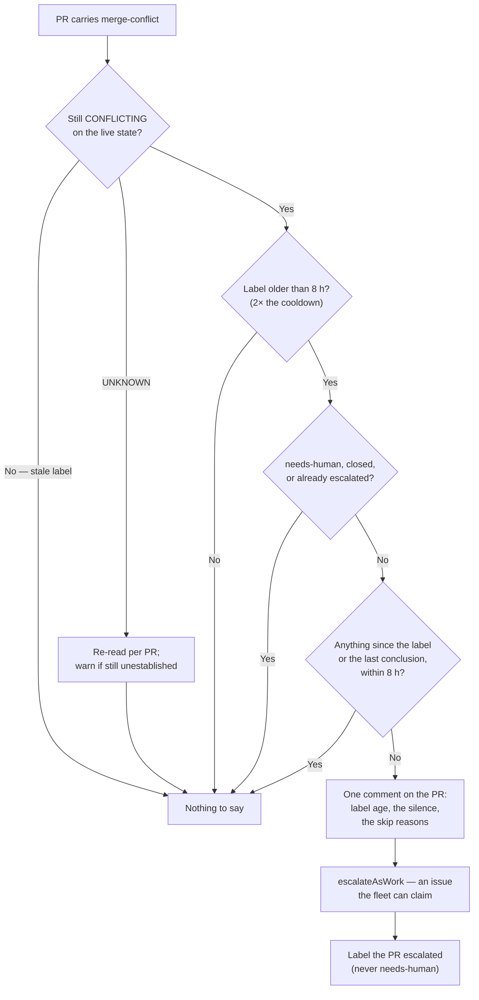

# Escalate a merge-conflict queue that stalled before its first attempt

## Summary

A PR carrying `merge-conflict` with no concluded attempt after a bounded time
is itself a defect, whatever suppressed the pass. New
`worker/deno/lib/merge_conflict_stall_watchdog.ts` detects that shape directly:
it keys on **wall-clock time since the `labeled` timeline event** — not on
attempt records, because the failure mode is that no attempt record exists —
and files the stall through `escalateAsWork`, marking the PR `escalated`. It
never applies `needs-human`, which would remove the PR from the very lane that
clears it (Issue #569), and it never starts an attempt. Wired into priority
1.61 after the drain, so it runs every cycle with the decisions that cycle
recorded (Issue #1109). Closes #1112.

## Evidence

Backend/CLI only — no web surface to screenshot. The evidence is the test
suite: 22 tests in
`worker/deno/tests/merge_conflict_stall_watchdog_test.ts`, all passing, and a
full `./quality.sh` run that passed (`markdownlint`, `mermaid`, `semgrep`,
`deno test/lint/check/fmt` and the chokepoint gates).

Three design points a reviewer should check:

- **Order of operations.** The issue says "comment, then file". The code files
  first, because the comment carries the cross-host dedup marker: posting it
  before the issue exists would let a filing failure leave a marker that
  silences every later pass. Covered by
  `escalateConflictQueueStall - a failed filing is reported, never swallowed`.
- **Stable escalation title.** `escalateAsWork` dedups on the exact title, so
  the label age lives in the body, not the summary — otherwise a title that
  grew by an hour each pass would file a fresh issue each pass.
- **Live state, not the label.** The label is only cleared by a successful
  fleet merge, so a conflict that cleared by other means leaves it behind — the
  shape `docs/workflows/merge-conflicts.md` draws from #116. A labelled PR
  GitHub now calls `MERGEABLE` is skipped; an `UNKNOWN` is re-read per PR and,
  if still unestablished, warned about rather than dropped.

## Acceptance Criteria

<!-- vibe-spec-review inputs="diff+issue-body" -->

- **met** — a PR labelled 9 hours ago with no attempt marker is detected,
  commented on once, and filed via `escalateAsWork` — evidence:
  `worker/deno/tests/merge_conflict_stall_watchdog_test.ts::detectConflictQueueStall - the four boundary states`
  (row 1) and `::escalateConflictQueueStall - files the stall as work and marks the PR`
  — reviewer: met
- **met** — a PR labelled 9 hours ago with one concluded attempt is not
  detected — evidence: same boundary table, row 2 (conclusion 7 h ago, inside
  the fresh clock) — reviewer: met
- **met** — a PR labelled 9 hours ago with one open, unconcluded attempt is
  detected — evidence: same boundary table, row 3; `openAttempt` is asserted
  true — reviewer: met
- **met** — a PR labelled 3 hours ago is not detected — evidence: same boundary
  table, row 4 — reviewer: met
- **met** — detection applies `escalated`, never `needs-human` — evidence:
  `::scanConflictQueueStalls - applies escalated, never needs-human`, which
  strips `--body` and asserts no `gh` argument names the veto label —
  reviewer: met
- **met** — running the scan twice over one stalled PR produces exactly one
  comment and one filed issue — evidence:
  `::scanConflictQueueStalls - two hosts in one window escalate once` —
  reviewer: met
- **met** — a PR that concludes an attempt after being escalated is not
  re-escalated — evidence:
  `::scanConflictQueueStalls - a concluded attempt after an escalation is not re-escalated`
  — reviewer: met
- **met** — `./quality.sh` passes — evidence: full gate run after the final
  edit, `Result: PASSED (with skipped checks)` — reviewer: partial — reason:
  the reviewer saw only the diff and could not run the gate; it was run here
  and passed.
- **partial** — "file it via `escalateAsWork` with a title … naming the
  repository, the PR, and the label age" — evidence:
  `worker/deno/lib/merge_conflict_stall_watchdog.ts:79` — reviewer: partial —
  reason: the title carries the PR number and a stable summary; the repository
  and the age are in the body, because `escalateAsWork` dedups on the exact
  title and an age in it would file a fresh issue every pass.
- **unrequested** — the live `mergeable` gate (`:287`, `:726`) and its
  `UNKNOWN` re-read — reviewer: unrequested — reason: without it the watchdog
  escalates stale labels on PRs that no longer conflict, which is the exact
  failure the #116 postmortem in this manual warns against.
- **unrequested** — suppressing markers (conclusion, escalation) are honoured
  only from a fleet author (`:251`) — reviewer: unrequested — reason: a comment
  body is text anybody may post, and a forged marker would buy silence, which
  is what this watchdog exists to remove.
- **unrequested** — the stall clock restarts at the most recent conclusion
  rather than only at the label (`:316-322`) — reviewer: unrequested — reason:
  the issue's "a subsequent stall starts a fresh clock" bullet; without it one
  failed attempt in hour two silences a PR that then never gets its second, a
  queue no other guard watches because its budget is not spent.
- **unrequested** — the watchdog is skipped past the cycle deadline
  (`worker/deno/lib/run_core_production_deps.ts:2111`) — reviewer: unrequested
  — reason: the drain stops at that deadline for the same reason; a watchdog
  should not run into the next pass's time.

## Standards Review

<!-- vibe-standards-review inputs="diff+CODING-STANDARDS.md" -->

- **violation** — the PR summary file was missing — evidence:
  `docs/archive/pr-summaries/pr-summary-1112.md` — reason: this file; written
  before the PR was raised.
- **violation** — an unreachable `if (!stalls.ok)` branch at the call site, and
  a `Result` return with exactly one success path — evidence:
  `worker/deno/lib/run_core_production_deps.ts:2121` (as reviewed) — reason:
  fixed — `scanConflictQueueStalls` now returns the stalls directly and the
  dead branch is gone.
- **violation** — an `UNKNOWN` mergeable state was skipped at `debug` level,
  identically to `MERGEABLE` — evidence:
  `worker/deno/lib/merge_conflict_stall_watchdog.ts:678` (as reviewed) —
  reason: fixed — re-read per PR, then `warn` if still unestablished, with two
  tests covering both outcomes.
- **violation** — untested branches: the "filed but could not comment" path,
  `isRepoAllowed`, and repeated skip reasons — evidence:
  `worker/deno/lib/merge_conflict_stall_watchdog.ts:492` (as reviewed) —
  reason: fixed — three tests added.
- **violation** — `commentAuthor` duplicates the six-line accessor in
  `merge_conflict_deferrals.ts:393` — evidence:
  `worker/deno/lib/merge_conflict_stall_watchdog.ts:161` — reason: stands. It
  is a local shape accessor over a raw REST object; extracting it would add a
  cross-module dependency between two sibling modules for six lines, which is
  the premature abstraction the standards warn against.
- **clean** — Australian English throughout (`labeled` appears only as the
  GitHub event name); `Result<T>` and injected seams (`ghCommandFn`, `nowMs`,
  `escalateWork`, `labelPr`) rather than globals; tests call real functions and
  assert on outcomes, never grep source; no hidden paths staged; label mutation
  routed through the guarded `ensureLabelExists`/`addLabelToIssue` so the
  Rule-of-Two allowlist gates it; every exported symbol documented; the docs
  change ships with the code change.

## Test Plan

`worker/deno/tests/merge_conflict_stall_watchdog_test.ts` — 22 tests:

- **Boundary table** (the issue's earliest failure-detection point): no attempt
  / concluded attempt / open unconcluded attempt / inside the threshold.
- **Clock**: a conclusion starts a fresh clock; a conclusion predating the
  label does not count; an escalation before the last conclusion does not
  suppress the next one; the default threshold is twice the cooldown and is
  configurable.
- **Exclusions**: `needs-human`, closed, unlabelled, unknown label age, already
  escalated for this stall, stale label on a now-`MERGEABLE` PR.
- **Trust**: a forged conclusion from an untrusted author cannot silence the
  watchdog.
- **Escalation**: files as work and marks the PR `escalated`; a failed filing
  is returned as an error with no marker comment posted; a comment that fails
  after filing names both the issue and the cause.
- **Scan**: cross-host dedupe (two hosts, one escalation); `escalated` applied
  and `needs-human` never; no re-escalation after a conclusion; skip reasons
  carried into the comment and collapsed when repeated; an `UNKNOWN` state
  re-read; an unestablished state warned about and not escalated; a repo
  outside the allowlist untouched; an unreadable PR does not stop the pass.

Existing suites re-run unchanged: `pr_merge_conflict_scan_test.ts`,
`merge_conflict_drain_test.ts`, `merge_conflict_deferrals_test.ts`,
`escalate_as_work_test.ts`, `run_core_merge_conflict_dispatch_test.ts`.
