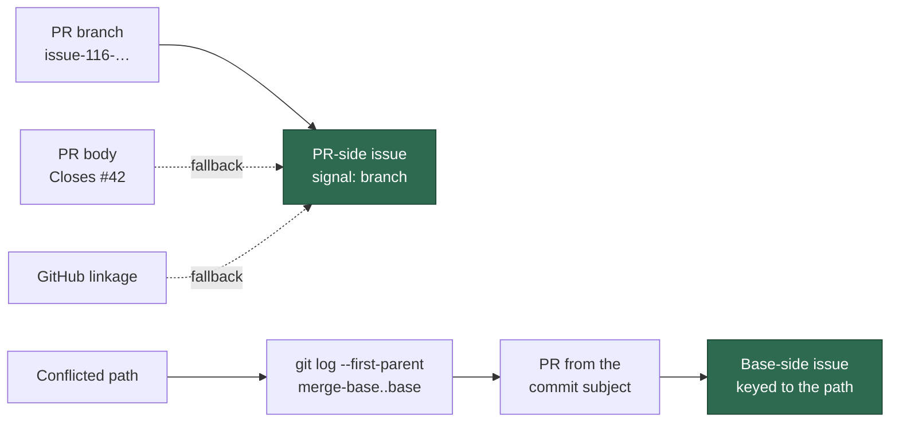

# PR Summary — Issue #1113

## Summary

Adds `worker/deno/lib/conflict_issue_context.ts`, a pure, bounded module that
answers the question the merge-conflict resolver cannot currently ask: **what
were the two sides trying to do?** `gatherConflictIssueContext` resolves the
conflicting PR's own originating issue and, per conflicted path, the issues
behind the base-branch commits that changed that path since the merge base.

It reports; it does not decide. No prompt, resolution or comment behaviour
changes — nothing calls the module yet, and that wiring is #1114. Closes #1113.

## Evidence

Backend/CLI change with no web interface to screenshot. The evidence is the
test suite: 24 cases in
`worker/deno/tests/conflict_issue_context_test.ts` drive the module through
injected `git` and `gh` seams, plus 6 new cases across the two reused helpers.
`./quality.sh < /dev/null` passes in full (semgrep, markdownlint, mermaid,
deno tests/lint/check/fmt).

**Test category** (per CODING-STANDARDS "Unit, Integration and Benchmark
Tests"): the new suite is a **unit test** — behavioural, self-contained (no
network, no spawned script, `git`/`gh` injected), fast (8 ms) and
parallel-safe (no process-wide state), so it needs no manifest entry.

**Bounds, with documented defaults:** 20 commits per path, 8 issues, 4000
characters of issue body text, 30 `gh` calls. Whichever bound bites is declared
in the returned `truncation` block, so a cut answer is never read as a whole
one.

## Acceptance Criteria

<!-- vibe-spec-review inputs="diff+issue-body" -->

- **met** — a PR on `issue-116-foo` returns issue 116 and names the
  branch-shape signal — evidence:
  `worker/deno/tests/conflict_issue_context_test.ts::conflict issue context - branch shape names the PR-side issue`
  — reviewer: met
- **met** — a branch with no issue number but `Closes #42` in the body returns
  42 and names the body signal — evidence:
  `worker/deno/tests/conflict_issue_context_test.ts::conflict issue context - PR body closing keyword names the issue`
  — reviewer: met
- **met** — a conflicted path changed by a merge commit for PR #99 closing #77
  returns issue 77 keyed to that path — evidence:
  `worker/deno/tests/conflict_issue_context_test.ts::conflict issue context - a base merge commit resolves to its issue`
  — reviewer: met
- **met** — a path whose base commits map to no PR yields an explicit
  unresolved entry — evidence:
  `worker/deno/tests/conflict_issue_context_test.ts::conflict issue context - base commits with no PR yield an unresolved entry`
  (`unresolved: "no-pr"`) — reviewer: met
- **met** — a PR with no discoverable issue yields an explicit "none found"
  distinguishable from `[]` — evidence:
  `worker/deno/tests/conflict_issue_context_test.ts::conflict issue context - no discoverable PR issue is stated, not empty`
  asserts the whole value equals `{resolved: false, reason: "no-signal"}`;
  `PrSideOrigin` is a discriminated union, so an empty list is not expressible
  — reviewer: met
- **met** — `issue-1160-…` does not resolve to issue 116 — evidence:
  `worker/deno/tests/conflict_issue_context_test.ts::conflict issue context - issue-1160 does not resolve to issue 116`
  and
  `worker/deno/tests/issue_branch_candidates_test.ts::issue branch candidates - branch number reading avoids the traps`;
  `issueNumberFromBranch` cross-checks its regex against the existing
  `belongsToIssue` rather than hand-rolling a second matcher — reviewer: met
- **met** — each bound is driven past and the result says it was truncated —
  evidence: the four `conflict issue context - the … cap/budget …` tests in
  `worker/deno/tests/conflict_issue_context_test.ts` — reviewer: met — reason:
  the reviewer noted the `gh`-budget case did not exercise a repeated base PR;
  that gap was a real defect (no PR-view cache) and is fixed, with
  `conflict issue context - one issue touched by two paths is fetched once`
  now asserting one `gh pr view` per PR
- **met** — `./quality.sh` passes — evidence: full gate run after the final
  edit, `Result: PASSED (with skipped checks)` — reviewer: missing — reason:
  the reviewer saw only the diff and could not run the gate; it was run here
  and passed
- **unrequested** — `hasClosingKeyword` rewritten onto a shared literal
  pattern covering every GitHub conjugation — evidence:
  `worker/deno/lib/pr_body.ts:22` — reviewer: unrequested — reason: forced by
  the gate — the semgrep `detect-non-literal-regexp` rule fails the build for
  the pre-existing `new RegExp` once the file is touched; the two readers now
  share one pattern so they cannot drift, and the broadened set matches what
  GitHub itself closes on
- **unrequested** — `extractIssueFromBranch` in
  `worker/deno/lib/pr_maintenance.ts:650` now delegates to
  `issueNumberFromBranch` — evidence: `worker/deno/lib/pr_maintenance.ts:650`
  — reviewer: unrequested — reason: without it this diff would leave two
  branch-shape parsers that disagree (`issue-0116-x` → `"0116"` vs `null`),
  which is the exact mis-resolution trap the issue names
- **unrequested** — new "What were the two sides trying to do?" section in
  `docs/workflows/merge-conflicts.md` — evidence:
  `docs/workflows/merge-conflicts.md:151` — reviewer: unrequested — reason:
  the workflow doc states the both-sides-survive contract this module exists to
  inform; leaving it undocumented would strand the module

## Standards Review

<!-- vibe-standards-review inputs="diff+CODING-STANDARDS.md" -->

- **violation** — a second branch-shape parser duplicating
  `extractIssueFromBranch` (DRY) — evidence:
  `worker/deno/lib/issue_branch_candidates.ts:81` — reason: fixed here — the
  older parser now delegates, so one implementation remains
- **violation** — a modified public function without tests for the changed
  behaviour — evidence: `worker/deno/lib/pr_body.ts:44` — reason: fixed here —
  `pr_body - hasClosingKeyword honours every conjugation GitHub does` covers
  `Fixed #42`, `Prefixes #42` and `Closes owner/repo#42`
- **violation** — a partly-resolved path returned `unresolved: null` and a
  short issue list, so a partial answer read as a whole one (fail loud) —
  evidence: `worker/deno/lib/conflict_issue_context.ts:661` — reason: fixed
  here — `BasePathOrigin.partial` states it, covered by
  `conflict issue context - a partly-resolved path says it is partial`
- **violation** — a bespoke `Lookup<T>` union instead of the repo's
  `Result<T, E>` — evidence: `worker/deno/lib/conflict_issue_context.ts:235` —
  reason: fixed here — `Lookup<T>` is now `Result<T, LookupFailure>`
- **violation** — the docs section named `no-signal` for a base-side case that
  reports `no-issue` — evidence: `docs/workflows/merge-conflicts.md:178` —
  reason: fixed here — both reasons are now stated on the correct side
- **violation** — `docs/archive/pr-summaries/pr-summary-1113.md` missing —
  evidence: this file — reason: fixed here
- **clean** — Australian English throughout code, comments and docs; tests
  call real code through injected seams with no source-text grepping, no
  wall-clock assertions, no process-state mutation and no spawned scripts (a
  parallel-safe unit test needing no manifest entry); one test file per module;
  `@std/assert` only; `gh`/`git` failures become stated warnings plus explicit
  unresolved reasons rather than empty lists; no hidden or credential paths
  staged; commits reference Issue #1113 and carry the run-id trailer

## Test Plan

Added `worker/deno/tests/conflict_issue_context_test.ts` (24 cases):

- PR-side precedence: branch shape, body closing keyword, GitHub linkage,
  branch beating a contradicting body, and the `issue-1160` / `wip/issue-220-x`
  traps.
- Explicit absence: `{resolved: false, reason: "no-signal"}` as a whole value,
  and an unreadable issue reported as `lookup-failed` with a warning.
- Base side: merge-commit subject, squash subject via body keywords, a PR title
  never read as an issue, no commits, no PR, no issue, unusable merge base,
  unresolvable base branch, and a partly-resolved path.
- Bounds: each of the four driven past, asserting both the truncated result and
  the declaration that it was truncated; plus the documented defaults.
- De-duplication: one issue and one PR fetched once across two paths.

Extended `worker/deno/tests/issue_branch_candidates_test.ts` (2 cases) for
`issueNumberFromBranch`, and `worker/deno/tests/pr_body_test.ts` (4 cases) for
`extractClosingIssueNumbers` and the broadened `hasClosingKeyword`. The
pre-existing `pr_body`, `regression_pr_body`, `pr_maintenance` and
`pr_maintenance_command` suites all still pass unchanged (176 tests).
