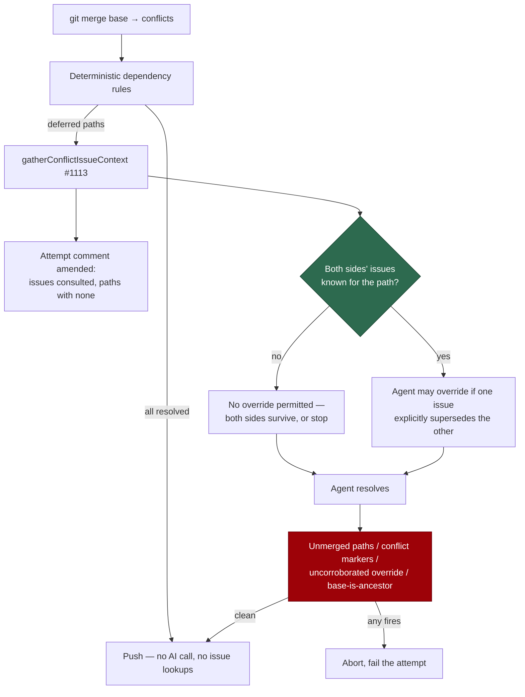

# Intent-aware merge-conflict resolution (Issue #1114)

## Summary

The merge-conflict agent sees the conflicted tree and nothing else, so "the same
constant set to two different values" reads as a contradiction and the attempt
aborts — even when one of the two originating issues plainly superseded the
other. This wires `gatherConflictIssueContext` (#1113) into the resolution path
and opens a **narrow, evidenced, loud** carve-out from the never-side-pick
contract. Closes #1114.

- `worker/deno/lib/conflict_intent_context.ts` — computes, per conflicted path,
  whether an override may even be **considered** (both sides' originating issues
  known, or not), and renders the issues for the prompt: redacted, sanitised,
  code-fenced and wrapped in the run's nonce boundary.
- `worker/deno/lib/conflict_intent_audit.ts` — the audit surface: the issues
  consulted (including the paths for which none was found), the overrides the
  agent declared, and `findUncorroboratedOverrides`, which is what the processor
  refuses on.
- `worker/deno/lib/pr_merge_conflict_processor.ts` — gathers the context after
  the deterministic dependency rules and before the agent, appends the consulted
  issues to the attempt comment, passes the context to the prompt, and **aborts
  the merge** when the agent claims an override on a path whose evidence was not
  gathered.
- `prompts/merge_conflict/prompt.md` — the default contract restated first, then
  the three-part override test (both issues present, one explicitly supersedes,
  quote the sentence), the declaration syntax, and two new worked examples.



## Evidence

Backend-only — no web interface to screenshot. The evidence is the test suite:
85 tests across the four merge-conflict files pass, including the three
override-gating cases, the guards-still-fire cases, and the degraded no-context
case.

```text
deno test tests/merge_conflict_intent_context_test.ts \
          tests/merge_conflict_intent_audit_test.ts \
          tests/merge_conflict_intent_processor_test.ts \
          tests/merge_conflict_prompt_v2_test.ts \
          tests/pr_merge_conflict_processor_test.ts
ok | 85 passed | 0 failed
```

## Acceptance Criteria

<!-- vibe-spec-review inputs="diff+issue-body" -->

- **met** — the agent prompt receives the issue context as a fenced block,
  asserted against a built prompt — evidence:
  `worker/deno/tests/merge_conflict_prompt_v2_test.ts::merge_conflict - the built prompt fences the issue context`
  — reviewer: met
- **missing** — the prompt ships as a new version; the previous version is
  unmodified — reviewer: missing — reason: per-template versioning was removed
  by Issue #844 (`worker/deno/lib/prompt_manager.ts:1-13`); `loadPrompt` reads
  only `prompts/<type>/prompt.md`, so a `v2.md` would never be loaded and the
  criterion is unsatisfiable as written. The template was edited in place, which
  is the repository's documented versioning surface (git history).
- **met** — with both sides' issues known and one superseding the other, an
  override is permitted and the resolved comment names both issues, the file and
  what was superseded — evidence:
  `worker/deno/tests/merge_conflict_intent_processor_test.ts::the resolved comment names the override`
  — reviewer: met
- **met** — with only one side's issue known, no override is permitted —
  evidence:
  `worker/deno/tests/merge_conflict_intent_context_test.ts::assessIntentEligibility - only the PR side is not enough`
  and `::one side only forbids an override`; enforced, not merely advised, by
  `findUncorroboratedOverrides`
  (`worker/deno/tests/merge_conflict_intent_processor_test.ts::an override with no evidence is refused, not reported`)
  — reviewer: met — reason: the reviewer noted the gate was advisory only; the
  deterministic refusal was added in response
- **partial** — with no issue context at all, behaviour is byte-identical to
  today apart from the attempt comment — evidence:
  `worker/deno/tests/merge_conflict_intent_processor_test.ts::no issue context leaves the prompt as it was`
  — reviewer: met — reason: recorded as partial rather than met because the
  carve-out prose the same issue asked for renders unconditionally, so the
  prompt is not literally byte-identical; the issue-context block and the
  resolution path are
- **partial** — every attempt comment lists the issues consulted and the paths
  for which none was found, including on a failed attempt — evidence:
  `worker/deno/tests/merge_conflict_intent_processor_test.ts::a failed attempt still records what was consulted`
  — reviewer: partial — reason: the record is written only when the agent is
  actually asked something, per the issue's own "the context is only needed for
  the paths actually going to the agent"; a clean merge and a conflict fully
  settled by the dependency rules consult nothing and say nothing
- **met** — the unmerged-path, conflict-marker and base-is-ancestor guards still
  abort a resolution claiming an intent justification — evidence:
  `worker/deno/tests/merge_conflict_intent_processor_test.ts::leftover markers abort even with an intent justification`,
  `::an unmerged path aborts even with an intent justification`,
  `::a base still not an ancestor fails an intent-justified merge` — reviewer:
  partial — reason: the reviewer found the base-is-ancestor case untested; that
  third test was added in response
- **met** — `./quality.sh` passes — evidence: full gate run after the final
  edit — reviewer: met
- **unrequested** — the attempt comment is amended by `gh api -X PATCH` (with
  `parseCommentId` and a fallback comment) rather than built with the consulted
  issues inside `buildAttemptComment` — reviewer: unrequested — reason: the
  attempt comment is posted **before** the merge (Issue #395, pinned by
  `pr_merge_conflict_processor_test.ts::records the attempt before touching the
  branch`), so the conflicted paths do not exist when it is written; amending it
  keeps one auditable attempt comment rather than two
- **unrequested** — malformed-claim reporting (`INTENT_OVERRIDE_SYNTAX`, the
  `malformed` channel) — reviewer: unrequested — reason: an override the parser
  cannot read must not read as "no override was claimed"; it is reported on the
  PR rather than silently dropped
- **unrequested** — the gather's truncation bounds are surfaced in the prompt
  (`renderGatherCaveats`) — reviewer: unrequested — reason: a cut answer must
  not read as a whole one, or the agent treats a bound that bit as "no issue
  exists"
- **unrequested** — the docs subsection "What the resolver does with it"
  (`docs/workflows/merge-conflicts.md`) — reviewer: unrequested — reason: the
  contract bullet the issue asked for is there too; this documents the new
  runtime behaviour beside the #1113 gather it consumes. The TL;DR and the
  mermaid diagram are untouched, as the issue required

## Standards Review

<!-- vibe-standards-review inputs="diff+CODING-STANDARDS.md" -->

- **violation** — the new outbound PR-comment sink did not route through
  `redactSecrets()` — evidence:
  `worker/deno/lib/conflict_intent_context.ts:123` — reason: fixed here;
  `sanitiseIssueText` now redacts before sanitising, covering both the comment
  and the prompt, with
  `merge_conflict_intent_context_test.ts::sanitiseIssueText - redacts a secret`
- **violation** — `docs/archive/pr-summaries/pr-summary-1114.md` missing —
  evidence: this file — reason: fixed here
- **violation** — README surfaces still stated the contract absolutely —
  evidence: `README.md:526`, `docs/workflows/README.md:196` — reason: fixed
  here; all four surfaces now name the bounded intent carve-out
- **violation** — exported `describeBaseUnresolved` / `describePrUnresolved` /
  `sanitiseIssueText` had no direct tests — evidence:
  `worker/deno/lib/conflict_intent_context.ts:87` — reason: fixed here; every
  reason code is now asserted to render distinct prose
- **violation** — the new template tests assert on prose keywords rather than
  behaviour — evidence:
  `worker/deno/tests/merge_conflict_prompt_v2_test.ts:185` — reason: stands. A
  prompt template *is* prose, and this mirrors the file's existing 12 template
  assertions; the behavioural half of the same file drives
  `buildMergeConflictPrompt` for real
- **clean** — Australian English throughout; no hidden paths staged; tests call
  real functions rather than grepping source; fail-loud error handling (both new
  `catch` blocks log with context and degrade to a *stated* result); untrusted
  issue text sanitised, fenced and nonce-wrapped; new logic in two focused
  modules rather than added to the processor; JSDoc on every exported symbol

## Test Plan

- `worker/deno/tests/merge_conflict_intent_context_test.ts` (new, 15 tests) —
  the eligibility gate (both sides / PR only / base only / neither / per path),
  the fenced prompt block, declared bounds, delimiter and forged-marker
  neutralisation, secret redaction, path normalisation, and every absence reason
  rendering distinct prose.
- `worker/deno/tests/merge_conflict_intent_audit_test.ts` (new, 18 tests) — the
  consulted-issues record, override parsing (documented shape, hyphen and
  backtick variants, malformed claims, an ordinary reply), the resolved-comment
  section, and `findUncorroboratedOverrides`.
- `worker/deno/tests/merge_conflict_intent_processor_test.ts` (new, 16 tests) —
  the context reaching the built prompt, the attempt comment carrying the
  consulted issues (amended, and via the fallback comment), a failed attempt
  still carrying them, the resolved comment naming an override, the refusal of
  an unevidenced override, and all three mechanical guards firing against a
  resolution that supplies an intent justification.
- `worker/deno/tests/merge_conflict_prompt_v2_test.ts` (extended, 6 tests) — the
  `{{ISSUE_CONTEXT}}` placeholder, the default contract stated before the
  carve-out, the three-part override test, the guards clause, and the built
  prompt with and without issue context.
- `worker/deno/tests/pr_merge_conflict_processor_test.ts` — unchanged and still
  passing, which is what shows the no-context path behaves as before.
