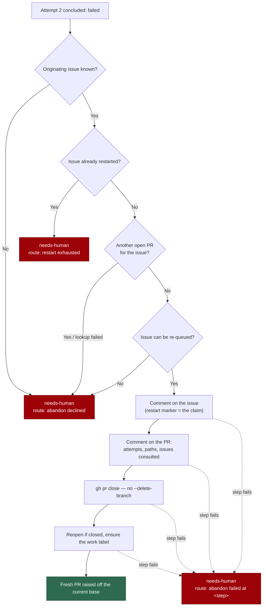

# Merge conflicts: abandon-and-restart before `needs-human`

## Summary

Adds the last automatic rung to the merge-conflict escalation ladder. When the
second **concluded** attempt fails, the worker no longer hands the PR straight
to a person: it closes the conflicting PR with an explanatory comment and
re-queues its originating issue, so the pipeline raises a fresh PR off the
current base. `needs-human` applies only when that restart is declined, fails,
or has already been used for that issue. A branch that has defeated two real
merges is usually cheaper to redo than to reconcile — and redoing it needs
nobody.

"Start again" never means force-push: the PR is **closed, not merged**, its
branch is neither deleted nor rewritten, and the abandoned work stays readable
and linked from the issue.

Closes #1115.

## Evidence

Backend/CLI change — no web surface to screenshot. The evidence is the test
suite (115 tests across the four touched suites, all green) and a full
`./quality.sh` run: **PASSED** (3 skips: config integration, pages-liquid,
mermaid built output — all environment, not code).

The rung fires from the **processor** (which concludes attempt 2) and from the
**scan's** backstop (which catches a PR whose escalation never landed):

Two ordering properties carry the safety of a destructive step, and both are
asserted rather than described:

- **every precondition is checked before the close** — the no-issue test
  asserts zero `pr close`, `pr comment` and `issue comment` calls, not just the
  outcome;
- **the restart claim is posted before the close** — it is what a second host
  reads, so the loser of the race must lose before anything is destroyed.

## Acceptance Criteria

<!-- vibe-spec-review inputs="diff+issue-body" -->

- **partial** — A PR with two concluded failed attempts and a known originating
  issue is closed, commented on, and its issue reopened, labelled and commented
  — `needs-human` is not applied — evidence:
  `worker/deno/tests/pr_merge_conflict_scan_test.ts::findConflictingPr - an exhausted PR with a known issue is abandoned, not escalated`,
  `worker/deno/tests/pr_merge_conflict_processor_test.ts::processMergeConflict - the final failure abandons and restarts rather than escalating`
  — reviewer: partial — reason: closing, both comments and the reopen are met;
  *applying* `work-on` to an existing issue is refused by
  `worker_label_guard.ts` and stripped by the discovery collectors, so the rung
  requires the issue to already carry the work label (the ordinary case — the
  issue keeps its human-applied `work-on` while its PR is open) and declines
  to `needs-human` rather than closing a PR whose issue would sit unqueued.
- **met** — The abandoned PR's branch is not deleted and not force-pushed; the
  PR is closed, not merged — evidence:
  `worker/deno/tests/conflict_abandon_restart_test.ts::abandonAndRestart - closes the PR, re-queues the issue, keeps the branch`
  — reviewer: met.
- **met** — A PR with two concluded failed attempts and no discoverable
  originating issue is not closed, and gets `needs-human` with a reason naming
  the missing issue link — evidence:
  `worker/deno/tests/pr_merge_conflict_scan_test.ts::findConflictingPr - an exhausted PR with no originating issue is not closed`
  — reviewer: met.
- **met** — An originating issue that already has another open PR is not
  re-queued; the path falls through to `needs-human` — evidence:
  `worker/deno/tests/conflict_abandon_restart_test.ts::abandonAndRestart - an issue with another open PR is left alone`,
  `::exhaustedEscalationRoute - the other two declines say what blocked them`
  — reviewer: partial — reason: the reviewer marked it partial because the
  check is a new `findOtherPrsForIssue` rather than the issue's suggested
  `findExistingPrForIssue`. That deviation is deliberate and recorded below;
  the criterion's behaviour is met and the decline's `needs-human` text is
  asserted.
- **met** — A second exhaustion for an already-restarted issue goes to
  `needs-human` and does not close the new PR — evidence:
  `worker/deno/tests/pr_merge_conflict_scan_test.ts::findConflictingPr - a restarted issue exhausting again goes to a human`
  — reviewer: met.
- **met** — A failure at the close step, or at the re-queue step, leaves
  `needs-human` applied with the failing step named — evidence:
  `worker/deno/tests/pr_merge_conflict_scan_test.ts::findConflictingPr - a failure at any abandon step rests at needs-human, named`
  — reviewer: partial — reason: the reviewer saw only the close step asserted
  end to end; the round-2 test above now injects a failure at **all ten** steps
  (`issue-reopen` and `issue-label` included) and asserts the `needs-human`
  resting state with the step named.
- **met** — Two hosts running the scan against the same exhausted PR produce
  one abandon, asserted with a marker-based dedupe test — evidence:
  `worker/deno/tests/conflict_abandon_restart_test.ts::abandonAndRestart - two hosts on the same PR produce one abandon`
  — reviewer: met — reason: the reviewer notes the dedupe is read-after-write,
  as the subsystem's other markers are; a genuinely simultaneous pair still has
  a TOCTOU window, narrowed by the claim being posted before the close.
- **met** — `./quality.sh` passes — evidence: full gate run after the final
  edit, `Result: PASSED (with skipped checks)` — reviewer: partial — reason:
  the reviewer could confirm only the changed-file gates on its first pass; the
  full gate was run here and passed.
- **met** — `buildExhaustedEscalationReason` distinguishes its three routes —
  evidence: `worker/deno/lib/conflict_abandon_restart.ts` (`ExhaustedEscalationRoute`,
  `describeExhaustedRoute`),
  `worker/deno/tests/conflict_abandon_restart_test.ts::describeExhaustedRoute - a burnt claim on this PR is not a failed replacement`
  — reviewer: met.
- **unrequested** — the rung also runs from the **processor's** final concluded
  failure, not only from the scan — reviewer: unrequested — reason: the issue
  says "extend the scan's ladder", but the processor escalates the moment
  attempt 2 concludes and the `needs-human` it applies then locks the PR out of
  the scan, so a scan-only rung would never fire in production.
- **unrequested** — a fourth precondition, `requeue-not-permitted` — reviewer:
  unrequested — reason: closing a PR whose issue cannot be re-queued destroys
  work exactly like closing one with no issue at all, so it is refused before
  the close rather than discovered after it.
- **unrequested** — `findOtherPrsForIssue` replaces `findExistingPrForIssue`
  for this check — reviewer: unrequested — reason: that helper swallows every
  `gh` failure into the same "not found" it returns for a genuine absence,
  returns only the first match and also matches merged/closed PRs — three
  wrong answers ahead of a destructive step.
- **unrequested** — new `abandoned-restarted` skip reason in the conflict
  decision taxonomy — reviewer: unrequested — reason: the taxonomy is closed
  (#1109); an exit with no reason does not compile.
- **unrequested** — `exhaustedEscalationDedupKey` gives a failed abandon its
  own escalation key — reviewer: unrequested — reason: the shared
  `merge-conflict-<pr>` key is inside its 24h suppression window by
  construction here, which would swallow the one comment naming the broken
  step.
- **unrequested** — `worker/deno/lib/merge_conflict_markers.ts` extracts the
  three attempt markers (re-exported from the scan, so no importer changes) —
  reviewer: unrequested — reason: removes the scan ↔ rung import cycle the
  standards review flagged.
- **unrequested** — outbound sanitisation of quoted text via
  `sanitiseIssueText`, and `CONSULTED_ISSUES_HEADING` exported from
  `conflict_intent_audit.ts` — reviewer: unrequested — reason: the comments are
  public sinks carrying agent-authored text (secrets, forged markers), and the
  consulted-issues record has to be read back from where #1114 writes it.
- **unrequested** — `README.md` and `docs/workflows/README.md` updated —
  reviewer: unrequested — reason: both stated the old "two attempts →
  `needs-human`" contract. `docs/workflows/merge-conflicts.md` is deliberately
  untouched: the issue assigns its rewrite to another sub-issue.

## Standards Review

<!-- vibe-standards-review inputs="diff+CODING-STANDARDS.md" -->

- **violation** — a swallowed thread-read error let the abandon comment publish
  "no failure comment survives in this thread" as a fact — evidence:
  `worker/deno/lib/pr_merge_conflict_processor.ts` (`readPrThread`) — reason:
  fixed here; the rung fetches the thread itself and a read failure is a
  `pr-thread` step failure, asserted by
  `conflict_abandon_restart_test.ts::abandonAndRestart - an unreadable PR thread stops the abandon before the close`.
- **violation** — absence versus outage: an unreadable `gh issue view` became
  `{ state: "", labels: [] }`, and empty `pr list` output became "no other PR"
  — evidence: `worker/deno/lib/conflict_abandon_restart.ts`
  (`fetchIssueSnapshot`, `findOtherPrsForIssue`) — reason: fixed here; both
  throw, with tests for each.
- **violation** — secret redaction on outbound sinks: quoted failure text,
  paths, issue titles and branch names were interpolated raw — evidence:
  `worker/deno/lib/conflict_abandon_restart.ts` (comment builders) and
  `worker/deno/lib/pr_merge_conflict_scan.ts` (escalation route detail) —
  reason: fixed here; everything quoted goes through `sanitiseIssueText`
  (redacts secrets, defuses delimiters, neutralises HTML comments so a quoted
  body cannot forge a marker), asserted by
  `::abandonAndRestart - quoted failure text cannot forge a marker or leak a token`.
- **violation** — ReDoS surface: a `RegExp` built from an interpolated issue
  number — evidence: `worker/deno/lib/conflict_abandon_restart.ts`
  (`bodyNamesIssue`) — reason: fixed here; the marker is scanned with `indexOf`
  and no pattern at all. The semgrep stage of the gate now passes.
- **violation** — import cycle between the scan and the new rung — evidence:
  `worker/deno/lib/merge_conflict_markers.ts` — reason: fixed here by
  extracting the shared marker literals to a leaf module, the same shape the
  repo used in Issue #319.
- **violation** — docs owed by a code change: `README.md` and
  `docs/workflows/README.md` still stated the old ladder — evidence:
  `README.md`, `docs/workflows/README.md` — reason: both updated here.
  `docs/workflows/merge-conflicts.md` is left to the sub-issue that owns it.
- **violation** — an exported helper with no production caller
  (`hasConflictRestartMarker`) — evidence:
  `worker/deno/lib/conflict_abandon_restart.ts` — reason: removed; the rung
  uses `restartMarkerPrNumbers`, which it needs anyway to tell a burnt claim
  from a failed replacement.
- **violation** — missing edge-case coverage: the detail/path truncation
  bounds, the empty-listing throw and two of the five route branches were
  untested — evidence: `worker/deno/tests/conflict_abandon_restart_test.ts` —
  reason: tests added for each.
- **violation (soft, stands)** — `conflict_abandon_restart.ts` is one large
  module (~1000 lines with doc comments) carrying marker parsing, history
  read-back, the outcome taxonomy, route rendering, the PR lookup, the comment
  bodies and the orchestrator — evidence:
  `worker/deno/lib/conflict_abandon_restart.ts` — reason: it stands. Splitting
  it further would scatter one decision — "is it safe to close this PR?" —
  across files whose only shared reader is each other; the repo has ~46
  `lib/*.ts` files above this size, and the one genuinely shared piece (the
  markers) *was* extracted.
- **clean** — Australian English throughout; TDD (every test sources the module
  and calls the real function through injected seams — no source-text greps, no
  line counts, no "A calls B" assertions); unit-test speed and parallel safety
  (no env/chdir mutation, no sleeps, no wall-clock budgets); Deno-native
  tooling only; commit safety (no hidden or credential-shaped paths; both
  commits carry the issue reference and the run-id trailer); `gh` always
  invoked as an argv array; exhaustive `never` guards on both new unions.

## Test Plan

New — `worker/deno/tests/conflict_abandon_restart_test.ts` (30 tests):

- the happy path: PR closed (no `--delete-branch`, no `pr merge`), both
  comments posted, issue reopened and labelled when it needs it;
- ordering: the issue claim precedes the close; a PR with no originating issue
  produces **no** mutating call at all;
- the bound: a restarted issue is never abandoned twice, and two hosts on the
  same PR produce one abandon and one issue comment;
- partial abandon: every step failed in turn returns that step;
- fail-loud: unreadable PR thread, unreadable issue view, unanswered PR
  listing;
- comment content: quoted failures, conflicted paths, consulted issues,
  truncation bounds, and that quoted text can neither forge a marker nor leak a
  token.

Extended:

- `worker/deno/tests/pr_merge_conflict_scan_test.ts` — the scan's ladder:
  abandoned rather than escalated; no issue → not closed; already restarted →
  a human; a failure at **each** of the ten steps rests at `needs-human` with
  the step named; the seam receives the PR's failure thread.
- `worker/deno/tests/pr_merge_conflict_processor_test.ts` — the final concluded
  failure abandons instead of escalating, still posts its failure conclusion,
  and escalates naming the step (or the decline) when the rung cannot run.
- `worker/deno/tests/merge_conflict_decision_taxonomy_test.ts` — the new
  `abandoned-restarted` reason, its operands and its queue classification.
