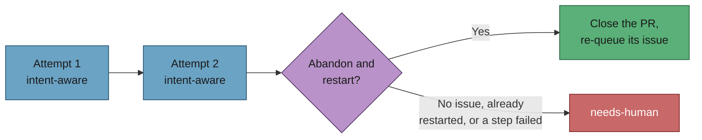

# docs: rewrite merge-conflicts.md for the four-rung intent-aware ladder

## Summary

`docs/workflows/merge-conflicts.md` documented a three-rung ladder — attempt →
attempt → `needs-human` — that the code stopped following once #1076's sibling
issues landed. The page now describes the ladder as merged: intent-aware
attempt → intent-aware attempt → abandon-and-restart → `needs-human`, with the
stall watchdog and the recorded skip reasons named as the two instruments that
make the queue observable. Documentation only; no code changed. Closes #1116.

What changed on the page:

- **TL;DR** carries the four rungs, the one-restart-per-issue bound, the
  never-force-push property, and the no-originating-issue fall-through.
- **The main flowchart** gains a `Context` node (gather both sides' originating
  issues) between the deterministic dependency rules and the agent, and an
  `Abandon` decision node between budget exhaustion and `needs-human` with
  three edges: declined (no originating issue, or already restarted once) →
  `Human`, a failed step → `Human`, and success → `Restart`. The scan's
  out-of-budget backstop (`Spent`) now routes through the same rung. Existing
  node styling convention kept.
- **"Both sides survive"** is qualified where the rule is stated, pointing at
  both bounded carve-outs, and the intent override gets its own subsection —
  parallel to the dependency carve-out — stating the evidence bar (both sides'
  issues known, the supersession quoted) and the reporting requirement.
- **"Bounds and escalation"** gains an `♻️ Abandon and restart, before a human
  is asked` subsection: no force-push, the four preconditions in order, the
  decline when no originating issue is known, the one-restart-per-issue marker
  on the *issue*, and the named-step failure path.
- **"Seeing the queue"** gains a `🛑 When the queue itself stalls` subsection
  naming #1076 and NEAT-AI-Ockham#116, covering the recorded skip reasons and
  the 8-hour watchdog, and stating that the watchdog files work and applies
  `escalated` — never `needs-human`.
- **The skip-reason taxonomy** gains the `abandoned-restarted` row, and
  `budget-spent` now says the abandon rung declined or failed first.
- **Further reading** gains `conflict_issue_context.ts`,
  `conflict_intent_context.ts`, `conflict_intent_audit.ts`,
  `conflict_abandon_restart.ts`, `merge_conflict_stall_watchdog.ts` and
  `merge_conflict_markers.ts`.
- **Drifted references fixed**: `idle_detect_diagnostics.ts:587` → `:591`,
  `run_core.ts:3849` → `:4053`, `run_core_production_deps.ts:1944` → `:2025`.



## Evidence

Documentation-only change with no web interface to screenshot. Two things were
verified instead:

- **The diagrams render.** All four Mermaid blocks on the page were parsed with
  Mermaid 11's own parser (the engine GitHub renders with), under jsdom:

  ```text
  OK   block1.mmd (flowchart-v2)
  OK   block2.mmd (flowchart-v2)
  OK   block3.mmd (flowchart-v2)
  OK   block4.mmd (flowchart-v2)
  ```

  The repository's own `check-mermaid` stage also passes (`427 file(s), 559
  block(s) checked`).

  A rendered screenshot could not be captured: the Playwright MCP browser tools
  are absent from this run (a tool search for `browser_navigate` /
  `browser_take_screenshot` returned `No matching deferred tools found`), and
  the fallback — Puppeteer's bundled Chrome — is x86-64 only, so on this
  aarch64 container it fails with `cannot execute binary file: Exec format
  error`. Parsing with the real Mermaid engine is the substitute, and it is a
  stronger check than the repo's regex validator.
- **Every path and symbol on the page was checked against the merged tree.**
  Every `worker/deno/lib/*.ts` path named on the page exists, and every
  function attributed to a file is exported by it: `gatherConflictIssueContext`
  (`conflict_issue_context.ts:680`), `assessIntentEligibility`
  (`conflict_intent_context.ts:103`), `findUncorroboratedOverrides`
  (`conflict_intent_audit.ts:223`), `exhaustedEscalationRoute`
  (`conflict_abandon_restart.ts:309`), `escalateAsWork`
  (`escalate_as_work.ts:165`), `findConflictingPr`
  (`pr_merge_conflict_scan.ts:1025`). The numeric claims were re-derived from
  the constants: 4-hour cooldown, 2 concluded attempts, 3 disrupted attempts,
  8-hour stall threshold, 5 PRs per cycle, 3-pass deferral notice, and the
  gather's 20/8/4000/30 bounds.
- **`./quality.sh` passed** after the final edit — mermaid, markdownlint,
  semgrep, deno tests, lint, type check and fmt all `PASSED`.

## Acceptance Criteria

<!-- vibe-spec-review inputs="diff+issue-body" -->

- **met** — The TL;DR describes the four-rung ladder — evidence:
  `docs/workflows/merge-conflicts.md:22-32` — reviewer: met
- **met** — The mermaid diagram renders and includes issue-context gathering
  and abandon-and-restart, with the no-originating-issue fall-through shown —
  evidence: `docs/workflows/merge-conflicts.md:63-77`, Mermaid 11 parse of all
  four blocks, `check-mermaid` PASSED — reviewer: met
- **met** — "Both sides survive" carries its qualification at the point the
  rule is stated — evidence: `docs/workflows/merge-conflicts.md:128-134`, with
  anchors resolving to both carve-out subsections — reviewer: met
- **met** — The intent override has a subsection stating its evidence
  requirement and its reporting requirement — evidence:
  `docs/workflows/merge-conflicts.md:189-209` — reviewer: met
- **met** — A "when the queue itself stalls" section exists and states that the
  watchdog applies `escalated`, not `needs-human` — evidence:
  `docs/workflows/merge-conflicts.md:504-526` — reviewer: met
- **met** — Every file path named on the page exists; every function named is
  exported by the file it is attributed to — evidence: path/symbol sweep above;
  the Spec reviewer independently checked all path references and camelCase
  identifiers — reviewer: met
- **met** — `./quality.sh` passes — evidence: full gate run after the final
  edit, `Result: PASSED (with skipped checks)` — reviewer: met
- **unrequested** — "Purpose and scope" bullet reworded from "those escalate"
  to "those leave the merge ladder for abandon-and-restart, and a human after
  that" — reviewer: unrequested — reason: the sentence stated the old
  three-rung ladder as fact, so leaving it would have made the page
  self-contradicting on the change this issue owns.
- **unrequested** — Skip-reason taxonomy table: new `abandoned-restarted` row
  and a reworded `budget-spent` description — reviewer: unrequested — reason:
  the taxonomy is closed and the code added a reason (`pr_merge_conflict_scan.ts:207-211`);
  an unlisted reason is a documented-taxonomy hole.
- **unrequested** — "One cycle empties the queue" closing paragraph now names
  the abandon rung alongside the cooldown and the two attempts — reviewer:
  unrequested — reason: it enumerated the per-PR budgets as
  "cooldown / two attempts / `needs-human`", which is the three-rung ladder
  restated.

## Standards Review

<!-- vibe-standards-review inputs="diff+CODING-STANDARDS.md" -->

- **violation** — DRY: the new "When the queue itself stalls" section repeated
  the watchdog's "it escalates, it never retries" point already made in full —
  evidence: `docs/workflows/merge-conflicts.md:524-526` — reason: fixed here; the
  repeated clause was removed and the bullet now links to the detailed section.
- **violation** — DRY: the new intent carve-out subsection repeated
  "eligibility is the worker's computation, not the model's", which the
  resolver subsection already states — evidence:
  `docs/workflows/merge-conflicts.md:201-205` — reason: fixed here; that bullet was
  dropped, leaving the evidence bar, the quoting requirement and the reporting
  requirement the acceptance criteria ask for. The remaining overlap with the
  #1114 contract bullet is the structure the issue explicitly requested (rule
  stated in the contract, detail in a subsection) and is bridged by an explicit
  pointer.
- **clean** — Australian English throughout the added prose; exactly one file
  staged and no hidden or credential-shaped path; markdownlint clean over the
  configured globs; all four added in-page anchors resolve via the repo's own
  slug algorithm and their "above"/"below" directions are correct; the added
  Mermaid nodes and `style` lines follow the file's existing convention,
  including its forward-reference pattern; every cited module and symbol
  exists; the documented preconditions, marker placement and no-`--delete-branch`
  close match `abandonAndRestart`.

## Test Plan

No tests were added or modified — this change touches documentation only, and
the repository's tests assert on code behaviour rather than prose. The checks
that do cover this file all ran:

- `deno run mod.ts check-mermaid` — every Mermaid block in every `.md` file:
  PASSED (427 files, 559 blocks).
- Mermaid 11 parse of the page's four blocks under jsdom: all four `OK`.
- `markdownlint-cli2` over the configured globs (via `./quality.sh`): PASSED.
- `./quality.sh` end to end after the final edit: PASSED.
