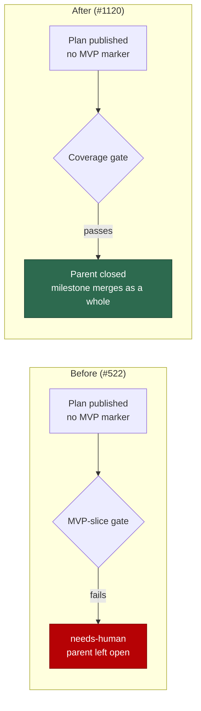

# Remove the MVP-slice planning logic

## Summary

The MVP-slice gate (Issue #522) required every published plan to mark exactly one
sub-issue `**MVP slice**` (or carry a `No independently valuable slice — <reason>`
line) and to order the list MVP-first; a plan that did not was escalated to a
human. Its premise was that a milestone can stop part-way and land only its first
sub-issue. The milestone workflow makes that impossible: a planning run puts its
sub-issues in a milestone, every sub-issue PR merges into that milestone's own
`milestone/<name>` feature branch, and the default branch is updated by one final
milestone PR raised only after every milestone issue closes. Ordering partial
value inside a milestone therefore delivers nothing the milestone does not already
deliver as a whole.

This removes the gate, its prompt instructions and the MVP-first value-ordering
rule, and records the reversal as a deliberate design decision so it is not
re-proposed. Closes #1120.

Removed: `worker/deno/lib/mvp_slice_gate.ts`, its wiring in
`worker/deno/lib/planning_processor.ts` (gate invocation, `MVP_SLICE_REQUIREMENT`
interpolation in both in-code fallback prompts, the `mvpSliceOffences` result
field and the `planGateFailed` flag, now just `coverageFailed`), and every
MVP-slice instruction in `prompts/planning/prompt.md` and
`prompts/planning_critique/prompt.md`. The coverage gate (#520) and the
Failure-Detection gate (#59) are untouched — they check that a plan is
*complete*, which milestone-wide merge does not make redundant.

## Evidence

Backend/CLI change — no web interface to screenshot. Evidence is the test suite
and the full quality gate.

- `deno test tests/planning_processor_test.ts` — 113 passed, 0 failed.
- `./quality.sh` — PASSED (deno tests, lint, type check, fmt, markdownlint,
  mermaid, semgrep and the chokepoint audits all green; `config integration`,
  `pages-liquid` and `mermaid built output` skipped as usual).
- Repo-wide `grep -i mvp` finds no match outside `docs/archive/pr-summaries/`
  (historical records, deliberately untouched) and the two docs that record the
  decision.

Behaviour before and after, for a plan that names no MVP slice:

## Acceptance Criteria

<!-- vibe-spec-review inputs="diff+issue-body" -->

- **met** — Remove the MVP-slice gate: delete `worker/deno/lib/mvp_slice_gate.ts`
  and `worker/deno/tests/mvp_slice_gate_test.ts`, and remove its invocation,
  `MVP_SLICE_REQUIREMENT` interpolation and `mvpSliceOffences` field from
  `worker/deno/lib/planning_processor.ts`; a published plan with no MVP marker
  passes without a `needs-human` escalation and the quality gate is green —
  evidence: `worker/deno/tests/planning_processor_test.ts::processIssuePlanning - a plan with no MVP marker closes the parent (Issue #1120)`,
  `worker/deno/lib/planning_processor.ts:1977` — reviewer: met
- **met** — Remove all MVP-slice content from `prompts/planning/prompt.md` and
  `prompts/planning_critique/prompt.md` — the marker requirement and the MVP-first
  value-ordering rule alike — plus the dependent tests
  (`worker/deno/tests/planning_mvp_prompts_test.ts` deleted, affected cases in
  `worker/deno/tests/planning_processor_test.ts` removed) — evidence:
  `prompts/planning_critique/prompt.md:130`, `prompts/planning/prompt.md:85`, and
  `worker/deno/tests/planning_processor_test.ts::fallback publish prompts state no MVP-slice requirement (Issue #1120)`
  — reviewer: met
- **met** — Record the design decision: `docs/SPEC-KIT-COMPARISON.md` §5 rewritten
  as "considered and removed — milestones merge as a whole", and
  `docs/workflows/planning-and-questions.md` no longer documents the gate as
  active and carries the decision note — evidence:
  `docs/SPEC-KIT-COMPARISON.md:166`, `docs/workflows/planning-and-questions.md:543`
  — reviewer: met
- **met** — Archived PR summaries (`pr-summary-510.md`, `-522.md`) stay untouched
  — evidence: neither path appears in `git diff --name-status` — reviewer: met
- **unrequested** — `docs/SPEC-KIT-COMPARISON.md:10`, `:72`, `:244`,
  `README.md:449` and `docs/REFERENCES.md:64` reworded from "five ideas adopted"
  to note that one was since removed — reviewer: unrequested — reason: the §5
  rewrite would otherwise contradict the surrounding summaries of the same
  document; a code change owes a docs change.
- **unrequested** — `docs/workflows/planning-and-questions.md:565` adds a Mermaid
  diagram of the milestone-branch merge flow — reviewer: unrequested — reason: the
  merge model is the whole rationale for the removal, and the repo standard asks
  for a diagram where it aids understanding.
- **unrequested** — `worker/deno/tests/planning_processor_test.ts::processIssuePlanning - a plan ordered against its dependency edges still closes the parent (Issue #1120)`
  — reviewer: unrequested — reason: guards the second half of the removal (the
  MVP-first ordering rule), which no other test would catch reintroduced.
- **unrequested** — `worker/deno/lib/planning_processor.ts:1973` adds a four-line
  comment recording why no MVP gate sits beside the coverage gate — reviewer:
  unrequested — reason: the issue asks for the design decision to be recorded, and
  the deletion site is where a future run would otherwise re-add the gate.

## Standards Review

<!-- vibe-standards-review inputs="diff+CODING-STANDARDS.md" -->

- **violation** — no `docs/archive/pr-summaries/pr-summary-1120.md`, required by
  `CODING-STANDARDS.md:549-563`, and with it the record of the removed tests
  (`CODING-STANDARDS.md:64-65`) — evidence:
  `docs/archive/pr-summaries/pr-summary-1120.md` (absent at review time) — reason:
  fixed here — this file is that summary, and the Test Plan below records every
  deleted test and why.
- **violation** — the rationale claimed "nothing partial **ever** reaches the
  default branch", while milestone creation is best-effort
  (`docs/workflows/planning-and-questions.md:599-601`) — evidence:
  `docs/workflows/planning-and-questions.md:560` — reason: fixed here — both docs
  now qualify the claim and say what happens when no milestone exists.
- **clean** — no dangling references to the deleted module anywhere in code, CI or
  config; every live doc surface updated in the same change and the cross-doc
  anchor resolves; prompt edits made in place under `prompts/<type>/prompt.md`;
  Australian English throughout; replacement tests drive real functions rather
  than grepping source; commit carries the issue reference and the
  `Vibe-Coder-Run-Id` trailer; no hidden paths staged.

## Test Plan

Added (`worker/deno/tests/planning_processor_test.ts`):

- `fallback publish prompts state no MVP-slice requirement (Issue #1120)` — both
  in-code fallback publish prompts are built and asserted to carry no MVP-slice
  instruction.
- `processIssuePlanning - a plan with no MVP marker closes the parent (Issue #1120)`
  — an unmarked two-entry plan closes the parent, applies no `needs-human` label
  and posts no MVP comment. Watched failing against the unremoved gate, passing
  after removal.
- `processIssuePlanning - a plan ordered against its dependency edges still closes the parent (Issue #1120)`
  — a plan listing a sub-issue before the one it depends on is no longer an
  offence. Also watched failing before the change.

Removed (business-logic change — the behaviour they assert is the behaviour this
issue removes):

- `worker/deno/tests/mvp_slice_gate_test.ts` (451 lines) — the whole unit suite
  for the deleted `mvp_slice_gate.ts`.
- `worker/deno/tests/planning_mvp_prompts_test.ts` (99 lines) — asserted the
  prompts carry the MVP-slice instructions that are now deleted.
- Three cases in `worker/deno/tests/planning_processor_test.ts` — the
  `MVP_SLICE_REQUIREMENT` fallback-prompt case and the three end-to-end gate cases
  (`no MVP slice … escalates`, `one MVP slice closes the parent`, `an explicit
  no-slice statement closes the parent`), replaced by the three above. Two
  coverage-gate fixtures had their `**MVP slice**` marker dropped; those tests
  assert coverage behaviour and are otherwise unchanged.

Full gate: `./quality.sh` — PASSED.
